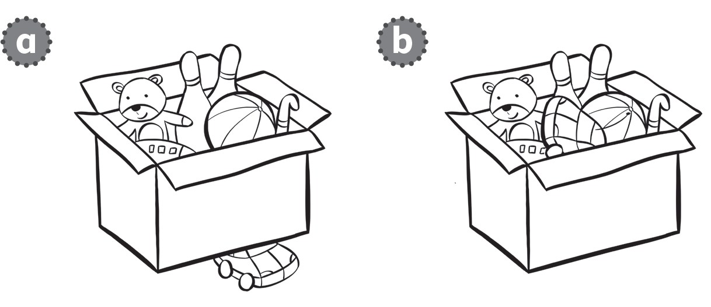
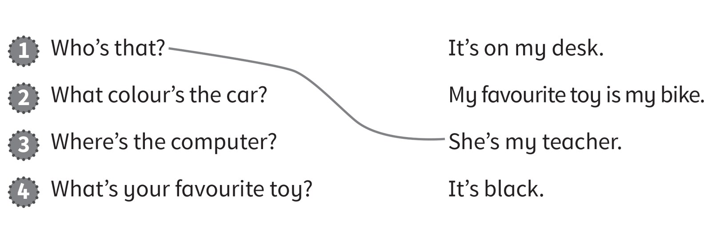

**[Vocabulary]{.underline}**

**1. Read and draw lines. There is one example.   (one point each)**

*2. computer*

*3. ball*

*4. doll*

*5. car*

*6. bike*

**2. Look and colour. There is one example.   (one point each)**

*2. grey*

*3. brown*

*4. black*

**3. Look and circle. There is one example.   (one point each)**

1\. in

2\. next to

*b*

3\. under

*a*

4\. on

*b*

**[Grammar]{.underline}**

**4. Read and draw lines. There is one example.   (one point each)**

*2. It's black*

*3. It's on my desk*

*4. My favourite toy is my bike*

**5. Read and circle *Yes* or *No*. There is one example.   (one point
each)**

1\. Is the box next to the table?

    *[Yes]{.underline}*    *No*

2\. Is the car on the computer?

    *Yes*    *No*

*Yes*

3\. Is the eraser on the chair?

    *Yes*    *No*

*No*

4\. Is the ball under the table?

    *Yes*    *No*

*Yes*

5\. Is the bag in the box?

    *Yes*    *No*

*No*

6\. Is the train next to the books?

    *Yes*    *No*

*Yes*

**[Listening]{.underline}**

**6. Listen and write the number. There is one example.   (one point
each)**

*b. 5 (doll and train)*

*c. 2 (car and computer)*

*d. 6 (computer and pencil)*

*e. 3 (box and doll)*

*f. 4 (chair and ball)*

**Audio script**

1\. The pencil is on the chair.

2\. The car is on the computer.

3\. The doll is in the box.

4\. The ball is under the chair.

5\. The train is next to the doll.

6\. The pencil is next to the computer.

**7. Listen and colour. There is one example.   (one point each)**

*bike -- blue*

*train in box -- grey*

*ball under table -- black*

*doll on chair -- red*

*car under chair -- brown*

**Audio script**

1

**Girl:** The book is next to a train.

**Boy:** Yes.

**Girl:** Colour it yellow.

**Boy:** Yellow? OK.

2

**Boy:** The bike is next to the door.

**Girl:** Yes, it is. Colour it blue.

**Boy:** Blue? OK.

3

**Girl:** The train in the box is grey.

**Boy:** In the box?

**Girl:** Yes.

**Boy:** OK.

4

**Girl:** The ball under the table is black.

**Boy:** Under the table?

**Girl:** Yes.

**Boy:** OK.

5

**Girl:** The doll on the chair is red.

**Boy:** On the chair?

**Girl:** Yes.

**Boy:** OK.

6

**Boy:** A car is under the chair.

**Girl:** Yes. That's right. Colour it brown.

**Boy:** A brown car. Ok.

**Girl:** Thank you.

**[Reading]{.underline}**

**8. Look and read. Write *A* or *B*. There is one example.   (one point
each)**

  ------------------------------- --- -----------------------------------
  1\. The eraser is on the table.     *[A]{.underline}*

  ------------------------------- --- -----------------------------------

  ------------------------------- --- -----------------------------------
  2\. The car is next to the          *B*
  computer.                           

  ------------------------------- --- -----------------------------------

  ------------------------------- --- -----------------------------------
  3\. The train is on the box.        *B*

  ------------------------------- --- -----------------------------------

  ------------------------------- --- -----------------------------------
  4\. The ball is under the           *B*
  chair.                              

  ------------------------------- --- -----------------------------------

  ------------------------------- --- -----------------------------------
  5\. The pen is on the chair.        *A*

  ------------------------------- --- -----------------------------------

  ------------------------------- --- -----------------------------------
  6\. The bag is next to the box.     *B*

  ------------------------------- --- -----------------------------------

