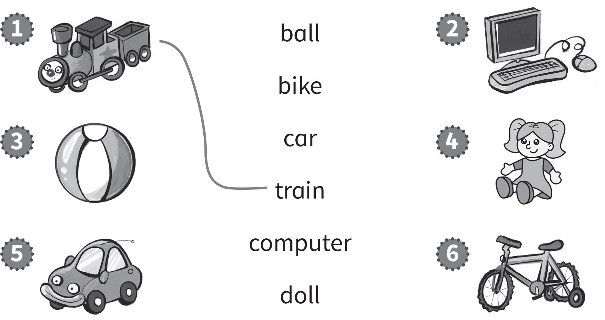
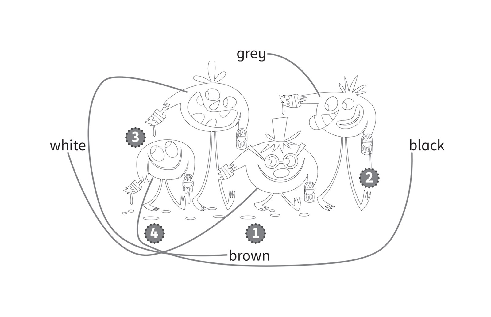
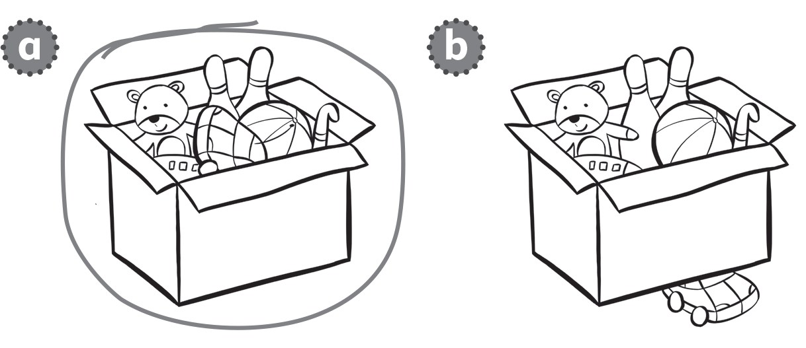
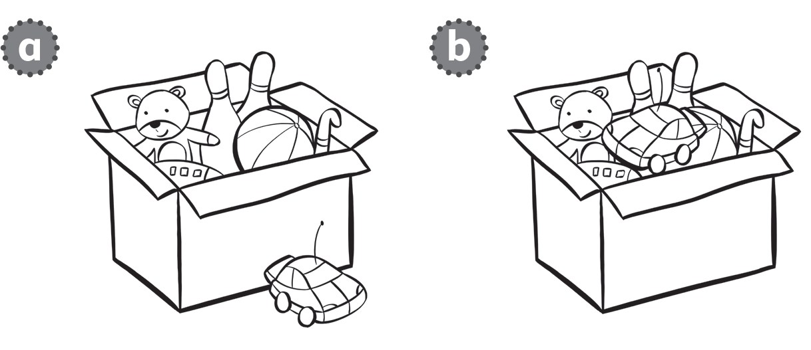
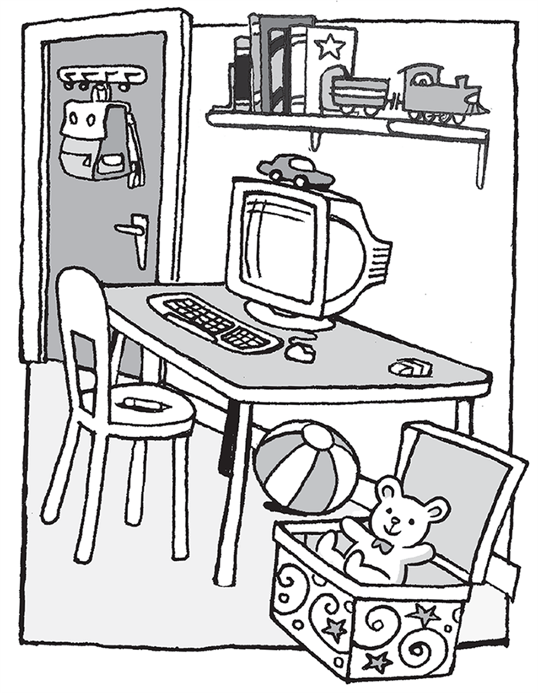
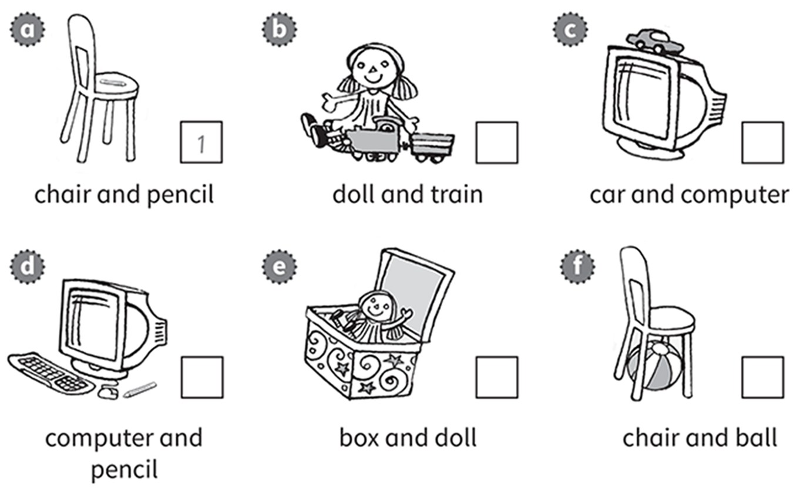
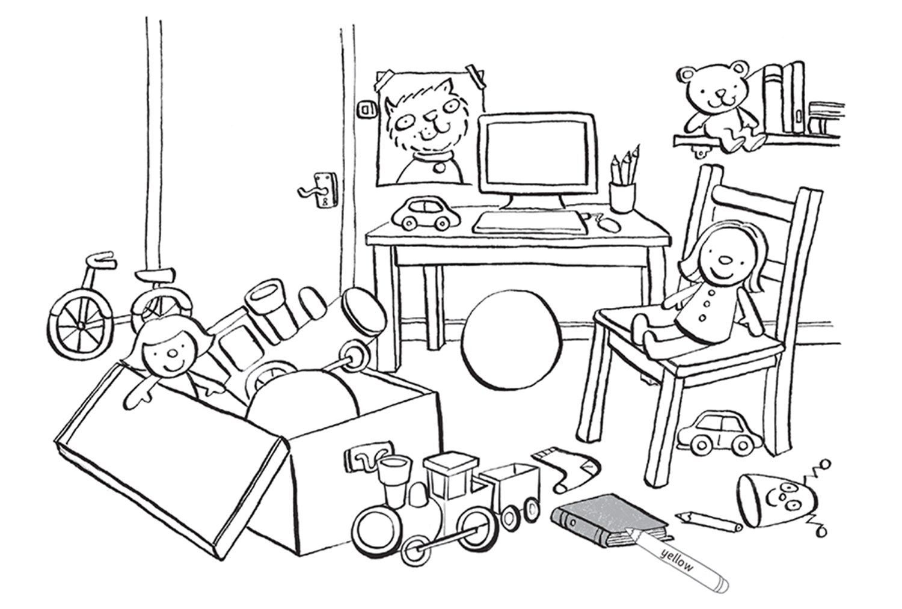
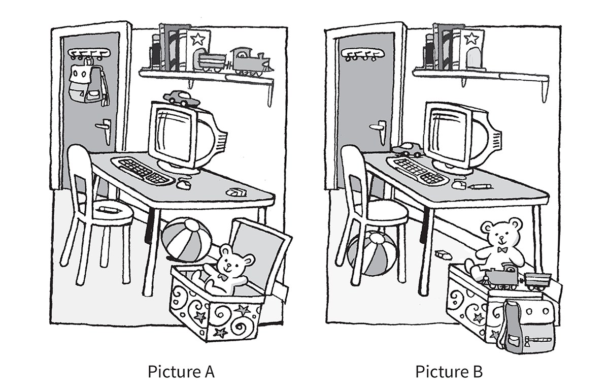

**[Vocabulary]{.underline}**

**1. Read and draw lines. There is one example.   (one point each)**

**2. Look and colour. There is one example.   (one point each)**

**3. Look and circle. There is one example.   (one point each)**

1\. in

2\. next to

3\. under

4\. on

**[Grammar]{.underline}**

**4. Read and draw lines. There is one example.   (one point each)**

**5. Read and circle *Yes* or *No*. There is one example.   (one point
each)**

1\. Is the box next to the table?

    *[Yes]{.underline}*    *No*

2\. Is the car on the computer?

    *Yes*    *No*

3\. Is the eraser on the chair?

    *Yes*    *No*

4\. Is the ball under the table?

    *Yes*    *No*

5\. Is the bag in the box?

    *Yes*    *No*

6\. Is the train next to the books?

    *Yes*    *No*

**[Listening]{.underline}**

**6. Listen and write the number. There is one example.   (one point
each)**

**7. Listen and colour. There is one example.   (one point each)**

**[Reading]{.underline}**

**8. Look and read. Write *A* or *B*. There is one example.   (one point
each)**

  ------------------------------- --- -----------------------------------
  1\. The eraser is on the table.     *[A]{.underline}*

  ------------------------------- --- -----------------------------------

  ------------------------------- --- -----------------------------------
  2\. The car is next to the          \_\_\_\_\_
  computer.                           

  ------------------------------- --- -----------------------------------

  ------------------------------- --- -----------------------------------
  3\. The train is on the box.        \_\_\_\_\_

  ------------------------------- --- -----------------------------------

  ------------------------------- --- -----------------------------------
  4\. The ball is under the           \_\_\_\_\_
  chair.                              

  ------------------------------- --- -----------------------------------

  ------------------------------- --- -----------------------------------
  5\. The pen is on the chair.        \_\_\_\_\_

  ------------------------------- --- -----------------------------------

  ------------------------------- --- -----------------------------------
  6\. The bag is next to the box.     \_\_\_\_\_

  ------------------------------- --- -----------------------------------

