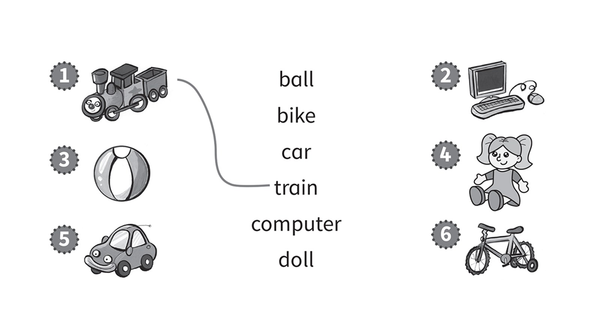
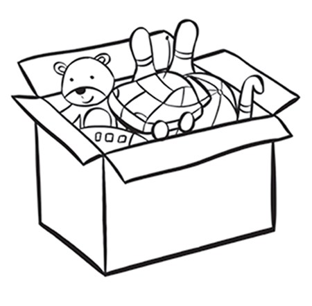
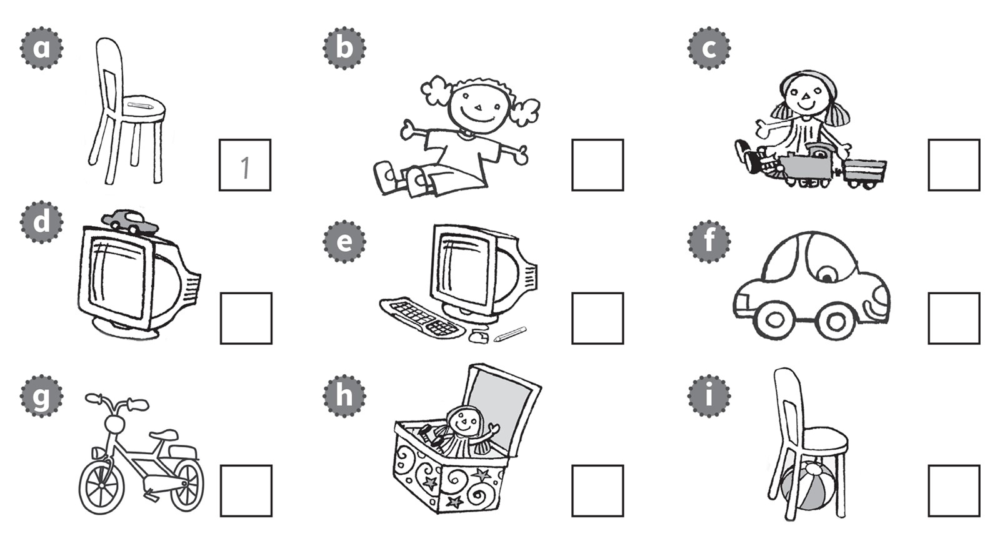
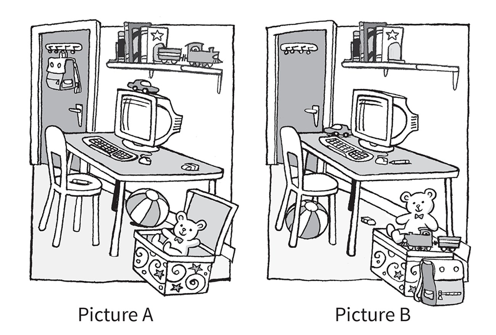

**[Vocabulary]{.underline}**

**1. Look, read and draw lines. There is one example.   (one point
each)**

*2. computer*

*3. ball*

*4. doll*

*5. car*

*6. bike*

**2. Look and put the letters in order. Then colour. There is one
example.   (one point each)**

*1. black*

*2. grey*

*3. brown*

**3. Look and write. There is one example.   (one point each)**

under \| next to \| on \| ~~in~~

  ------------------------------------------------------------------------------------------------------------------------------------------------------------------------------------------------------------------- -- ---------------------------------------------------------------------------------------------------------------------------------------------------------------------------------------------------------------- -- ---------------------------------------------------------------------------------------------------------------------------------------------------------------------------------------------------------------- -- ----------------------------------------------------------------------------------------------------------------------------------------------------------------------------------------------------------------
   1.                  
  *[in]{.underline}*                                                                                                                                                                                                     2. *on*                                                                                                                                                                                                             3. *next to*                                                                                                                                                                                                        4. *under*

  ------------------------------------------------------------------------------------------------------------------------------------------------------------------------------------------------------------------- -- ---------------------------------------------------------------------------------------------------------------------------------------------------------------------------------------------------------------- -- ---------------------------------------------------------------------------------------------------------------------------------------------------------------------------------------------------------------- -- ----------------------------------------------------------------------------------------------------------------------------------------------------------------------------------------------------------------

**[Grammar]{.underline}**

**4. Read and complete the sentences. There is one example.   (one point
each)**

my desk \| my bike \| black \| ~~my teacher~~

1\. Who's that?

    She's *[my teacher]{.underline}*.

2\. What colour's the car?

    It's \_\_\_\_\_\_\_\_\_\_.

*black*

3\. Where's the computer?

    It's on \_\_\_\_\_\_\_\_\_\_.

*my desk*

4\. What's your favourite toy?

    My favourite toy is \_\_\_\_\_\_\_\_\_\_.

*my bike*

**5. Look and read. Write *Yes, it is* or *No, it isn't*. There is one
example.   (one point each)**

1\. Is the box next to the table?

    *[Yes, it is.]{.underline}*

2\. Is the car on the computer?

    \_\_\_\_\_\_\_\_\_\_\_\_\_\_\_

*Yes, it is*

3\. Is the eraser on the chair?

    \_\_\_\_\_\_\_\_\_\_\_\_\_\_\_

*No, it isn't*

4\. Is the ball under the table?

    \_\_\_\_\_\_\_\_\_\_\_\_\_\_\_

*Yes, it is*

5\. Is the bag in the box?

    \_\_\_\_\_\_\_\_\_\_\_\_\_\_\_

*No, it isn't*

6\. Is the train next to the books?

    \_\_\_\_\_\_\_\_\_\_\_\_\_\_\_

*Yes, it is*

**[Listening]{.underline}**

**6. Listen and write the number. There are three extra pictures. There
is one example.   (one point each)**

*2. d*

*3. h*

*4. i*

*5. c*

*6. e*

**Audio script**

1\. The pencil is on the chair.

2\. The car is on the computer.

3\. The doll is in the box.

4\. The ball is under the chair.

5\. The train is next to the doll.

6\. The pencil is next to the computer.

**7. Listen and colour. There is one example.   (one point each)**

*bike -- blue*

*train in the box -- grey*

*ball under table -- black*

*doll on chair -- red*

*car under chair -- brown*

**Audio script**

1

**Girl:** The book is next to a train.

**Boy:** Yes.

**Girl:** Colour it yellow.

**Boy:** Yellow? OK.

2

**Boy:** The bike is next to the door.

**Girl:** Yes, it is. Colour it blue.

**Boy:** Blue? OK.

3

**Girl:** The train in the box is grey.

**Boy:** In the box?

**Girl:** Yes.

**Boy:** OK.

4

**Girl:** The ball under the table is black.

**Boy:** Under the table?

**Girl:** Yes.

**Boy:** OK.

5

**Girl:** The doll on the chair is red.

**Boy:** On the chair?

**Girl:** Yes.

**Boy:** OK.

6

**Boy:** A car is under the chair.

**Girl:** Yes. That's right. Colour it brown.

**Boy:** A brown car. Ok.

**Girl:** Thank you.

**[Reading]{.underline}**

**8. Answer the following questions in your own words according to the
information given in the text.**

on the table \| next to the computer \| under the chair \| next to the
box \| ~~under the table~~ \| in the box

1\. In Picture A, the eraser is on the table.

    In Picture B, it's *[under the table]{.underline}*.

2\. In Picture A, the car is on the computer.

    In Picture B, it's \_\_\_\_\_\_\_\_\_\_\_\_\_\_\_.

*next to the computer / on the table*

3\. In Picture A, the train is next to the books.

    In Picture B, it's \_\_\_\_\_\_\_\_\_\_\_\_\_\_\_.

*in the box*

4\. In Picture A, the ball is under the table.

    In Picture B, it's \_\_\_\_\_\_\_\_\_\_\_\_\_\_\_.

*under the chair*

5\. In Picture A, the pen is on the chair.

    In Picture B, it's \_\_\_\_\_\_\_\_\_\_\_\_\_\_\_.

*on the table / next to the computer*

6\. In Picture A, the bag is on the door.

    In Picture B, it's \_\_\_\_\_\_\_\_\_\_\_\_\_\_\_.

*next to the box*

