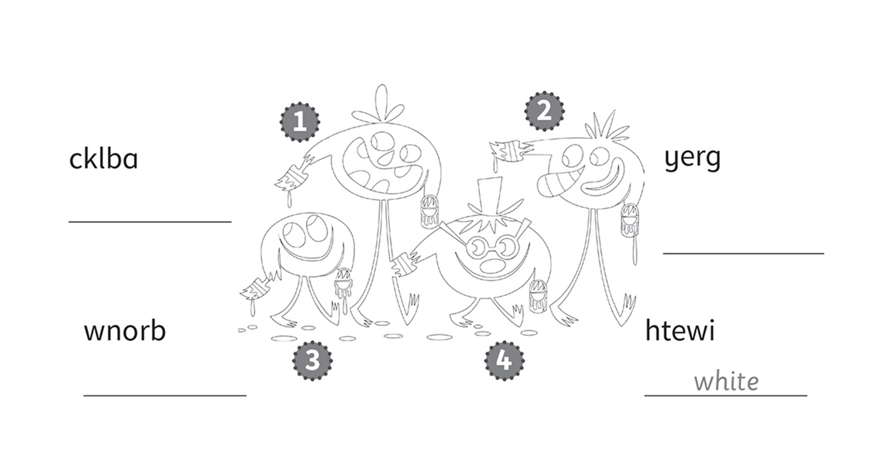
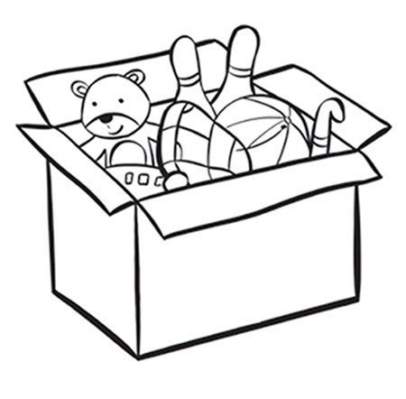
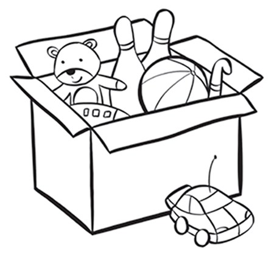
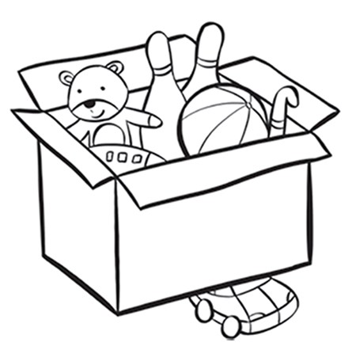
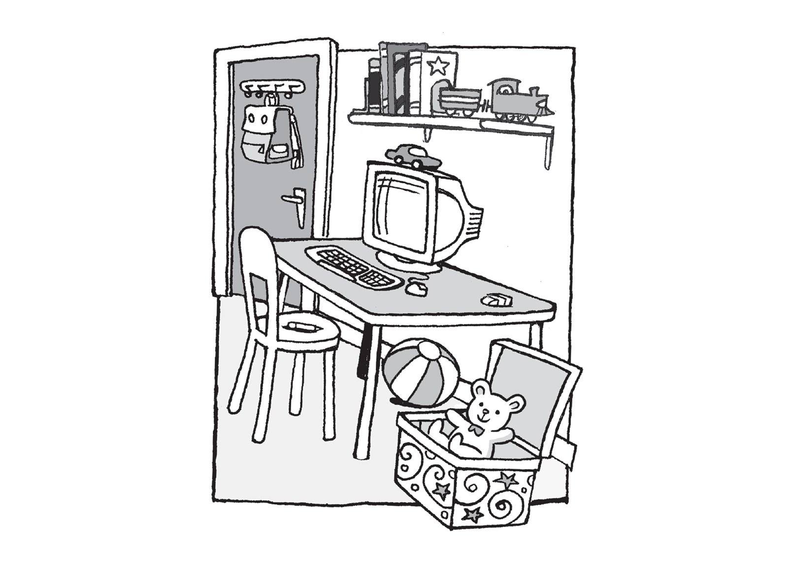
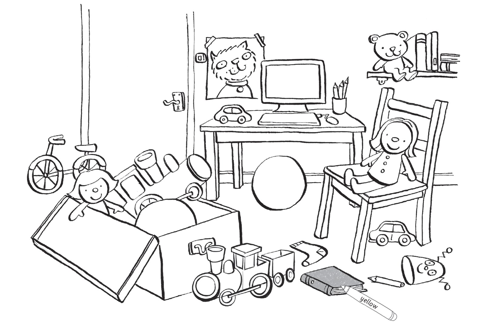

**[Vocabulary]{.underline}**

**1. Look, read and draw lines. There is one example.   (one point
each)**

**2. Look and put the letters in order. Then colour. There is one
example.   (one point each)**

**3. Look and write. There is one example.   (one point each)**

under \| next to \| on \| ~~in~~

  ---------------------------------------------------------------------------------------------------------------------------------------------------------------------------------------------------------------------- -- ------------------------------------------------------------------------------------------------------------------------------------------------------------------------------------------------------------------- -- ------------------------------------------------------------------------------------------------------------------------------------------------------------------------------------------------------------------- -- -------------------------------------------------------------------------------------------------------------------------------------------------------------------------------------------------------------------
   1.                  
  \_\_\_\_\_\_\_\_\_\_\_\_\_\_\_\_                                                                                                                                                                                          2. \_\_\_\_\_\_\_\_\_\_\_\_\_\_\_\_                                                                                                                                                                                    3. \_\_\_\_\_\_\_\_\_\_\_\_\_\_\_\_                                                                                                                                                                                    4. \_\_\_\_\_\_\_\_\_\_\_\_\_\_\_\_

  ---------------------------------------------------------------------------------------------------------------------------------------------------------------------------------------------------------------------- -- ------------------------------------------------------------------------------------------------------------------------------------------------------------------------------------------------------------------- -- ------------------------------------------------------------------------------------------------------------------------------------------------------------------------------------------------------------------- -- -------------------------------------------------------------------------------------------------------------------------------------------------------------------------------------------------------------------

**[Grammar]{.underline}**

**4. Read and complete the sentences. There is one example.   (one point
each)**

my desk \| my bike \| black \| ~~my teacher~~

1\. Who's that?

    She's *[my teacher]{.underline}*.

2\. What colour's the car?

    It's \_\_\_\_\_\_\_\_\_\_.

3\. Where's the computer?

    It's on \_\_\_\_\_\_\_\_\_\_.

4\. What's your favourite toy?

    My favourite toy is \_\_\_\_\_\_\_\_\_\_.

**5. Look and read. Write *Yes, it is* or *No, it isn't*. There is one
example.   (one point each)**

1\. Is the box next to the table?

    *[Yes, it is.]{.underline}*

2\. Is the car on the computer?

    \_\_\_\_\_\_\_\_\_\_\_\_\_\_\_

3\. Is the eraser on the chair?

    \_\_\_\_\_\_\_\_\_\_\_\_\_\_\_

4\. Is the ball under the table?

    \_\_\_\_\_\_\_\_\_\_\_\_\_\_\_

5\. Is the bag in the box?

    \_\_\_\_\_\_\_\_\_\_\_\_\_\_\_

6\. Is the train next to the books?

    \_\_\_\_\_\_\_\_\_\_\_\_\_\_\_

**[Listening]{.underline}**

**6. Listen and write the number. There are three extra pictures. There
is one example.   (one point each)**

**7. Listen and colour. There is one example.   (one point each)**

**[Reading]{.underline}**

**8. Answer the following questions in your own words according to the
information given in the text.**

on the table \| next to the computer \| under the chair \| next to the
box \| ~~under the table~~ \| in the box

1\. In Picture A, the eraser is on the table.

    In Picture B, it's *[under the table]{.underline}*.

2\. In Picture A, the car is on the computer.

    In Picture B, it's \_\_\_\_\_\_\_\_\_\_\_\_\_\_\_.

3\. In Picture A, the train is next to the books.

    In Picture B, it's \_\_\_\_\_\_\_\_\_\_\_\_\_\_\_.

4\. In Picture A, the ball is under the table.

    In Picture B, it's \_\_\_\_\_\_\_\_\_\_\_\_\_\_\_.

5\. In Picture A, the pen is on the chair.

    In Picture B, it's \_\_\_\_\_\_\_\_\_\_\_\_\_\_\_.

6\. In Picture A, the bag is on the door.

    In Picture B, it's \_\_\_\_\_\_\_\_\_\_\_\_\_\_\_.

