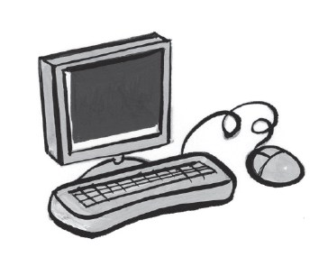
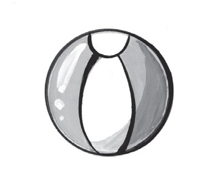
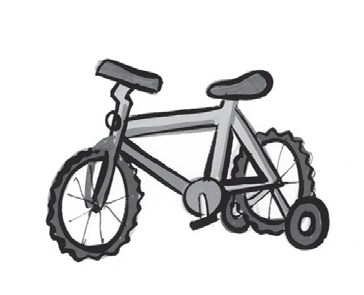
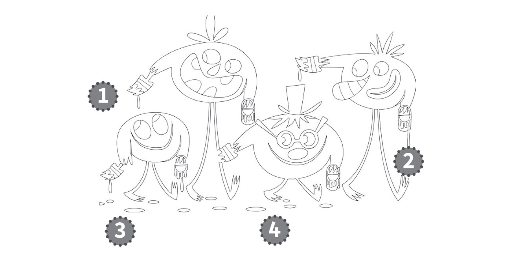
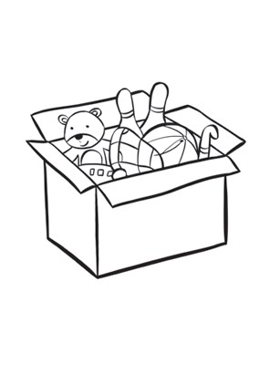
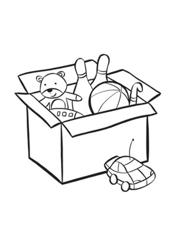
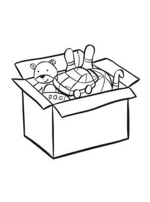
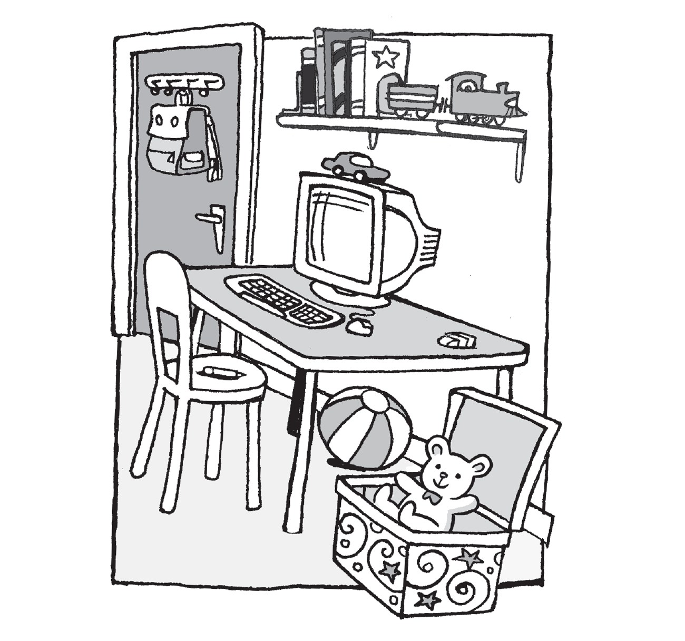
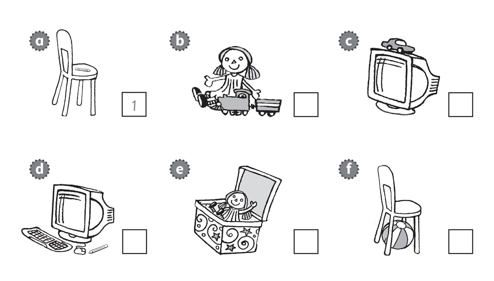

**[Vocabulary]{.underline}**

**1. Look and complete the words. There is one example.   (one point
each)**

1\. t *[r]{.underline}* *[a]{.underline}* *[i]{.underline}* n

2\. c \_ m \_ u t e \_

*computer*

3\. b \_ \_ l

*ball*

4\. d \_ l l

*doll*

5\. c \_ \_

*car*

6\. \_ i k \_

*bike*

**2. Look and circle. Then colour. There is one example.   (one point
each)**

*2. grey*

*3. brown*

*4. black*

**3. Look at the car and circle. There is one example.   (one point
each)**

1\. *[in]{.underline}* / *on*

2\. *under* / *next to*

*next to*

3\. *on* / *under*

*under*

4\. *on* / *next to*

*on*

**[Grammar]{.underline}**

**4. Read and put the words in order. There is one example.   (one point
each)**

1\. Who's that?

    my She's teacher.

    *[She's my teacher.]{.underline}*

2\. What colour's the car?

    black It's.

    \_\_\_\_\_\_\_\_\_\_\_\_\_\_\_\_\_\_\_\_\_\_\_\_\_

*It's black*

3\. Where's the computer?

    on desk my It's.

    \_\_\_\_\_\_\_\_\_\_\_\_\_\_\_\_\_\_\_\_\_\_\_\_\_

*It's on my desk*

4\. What's your favourite toy?

    is bike favourite toy My a.

    \_\_\_\_\_\_\_\_\_\_\_\_\_\_\_\_\_\_\_\_\_\_\_\_\_

*My favourite toy is my bike.*

**5. Look and read. Circle *Yes, it is* or *No, it isn't*. There is one
example.   (one point each)**

1\. Is the box next to the table?

    *[Yes, it is.]{.underline}*        No, it isn't.

2\. Is the car on the computer?

    Yes, it is.        No, it isn't.

*Yes, it is.*

3\. Is the eraser on the chair?

    Yes, it is.        No, it isn't.

*No, it isn't.*

4\. Is the ball under the table?

    Yes, it is.        No, it isn't.

*Yes, it is.*

5\. Is the bag in the box?

    Yes, it is.        No, it isn't.

*No, it isn't.*

6\. Is the train next to the books?

    Yes, it is.        No, it isn't.

*Yes, it is.*

**[Listening]{.underline}**

**6. Listen and write the number. There is one example.   (one point
each)**

*b. 5*

*c. 2*

*d. 6*

*e. 3*

*f. 4*

**Audio script**

1\. The pencil is on the chair.

2\. The car is on the computer.

3\. The doll is in the box.

4\. The ball is under the chair.

5\. The train is next to the doll.

6\. The pencil is next to the computer.

**7. Listen and colour. There is one example.   (one point each)**

*bike -- blue*

*train in the box -- grey*

*ball under table -- black*

*doll on chair -- red*

*car under chair -- brown*

**Audio script**

1

**Girl:** The book is next to a train.

**Boy:** Yes.

**Girl:** Colour it yellow.

**Boy:** Yellow? OK.

2

**Boy:** The bike is next to the door.

**Girl:** Yes, it is. Colour it blue.

**Boy:** Blue? OK.

3

**Girl:** The train in the box is grey.

**Boy:** In the box?

**Girl:** Yes.

**Boy:** OK.

4

**Girl:** The ball under the table is black.

**Boy:** Under the table?

**Girl:** Yes.

**Boy:** OK.

5

**Girl:** The doll on the chair is red.

**Boy:** On the chair?

**Girl:** Yes.

**Boy:** OK.

6

**Boy:** A car is under the chair.

**Girl:** Yes. That's right. Colour it brown.

**Boy:** A brown car. Ok.

**Girl:** Thank you.

**[Reading]{.underline}**

**8. Look, read and write. There is one example.   (one point each)**

1\. In Picture A, the eraser is on the table.

    In Picture B, the eraser is *[under]{.underline}* the table.

2\. In Picture A, the car is on the computer.

    In Picture B, the car is *next to* the computer.

3\. In Picture A, the train is next to the books.

    In Picture B, the train is *on* the box.

4\. In Picture A, the ball is under the table.

    In Picture B, the ball is *under* the chair.

5\. In Picture A, the pen is on the chair.

    In Picture B, the pen is *on* the table.

6\. In Picture A, the bag is on the door.

    In Picture B, the bag is *next to* the box.

