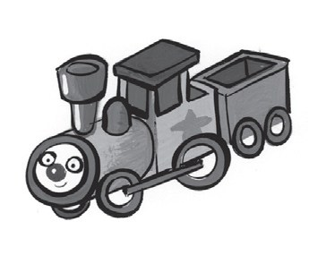
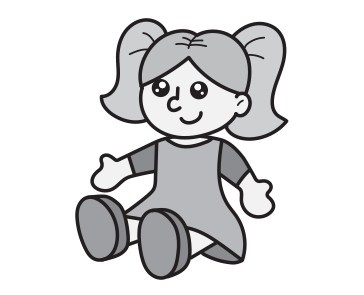
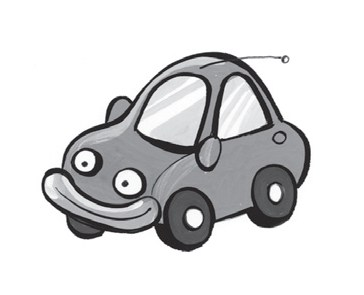
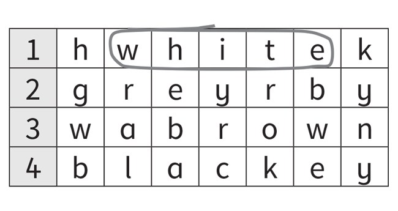
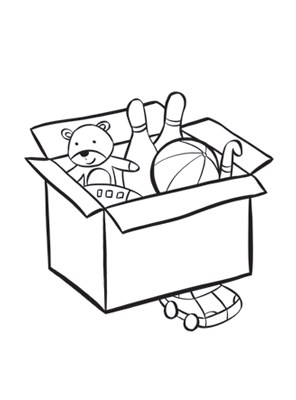
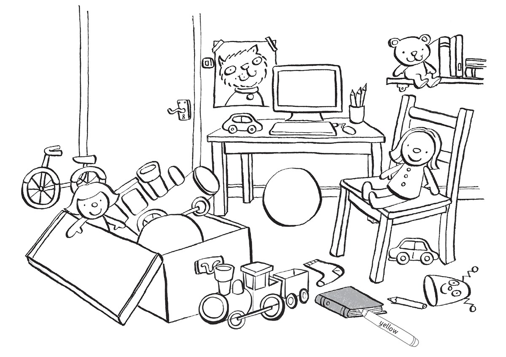
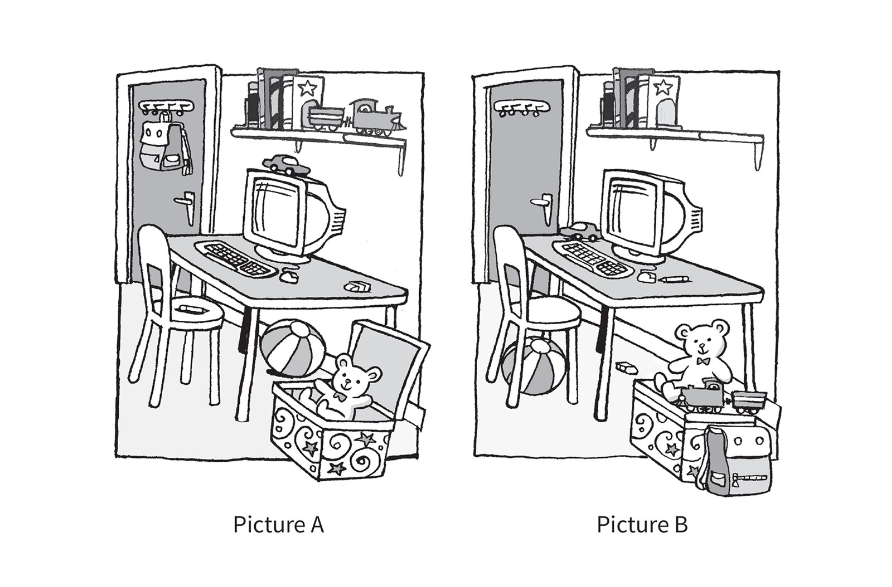

**[Vocabulary]{.underline}**

**1. Look and complete the words. There is one example.   (one point
each)**

1\. t *[r]{.underline}* *[a]{.underline}* *[i]{.underline}* n

2\. c \_ m \_ u t e \_

3\. b \_ \_ l

4\. d \_ l l

5\. c \_ \_

6\. \_ i k \_

**2. Look and circle. Then colour. There is one example.   (one point
each)**

**3. Look at the car and circle. There is one example.   (one point
each)**

1\. *[in]{.underline}* / *on*

2\. *under* / *next to*

3\. *on* / *under*

4\. *on* / *next to*

**[Grammar]{.underline}**

**4. Read and put the words in order. There is one example.   (one point
each)**

1\. Who's that?

    my She's teacher.

    *[She's my teacher.]{.underline}*

2\. What colour's the car?

    black It's.

    \_\_\_\_\_\_\_\_\_\_\_\_\_\_\_\_\_\_\_\_\_\_\_\_\_

3\. Where's the computer?

    on desk my It's.

    \_\_\_\_\_\_\_\_\_\_\_\_\_\_\_\_\_\_\_\_\_\_\_\_\_

4\. What's your favourite toy?

    is bike favourite toy My a.

    \_\_\_\_\_\_\_\_\_\_\_\_\_\_\_\_\_\_\_\_\_\_\_\_\_

**5. Look and read. Circle *Yes, it is* or *No, it isn't*. There is one
example.   (one point each)**

1\. Is the box next to the table?

    *[Yes, it is.]{.underline}*        No, it isn't.

2\. Is the car on the computer?

    Yes, it is.        No, it isn't.

3\. Is the eraser on the chair?

    Yes, it is.        No, it isn't.

4\. Is the ball under the table?

    Yes, it is.        No, it isn't.

5\. Is the bag in the box?

    Yes, it is.        No, it isn't.

6\. Is the train next to the books?

    Yes, it is.        No, it isn't.

**[Listening]{.underline}**

**6. Listen and write the number. There is one example.   (one point
each)**

**7. Listen and colour. There is one example.   (one point each)**

**[Reading]{.underline}**

**8. Look, read and write. There is one example.   (one point each)**

1\. In Picture A, the eraser is on the table.

    In Picture B, the eraser is *[under]{.underline}* the table.

2\. In Picture A, the car is on the computer.

    In Picture B, the car is \_\_\_\_\_\_\_\_\_\_\_\_\_\_ the computer.

3\. In Picture A, the train is next to the books.

    In Picture B, the train is \_\_\_\_\_\_\_\_\_\_\_\_\_\_ the box.

4\. In Picture A, the ball is under the table.

    In Picture B, the ball is \_\_\_\_\_\_\_\_\_\_\_\_\_\_ the chair.

5\. In Picture A, the pen is on the chair.

    In Picture B, the pen is \_\_\_\_\_\_\_\_\_\_\_\_\_\_ the table.

6\. In Picture A, the bag is on the door.

    In Picture B, the bag is \_\_\_\_\_\_\_\_\_\_\_\_\_\_ the box.

