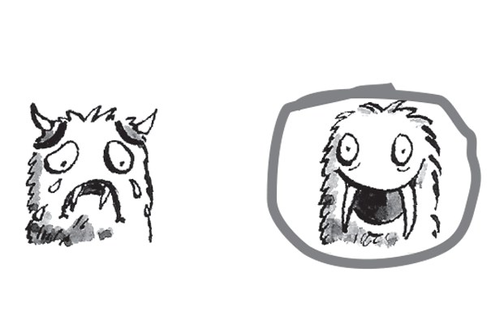
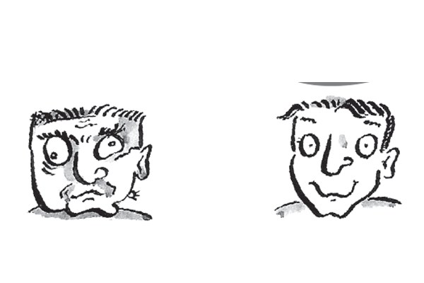
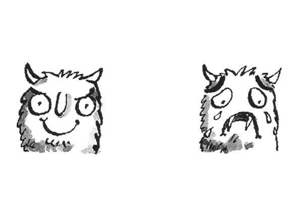
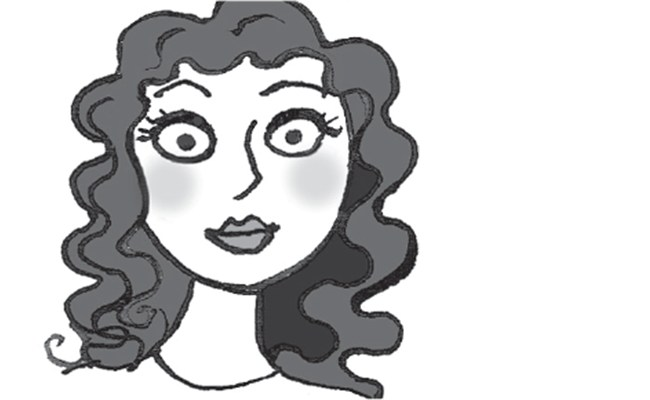
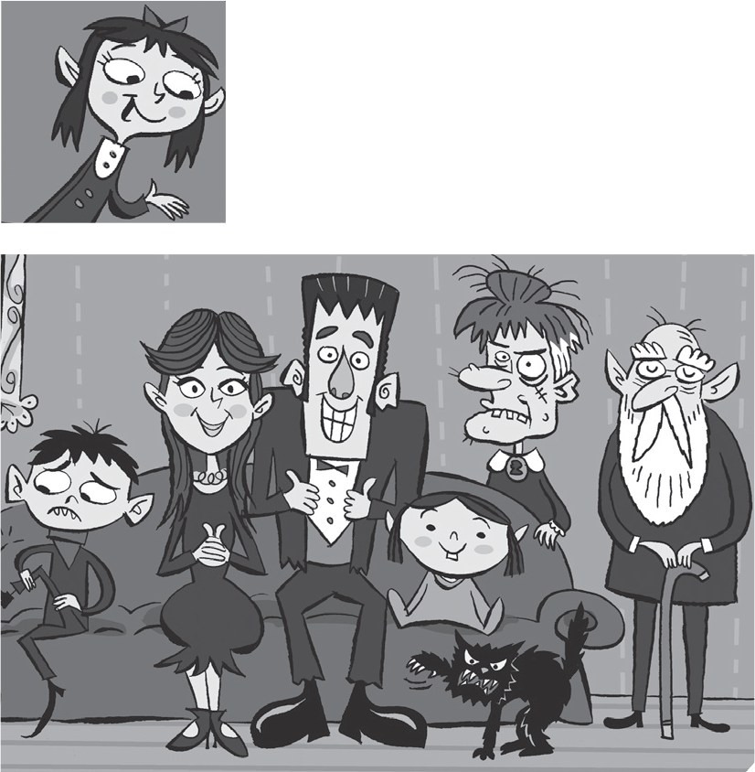

**[Vocabulary]{.underline}**

**1. Look and draw lines. There is one example.   (one point each)**

*2. grandfather*

*3. brother*

*4. mother*

*5. grandmother*

*6. father*

**2. Look and write. There are two examples.   (one point each)**

brother \| mother \| grandfather \| sister \| grandmother \| ~~father~~
\| ~~sister~~

*1. grandfather*

*2. grandmother*

*4. mother*

*5. sister*

*6. brother*

**3. Look and circle *A* or *B*. There is one example.   (one point
each)**

1\. He's happy.

2\. He's ugly.

*A*

3\. She's beautiful.

*A*

4\. She's old.

*B*

5\. He's young.

*A*

6\. He's sad.

*B*

**[Grammar]{.underline}**

**4. Look, read and circle. There is one example.   (one point each)**

1\. She is / *[isn't]{.underline}* ugly.

2\. He is / *isn't* happy.

*isn't*

3\. She is / *isn't* young.

*is*

4\. He is / *isn't* sad.

*isn't*

5\. He is / *isn't* old.

*is*

6\. She is / *isn't* beautiful.

*isn't*

**5. Look and write. There is one example.   (two points each)**

Here you are. \| ~~Thanks!~~ \| I'm sorry!

  -------------------------------------------------------------------------------------------------------------------------------------------------------------------------------------------------------------------- -- -----------------------------------------------------------------------------------------------------------------------------------------------------------------------------------------------------------------
   1.      
  *[Thanks!]{.underline}*                                                                                                                                                                                                 2. *Here you are.*

  -------------------------------------------------------------------------------------------------------------------------------------------------------------------------------------------------------------------- -- -----------------------------------------------------------------------------------------------------------------------------------------------------------------------------------------------------------------

  -----------------------------------------------------------------------------------------------------------------------------------------------------------------------------------------------------------------
  
  3. *I'm sorry.*

  -----------------------------------------------------------------------------------------------------------------------------------------------------------------------------------------------------------------

**[Listening]{.underline}**

**6. Listen and match. There is one example.   (one point each)**

*1. mother -- Sue*

*2. brother -- Nick*

*3. father -- Tom*

*4. grandfather -- Bill*

*5. sister -- Lucy*

**Audio script**

This is my grandmother. Her name's Alice.

This is my mother. Her name's Sue.

This is my brother. His name's Nick.

This is my father. His name's Tom.

This is my grandfather. His name's Bill.

This is my sister. Her name's Lucy.

**7. Listen and write the number. There is one example.   (one point
each)**

*b. 6*

*c. 4*

*d. 2*

*e. 5*

*f. 3*

**Audio script**

1\. happy

2\. sad

3\. young

4\. old

5\. beautiful

6\. ugly

**[Reading]{.underline}**

**8. Read and write. There is one example.   (one point each)**

beautiful \| black \| brother \| father \| ~~family~~ \| grandfather \|
young

1\. This is a photo of my (1) f*[amily]{.underline}*.

2\. My grandmother and (2) g\_\_\_\_\_\_\_\_\_\_ are old. My grandmother
isn't (3) b\_\_\_\_\_\_\_\_\_\_, she's ugly!

*grandfather*

*beautiful*

3\. My mother and (4) f\_\_\_\_\_\_\_\_\_\_ are happy.

*father*

4\. I've got a (5) b\_\_\_\_\_\_\_\_\_\_ and a sister. My sister is (6)
y\_\_\_\_\_\_\_\_\_\_. She's three years old!

*brother*

*young*

5\. I have got a cat too. It's (7) b\_\_\_\_\_\_\_\_\_\_.

*black*

