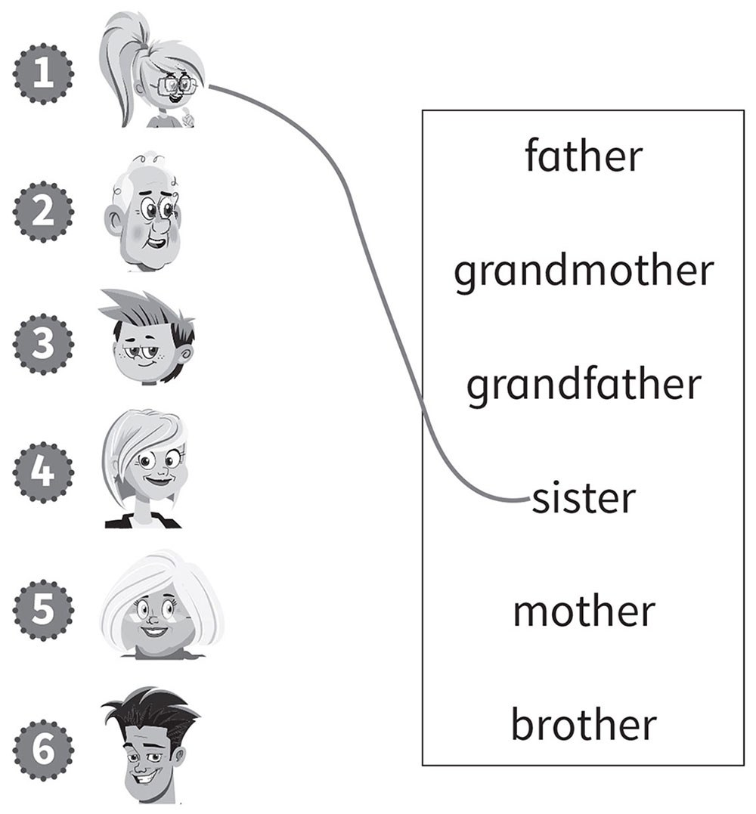
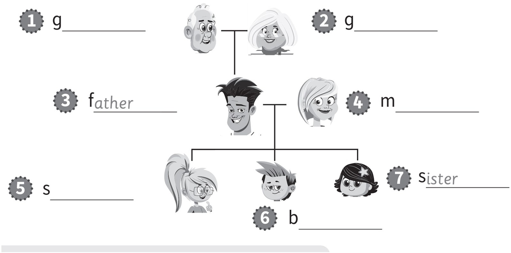
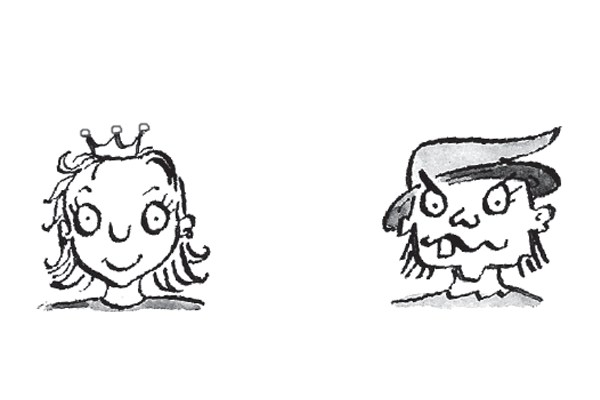
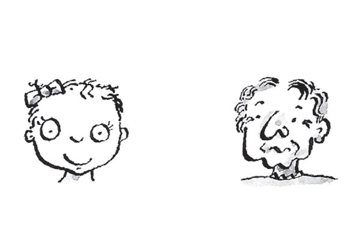
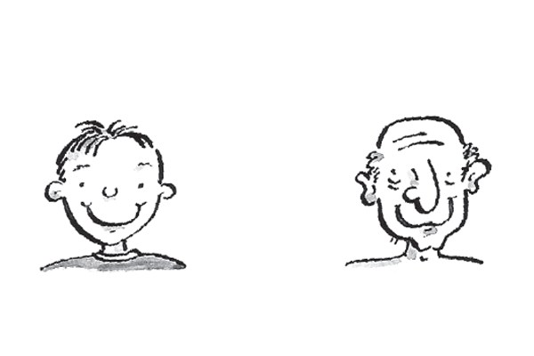
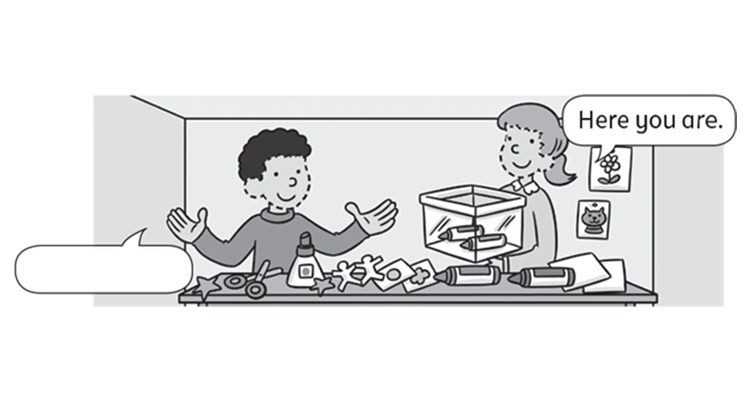
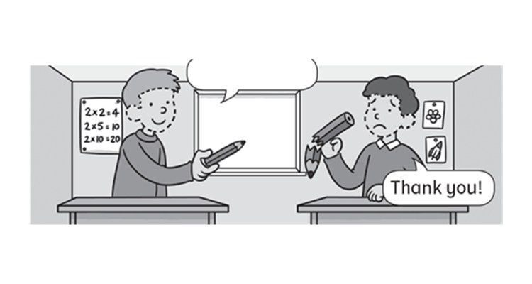
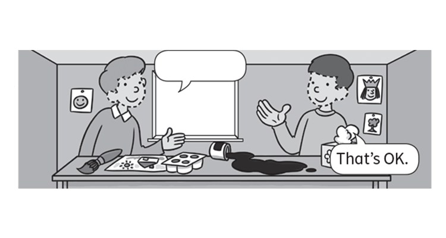
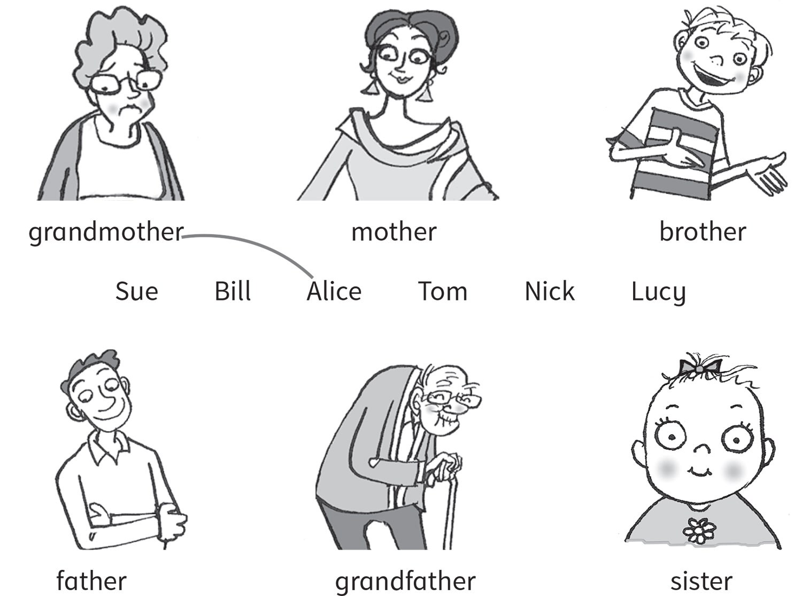

**[Vocabulary]{.underline}**

**1. Look and draw lines. There is one example.   (one point each)**

**2. Look and write. There are two examples.   (one point each)**

brother \| mother \| grandfather \| sister \| grandmother \| ~~father~~
\| ~~sister~~

**3. Look and circle *A* or *B*. There is one example.   (one point
each)**

1\. He's happy.

2\. He's ugly.

3\. She's beautiful.

4\. She's old.

5\. He's young.

6\. He's sad.

**[Grammar]{.underline}**

**4. Look, read and circle. There is one example.   (one point each)**

1\. She is / *[isn't]{.underline}* ugly.

2\. He is / *isn't* happy.

3\. She is / *isn't* young.

4\. He is / *isn't* sad.

5\. He is / *isn't* old.

6\. She is / *isn't* beautiful.

**5. Look and write. There is one example.   (two points each)**

Here you are. \| ~~Thanks!~~ \| I'm sorry!

  ----------------------------------------------------------------------------------------------------------------------------------------------------------------------------------------------------------------------- -- --------------------------------------------------------------------------------------------------------------------------------------------------------------------------------------------------------------------
   1.      
  *[Thanks!]{.underline}*                                                                                                                                                                                                    2. \_\_\_\_\_\_\_\_\_\_\_\_\_

  ----------------------------------------------------------------------------------------------------------------------------------------------------------------------------------------------------------------------- -- --------------------------------------------------------------------------------------------------------------------------------------------------------------------------------------------------------------------

  --------------------------------------------------------------------------------------------------------------------------------------------------------------------------------------------------------------------
  
  3. \_\_\_\_\_\_\_\_\_\_\_\_\_

  --------------------------------------------------------------------------------------------------------------------------------------------------------------------------------------------------------------------

**[Listening]{.underline}**

**6. Listen and match. There is one example.   (one point each)**

**7. Listen and write the number. There is one example.   (one point
each)**

**[Reading]{.underline}**

**8. Read and write. There is one example.   (one point each)**

beautiful \| black \| brother \| father \| ~~family~~ \| grandfather \|
young

1\. This is a photo of my (1) f*[amily]{.underline}*.

2\. My grandmother and (2) g\_\_\_\_\_\_\_\_\_\_ are old. My grandmother
isn't (3) b\_\_\_\_\_\_\_\_\_\_, she's ugly!

3\. My mother and (4) f\_\_\_\_\_\_\_\_\_\_ are happy.

4\. I've got a (5) b\_\_\_\_\_\_\_\_\_\_ and a sister. My sister is (6)
y\_\_\_\_\_\_\_\_\_\_. She's three years old!

5\. I have got a cat too. It's (7) b\_\_\_\_\_\_\_\_\_\_.

