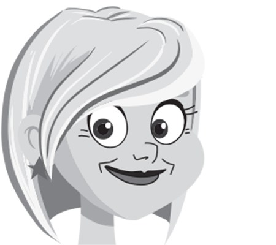
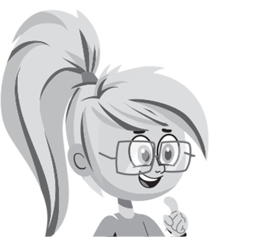
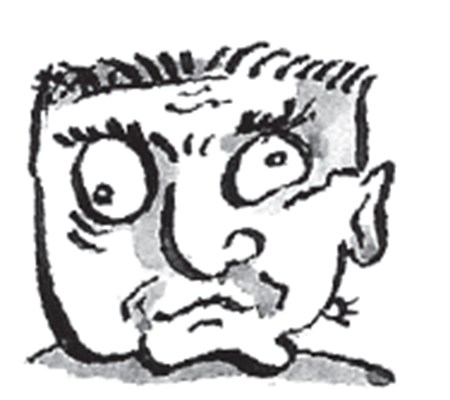
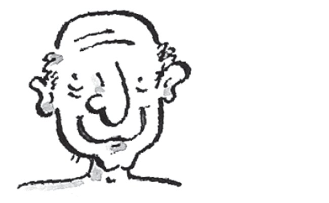
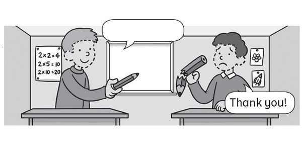
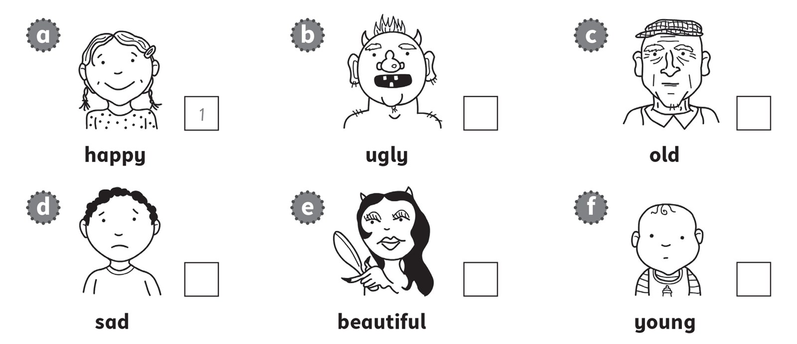

**[Vocabulary]{.underline}**

**1. Complete the words. There is one example.   (one point each)**

1\. f*[a]{.underline}*t*[he]{.underline}*r

2\. gr_n_m\_ \_h\_ \_

*grandmother*

3\. m \_ t \_ \_ r

*mother*

4\. g\_ \_n_f_t\_ \_r

*grandfather*

5\. s\_ \_t_r

*sister*

6\. b\_ \_t\_ \_r

*brother*

**2. Look and write. There are two examples.   (one point each)**

*2. grandmother*

*3. father*

*4. mother*

*5. sister*

*6. brother*

**3. Look and write. There is one example.   (one point each)**

beautiful \| happy \| old \| sad \| ~~ugly~~ \| young

  ------------------------------------------------------------------------------------------------------------------------------------------------------------------------------------------------------------------- -- ---------------------------------------------------------------------------------------------------------------------------------------------------------------------------------------------------------------- -- ----------------------------------------------------------------------------------------------------------------------------------------------------------------------------------------------------------------- -- -----------------------------------------------------------------------------------------------------------------------------------------------------------------------------------------------------------------
   1.                  
  He's *[ugly]{.underline}*.                                                                                                                                                                                             2. He's *happy*.                                                                                                                                                                                                    3. She's *beautiful*.                                                                                                                                                                                                4. She's *old*.

  ------------------------------------------------------------------------------------------------------------------------------------------------------------------------------------------------------------------- -- ---------------------------------------------------------------------------------------------------------------------------------------------------------------------------------------------------------------- -- ----------------------------------------------------------------------------------------------------------------------------------------------------------------------------------------------------------------- -- -----------------------------------------------------------------------------------------------------------------------------------------------------------------------------------------------------------------

  ----------------------------------------------------------------------------------------------------------------------------------------------------------------------------------------------------------------- -- -----------------------------------------------------------------------------------------------------------------------------------------------------------------------------------------------------------------
        
  5. She's *young*.                                                                                                                                                                                                    6. He's *sad*.

  ----------------------------------------------------------------------------------------------------------------------------------------------------------------------------------------------------------------- -- -----------------------------------------------------------------------------------------------------------------------------------------------------------------------------------------------------------------

**[Grammar]{.underline}**

**4. Look, read and write *He is, She is, He isn't, She isn't*. There is
one example.   (one point each)**

  -------------------------------------------------------------------------------------------------------------------------------------------------------------------------------------------------------------------- -- -----------------------------------------------------------------------------------------------------------------------------------------------------------------------------------------------------------------
   1.      
  *[She isn't]{.underline}* ugly.                                                                                                                                                                                         2. *He isn't* happy.

  -------------------------------------------------------------------------------------------------------------------------------------------------------------------------------------------------------------------- -- -----------------------------------------------------------------------------------------------------------------------------------------------------------------------------------------------------------------

  ----------------------------------------------------------------------------------------------------------------------------------------------------------------------------------------------------------------- -- -----------------------------------------------------------------------------------------------------------------------------------------------------------------------------------------------------------------
        
  3. *She is* young.                                                                                                                                                                                                   4. *He isn't* sad.

  ----------------------------------------------------------------------------------------------------------------------------------------------------------------------------------------------------------------- -- -----------------------------------------------------------------------------------------------------------------------------------------------------------------------------------------------------------------

  ----------------------------------------------------------------------------------------------------------------------------------------------------------------------------------------------------------------- -- -----------------------------------------------------------------------------------------------------------------------------------------------------------------------------------------------------------------
        
  5. *He is* old.                                                                                                                                                                                                      6. *She isn't* beautiful.

  ----------------------------------------------------------------------------------------------------------------------------------------------------------------------------------------------------------------- -- -----------------------------------------------------------------------------------------------------------------------------------------------------------------------------------------------------------------

**5. Read and write. Choose the correct words. There is one
example.   (two points each)**

you \| Here \| sorry! \| are. \| I'm \| ~~Thanks~~!

  -------------------------------------------------------------------------------------------------------------------------------------------------------------------------------------------------------------------- -- ----------------------------------------------------------------------------------------------------------------------------------------------------------------------------------------------------------------- -- -----------------------------------------------------------------------------------------------------------------------------------------------------------------------------------------------------------------
   1.            
  *[Thanks!]{.underline}*                                                                                                                                                                                                 2. *Here you are.*                                                                                                                                                                                                   3. *I'm sorry.*

  -------------------------------------------------------------------------------------------------------------------------------------------------------------------------------------------------------------------- -- ----------------------------------------------------------------------------------------------------------------------------------------------------------------------------------------------------------------- -- -----------------------------------------------------------------------------------------------------------------------------------------------------------------------------------------------------------------

**[Listening]{.underline}**

**6. Listen and write the name. There is one example.   (one point
each)**

Nick \| Bill \| ~~Alice~~ \| Sue \| Tom \| Lucy

*2. Sue*

*3. Nick*

*4. Tom*

*5. Bill*

*6. Lucy*

**Audio script**

This is my grandmother. Her name's Alice.

This is my mother. Her name's Sue.

This is my brother. His name's Nick.

This is my father. His name's Tom.

This is my grandfather. His name's Bill.

This is my sister. Her name's Lucy.

**7. Listen and write the number. Then write the word. There is one
example.   (one point each)**

ugly \| ~~happy~~ \| sad \| young \| old \| beautiful

*b. 6, ugly*

*c. 4, old*

*d. 2, sad*

*e. 5, beautiful*

*f. 3, young*

**Audio script**

1\. happy

2\. sad

3\. young

4\. old

5\. beautiful

6\. ugly

**[Reading]{.underline}**

**8. Read and write. There are three extra words. There is one
example.   (one point each)**

black \| brother \| ~~father~~ \| family \| grandfather \| old \| sad \|
beautiful \| white \| young

This is a photo of my (1) family \_\_\_\_\_\_\_\_\_\_\_\_\_\_\_.

My grandmother and (2) \_\_\_\_\_\_\_\_\_\_\_\_\_\_\_ are old. My
grandmother isn't (3), she's ugly!

My mother and (4) \_\_\_\_\_\_\_\_\_\_\_\_\_\_\_ are happy.

I've got a (5) \_\_\_\_\_\_\_\_\_\_\_\_\_\_\_ and a sister. My sister is
(6) \_\_\_\_\_\_\_\_\_\_\_\_\_\_\_. She's three years old!

I have got a cat too. It's (7) b \_\_\_\_\_\_\_\_\_\_\_\_\_\_\_.

*2. grandfather*

*3. beautiful*

*4. father*

*5. brother*

*6. young*

*7. black*

