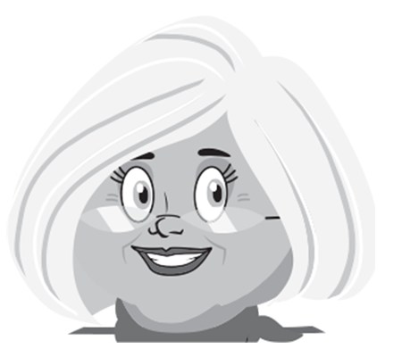
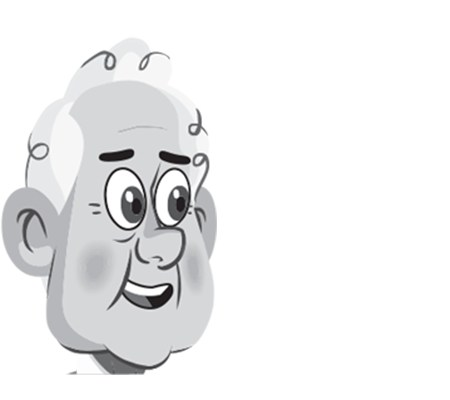
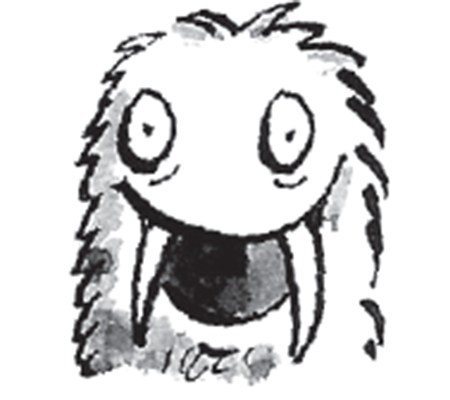
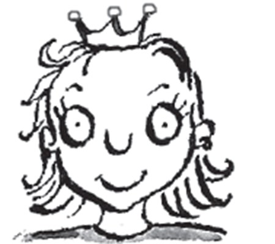
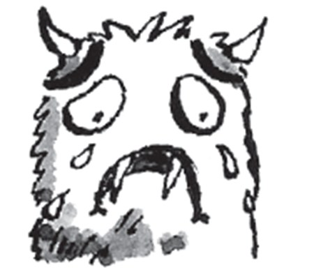
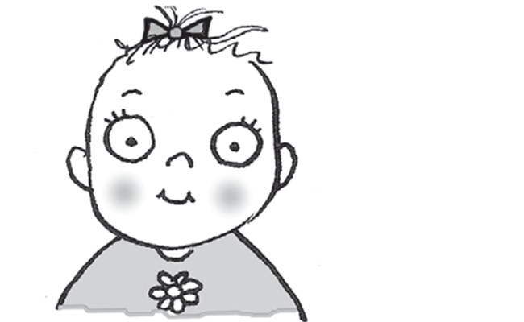
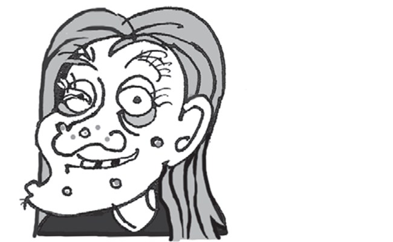
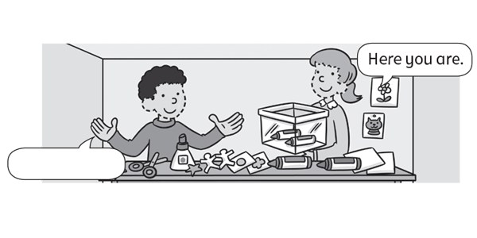
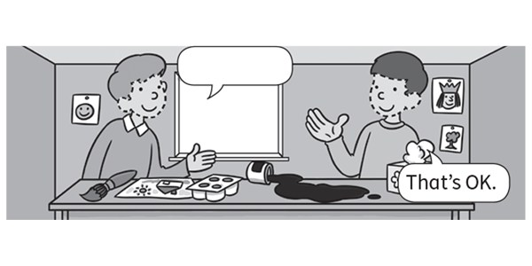
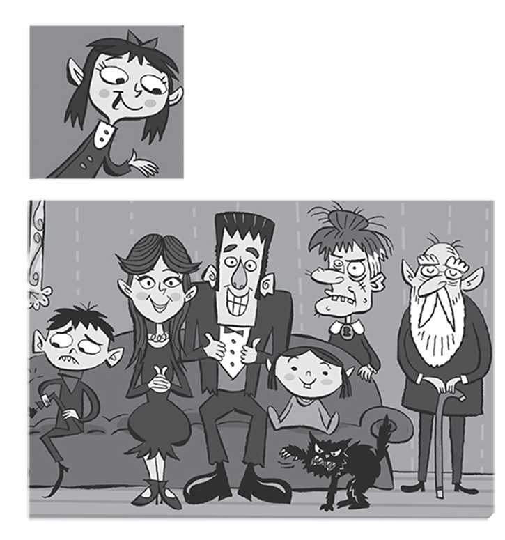

**[Vocabulary]{.underline}**

**1. Complete the words. There is one example.   (one point each)**

1\. f*[a]{.underline}*t*[he]{.underline}*r

2\. gr_n_m\_ \_h\_ \_

3\. m \_ t \_ \_ r

4\. g\_ \_n_f_t\_ \_r

5\. s\_ \_t_r

6\. b\_ \_t\_ \_r

**2. Look and write. There are two examples.   (one point each)**

**3. Look and write. There is one example.   (one point each)**

beautiful \| happy \| old \| sad \| ~~ugly~~ \| young

  ---------------------------------------------------------------------------------------------------------------------------------------------------------------------------------------------------------------------- -- ------------------------------------------------------------------------------------------------------------------------------------------------------------------------------------------------------------------- -- -------------------------------------------------------------------------------------------------------------------------------------------------------------------------------------------------------------------- -- --------------------------------------------------------------------------------------------------------------------------------------------------------------------------------------------------------------------
   1.                  
  He's *[ugly]{.underline}*.                                                                                                                                                                                                2. He's \_\_\_\_\_\_\_\_\_.                                                                                                                                                                                            3. She's \_\_\_\_\_\_\_\_\_.                                                                                                                                                                                            4. She's \_\_\_\_\_\_\_\_\_.

  ---------------------------------------------------------------------------------------------------------------------------------------------------------------------------------------------------------------------- -- ------------------------------------------------------------------------------------------------------------------------------------------------------------------------------------------------------------------- -- -------------------------------------------------------------------------------------------------------------------------------------------------------------------------------------------------------------------- -- --------------------------------------------------------------------------------------------------------------------------------------------------------------------------------------------------------------------

  -------------------------------------------------------------------------------------------------------------------------------------------------------------------------------------------------------------------- -- --------------------------------------------------------------------------------------------------------------------------------------------------------------------------------------------------------------------
        
  5. She's \_\_\_\_\_\_\_\_\_.                                                                                                                                                                                            6. He's \_\_\_\_\_\_\_\_\_.

  -------------------------------------------------------------------------------------------------------------------------------------------------------------------------------------------------------------------- -- --------------------------------------------------------------------------------------------------------------------------------------------------------------------------------------------------------------------

**[Grammar]{.underline}**

**4. Look, read and write *He is, She is, He isn't, She isn't*. There is
one example.   (one point each)**

  ----------------------------------------------------------------------------------------------------------------------------------------------------------------------------------------------------------------------- -- --------------------------------------------------------------------------------------------------------------------------------------------------------------------------------------------------------------------
   1.      
  *[She isn't]{.underline}* ugly.                                                                                                                                                                                            2. \_\_\_\_\_\_\_\_\_ happy.

  ----------------------------------------------------------------------------------------------------------------------------------------------------------------------------------------------------------------------- -- --------------------------------------------------------------------------------------------------------------------------------------------------------------------------------------------------------------------

  -------------------------------------------------------------------------------------------------------------------------------------------------------------------------------------------------------------------- -- --------------------------------------------------------------------------------------------------------------------------------------------------------------------------------------------------------------------
        
  3. \_\_\_\_\_\_\_\_\_ young.                                                                                                                                                                                            4. \_\_\_\_\_\_\_\_\_ sad.

  -------------------------------------------------------------------------------------------------------------------------------------------------------------------------------------------------------------------- -- --------------------------------------------------------------------------------------------------------------------------------------------------------------------------------------------------------------------

  -------------------------------------------------------------------------------------------------------------------------------------------------------------------------------------------------------------------- -- --------------------------------------------------------------------------------------------------------------------------------------------------------------------------------------------------------------------
        
  5. \_\_\_\_\_\_\_\_\_ old.                                                                                                                                                                                              6. \_\_\_\_\_\_\_\_\_ beautiful.

  -------------------------------------------------------------------------------------------------------------------------------------------------------------------------------------------------------------------- -- --------------------------------------------------------------------------------------------------------------------------------------------------------------------------------------------------------------------

**5. Read and write. Choose the correct words. There is one
example.   (two points each)**

you \| Here \| sorry! \| are. \| I'm \| ~~Thanks~~!

  ----------------------------------------------------------------------------------------------------------------------------------------------------------------------------------------------------------------------- -- -------------------------------------------------------------------------------------------------------------------------------------------------------------------------------------------------------------------- -- --------------------------------------------------------------------------------------------------------------------------------------------------------------------------------------------------------------------
   1.            
  *[Thanks!]{.underline}*                                                                                                                                                                                                    2. \_\_\_\_\_\_\_\_\_\_\_\_\_                                                                                                                                                                                           3. \_\_\_\_\_\_\_\_\_\_\_\_\_

  ----------------------------------------------------------------------------------------------------------------------------------------------------------------------------------------------------------------------- -- -------------------------------------------------------------------------------------------------------------------------------------------------------------------------------------------------------------------- -- --------------------------------------------------------------------------------------------------------------------------------------------------------------------------------------------------------------------

**[Listening]{.underline}**

**6. Listen and write the name. There is one example.   (one point
each)**

Nick \| Bill \| ~~Alice~~ \| Sue \| Tom \| Lucy

**7. Listen and write the number. Then write the word. There is one
example.   (one point each)**

ugly \| ~~happy~~ \| sad \| young \| old \| beautiful

**[Reading]{.underline}**

**8. Read and write. There are three extra words. There is one
example.   (one point each)**

black \| brother \| ~~father~~ \| family \| grandfather \| old \| sad \|
beautiful \| white \| young

This is a photo of my (1) family \_\_\_\_\_\_\_\_\_\_\_\_\_\_\_.

My grandmother and (2) \_\_\_\_\_\_\_\_\_\_\_\_\_\_\_ are old. My
grandmother isn't (3), she's ugly!

My mother and (4) \_\_\_\_\_\_\_\_\_\_\_\_\_\_\_ are happy.

I've got a (5) \_\_\_\_\_\_\_\_\_\_\_\_\_\_\_ and a sister. My sister is
(6) \_\_\_\_\_\_\_\_\_\_\_\_\_\_\_. She's three years old!

I have got a cat too. It's (7) b \_\_\_\_\_\_\_\_\_\_\_\_\_\_\_.

