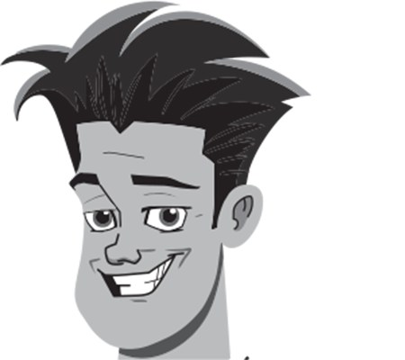
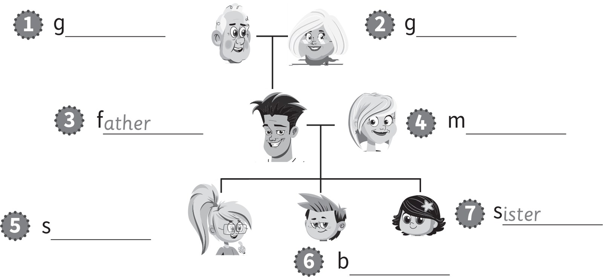
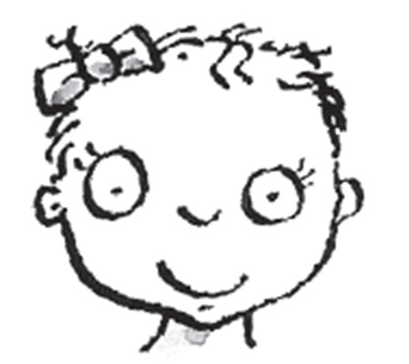
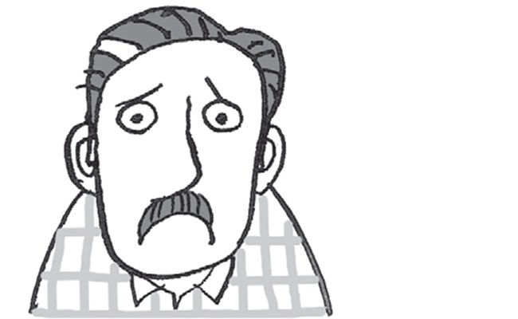
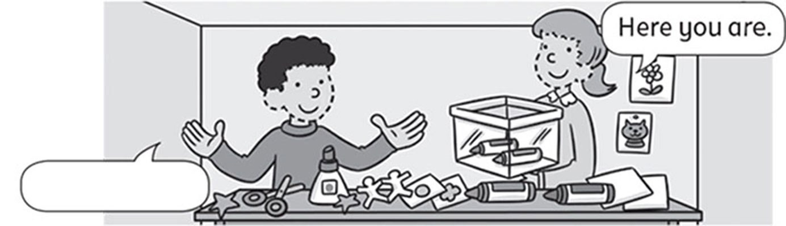

**[Vocabulary]{.underline}**

**1. Look. Choose the correct word. There is one example.   (one point
each)**

1\. *[father]{.underline}* / brother

2\. sister / grandmother

*grandmother*

3\. grandmother / mother

*mother*

4\. brother / grandfather

*grandfather*

5\. brother / sister

*sister*

6\. brother / mother

*brother*

**2. Look and write. There are two examples.   (one point each)**

brother \| mother \| ~~grandfather~~ \| ~~sister~~ \| grandmother \|
father \| sister

*2. grandmother*

*3. father*

*4. mother*

*5. sister*

*6. brother*

**3. Look and match. Write the number. There is one example.   (one
point each)**

1\. He's ugly. *[6]{.underline}*

2\. He's happy. \_\_\_\_\_\_\_\_\_\_\_\_

*happy -- 5*

3\. She's beautiful. \_\_\_\_\_\_\_\_\_\_\_\_

*beautiful -- 1*

4\. She's old. \_\_\_\_\_\_\_\_\_\_\_\_

*old -- 2*

5\. She's young. \_\_\_\_\_\_\_\_\_\_\_\_

*young -- 4*

6\. He's sad. \_\_\_\_\_\_\_\_\_\_\_\_

*sad -- 3*

**[Grammar]{.underline}**

**4. Look, read and write *is / isn't*. There is one example.   (one
point each)**

1\. She *[isn't]{.underline}* ugly.

2\. He \_\_\_\_\_\_\_\_ happy.

*isn't*

3\. She \_\_\_\_\_\_\_\_ young.

*is*

4\. He \_\_\_\_\_\_\_\_ sad.

*isn't*

5\. He \_\_\_\_\_\_\_\_ old.

*is*

6\. She \_\_\_\_\_\_\_\_ ugly.

*is*

**5. Read and put the words in order. Write. There is one
example.   (two points each)**

you Here are. \| ~~Thanks~~! \| sorry I'm.

  ---------------------------------------------------------------------------------------------------------------------------------------------------------------------------------------------------------------------
   1.
  *[Thanks!]{.underline}*

  ---------------------------------------------------------------------------------------------------------------------------------------------------------------------------------------------------------------------

  ------------------------------------------------------------------------------------------------------------------------------------------------------------------------------------------------------------------
  
  2. *Here you are.*

  ------------------------------------------------------------------------------------------------------------------------------------------------------------------------------------------------------------------

  ------------------------------------------------------------------------------------------------------------------------------------------------------------------------------------------------------------------
  
  3. *I'm sorry.*

  ------------------------------------------------------------------------------------------------------------------------------------------------------------------------------------------------------------------

**[Listening]{.underline}**

**6. Listen and draw lines. There are two examples.   (one point each)**

*2. mum -- Sue*

*3. brother -- Nick*

*4. sister -- Lucy*

*5. grandfather -- Bill*

*6. father -- Tom*

**Audio script**

This is my grandmother. Her name's Alice.

This is my mum. Her name's Sue.

This is my brother. His name's Nick.

This is my dad. His name's Tom.

This is my grandfather. His name's Bill.

This is my sister. Her name's Lucy.

**7. Listen and write the number. There is one example.   (one point
each)**

*b. 6*

*c. 4*

*d. 2*

*e. 5*

*f. 3*

**Audio script**

1 happy

2 sad

3 young

4 old

5 beautiful

6 ugly

**[Reading]{.underline}**

**8. Read and write. There is one example.   (one point each)**

black \| brother \| dad \| ~~family~~ \| grandfather \| beautiful \|
young

This is a photo of my (1) *[family]{.underline}*.

My grandmother and (2) *grandfather* are old. My grandmother isn't (3)
*beautiful*, she's ugly!

My mum and (4) *dad* are happy.

I've got a (5) *brother* and a sister. My sister is (6) *young*. She's
three years old!

I have got a cat too. It's (7) b *black*.

