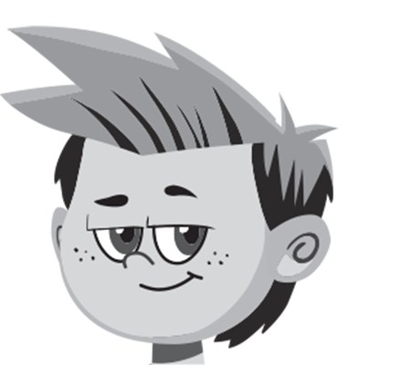
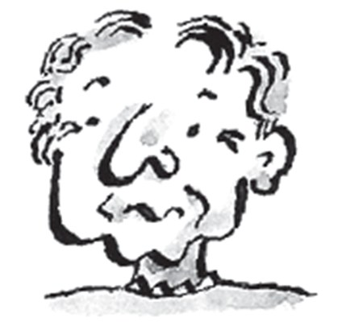
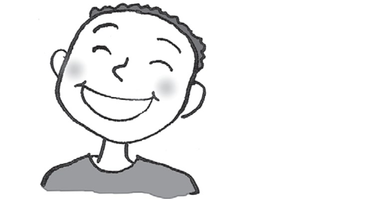
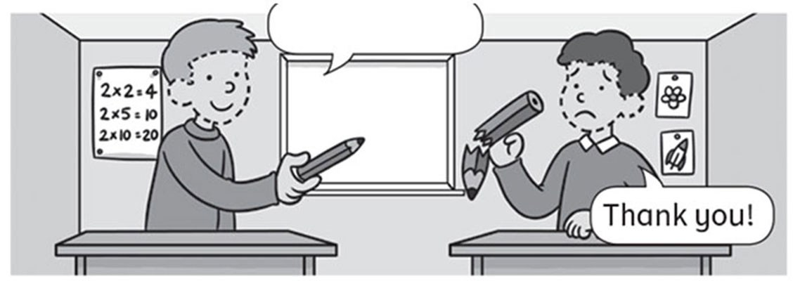
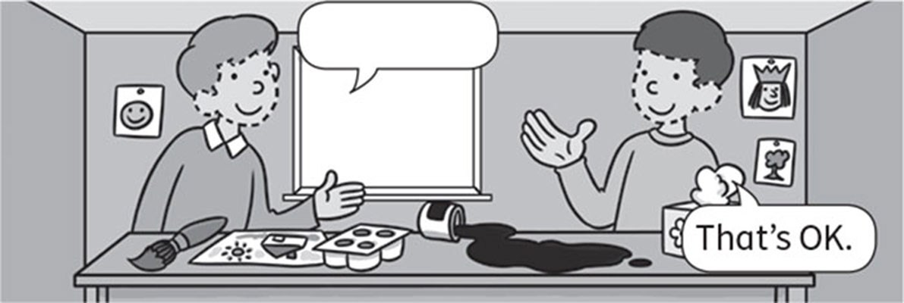
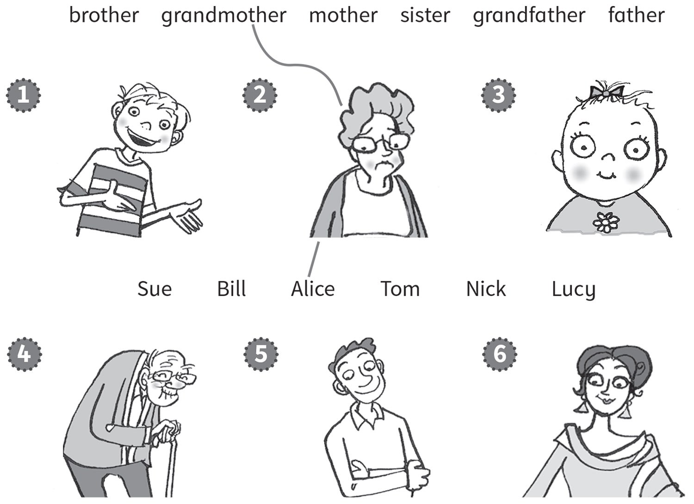
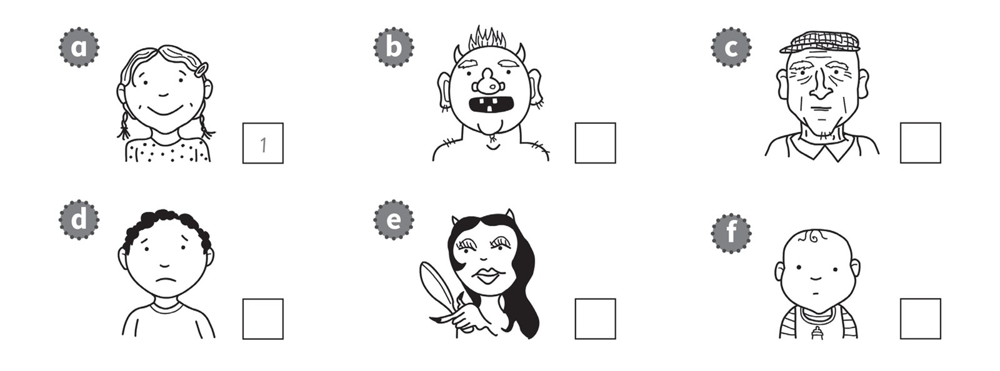

**[Vocabulary]{.underline}**

**1. Look. Choose the correct word. There is one example.   (one point
each)**

1\. *[father]{.underline}* / brother

2\. sister / grandmother

3\. grandmother / mother

4\. brother / grandfather

5\. brother / sister

6\. brother / mother

**2. Look and write. There are two examples.   (one point each)**

brother \| mother \| ~~grandfather~~ \| ~~sister~~ \| grandmother \|
father \| sister

**3. Look and match. Write the number. There is one example.   (one
point each)**

1\. He's ugly. *[6]{.underline}*

2\. He's happy. \_\_\_\_\_\_\_\_\_\_\_\_

3\. She's beautiful. \_\_\_\_\_\_\_\_\_\_\_\_

4\. She's old. \_\_\_\_\_\_\_\_\_\_\_\_

5\. She's young. \_\_\_\_\_\_\_\_\_\_\_\_

6\. He's sad. \_\_\_\_\_\_\_\_\_\_\_\_

**[Grammar]{.underline}**

**4. Look, read and write *is / isn't*. There is one example.   (one
point each)**

1\. She *[isn't]{.underline}* ugly.

2\. He \_\_\_\_\_\_\_\_ happy.

3\. She \_\_\_\_\_\_\_\_ young.

4\. He \_\_\_\_\_\_\_\_ sad.

5\. He \_\_\_\_\_\_\_\_ old.

6\. She \_\_\_\_\_\_\_\_ ugly.

**5. Read and put the words in order. Write. There is one
example.   (two points each)**

you Here are. \| ~~Thanks~~! \| sorry I'm.

  ------------------------------------------------------------------------------------------------------------------------------------------------------------------------------------------------------------------------
   1.
  *[Thanks!]{.underline}*

  ------------------------------------------------------------------------------------------------------------------------------------------------------------------------------------------------------------------------

  ---------------------------------------------------------------------------------------------------------------------------------------------------------------------------------------------------------------------
  
  2. \_\_\_\_\_\_\_\_\_\_\_\_\_

  ---------------------------------------------------------------------------------------------------------------------------------------------------------------------------------------------------------------------

  ---------------------------------------------------------------------------------------------------------------------------------------------------------------------------------------------------------------------
  
  3. \_\_\_\_\_\_\_\_\_\_\_\_\_

  ---------------------------------------------------------------------------------------------------------------------------------------------------------------------------------------------------------------------

**[Listening]{.underline}**

**6. Listen and draw lines. There are two examples.   (one point each)**

**7. Listen and write the number. There is one example.   (one point
each)**

**[Reading]{.underline}**

**8. Read and write. There is one example.   (one point each)**

black \| brother \| dad \| ~~family~~ \| grandfather \| beautiful \|
young

This is a photo of my (1) *[family]{.underline}*.

My grandmother and (2) \_\_\_\_\_\_\_\_\_\_\_\_\_\_\_\_\_\_ are old. My
grandmother isn't (3) \_\_\_\_\_\_\_\_\_\_\_\_\_\_\_\_\_\_, she's ugly!

My mum and (4) \_\_\_\_\_\_\_\_\_\_\_\_\_\_\_\_\_\_ are happy.

I've got a (5) \_\_\_\_\_\_\_\_\_\_\_\_\_\_\_\_\_\_ and a sister. My
sister is (6) \_\_\_\_\_\_\_\_\_\_\_\_\_\_\_\_\_\_. She's three years
old!

I have got a cat too. It's (7) b \_\_\_\_\_\_\_\_\_\_\_\_\_\_\_\_\_\_.

