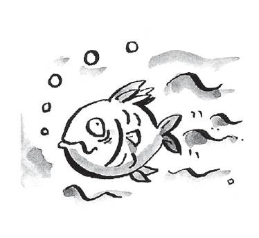
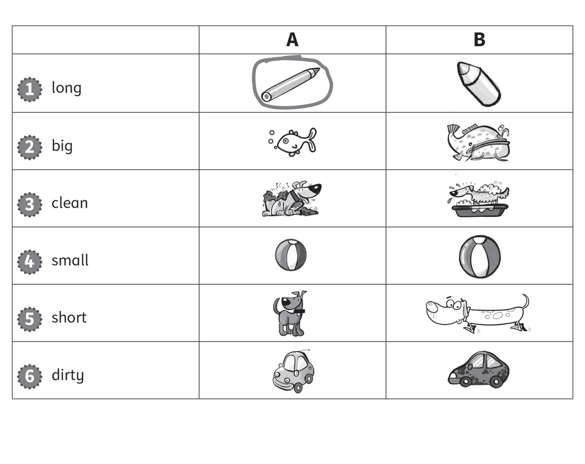
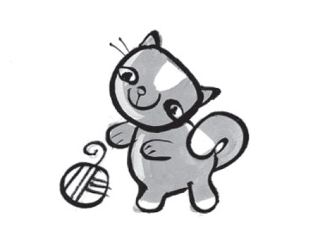
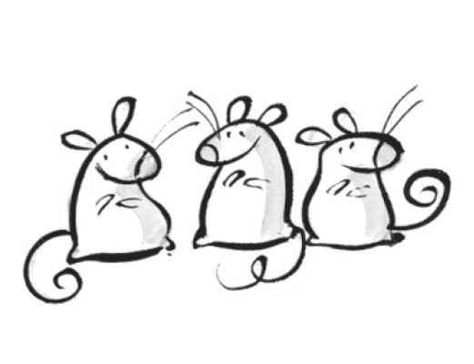
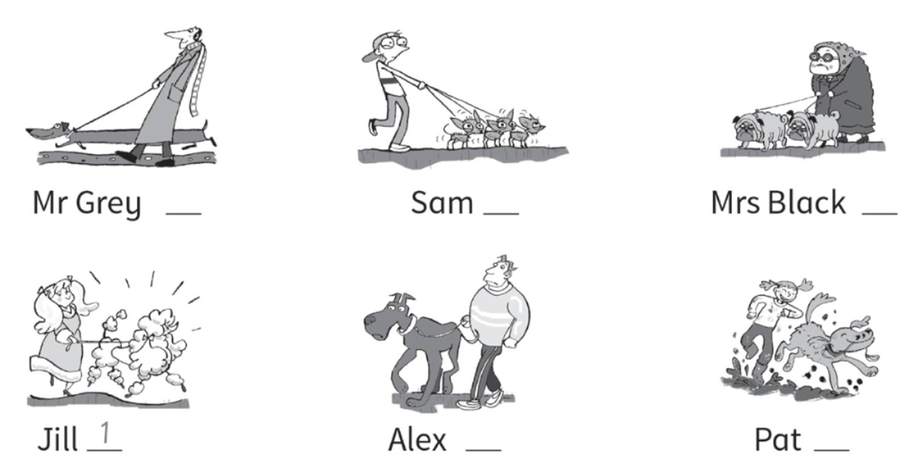
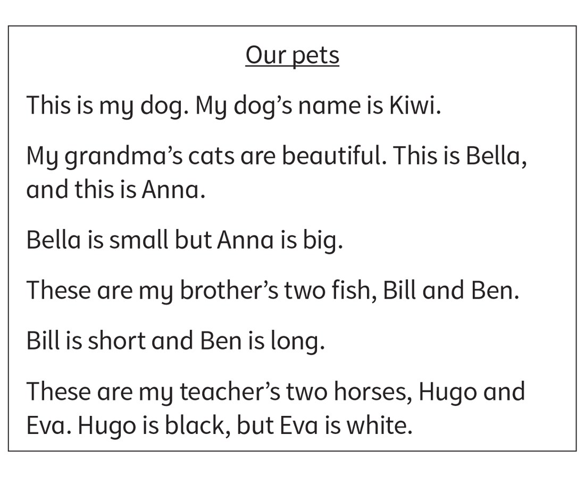
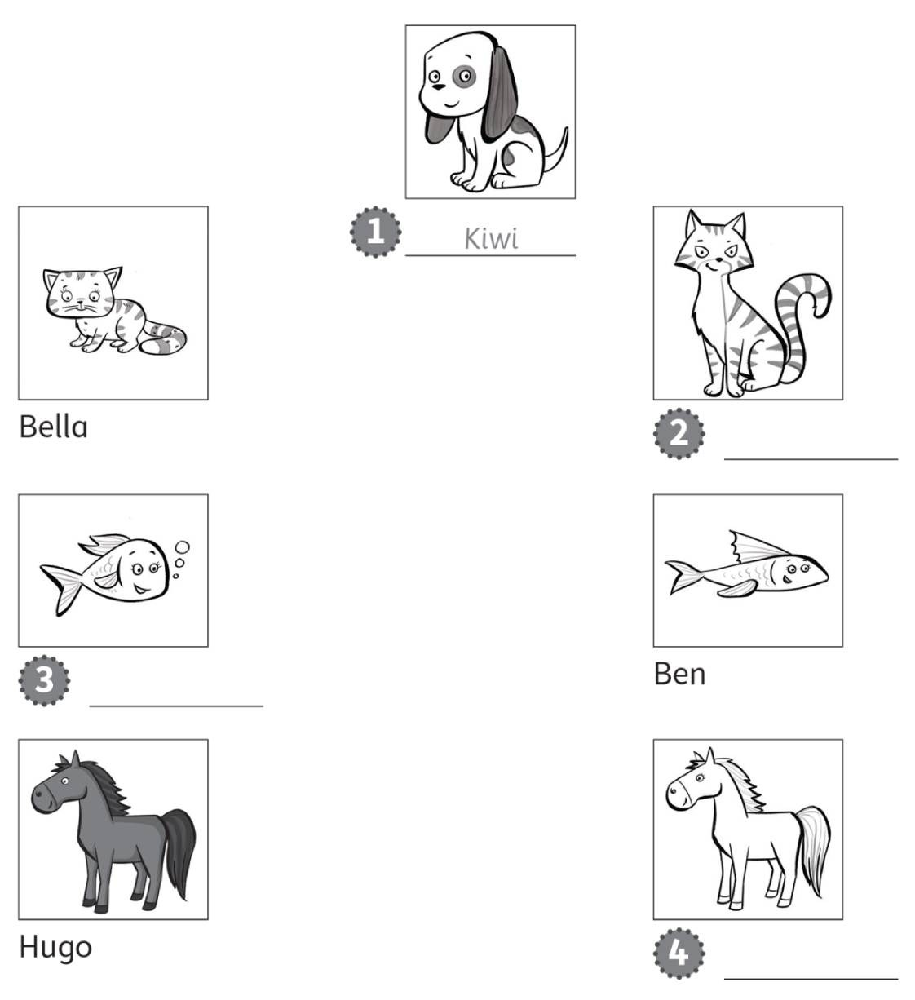

**[Vocabulary]{.underline}**

**1. Look and circle. There is one example.    (one point each)**

1\. *[dog]{.underline}* / bird

2\. dog / cat

*cat*

3\. mouse / horse

*horse*

4\. cat / mouse

*mouse*

5\. fish / horse

*fish*

6\. dog / bird

*bird*

**2. Look and circle the picture in A or B. There is one example.   (one
point each)**

*2. B*

*3. B*

*4. A*

*5. A*

*6. B*

**3. Look and draw lines. There is one example. (Unit 5 Basic)   (one
point each)**

*2. big*

*3. long*

*4. dirty*

*5. ugly*

**[Grammar]{.underline}**

**4. Look, read and circle. There is one example.   (one point each)**

1\. *[It's]{.underline}* / *They're* a cat.

2\. *It's* / *They're* mice.

*They're*

3\. *It's* / *They're* a car.

*It's*

4\. *It's* / *They're* pencils.

*They're*

5\. *It's* / *They're* horses.

*They're*

6\. *It's* / *They're* a fish.

*It's*

**5. Look. Put the words in the correct order. There is one
example.   (one point each)**

1\. small a It's mouse. It's a *[small mouse]{.underline}*.

2\. horse a big It's. It's a \_\_\_\_\_\_\_.

*It's a big horse.*

3\. clean They're cats. They're \_\_\_\_\_\_\_.

*They're clean cats.*

4\. long fish They're. They're \_\_\_\_\_\_\_.

*They're long fish.*

5\. It's dog a dirty. It's a \_\_\_\_\_\_\_.

*It's a dirty dog.*

6\. and ugly They're long. They're long \_\_\_\_\_\_\_.

*They're long and ugly.*

**[Listening]{.underline}**

**6. Listen and colour. There is one example.   (one point each)**

*2. a grey mouse*

*3. an orange fish*

*4. a brown horse*

*5. a blue bird*

*6. a black dog*

**Audio script**

1\. A black and white cat.

2\. A grey mouse.

3\. An orange fish.

4\. A brown horse.

5\. A blue bird.

6\. A black dog.

**7. Listen and write the number. There is one example.   (one point
each)**

*Mr Grey 4*

*Sam 5*

*Mrs Black 2*

*Alex 6*

*Pat 3*

**Audio script**

1\. Jill's dog is clean.

2\. Mrs Black's dogs are short.

3\. Pat's dog is dirty.

4\. Mr Grey's dog is long.

5\. Sam's three dogs are small.

6\. Alex's dog is very big.

**[Reading]{.underline}**

**8. Read and write the names. There is one example.   (two points
each)**

  ------------------------------------------------------------------------------------------------------------------------------------------------------------------------------------------------------------------
  

  ------------------------------------------------------------------------------------------------------------------------------------------------------------------------------------------------------------------

