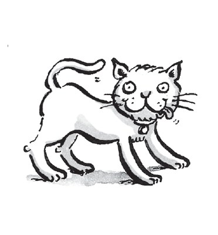
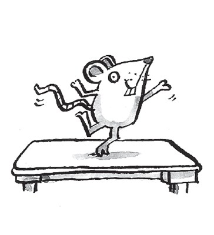
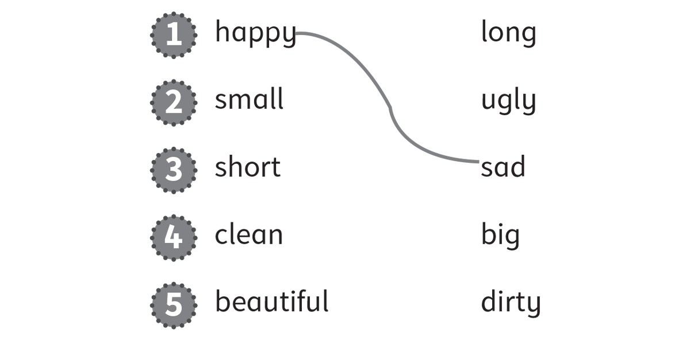
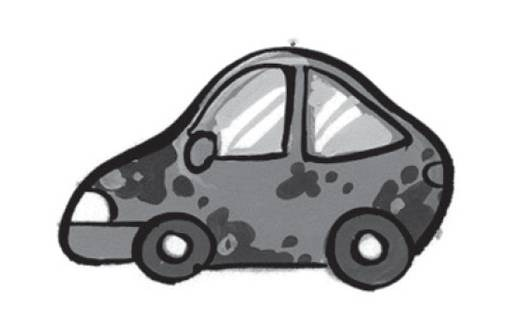
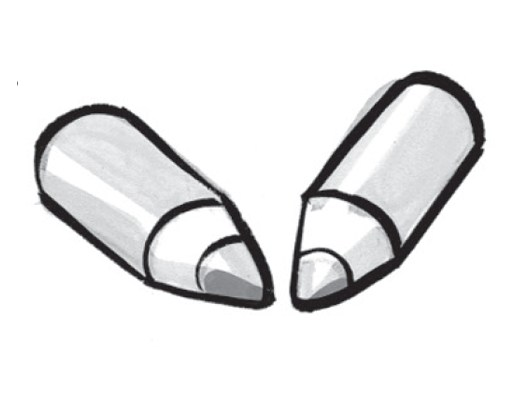
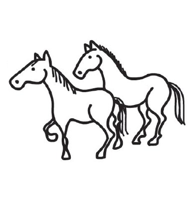
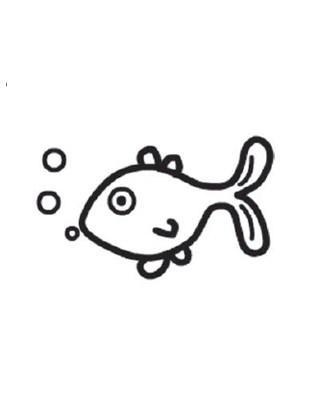
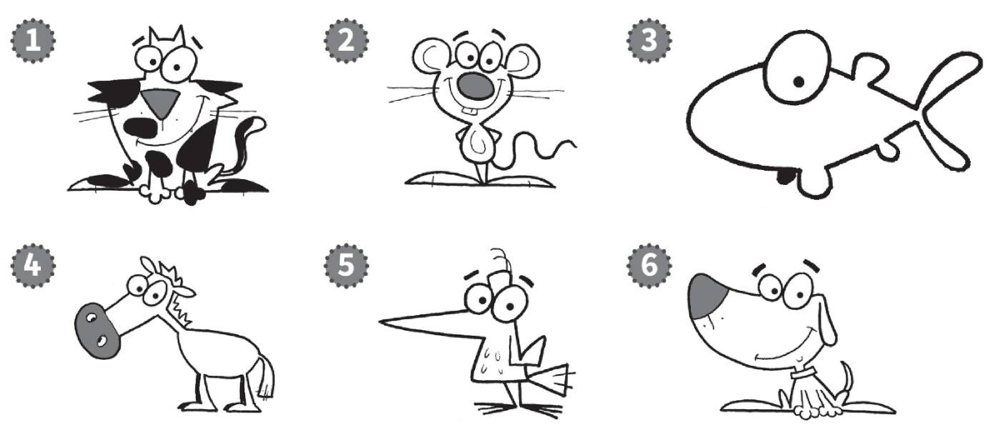

**[Vocabulary]{.underline}**

**1. Look and circle. There is one example.    (one point each)**

1\. *[dog]{.underline}* / bird

2\. dog / cat

3\. mouse / horse

4\. cat / mouse

5\. fish / horse

6\. dog / bird

**2. Look and circle the picture in A or B. There is one example.   (one
point each)**

**3. Look and draw lines. There is one example. (Unit 5 Basic)   (one
point each)**

**[Grammar]{.underline}**

**4. Look, read and circle. There is one example.   (one point each)**

1\. *[It's]{.underline}* / *They're* a cat.

2\. *It's* / *They're* mice.

3\. *It's* / *They're* a car.

4\. *It's* / *They're* pencils.

5\. *It's* / *They're* horses.

6\. *It's* / *They're* a fish.

**5. Look. Put the words in the correct order. There is one
example.   (one point each)**

1\. small a It's mouse. It's a *[small mouse]{.underline}*.

2\. horse a big It's. It's a \_\_\_\_\_\_\_.

3\. clean They're cats. They're \_\_\_\_\_\_\_.

4\. long fish They're. They're \_\_\_\_\_\_\_.

5\. It's dog a dirty. It's a \_\_\_\_\_\_\_.

6\. and ugly They're long. They're long \_\_\_\_\_\_\_.

**[Listening]{.underline}**

**6. Listen and colour. There is one example.   (one point each)**

**7. Listen and write the number. There is one example.   (one point
each)**

**[Reading]{.underline}**

**8. Read and write the names. There is one example.   (two points
each)**

  ---------------------------------------------------------------------------------------------------------------------------------------------------------------------------------------------------------------------
  

  ---------------------------------------------------------------------------------------------------------------------------------------------------------------------------------------------------------------------

