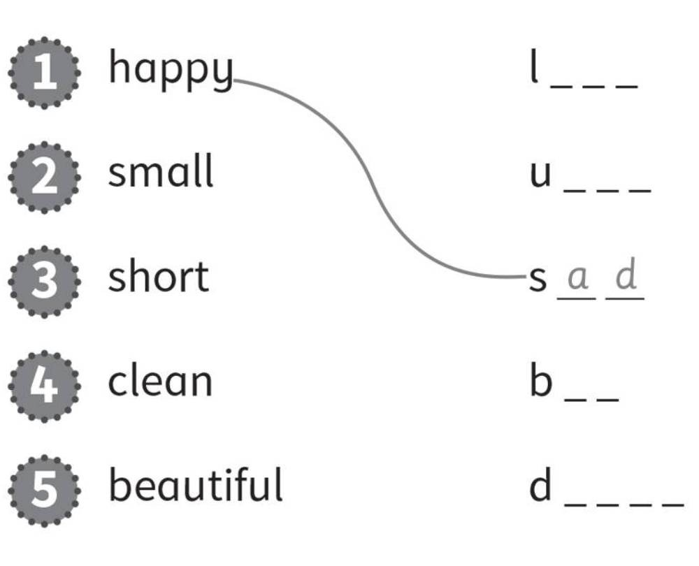
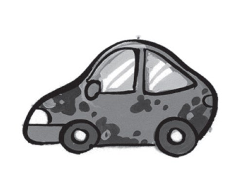
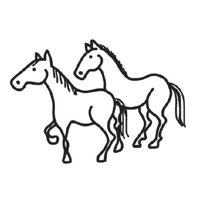
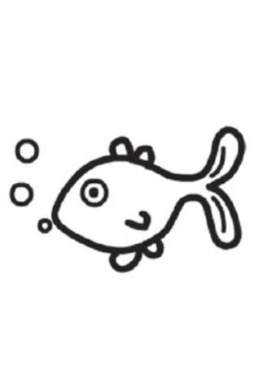
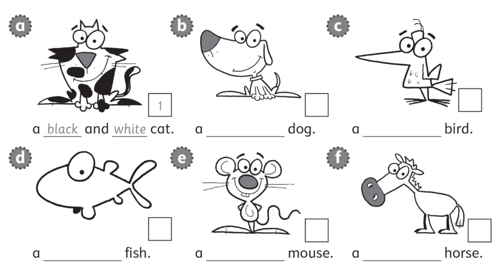
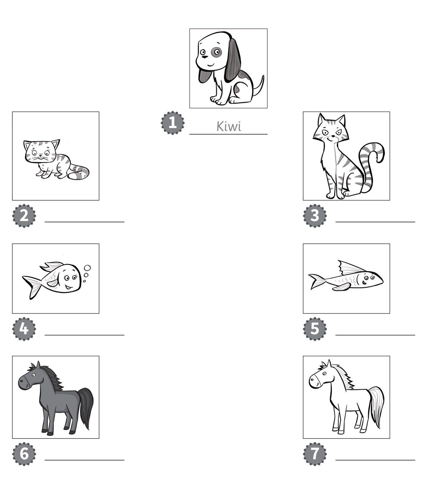

**[Vocabulary]{.underline}**

**1. Look and write. There is one example.   (one point each)**

1\. a d *[o]{.underline}* *[g]{.underline}*

2\. a c \_ \_

*cat*

3\. a h \_ \_ \_ \_

*horse*

4\. a m \_ \_ \_ \_

*mouse*

5\. a f \_ \_ \_

*fish*

6\. a b \_ \_ \_

*bird*

**2. Look and write the word. There is one example.   (one point each)**

big \| clean \| dirty \| ~~long~~ \| short \| small

*2. big*

*3. clean*

*4. small*

*5. short*

*6. dirty*

**3. Read and write the opposite. Draw lines. There is one
example.   (one point each)**

*2. big*

*3. long*

*4. dirty*

*5. ugly*

**[Grammar]{.underline}**

**4. Look. Complete the sentences. There is one example.   (one point
each)**

1\. What is it?

*[It's]{.underline}* a cat.

2\. What are they?

\_\_\_\_\_\_\_ mice.

*They're*

3\. What is it?

\_\_\_\_\_\_\_ a car.

*It's*

4\. What are they?

\_\_\_\_\_\_\_ pencils.

*They're*

5\. What are they?

\_\_\_\_\_\_\_ horses.

*They're*

6\. What is it?

\_\_\_\_\_\_\_ a fish.

*It's*

**5. Look. Put the words in the correct order. There is one
example.   (one point each)**

  ------------------------------- --- -----------------------------------
  1\. small a It's mouse.             *It's a small mouse.*

  ------------------------------- --- -----------------------------------

  ------------------------------- --- -----------------------------------
  2\. horse a big It's.               *It's a big horse.*

  ------------------------------- --- -----------------------------------

  ------------------------------- --- -----------------------------------
  3\. clean They're cats.             *They're clean cats.*

  ------------------------------- --- -----------------------------------

  ------------------------------- --- -----------------------------------
  4\. long fish They're.              *They're long fish.*

  ------------------------------- --- -----------------------------------

  ------------------------------- --- -----------------------------------
  5\. It's dog a dirty.               *It's a dirty dog.*

  ------------------------------- --- -----------------------------------

  ------------------------------- --- -----------------------------------
  6\. and ugly They're long.          *They're long and ugly.*

  ------------------------------- --- -----------------------------------

**[Listening]{.underline}**

**6. Listen and write the number. Then complete and colour. There is one
example.   (one point each)**

*b. 6 black*

*c. 5 blue*

*d. 3 orange*

*e. 2 grey*

*f. 4 brown*

**Audio script**

1\. A black and white cat.

2\. A grey mouse.

3\. An orange fish.

4\. A brown horse.

5\. A blue bird.

6\. A black dog.

**7. Listen and write the number.   (one point each)**

*a. 4*

*c. 6*

*d. 3*

*e. 2*

*f. 5*

**Audio script**

1\. Jill's dog is clean.

2\. Mrs Black's dogs are short.

3\. Pat's dog is dirty.

4\. Mr Grey's dog is long.

5\. Sam's three dogs are small.

6\. Alex's dog is very big.

**[Reading]{.underline}**

**8. Read and write the names.   (one point each)**

  -----------------------------------------------------------------------------------------------------------------------------------------------------------------------------------------------------------------
  

  -----------------------------------------------------------------------------------------------------------------------------------------------------------------------------------------------------------------

