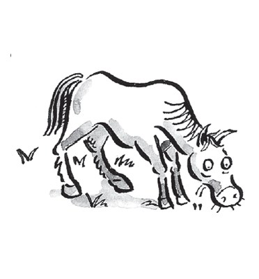
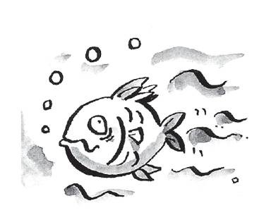
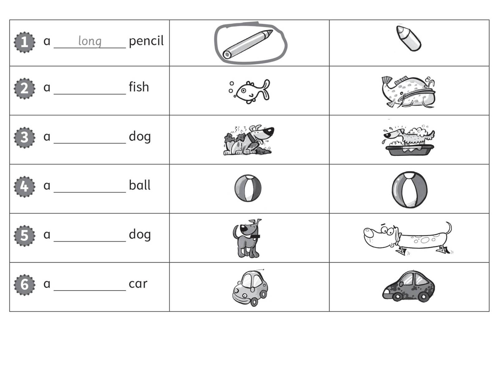
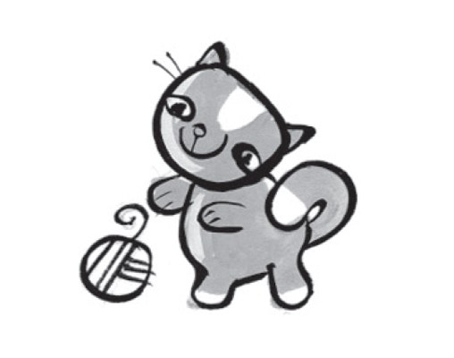
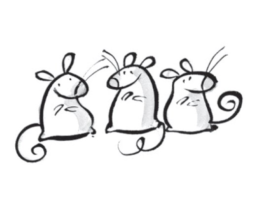
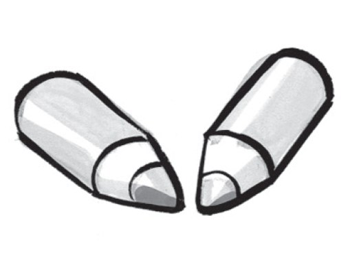
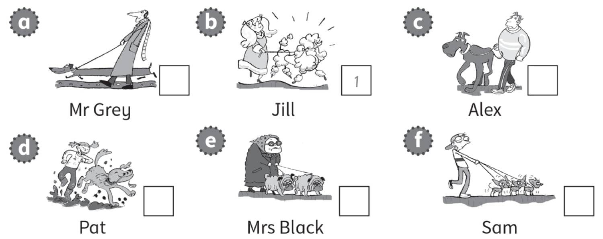
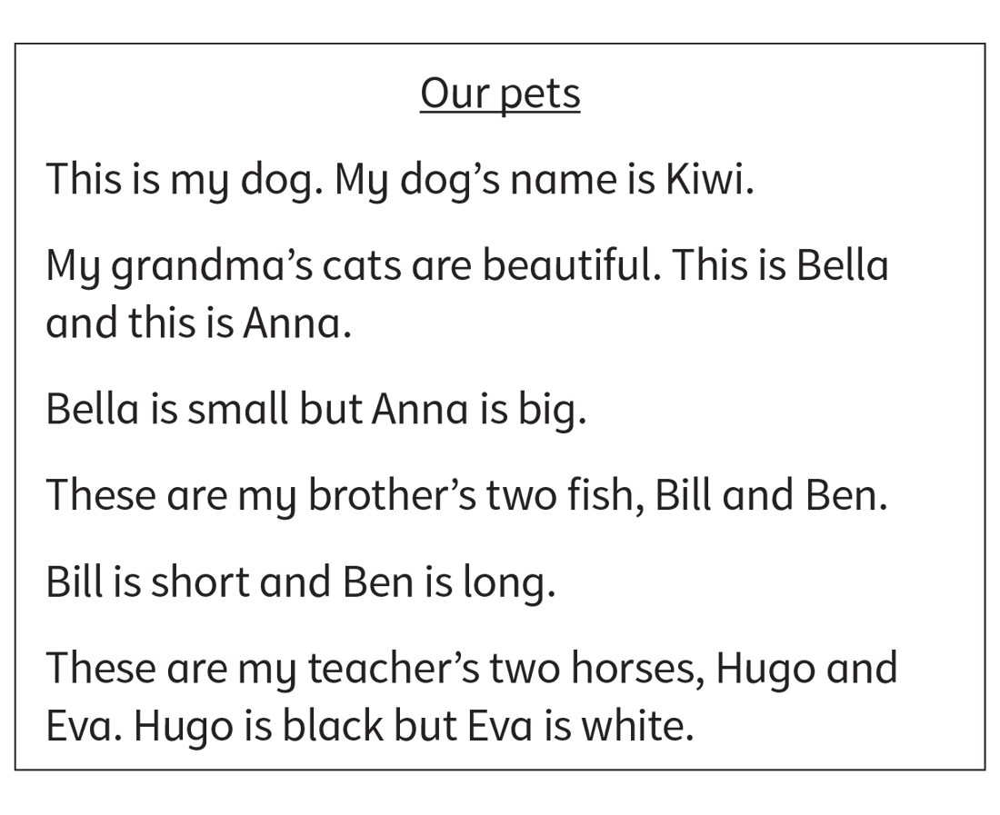

**[Vocabulary]{.underline}**

**1. Look and write. There is one example.   (one point each)**

1\. a d *[o]{.underline}* *[g]{.underline}*

2\. a c \_ \_

3\. a h \_ \_ \_ \_

4\. a m \_ \_ \_ \_

5\. a f \_ \_ \_

6\. a b \_ \_ \_

**2. Look and write the word. There is one example.   (one point each)**

big \| clean \| dirty \| ~~long~~ \| short \| small

**3. Read and write the opposite. Draw lines. There is one
example.   (one point each)**

**[Grammar]{.underline}**

**4. Look. Complete the sentences. There is one example.   (one point
each)**

1\. What is it?

*[It's]{.underline}* a cat.

2\. What are they?

\_\_\_\_\_\_\_ mice.

3\. What is it?

\_\_\_\_\_\_\_ a car.

4\. What are they?

\_\_\_\_\_\_\_ pencils.

5\. What are they?

\_\_\_\_\_\_\_ horses.

6\. What is it?

\_\_\_\_\_\_\_ a fish.

**5. Look. Put the words in the correct order. There is one
example.   (one point each)**

  ------------------------------- --- -----------------------------------
  1\. small a It's mouse.             \_\_\_\_\_\_\_\_

  ------------------------------- --- -----------------------------------

  ------------------------------- --- -----------------------------------
  2\. horse a big It's.               \_\_\_\_\_\_\_\_

  ------------------------------- --- -----------------------------------

  ------------------------------- --- -----------------------------------
  3\. clean They're cats.             \_\_\_\_\_\_\_\_

  ------------------------------- --- -----------------------------------

  ------------------------------- --- -----------------------------------
  4\. long fish They're.              \_\_\_\_\_\_\_\_

  ------------------------------- --- -----------------------------------

  ------------------------------- --- -----------------------------------
  5\. It's dog a dirty.               \_\_\_\_\_\_\_\_

  ------------------------------- --- -----------------------------------

  ------------------------------- --- -----------------------------------
  6\. and ugly They're long.          \_\_\_\_\_\_\_\_

  ------------------------------- --- -----------------------------------

**[Listening]{.underline}**

**6. Listen and write the number. Then complete and colour. There is one
example.   (one point each)**

**7. Listen and write the number.   (one point each)**

**[Reading]{.underline}**

**8. Read and write the names.   (one point each)**

  --------------------------------------------------------------------------------------------------------------------------------------------------------------------------------------------------------------------
  

  --------------------------------------------------------------------------------------------------------------------------------------------------------------------------------------------------------------------

