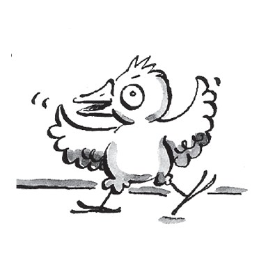
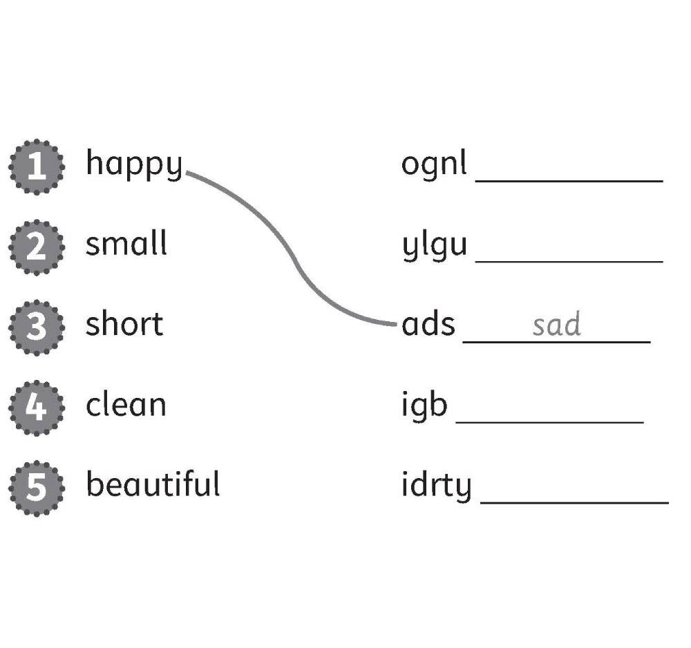
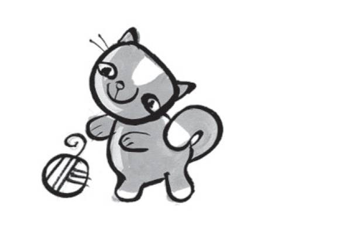
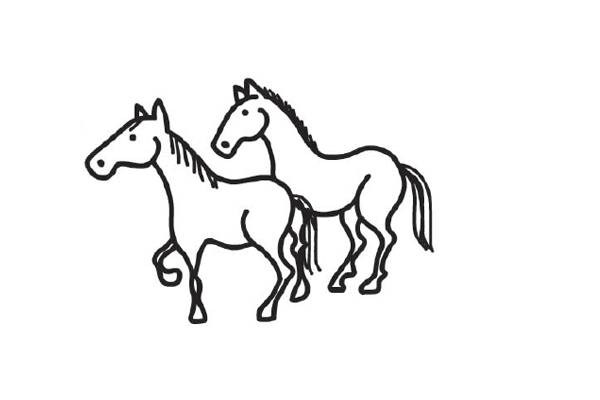
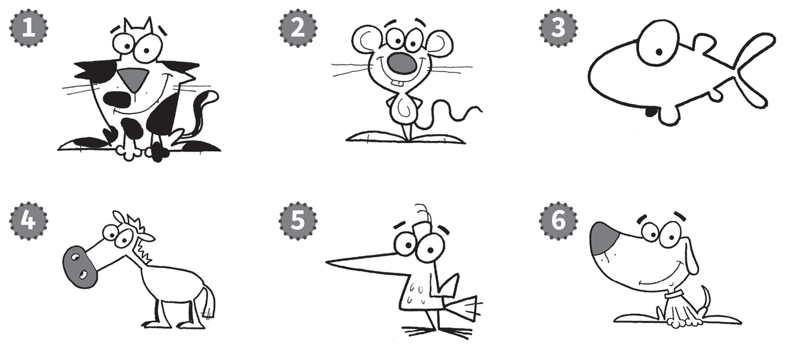
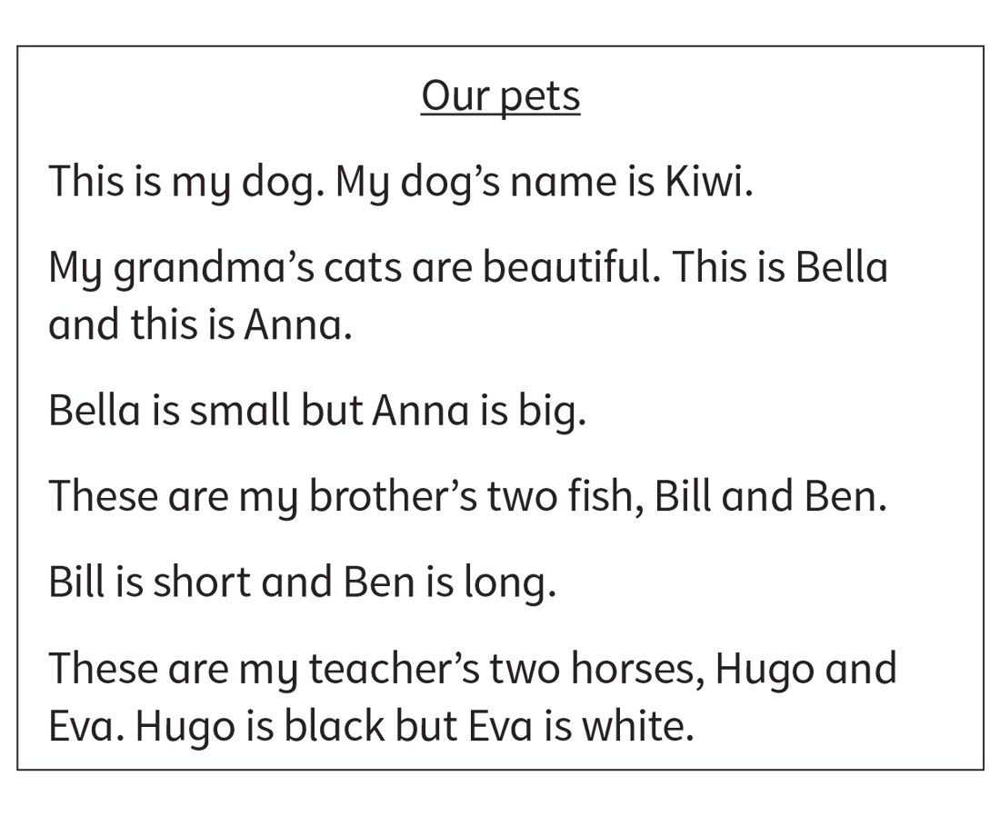
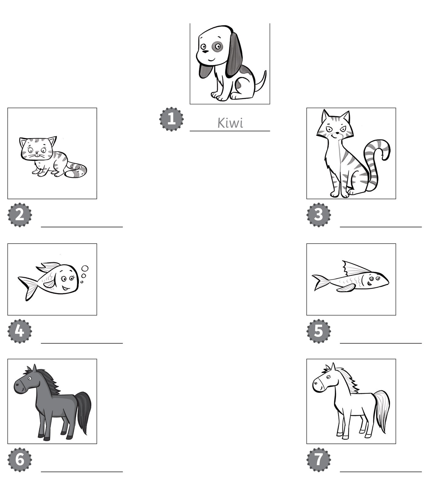

**[Vocabulary]{.underline}**

**1. Look and write the letters. There is one example.   (one point
each)**

1\. a d *[o]{.underline}* *[g]{.underline}*

2\. a c \_ \_

*cat*

3\. a h \_ \_ \_ \_

*horse*

4\. a m \_ \_ \_ \_

*mouse*

5\. a f \_ \_ \_

*fish*

6\. a \_ \_ \_ \_

*bird*

**2. Look and circle A or B. There is one example.   (one point each)**

*2. B*

*3. B*

*4. A*

*5. B*

*6. B*

**3. Look and put the letters in order. Draw lines. There is one
example.   (one point each)**

*2. big*

*3. long*

*4. dirty*

*5. ugly*

**[Grammar]{.underline}**

**4. Look. Write *It's* or *They're*. There is one example.   (one point
each)**

  -------------------------------------------------------------------------------------------------------------------------------------------------------------------------------------------------------------------- -- ------------------------------------------------------------------------------------------------------------------------------------------------------------------------------------------------------------------ -- ------------------------------------------------------------------------------------------------------------------------------------------------------------------------------------------------------------------
   1.            
  *[It's]{.underline}* a cat.                                                                                                                                                                                             2. *They're* mice.                                                                                                                                                                                                    3. *It's* a car.

  -------------------------------------------------------------------------------------------------------------------------------------------------------------------------------------------------------------------- -- ------------------------------------------------------------------------------------------------------------------------------------------------------------------------------------------------------------------ -- ------------------------------------------------------------------------------------------------------------------------------------------------------------------------------------------------------------------

  ------------------------------------------------------------------------------------------------------------------------------------------------------------------------------------------------------------------ -- ------------------------------------------------------------------------------------------------------------------------------------------------------------------------------------------------------------------ -- ------------------------------------------------------------------------------------------------------------------------------------------------------------------------------------------------------------------
              
  4. *They're* pencils.                                                                                                                                                                                                 5. *They're* horses.                                                                                                                                                                                                  6. *It's* a fish.

  ------------------------------------------------------------------------------------------------------------------------------------------------------------------------------------------------------------------ -- ------------------------------------------------------------------------------------------------------------------------------------------------------------------------------------------------------------------ -- ------------------------------------------------------------------------------------------------------------------------------------------------------------------------------------------------------------------

**5. Look. Put the words in the correct order. There is one
example.   (one point each)**

1\. small a It's mouse. It's a *[small mouse]{.underline}*.

2\. horse a big It's. It's \_\_\_\_\_\_\_.

*It's a big horse.*

3\. clean They're cats. They're \_\_\_\_\_\_\_.

*They're clean cats.*

4\. long fish They're. They're \_\_\_\_\_\_\_.

*They're long fish.*

5\. It's dog a dirty. It's \_\_\_\_\_\_\_.

*It's a dirty dog.*

6\. and ugly They're long. They're \_\_\_\_\_\_\_.

*They're long and ugly.*

**[Listening]{.underline}**

**6. Listen and colour. There is one example.   (one point each)**

*2. mouse -- grey*

*3. fish -- orange*

*4. horse -- brown*

*5. bird -- blue*

*6. dog -- black*

**Audio script**

1\. A black and white cat.

2\. A grey mouse.

3\. An orange fish.

4\. A brown horse.

5\. A blue bird.

6\. A black dog.

**7. Listen and write the number. There is one example.   (one point
each)**

*b. 6*

*c. 3*

*d. 5*

*e. 4*

*f. 2*

**Audio script**

1\. Jill's dog is clean.

2\. Mrs Black's dogs are short.

3\. Pat's dog is dirty.

4\. Mr Grey's dog is long.

5\. Sam's three dogs are small.

6\. Alex's dog is very big.

**[Reading]{.underline}**

**8. Read and write the names. There is one example.   (one point
each)**

  -----------------------------------------------------------------------------------------------------------------------------------------------------------------------------------------------------------------
  

  -----------------------------------------------------------------------------------------------------------------------------------------------------------------------------------------------------------------

