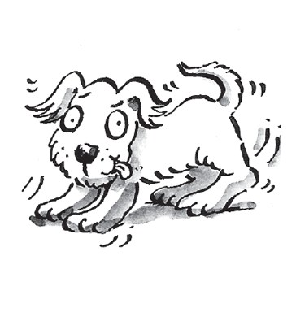
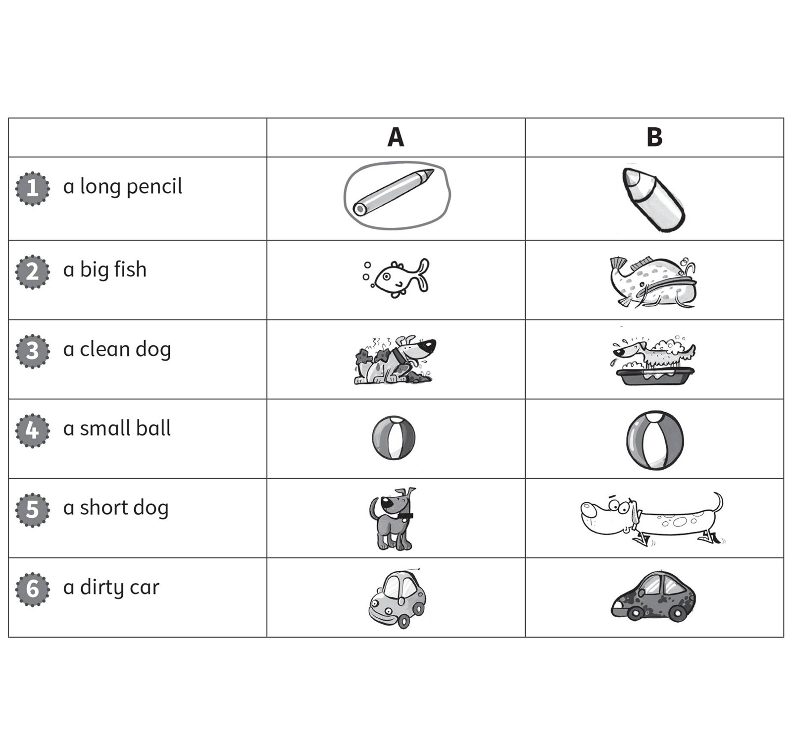
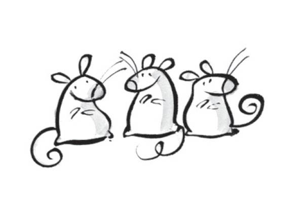
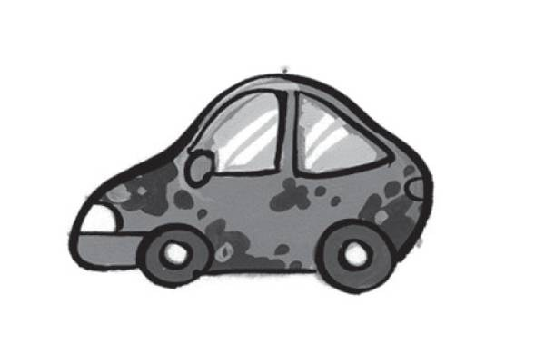
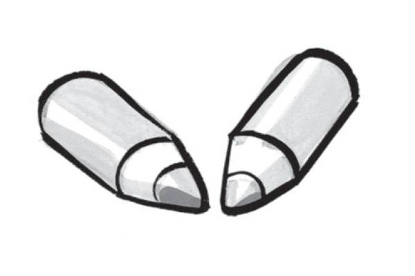
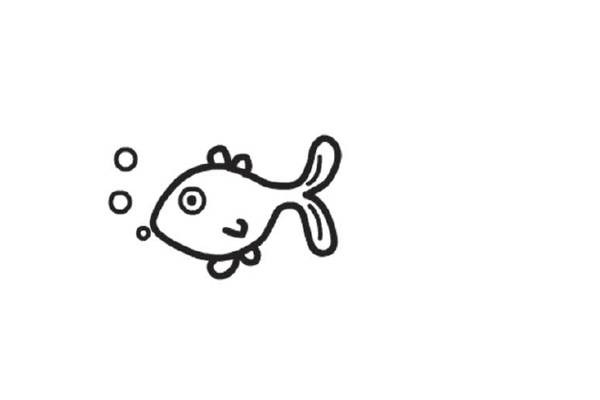
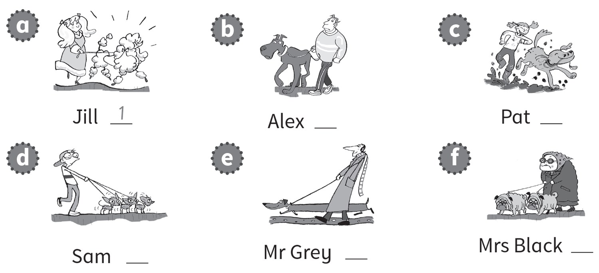

**[Vocabulary]{.underline}**

**1. Look and write the letters. There is one example.   (one point
each)**

1\. a d *[o]{.underline}* *[g]{.underline}*

2\. a c \_ \_

3\. a h \_ \_ \_ \_

4\. a m \_ \_ \_ \_

5\. a f \_ \_ \_

6\. a \_ \_ \_ \_

**2. Look and circle A or B. There is one example.   (one point each)**

**3. Look and put the letters in order. Draw lines. There is one
example.   (one point each)**

**[Grammar]{.underline}**

**4. Look. Write *It's* or *They're*. There is one example.   (one point
each)**

  ----------------------------------------------------------------------------------------------------------------------------------------------------------------------------------------------------------------------- -- --------------------------------------------------------------------------------------------------------------------------------------------------------------------------------------------------------------------- -- ---------------------------------------------------------------------------------------------------------------------------------------------------------------------------------------------------------------------
   1.            
  *[It's]{.underline}* a cat.                                                                                                                                                                                                2. \_\_\_\_\_\_\_ mice.                                                                                                                                                                                                  3. \_\_\_\_\_\_\_ a car.

  ----------------------------------------------------------------------------------------------------------------------------------------------------------------------------------------------------------------------- -- --------------------------------------------------------------------------------------------------------------------------------------------------------------------------------------------------------------------- -- ---------------------------------------------------------------------------------------------------------------------------------------------------------------------------------------------------------------------

  --------------------------------------------------------------------------------------------------------------------------------------------------------------------------------------------------------------------- -- --------------------------------------------------------------------------------------------------------------------------------------------------------------------------------------------------------------------- -- ---------------------------------------------------------------------------------------------------------------------------------------------------------------------------------------------------------------------
              
  4. \_\_\_\_\_\_\_ pencils.                                                                                                                                                                                               5. \_\_\_\_\_\_\_ horses.                                                                                                                                                                                                6. \_\_\_\_\_\_\_ a fish.

  --------------------------------------------------------------------------------------------------------------------------------------------------------------------------------------------------------------------- -- --------------------------------------------------------------------------------------------------------------------------------------------------------------------------------------------------------------------- -- ---------------------------------------------------------------------------------------------------------------------------------------------------------------------------------------------------------------------

**5. Look. Put the words in the correct order. There is one
example.   (one point each)**

1\. small a It's mouse. It's a *[small mouse]{.underline}*.

2\. horse a big It's. It's \_\_\_\_\_\_\_.

3\. clean They're cats. They're \_\_\_\_\_\_\_.

4\. long fish They're. They're \_\_\_\_\_\_\_.

5\. It's dog a dirty. It's \_\_\_\_\_\_\_.

6\. and ugly They're long. They're \_\_\_\_\_\_\_.

**[Listening]{.underline}**

**6. Listen and colour. There is one example.   (one point each)**

**7. Listen and write the number. There is one example.   (one point
each)**

**[Reading]{.underline}**

**8. Read and write the names. There is one example.   (one point
each)**

  --------------------------------------------------------------------------------------------------------------------------------------------------------------------------------------------------------------------
  

  --------------------------------------------------------------------------------------------------------------------------------------------------------------------------------------------------------------------

