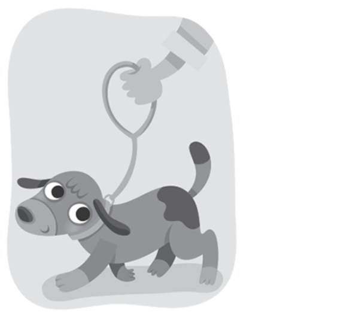
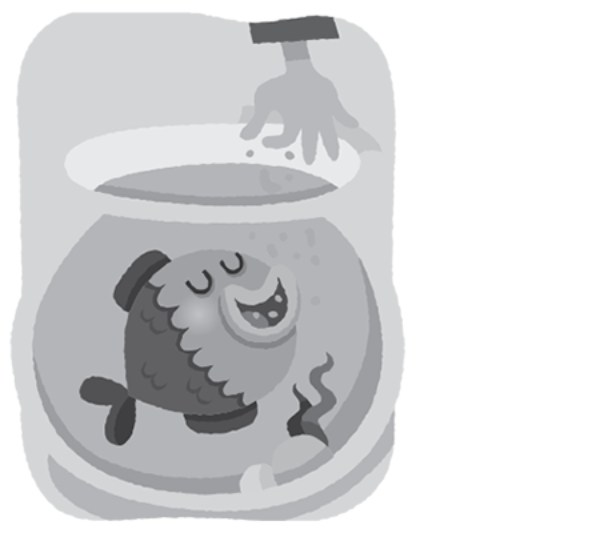
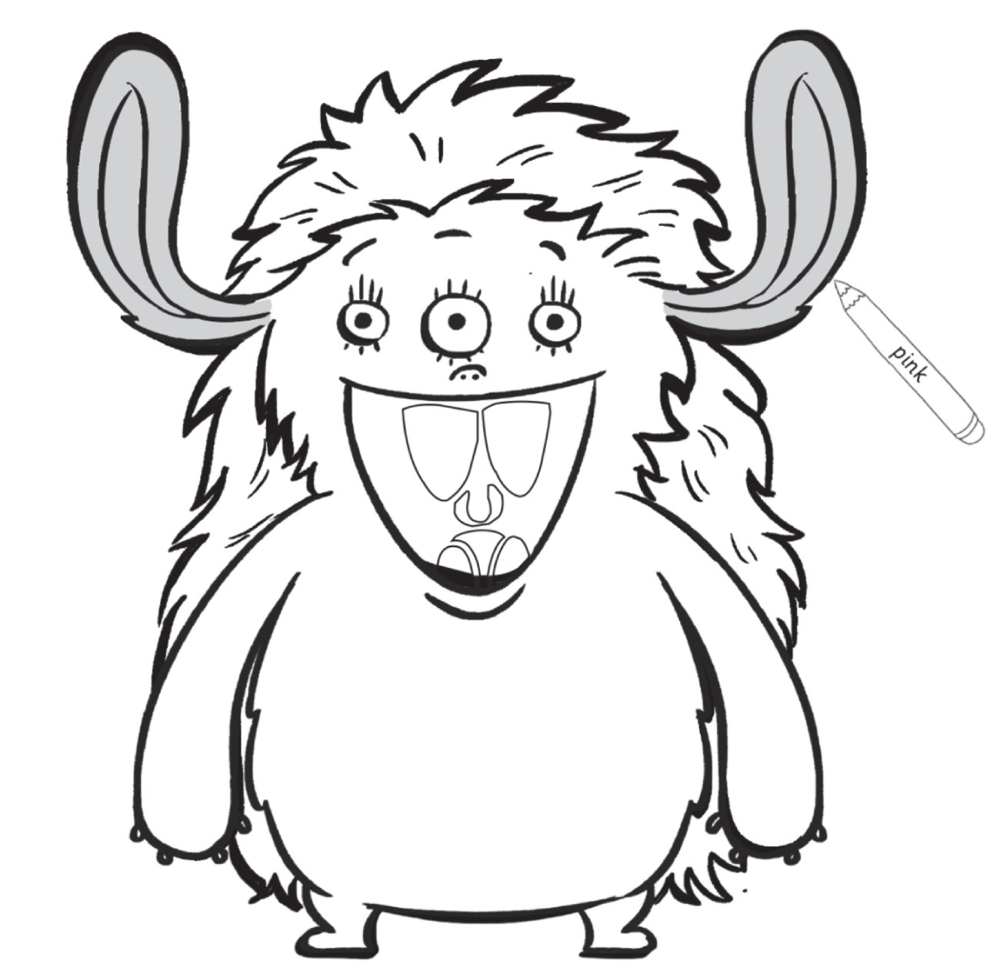
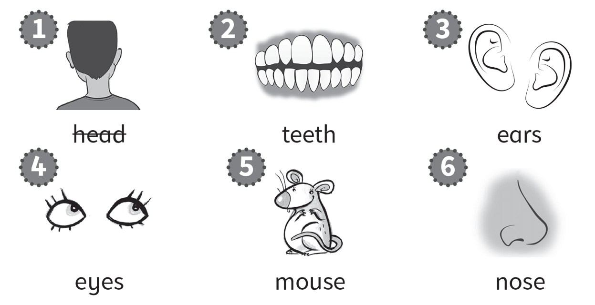

**[Vocabulary]{.underline}**

**1. Look and draw lines. There is one example.   (one point each)**

*1. e*

*2. f*

*3. c*

*4. d*

*6. b*

**2. Look. Write the number. There is one example.   (one point each)**

*2. flower*

*3. bird*

*4. ice cream*

*5. cat*

**3. Look and tick. There is one example.   (one point each)**

1\. wash   *[✓]{.underline}*      feed   \_\_\_\_\_

2\. brush   \_\_\_\_\_      wash   \_\_\_\_\_

*brush*

3\. walk   \_\_\_\_\_      wash   \_\_\_\_\_

*walk*

4\. feed   \_\_\_\_\_      brush   \_\_\_\_\_

*feed*

**[Grammar]{.underline}**

**4. Look, read and draw lines. There is one example.   (one point
each)**

*2. girls*

*3. monster*

*4. rabbits*

*5. crocodile*

*6. snake*

**5. Read and draw lines. There is one example.   (one point each)**

*2. Yes, I have.*

*3. No, I haven't.*

*4. Yes, I have.*

*5. No, I haven't.*

*6. No, I haven't.*

**[Listening]{.underline}**

**6. Listen and colour. There is one example.   (one point each)**

*2. yellow eyes*

*3. green nose*

*4. purple mouth*

*5. red teeth*

*6. blue hair.*

**Audio script**

Hello. My name's Matt. I'm a monster!

I've got two ears. They're pink.

I've got three yellow eyes.

I've got one small nose. It's green.

My mouth is big! It's purple!

I've got four teeth. They're red.

I've got long hair. It's blue ... haha!

**7. Listen. Circle *yes* or *no*.   (one point each)**

*2. yes*

*3. yes*

*4. no*

*5. yes*

*6. no*

**Audio script**

1

**Teacher:** Good morning, class. Have you got your school bags?

**Children:** Yes, we have!

**Teacher:** Good! Now put them under your chair.

2

**Boy:** Hi, Anna. Have you got a pencil?

**Anna:** Yes, here you are.

**Boy:** Thank you!

3

**Girl:** Ben, have you got a dog?

**Ben:** No, but I've got a cat.

4

**Boy 1:** Where are your fish?

**Boy 2:** I haven't got fish. I've got mice!

**Boy 1:** Oh!

5

**Girl 1:** I've got short, black hair.

**Girl 2:** Me too!

6

**Boy:** Hello, I'm a monster. I've got three ears and three eyes!

**Girl:** You're a beautiful monster.

**Boy:** Thank you!

**[Reading]{.underline}**

**8. Read and write. There is one example.   (one point each)**

*2. ears*

*3. eyes*

*4. nose*

*5. teeth*

*6. mouse*

