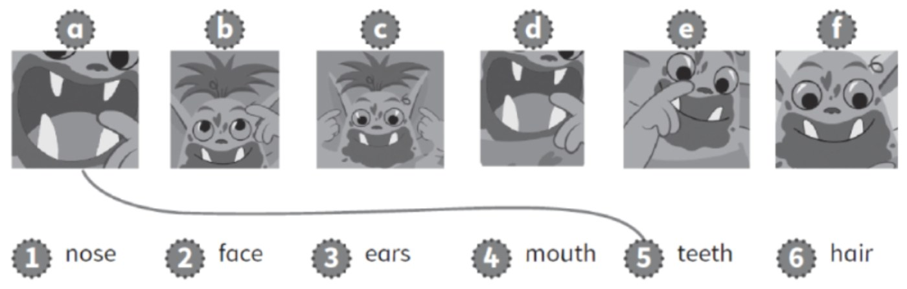
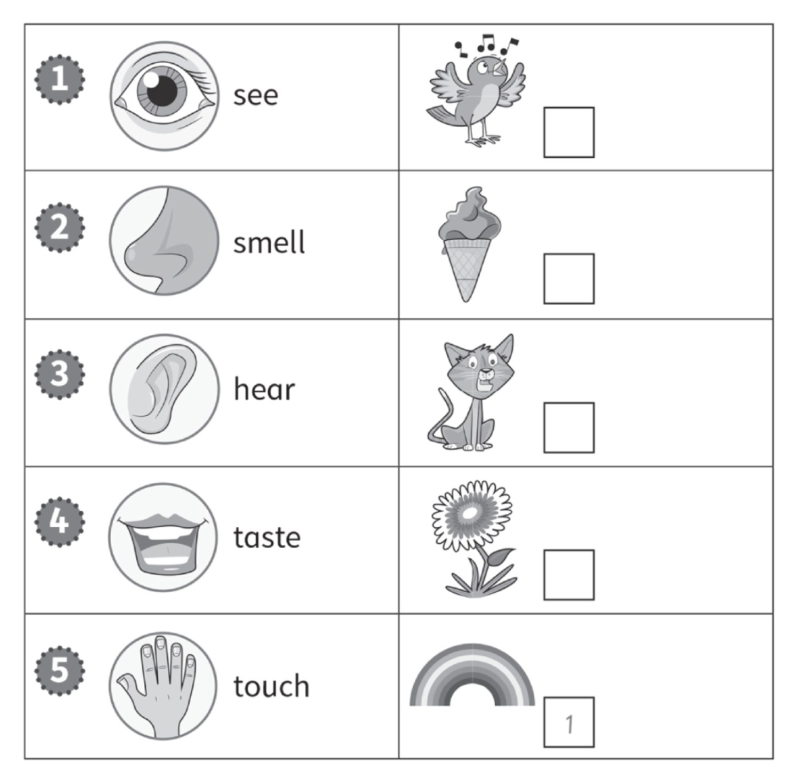
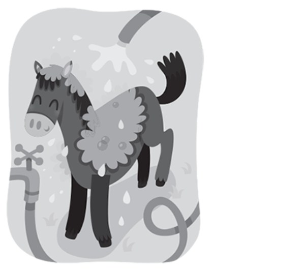
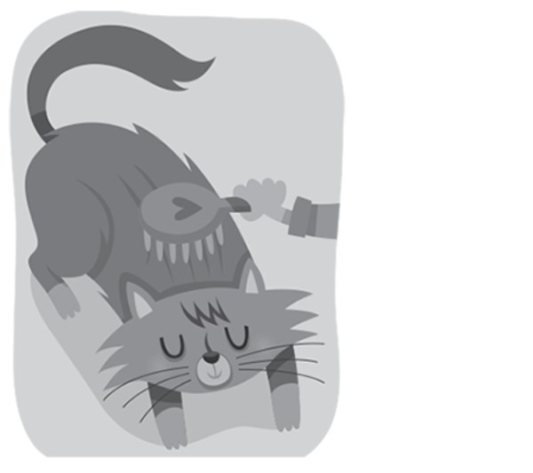
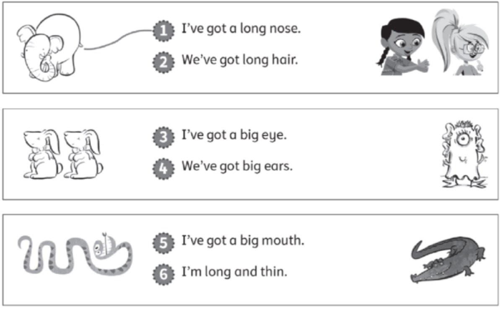
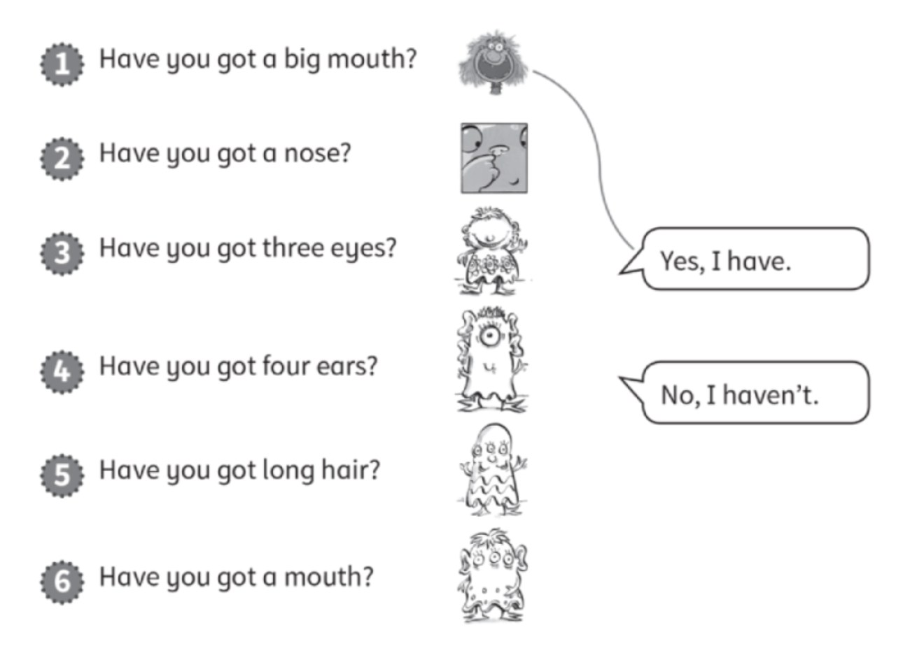
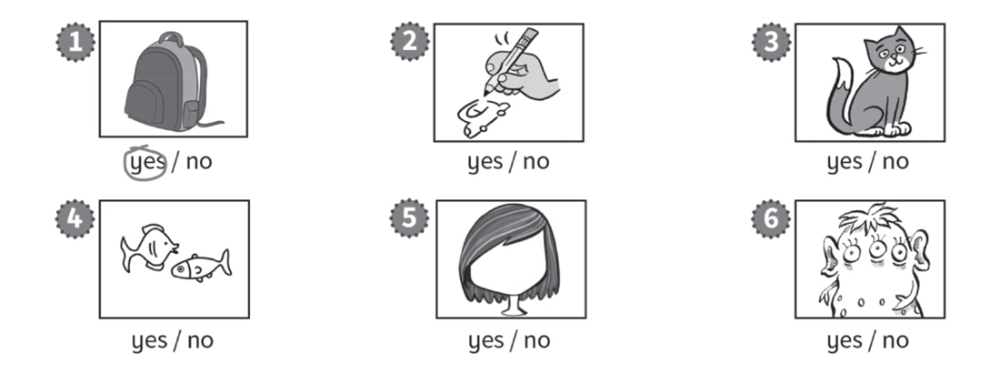
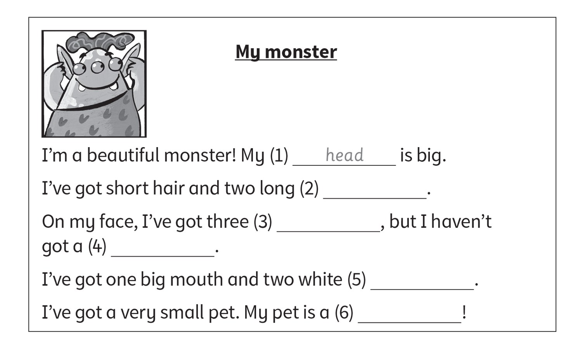

**[Vocabulary]{.underline}**

**1. Look and draw lines. There is one example.   (one point each)**

**2. Look. Write the number. There is one example.   (one point each)**

**3. Look and tick. There is one example.   (one point each)**

1\. wash   *[✓]{.underline}*      feed   \_\_\_\_\_

2\. brush   \_\_\_\_\_      wash   \_\_\_\_\_

3\. walk   \_\_\_\_\_      wash   \_\_\_\_\_

4\. feed   \_\_\_\_\_      brush   \_\_\_\_\_

**[Grammar]{.underline}**

**4. Look, read and draw lines. There is one example.   (one point
each)**

**5. Read and draw lines. There is one example.   (one point each)**

**[Listening]{.underline}**

**6. Listen and colour. There is one example.   (one point each)**

**7. Listen. Circle *yes* or *no*.   (one point each)**

**[Reading]{.underline}**

**8. Read and write. There is one example.   (one point each)**

