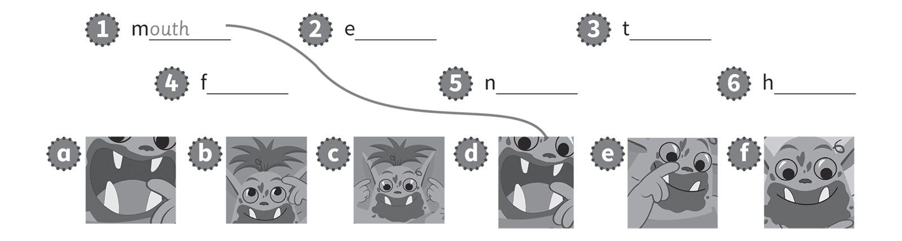
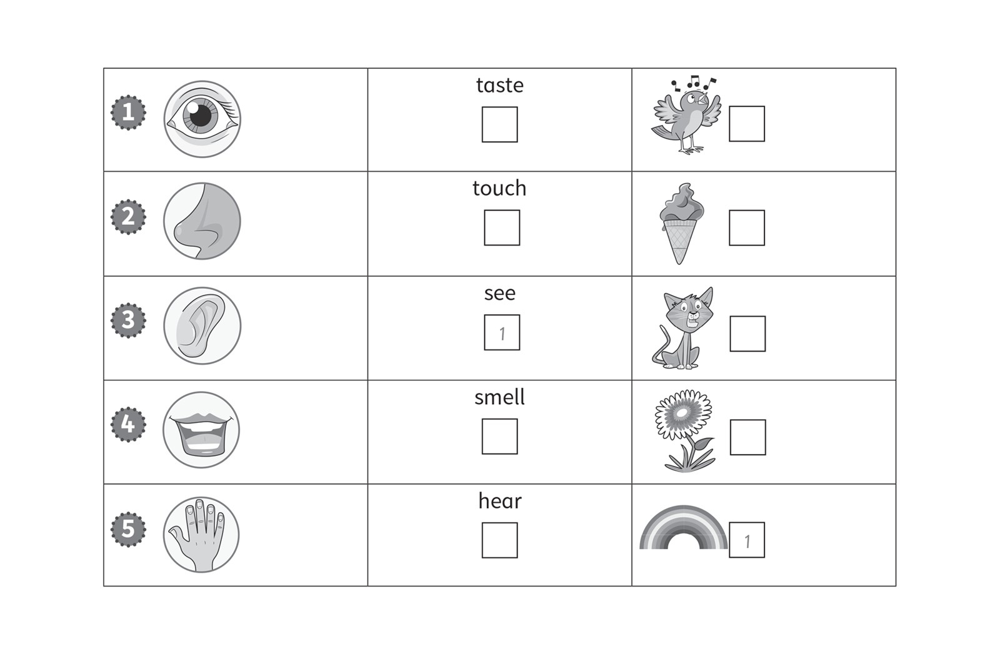
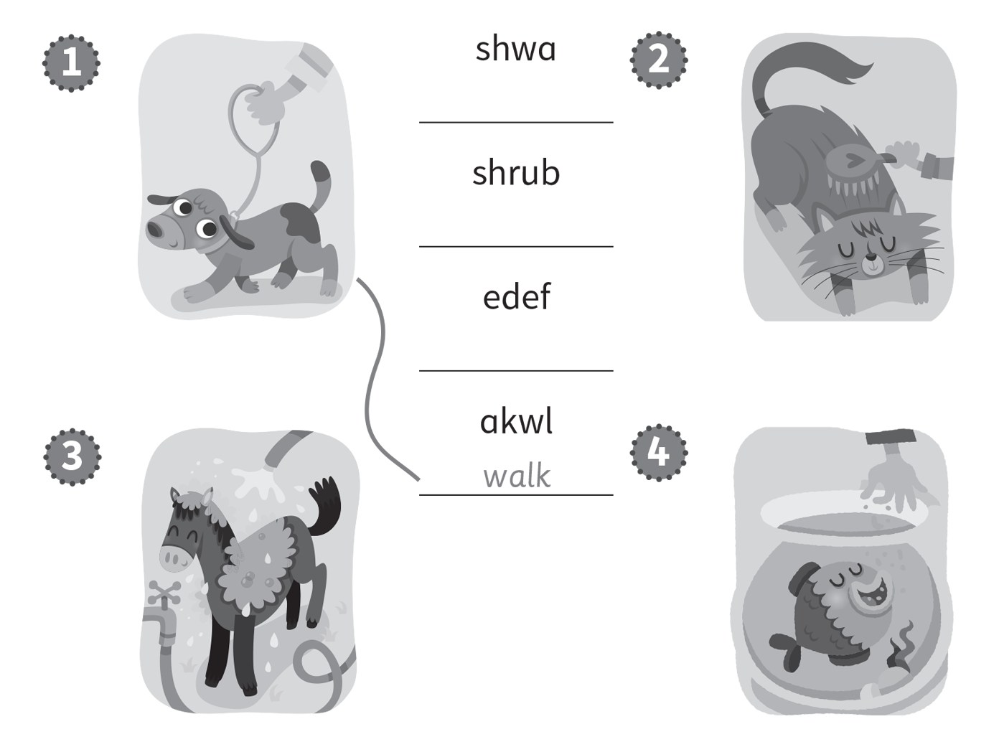
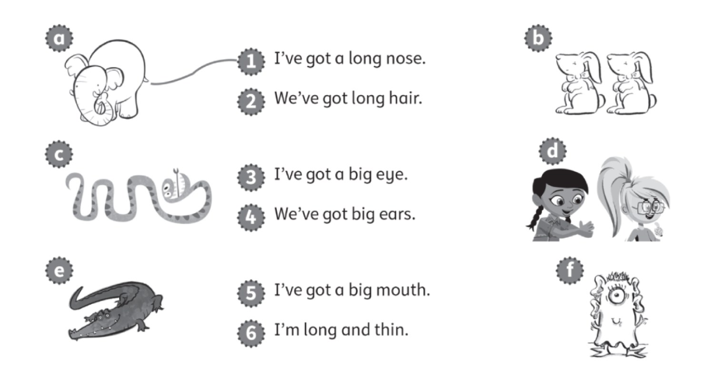
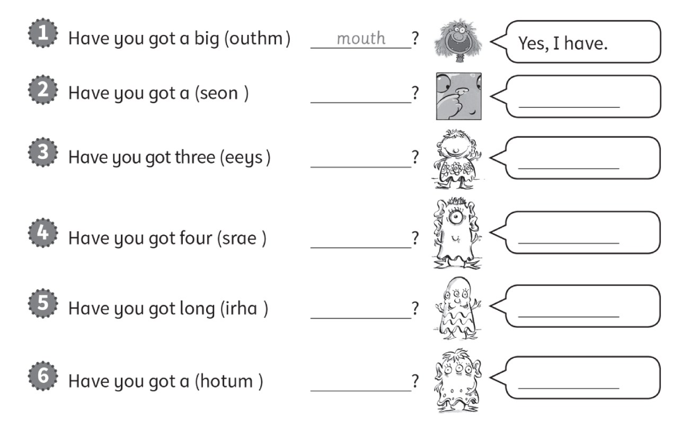
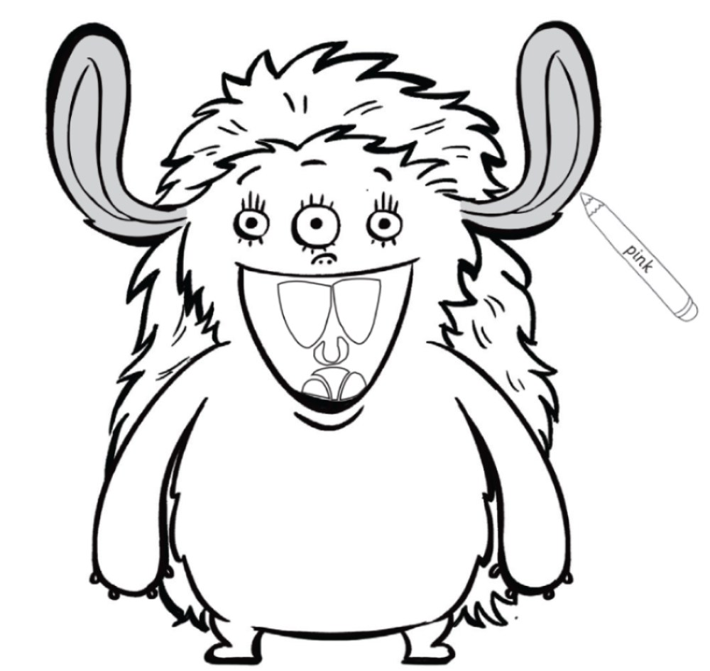
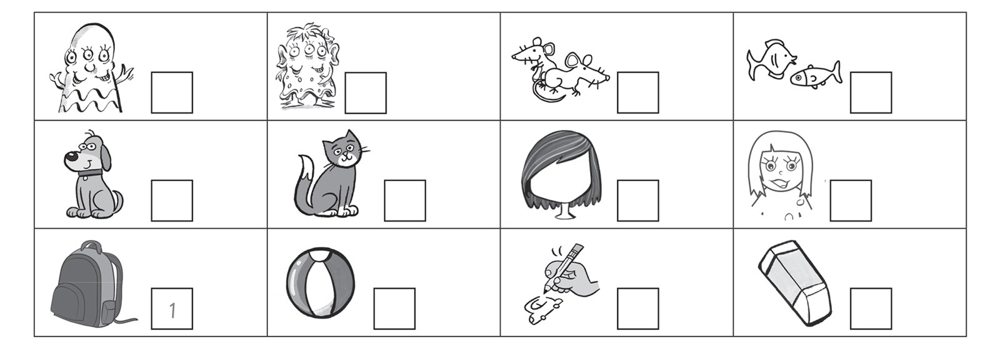
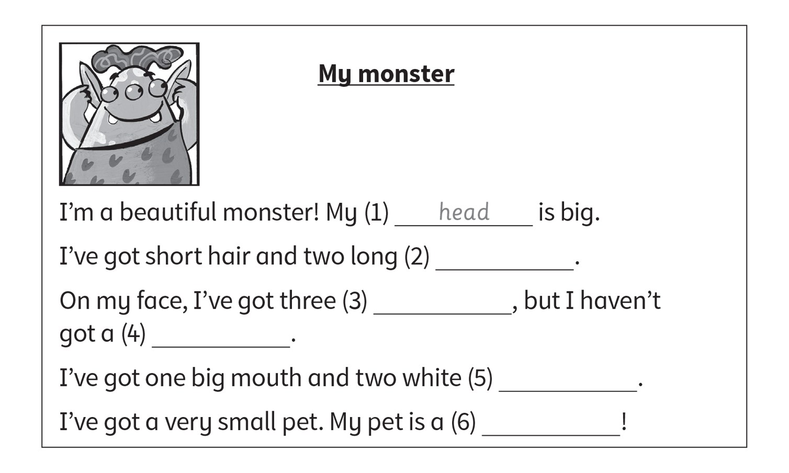
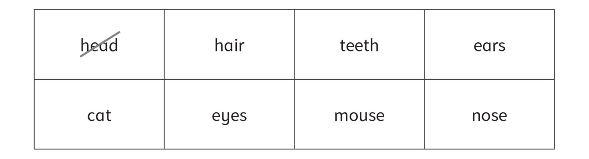

**[Vocabulary]{.underline}**

**1. Write the words and draw lines. There is one example.   (one point
each)**

**2. Look.Match and write the numbers. There is one example.   (one
point each)**

**3. Look. Put the letters in order. Draw lines. There is one
example.   (one point each)**

**[Grammar]{.underline}**

**4. Read and match. There are two extra sentences. There is one
example.   (one point each)**

**5. Look and read. Put the letters in order. Write *Yes, I have. or No,
I haven't*. There is one example.   (one point each)**

**[Listening]{.underline}**

**6. Listen and colour. There is one example.   (one point each)**

**7. Listen. Number the pictures. There is one example.   (one point
each)**

**[Reading]{.underline}**

**8. Read and write. There are two extra words. There is one
example.   (one point each)**

