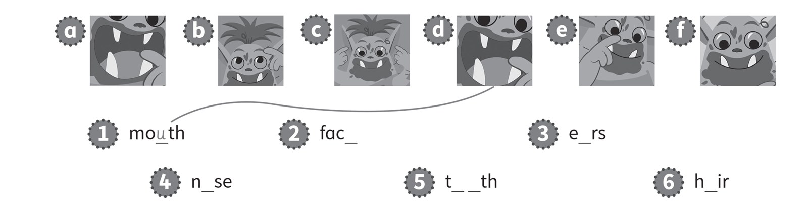
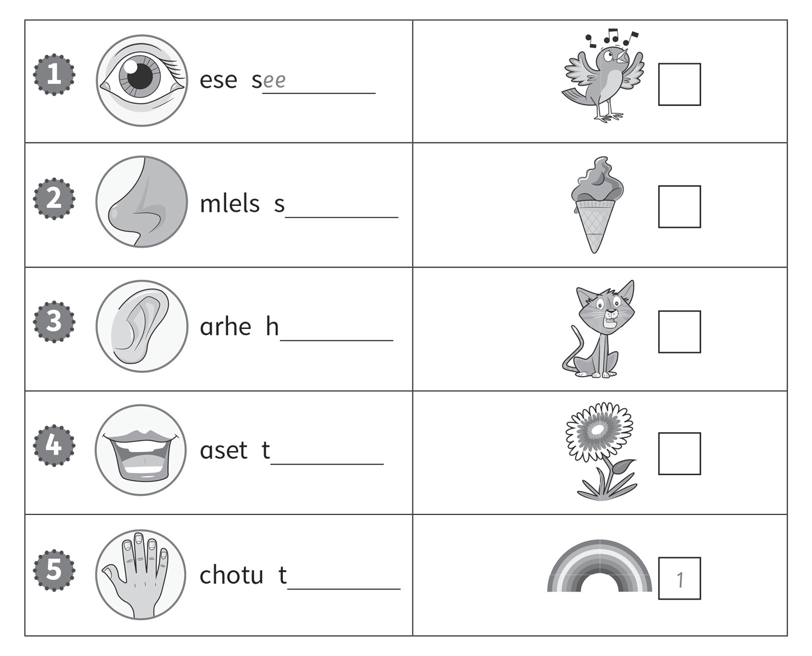
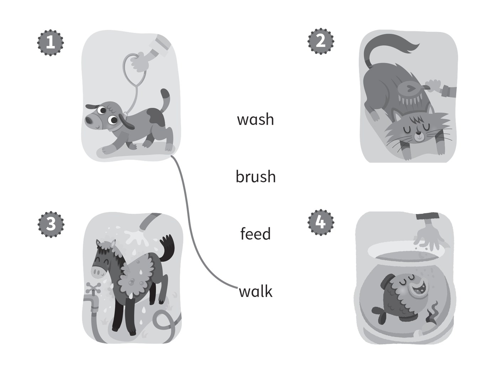
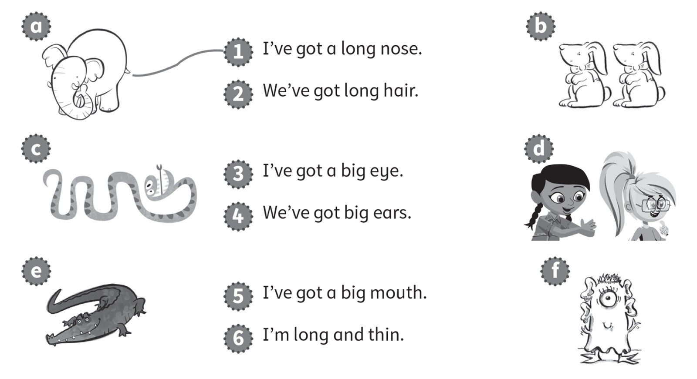
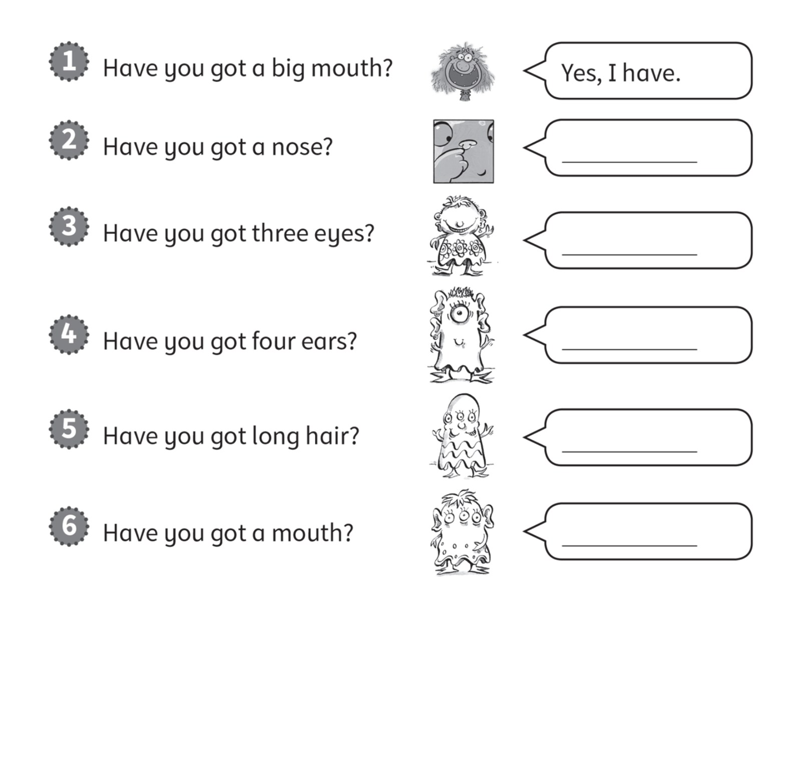
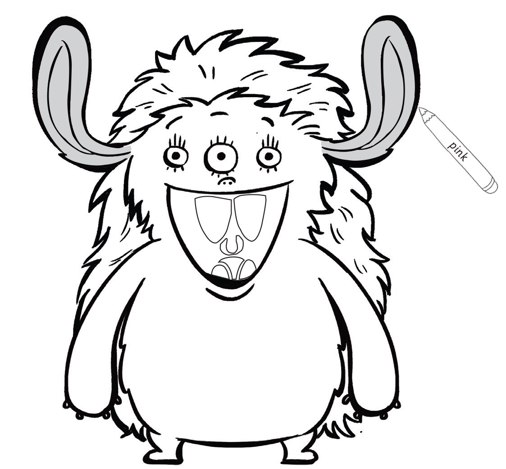
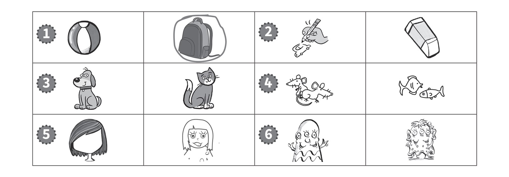
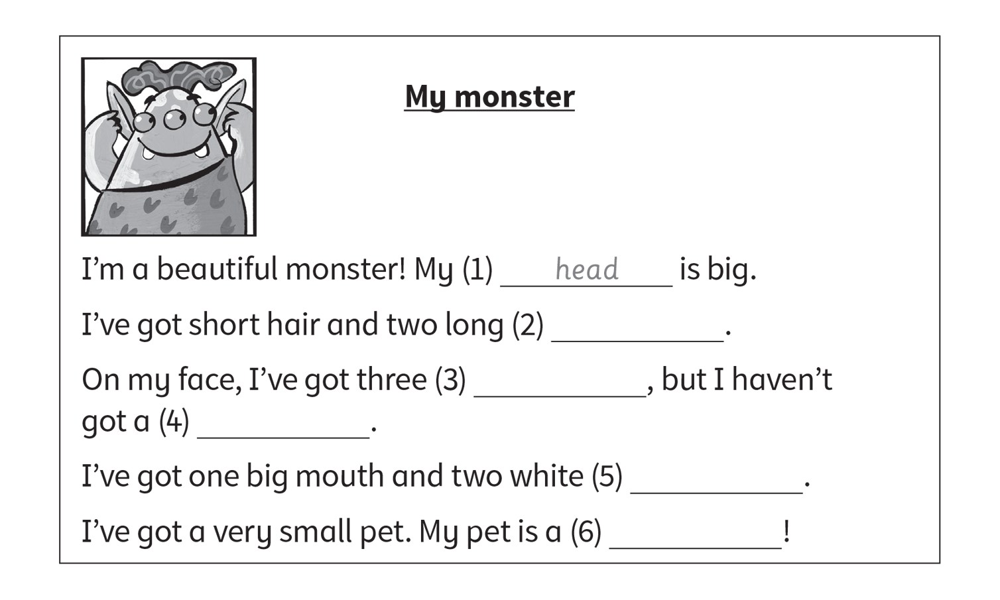
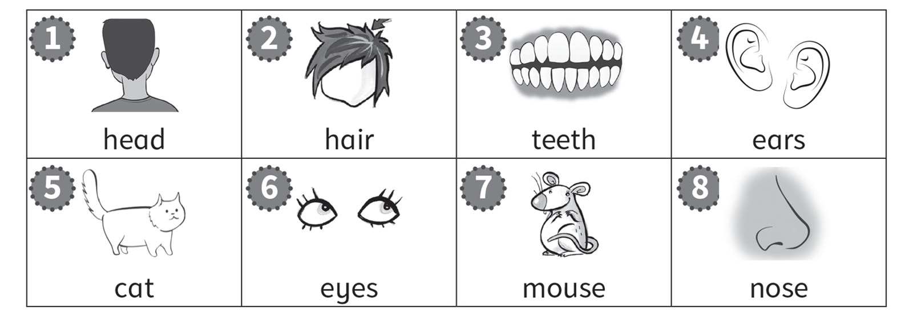

**[Vocabulary]{.underline}**

**1. Complete the words and draw lines. There is one example.   (one
point each)**

*2. face f*

*3. ears c*

*4. nose e*

*5. teeth a*

*6. hair b*

**2. Look. Put the letters in order. Write the numbers. There is one
example.   (one point each)**

*2. smell -- flower*

*3. hear -- bird*

*4. taste -- ice cream*

*5. touch -- cat*

**3. Look and draw lines. There is one example.   (one point each)**

*2. brush*

*3. wash*

*4. feed*

**[Grammar]{.underline}**

**4. Look and draw lines. There is one example.   (one point each)**

*2. d*

*3. f*

*4. b*

*5. e*

*6. c*

**5. Look. Write *Yes, I have* or *No, I haven't*. There is one
example.   (one point each)**

*2. Yes, I have.*

*3. No, I haven't.*

*4. Yes, I have.*

*5. No, I haven't.*

*6. No, I haven't.*

**[Listening]{.underline}**

**6. Listen and colour. There is one example.   (one point each)**

*three yellow eyes, small green nose,*

*purple mouth, red teeth, blue hair.*

**Audio script**

Hello. My name's Matt. I'm a monster!

I've got two ears. They're pink.

I've got three yellow eyes.

I've got one small nose. It's green.

My mouth is big! It's purple!

I've got four teeth. They're red.

I've got long hair. It's blue ... haha!

**7. Listen. Circle the picture. There is one example.   (one point
each)**

*2. pencil*

*3. cat*

*4. mice*

*5. black hair*

*6. three ears, three eyes*

**Audio script**

1

**Teacher:** Good morning, class. Have you got your school bags?

**Children:** Yes, we have!

**Teacher:** Good! Now put them under your chair.

2

**Boy:** Hi, Anna. Have you got a pencil?

**Anna:** Yes, here you are.

**Boy:** Thank you!

3

**Girl:** Ben, have you got a dog?

**Ben:** No, but I've got a cat.

4

**Boy 1:** Where are your fish?

**Boy 2:** I haven't got fish. I've got mice!

**Boy 1:** Oh!

5

**Girl 1:** I've got short, black hair.

**Girl 2:** Me too!

6

**Boy:** Hello, I'm a monster. I've got three ears and three eyes!

**Girl:** You're a beautiful monster.

**Boy:** Thank you!

**[Reading]{.underline}**

**8. Read and write. There are two extra words. There is one
example.   (one point each)**

*2. ears*

*3. eyes*

*4. nose*

*5. teeth*

*6. mouse*

