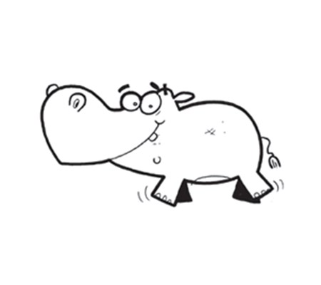
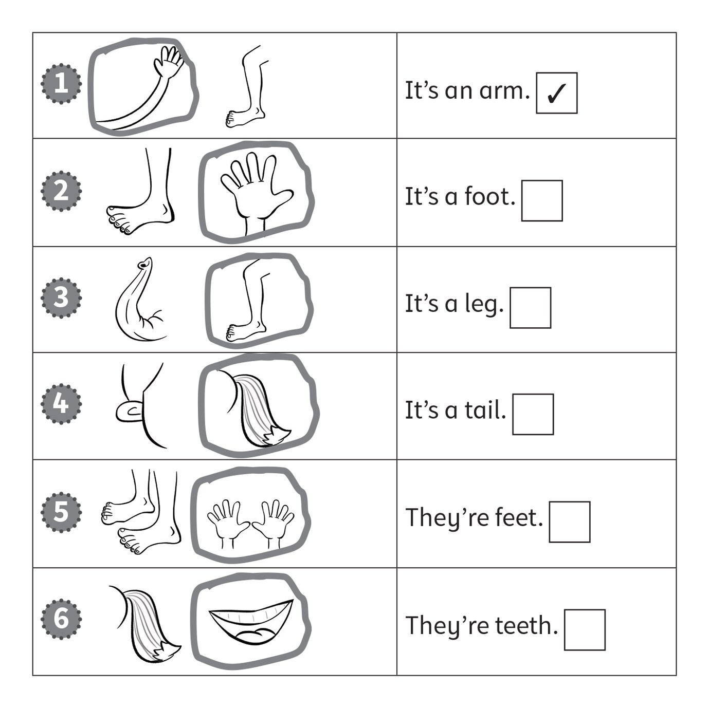
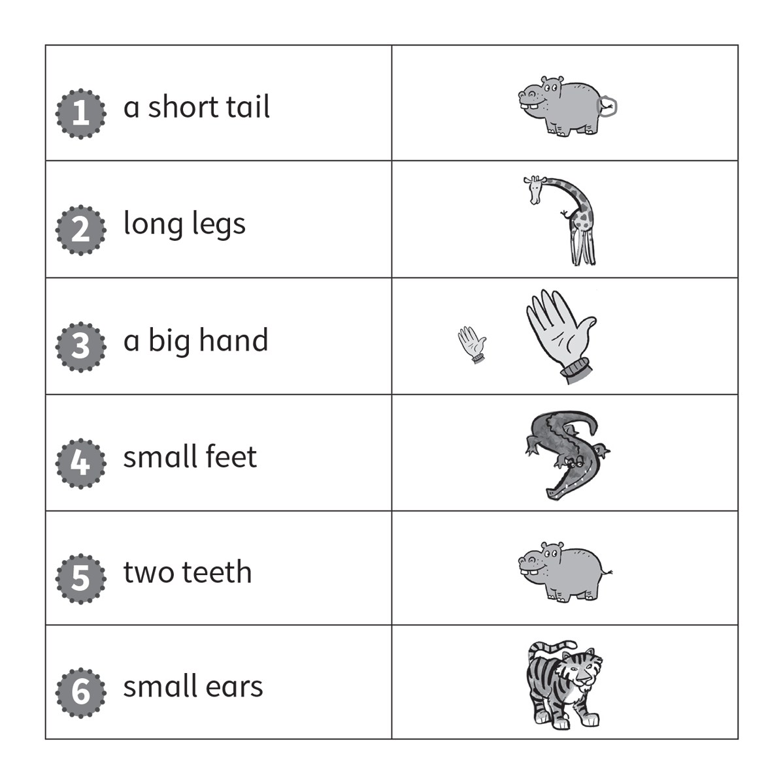
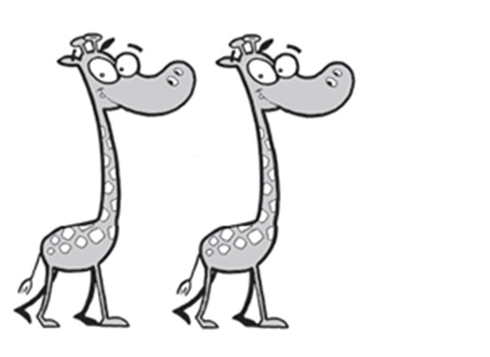
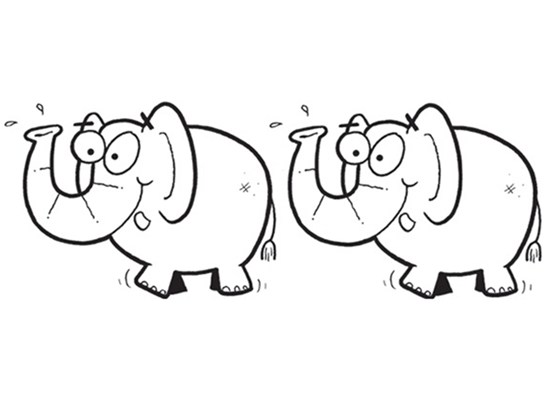
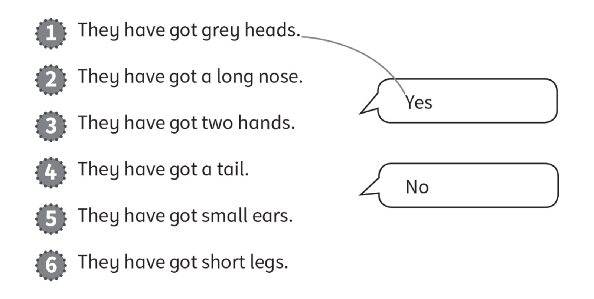
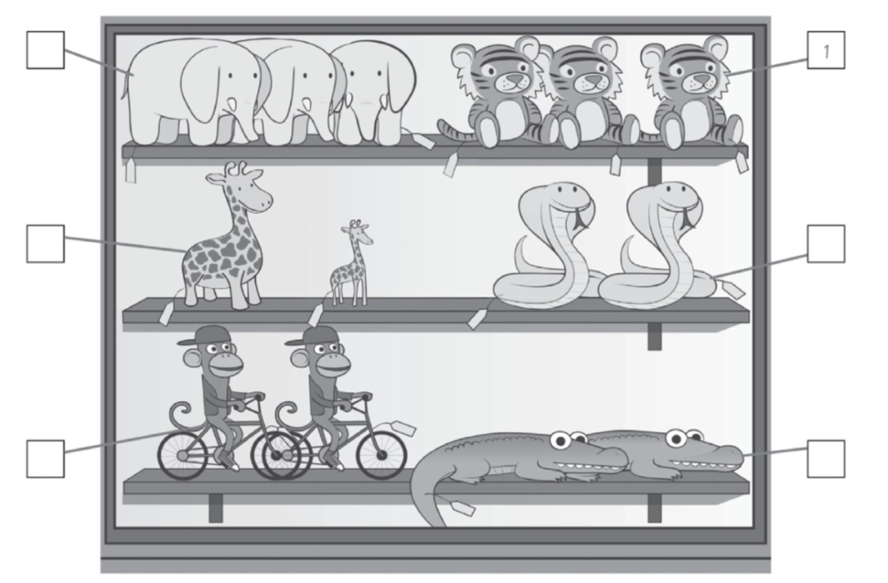
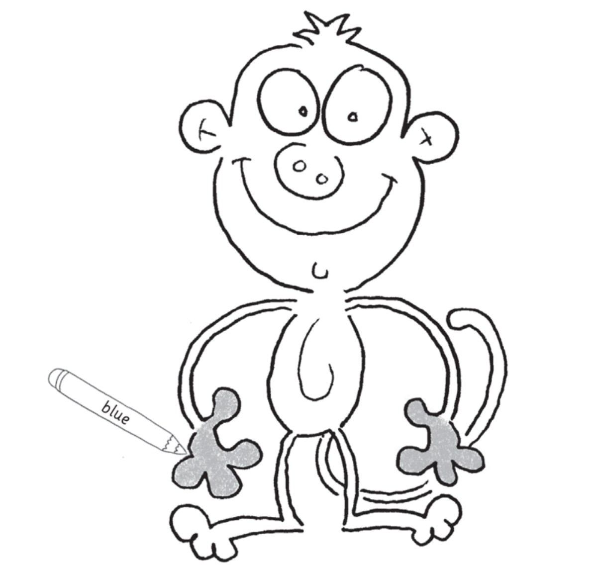
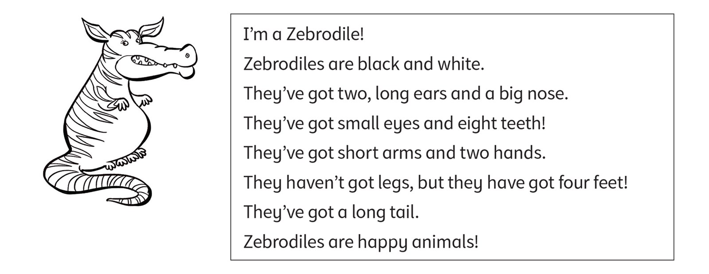

**[Vocabulary]{.underline}**

**1. Look and write. There is one example.   (one point each)**

elephant \| hippo \| giraffe \| ~~crocodile~~ \| zebra \| snake

1\. *[c]{.underline}* *[r]{.underline}* *[o]{.underline}*
*[c]{.underline}* *[o]{.underline}* *[d]{.underline}* *[i]{.underline}*
*[l]{.underline}* *[e]{.underline}*

2\. \_\_ \_\_ \_\_ \_\_ \_\_ \_\_ \_\_ \_\_

*elephant*

3\. \_\_ \_\_ \_\_ \_\_ \_\_

*hippo*

4\. \_\_ \_\_ \_\_ \_\_ \_\_ \_\_ \_\_

*giraffe*

5\. \_\_ \_\_ \_\_ \_\_ \_\_

*snake*

6\. \_\_ \_\_ \_\_ \_\_ \_\_

*zebra*

**2. Look. Put a tick or a cross. There is one example.   (one point
each)**

*2. ✗*

*3. ✓*

*4. ✓*

*5. ✗*

*6. ✓*

**3. Look and circle. There is one example.   (one point each)**

*Circle:*

*2. giraffe's legs*

*3. big hand*

*4. crocodile's feet*

*5. hippo's teeth*

*6. tiger's ears*

**[Grammar]{.underline}**

**4. Look, read and circle. There is one example.   (one point each)**

1\. They've got hands.

    *[They haven't got hands.]{.underline}*

2\. They've got feet.

    They haven't got feet.

*They've got feet.*

3\. They've got teeth.

    They haven't got teeth.

*They've got teeth.*

4\. They've got legs.

    They haven't got legs.

*They haven't got legs.*

5\. They've got arms.

    They haven't got arms.

*They haven't got arms.*

6\. They've got tails.

They haven't got tails.

*They've got tails.*

**5. Read and draw lines. There is one example.   (one point each)**

*2. Yes. link to nose/trunk*

*3. No.*

*4. Yes. link to tail*

*5. No.*

*6. Yes. link to legs*

**[Listening]{.underline}**

**6. Listen. Write the number. There is one example.   (one point
each)**

*2. snakes*

*3. monkeys*

*4. crocodiles*

*5. elephants*

*6. giraffes*

**Audio script**

1\. They're orange and white animals.

2\. They haven't got legs.

3\. They've got hands and a long tail.

4\. They've got big teeth.

5\. They've got big ears.

6\. One is big and one is small.

**7. Listen. Colour and draw. There is one example.   (one point each)**

*green - feet*

*yellow - legs*

*grey - arms*

*orange - tail*

*red - mouth*

**Audio script**

1\. I've got blue hands.

2\. I've got green feet.

3\. I've got yellow legs.

4\. I've got two grey arms.

5\. I've got a long orange tail.

6\. I've got a happy red mouth!

**[Reading]{.underline}**

**8. Look and read. Circle. There is one example.   (one point each)**

1\. What is the animal?      a *[Zebrodile]{.underline}* / *Crocobra*

2\. What colour are they?      black and *red* / *white*

*white*

3\. Have they got a small nose?      *yes* / *no*

*no*

4\. How many teeth have they got?      *four* / *eight*

*eight*

5\. How many feet have they got?      *four* / *five*

*four*

6\. Have they got legs?      *yes* / *no*

*no*

