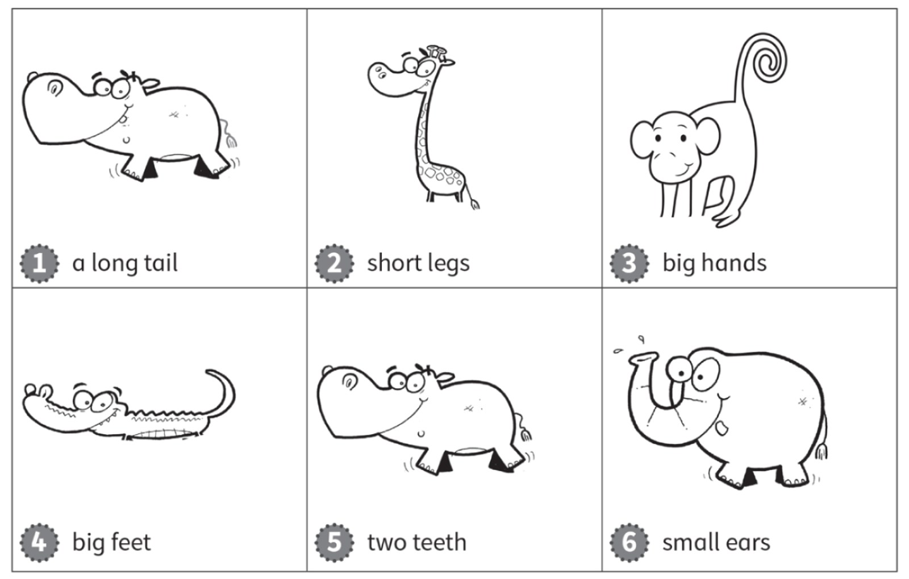
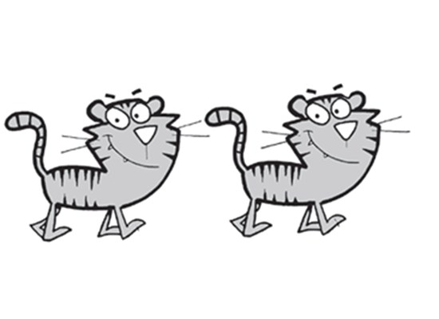
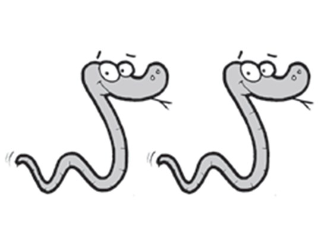

**[Vocabulary]{.underline}**

**1. Look and write. There is one example.   (one point each)**

  ------------------------------------------------------------------------------------------------------------------------------------------------------------------------------------------------------------------- -- ---------------------------------------------------------------------------------------------------------------------------------------------------------------------------------------------------------------- -- ---------------------------------------------------------------------------------------------------------------------------------------------------------------------------------------------------------------- -- ----------------------------------------------------------------------------------------------------------------------------------------------------------------------------------------------------------------
   1.                  
  *[crocodile]{.underline}*                                                                                                                                                                                              2. *elephant*                                                                                                                                                                                                       3. *hippo*                                                                                                                                                                                                          4. *giraffe*

  ------------------------------------------------------------------------------------------------------------------------------------------------------------------------------------------------------------------- -- ---------------------------------------------------------------------------------------------------------------------------------------------------------------------------------------------------------------- -- ---------------------------------------------------------------------------------------------------------------------------------------------------------------------------------------------------------------- -- ----------------------------------------------------------------------------------------------------------------------------------------------------------------------------------------------------------------

  ---------------------------------------------------------------------------------------------------------------------------------------------------------------------------------------------------------------- -- ----------------------------------------------------------------------------------------------------------------------------------------------------------------------------------------------------------------
        
  5. *snake*                                                                                                                                                                                                          6. *zebra*

  ---------------------------------------------------------------------------------------------------------------------------------------------------------------------------------------------------------------- -- ----------------------------------------------------------------------------------------------------------------------------------------------------------------------------------------------------------------

**2. Look and write. There is one example.   (one point each)**

~~arm~~ \| feet \| foot \| hand \| leg \| tail

*2. ✗*

*3. ✓*

*4. ✓*

*5. ✗*

*6. ✓*

**3. Read and draw. There is one example.   (one point each)**

*2. giraffe -- short legs*

*3. monkey -- big hands*

*4. crocodile -- big feet*

*5. hippo -- two teeth*

*6. elephant -- small ears*

**[Grammar]{.underline}**

**4. Look, read and write *'ve got* or *haven't got*. There is one
example.   (one point each)**

1\. They *['ve got]{.underline}* long legs.

    They *[haven't got]{.underline}* hands.

2\. They \_\_\_\_\_\_\_\_\_\_\_\_\_\_\_ tails

    They \_\_\_\_\_\_\_\_\_\_\_\_\_\_\_ two feet.

*haven't got, 've got*

3\. They \_\_\_\_\_\_\_\_\_\_\_\_\_\_\_ long tails.

    They \_\_\_\_\_\_\_\_\_\_\_\_\_\_\_ teeth.

*'ve got, 've got*

4\. They \_\_\_\_\_\_\_\_\_\_\_\_\_\_\_ arms.

    They \_\_\_\_\_\_\_\_\_\_\_\_\_\_\_ legs.

*haven't got, haven't got.*

**5. Look. Write *They've got* or *They haven't got*. There is one
example.   (one point each)**

1\. *[They]{.underline}* *['ve]{.underline}* *[got]{.underline}* a grey
head and body.

2\. *They have got* a long nose.

3\. *They haven't got* two hands.

4\. *They have got* a tail.

5\. *They haven't got* small ears.

6\. *They have got.* short legs.

**[Listening]{.underline}**

**6. Look and write. Listen and number. There is one example.   (one
point each)**

*2. snakes*

*3. monkeys*

*4. crocodiles*

*5. elephants*

*6. giraffes*

**Audio script**

1\. They're orange and white animals.

2\. They haven't got legs.

3\. They've got hands and a long tail.

4\. They've got big teeth.

5\. They've got big ears.

6\. One is big and one is small.

**7. Listen and colour. Draw lines. There is one example.   (one point
each)**

*green - feet*

*yellow - legs*

*grey - arms*

*red - mouth*

*orange - tail*

*red - mouth*

**Audio script**

1\. I've got blue hands.

2\. I've got green feet.

3\. I've got yellow legs.

4\. I've got two grey arms.

5\. I've got a long orange tail.

6\. I've got a happy red mouth!

**[Reading]{.underline}**

**8. Look and read. Write. There is one example.   (one point each)**

1\. What is this animal?       It's a *[Zebrodile]{.underline}*

2\. What colour are they?      black and \_\_\_\_\_\_\_\_\_\_\_\_\_\_\_

*white*

3\. Have they got a small nose?      \_\_\_\_\_\_\_\_\_\_\_\_\_\_\_

*no*

4\. How many teeth have they got?      \_\_\_\_\_\_\_\_\_\_\_\_\_\_\_

*eight*

5\. How many feet have they got?      \_\_\_\_\_\_\_\_\_\_\_\_\_\_\_

*four*

6\. Have they got legs?      \_\_\_\_\_\_\_\_\_\_\_\_\_\_\_

*no*

