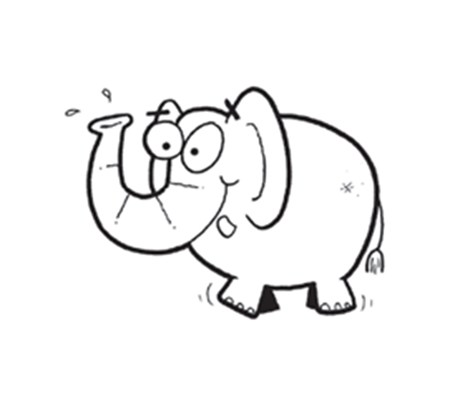
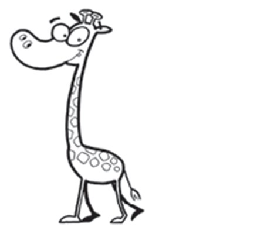
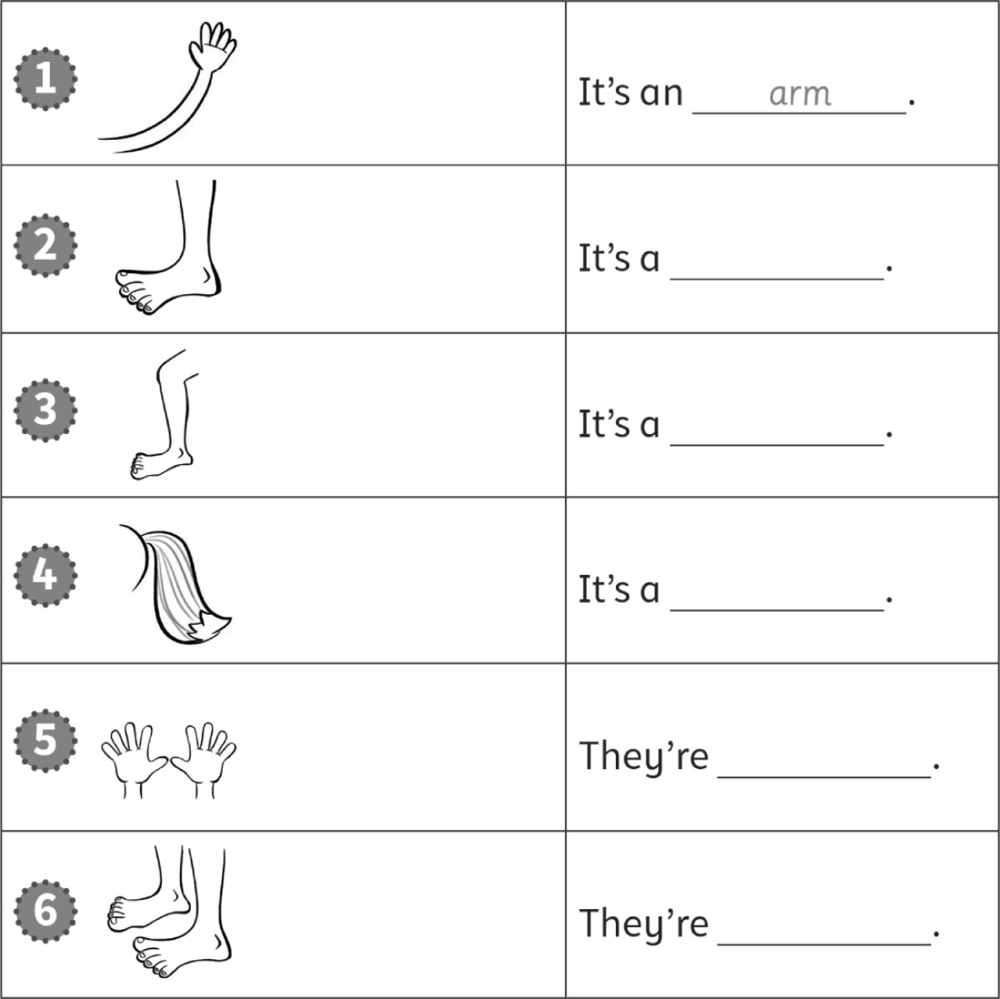
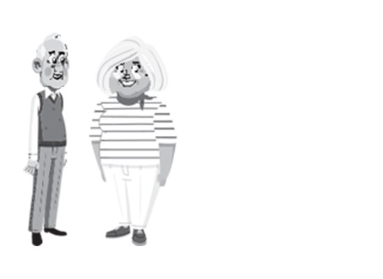
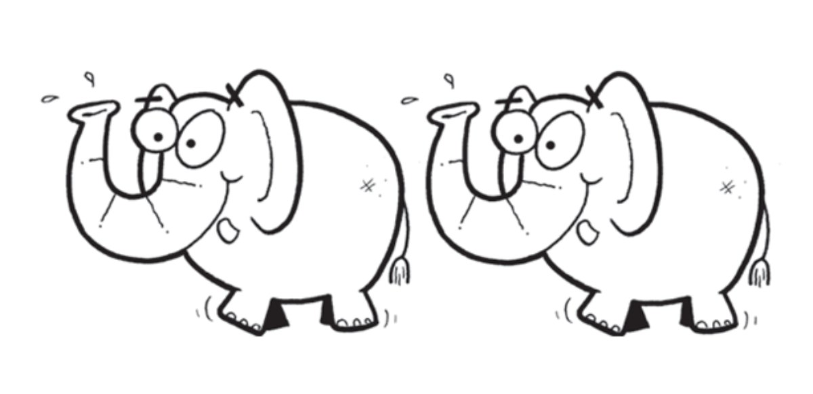
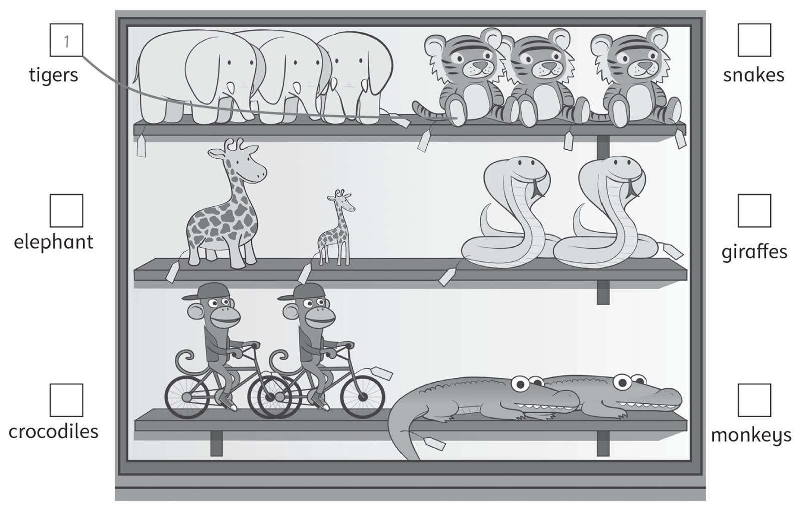
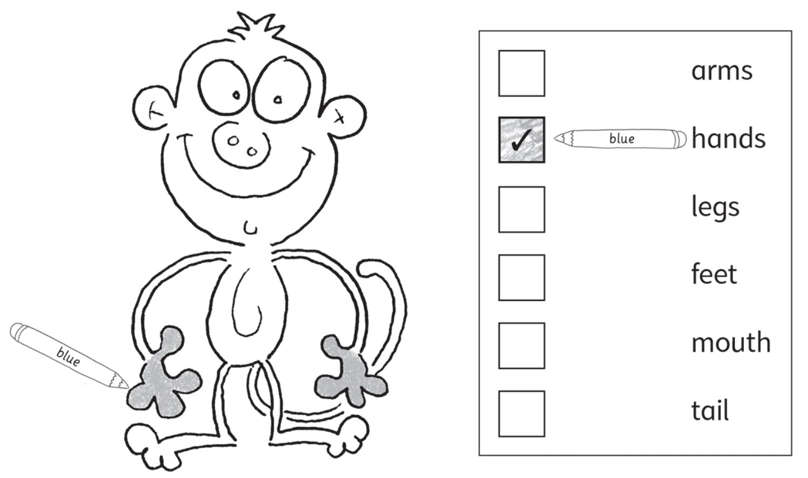

**[Vocabulary]{.underline}**

**1. Look and write. There is one example.   (one point each)**

  ---------------------------------------------------------------------------------------------------------------------------------------------------------------------------------------------------------------------- -- ------------------------------------------------------------------------------------------------------------------------------------------------------------------------------------------------------------------- -- ------------------------------------------------------------------------------------------------------------------------------------------------------------------------------------------------------------------- -- -------------------------------------------------------------------------------------------------------------------------------------------------------------------------------------------------------------------
   1.                  
  *[crocodile]{.underline}*                                                                                                                                                                                                 2. \_\_\_\_\_\_\_\_                                                                                                                                                                                                    3. \_\_\_\_\_\_\_\_                                                                                                                                                                                                    4. \_\_\_\_\_\_\_\_

  ---------------------------------------------------------------------------------------------------------------------------------------------------------------------------------------------------------------------- -- ------------------------------------------------------------------------------------------------------------------------------------------------------------------------------------------------------------------- -- ------------------------------------------------------------------------------------------------------------------------------------------------------------------------------------------------------------------- -- -------------------------------------------------------------------------------------------------------------------------------------------------------------------------------------------------------------------

  ------------------------------------------------------------------------------------------------------------------------------------------------------------------------------------------------------------------- -- -------------------------------------------------------------------------------------------------------------------------------------------------------------------------------------------------------------------
        
  5. \_\_\_\_\_\_\_\_                                                                                                                                                                                                    6. \_\_\_\_\_\_\_\_

  ------------------------------------------------------------------------------------------------------------------------------------------------------------------------------------------------------------------- -- -------------------------------------------------------------------------------------------------------------------------------------------------------------------------------------------------------------------

**2. Look and write. There is one example.   (one point each)**

~~arm~~ \| feet \| foot \| hand \| leg \| tail

**3. Read and draw. There is one example.   (one point each)**

**[Grammar]{.underline}**

**4. Look, read and write *'ve got* or *haven't got*. There is one
example.   (one point each)**

1\. They *['ve got]{.underline}* long legs.

    They *[haven't got]{.underline}* hands.

2\. They \_\_\_\_\_\_\_\_\_\_\_\_\_\_\_ tails

    They \_\_\_\_\_\_\_\_\_\_\_\_\_\_\_ two feet.

3\. They \_\_\_\_\_\_\_\_\_\_\_\_\_\_\_ long tails.

    They \_\_\_\_\_\_\_\_\_\_\_\_\_\_\_ teeth.

4\. They \_\_\_\_\_\_\_\_\_\_\_\_\_\_\_ arms.

    They \_\_\_\_\_\_\_\_\_\_\_\_\_\_\_ legs.

**5. Look. Write *They've got* or *They haven't got*. There is one
example.   (one point each)**

1\. *[They]{.underline}* *['ve]{.underline}* *[got]{.underline}* a grey
head and body.

2\. \_\_\_\_\_\_\_\_\_\_\_\_\_\_\_\_\_\_\_\_\_\_\_
\_\_\_\_\_\_\_\_\_\_\_\_\_\_\_\_\_\_\_\_\_\_\_
\_\_\_\_\_\_\_\_\_\_\_\_\_\_\_\_\_\_\_\_\_\_\_ a long nose.

3\. \_\_\_\_\_\_\_\_\_\_\_\_\_\_\_\_\_\_\_\_\_\_\_
\_\_\_\_\_\_\_\_\_\_\_\_\_\_\_\_\_\_\_\_\_\_\_
\_\_\_\_\_\_\_\_\_\_\_\_\_\_\_\_\_\_\_\_\_\_\_ two hands.

4\. \_\_\_\_\_\_\_\_\_\_\_\_\_\_\_\_\_\_\_\_\_\_\_
\_\_\_\_\_\_\_\_\_\_\_\_\_\_\_\_\_\_\_\_\_\_\_
\_\_\_\_\_\_\_\_\_\_\_\_\_\_\_\_\_\_\_\_\_\_\_ a tail.

5\. \_\_\_\_\_\_\_\_\_\_\_\_\_\_\_\_\_\_\_\_\_\_\_
\_\_\_\_\_\_\_\_\_\_\_\_\_\_\_\_\_\_\_\_\_\_\_
\_\_\_\_\_\_\_\_\_\_\_\_\_\_\_\_\_\_\_\_\_\_\_ small ears.

6\. \_\_\_\_\_\_\_\_\_\_\_\_\_\_\_\_\_\_\_\_\_\_\_
\_\_\_\_\_\_\_\_\_\_\_\_\_\_\_\_\_\_\_\_\_\_\_
\_\_\_\_\_\_\_\_\_\_\_\_\_\_\_\_\_\_\_\_\_\_\_ short legs.

**[Listening]{.underline}**

**6. Look and write. Listen and number. There is one example.   (one
point each)**

**7. Listen and colour. Draw lines. There is one example.   (one point
each)**

**[Reading]{.underline}**

**8. Look and read. Write. There is one example.   (one point each)**

1\. What is this animal?       It's a *[Zebrodile]{.underline}*

2\. What colour are they?      black and \_\_\_\_\_\_\_\_\_\_\_\_\_\_\_

3\. Have they got a small nose?      \_\_\_\_\_\_\_\_\_\_\_\_\_\_\_

4\. How many teeth have they got?      \_\_\_\_\_\_\_\_\_\_\_\_\_\_\_

5\. How many feet have they got?      \_\_\_\_\_\_\_\_\_\_\_\_\_\_\_

6\. Have they got legs?      \_\_\_\_\_\_\_\_\_\_\_\_\_\_\_

