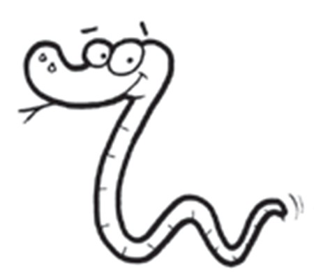
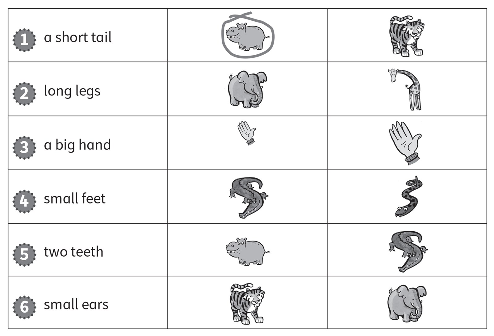
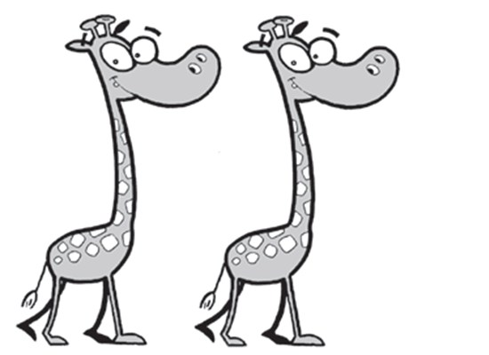
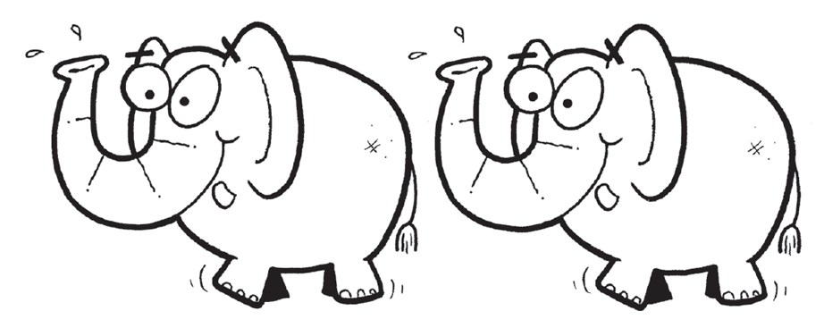
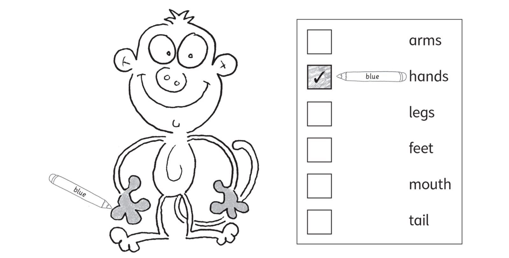

**[Vocabulary]{.underline}**

**1. Look and write. There is one example.   (one point each)**

1\. *[c]{.underline}* *[r]{.underline}* *[o]{.underline}*
*[c]{.underline}* *[o]{.underline}* *[d]{.underline}* *[i]{.underline}*
*[l]{.underline}* *[e]{.underline}*

2\. \_\_ \_\_ \_\_ \_\_ \_\_ \_\_ \_\_ \_\_

*elephant*

3\. \_\_ \_\_ \_\_ \_\_ \_\_

*hippo*

4\. \_\_ \_\_ \_\_ \_\_ \_\_ \_\_ \_\_

*giraffe*

5\. \_\_ \_\_ \_\_ \_\_ \_\_

*snake*

6\. \_\_ \_\_ \_\_ \_\_ \_\_

*zebra*

**2. Look. Put a tick or a cross. There is one example.   (one point
each)**

*2. ✓*

*3. ✗*

*4. ✓*

*5. ✗*

*6. ✓*

**3. Look and circle. There is one example.   (one point each)**

*Circle:*

*2. giraffe*

*3. big hand*

*4. crocodile*

*5. hippo*

*6. tiger*

**[Grammar]{.underline}**

**4. Look, read and circle. There is one example.   (one point each)**

1\. They *['ve]{.underline}* / *[haven't]{.underline}* got hands.

2\. They *'ve* / *haven't* got feet.

*'ve*

3\. They *'ve* / *haven't* got teeth.

*'ve*

4\. They *'ve* / *haven't* got legs.

*haven't*

5\. They *'ve* / *haven't* got arms.

*haven't*

6\. They *'ve* / *haven't* got tails.

*'ve*

**5. Look. Write *'ve* or *haven't*. There is one example.   (one point
each)**

1\. They *['ve]{.underline}* got grey head and body.

2\. They *'ve* got a long nose.

3\. They *haven't* got two hands.

4\. They *'ve* got a tail.

5\. They *haven't* got small ears.

6\. They *'ve* got short legs.

**[Listening]{.underline}**

**6. Look and draw lines. Listen and write the number. There is one
example.   (one point each)**

*2. snakes*

*3. monkeys*

*4. crocodiles*

*5. elephants*

*6. giraffes*

**Audio script**

1\. They're orange and white animals.

2\. They haven't got legs.

3\. They've got hands and a long tail.

4\. They've got big teeth.

5\. They've got big ears.

6\. One is big and one is small.

**7. Listen and colour. Colour the code. There is one example.   (one
point each)**

*green - feet*

*yellow - legs*

*grey - arms*

*orange - tail*

*red - mouth*

**Audio script**

1\. I've got blue hands.

2\. I've ot green feet.

3\. I've got yellow legs.

4\. I've got two grey arms.

5\. I've got a long orange tail.

6\. I've got a happy red mouth!

**[Reading]{.underline}**

**8. Look and read. Write the number. There is one example.   (one point
each)**

1\. What is this animal?      \_\_ no

*3*

2\. What colour are they?      \_\_ black and white

*2*

3\. Have they got a small nose?      \_\_ eight

*4*

4\. How many teeth have they got?      *[1]{.underline}* It's a
Zebrodile

5\. How many feet have they got?      \_\_ yes

*6*

6\. Have they got legs?      \_\_ four

*5*

