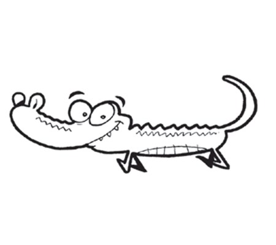
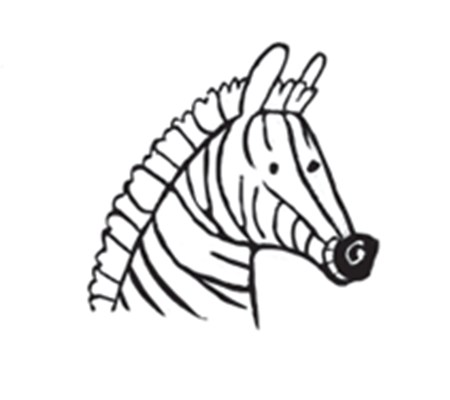
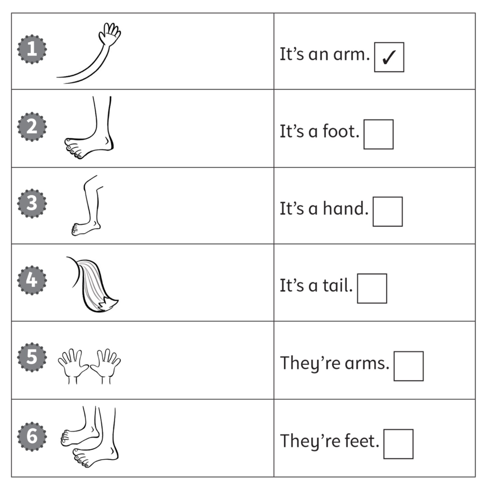
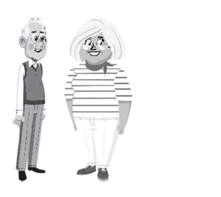
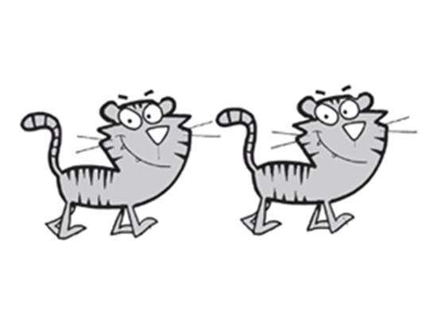
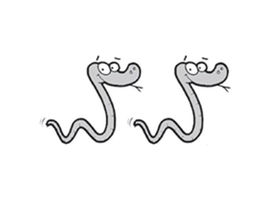
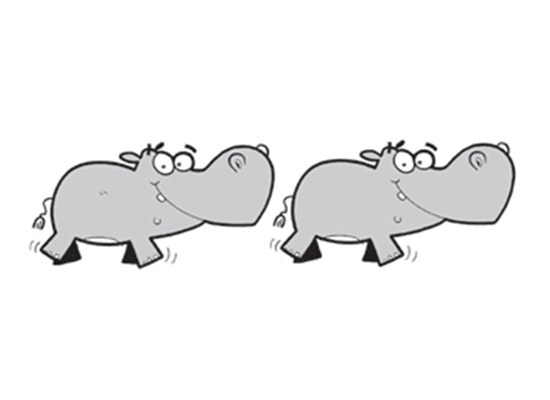
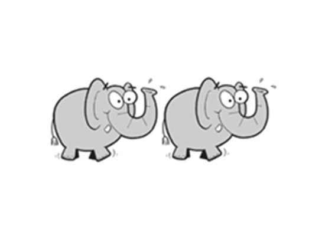
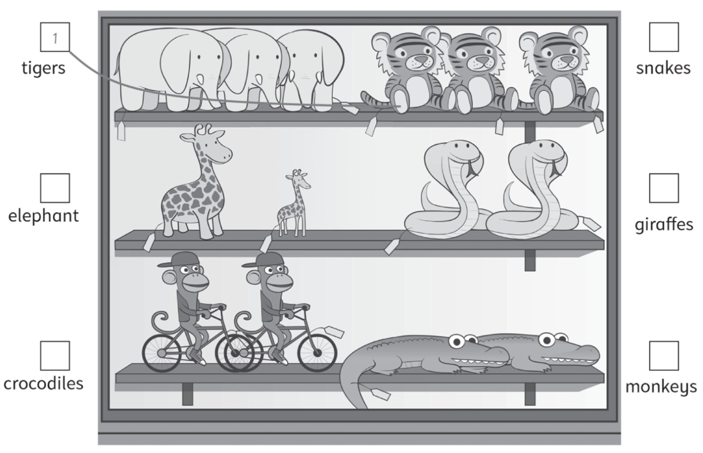
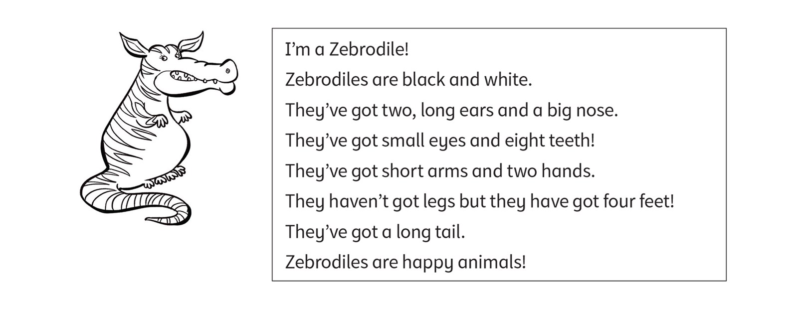

**[Vocabulary]{.underline}**

**1. Look and write. There is one example.   (one point each)**

1\. *[c]{.underline}* *[r]{.underline}* *[o]{.underline}*
*[c]{.underline}* *[o]{.underline}* *[d]{.underline}* *[i]{.underline}*
*[l]{.underline}* *[e]{.underline}*

2\. \_\_ \_\_ \_\_ \_\_ \_\_ \_\_ \_\_ \_\_

3\. \_\_ \_\_ \_\_ \_\_ \_\_

4\. \_\_ \_\_ \_\_ \_\_ \_\_ \_\_ \_\_

5\. \_\_ \_\_ \_\_ \_\_ \_\_

6\. \_\_ \_\_ \_\_ \_\_ \_\_

**2. Look. Put a tick or a cross. There is one example.   (one point
each)**

**3. Look and circle. There is one example.   (one point each)**

**[Grammar]{.underline}**

**4. Look, read and circle. There is one example.   (one point each)**

1\. They *['ve]{.underline}* / *[haven't]{.underline}* got hands.

2\. They *'ve* / *haven't* got feet.

3\. They *'ve* / *haven't* got teeth.

4\. They *'ve* / *haven't* got legs.

5\. They *'ve* / *haven't* got arms.

6\. They *'ve* / *haven't* got tails.

**5. Look. Write *'ve* or *haven't*. There is one example.   (one point
each)**

1\. They *['ve]{.underline}* got grey head and body.

2\. They \_\_\_\_\_\_\_\_\_\_\_\_\_\_ got a long nose.

3\. They \_\_\_\_\_\_\_\_\_\_\_\_\_\_ got two hands.

4\. They \_\_\_\_\_\_\_\_\_\_\_\_\_\_ got a tail.

5\. They \_\_\_\_\_\_\_\_\_\_\_\_\_\_ got small ears.

6\. They \_\_\_\_\_\_\_\_\_\_\_\_\_\_ got short legs.

**[Listening]{.underline}**

**6. Look and draw lines. Listen and write the number. There is one
example.   (one point each)**

**7. Listen and colour. Colour the code. There is one example.   (one
point each)**

**[Reading]{.underline}**

**8. Look and read. Write the number. There is one example.   (one point
each)**

1\. What is this animal?      \_\_ no

2\. What colour are they?      \_\_ black and white

3\. Have they got a small nose?      \_\_ eight

4\. How many teeth have they got?      *[1]{.underline}* It's a
Zebrodile

5\. How many feet have they got?      \_\_ yes

6\. Have they got legs?      \_\_ four

