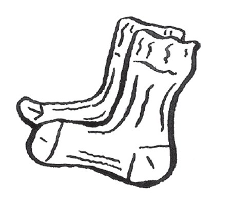
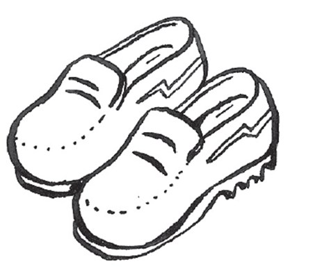
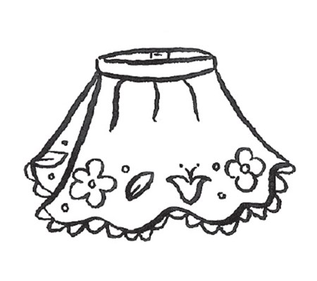
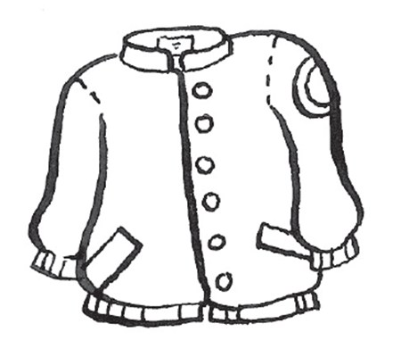
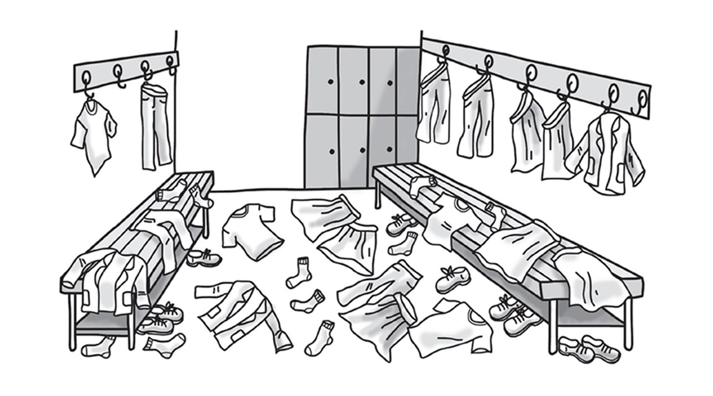
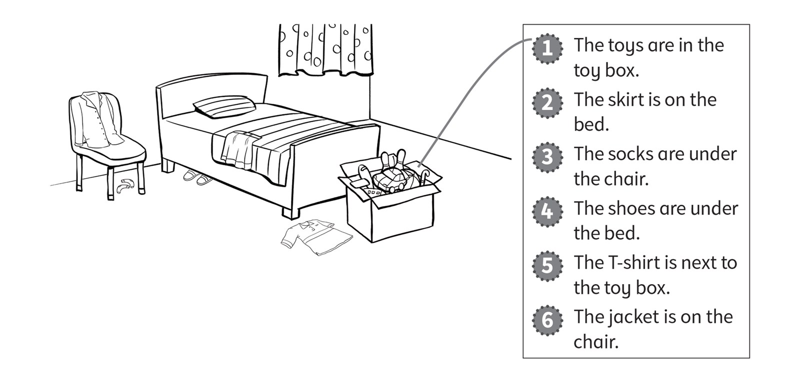
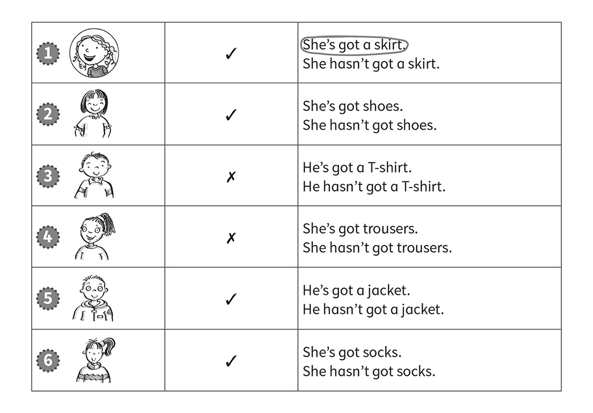
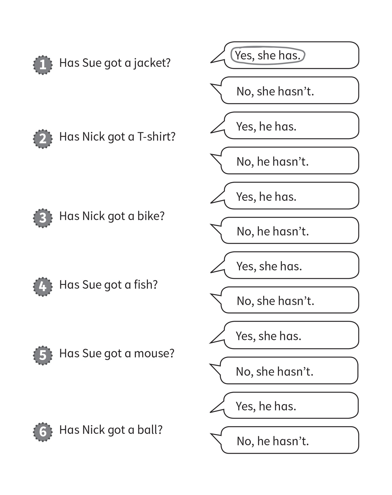
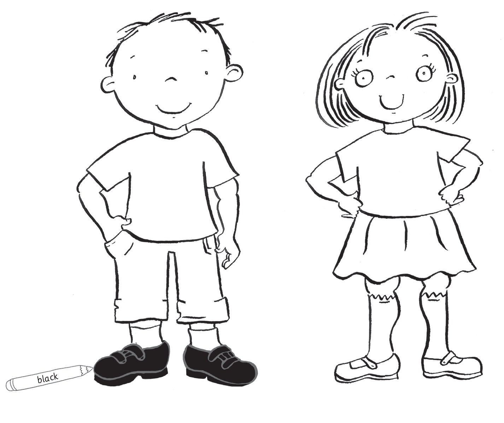
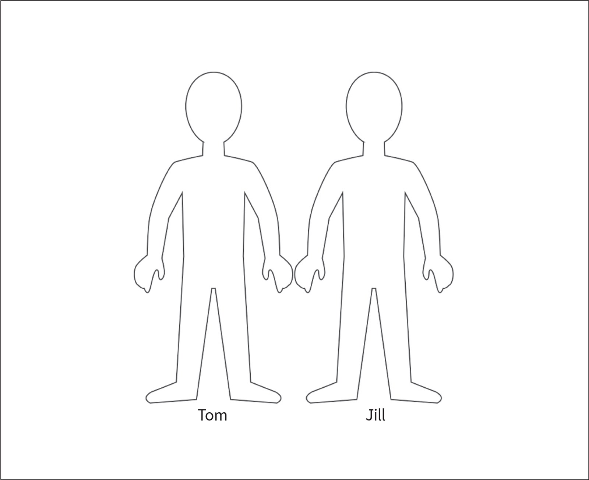

**[Vocabulary]{.underline}**

**1. Look and circle. There is one example.   (one point each)**

1\. *[socks]{.underline}* / shoes

2\. shorts / jacket

*shorts*

3\. skirt / shoes

*shoes*

4\. T-shirt / skirt

*skirt*

5\. jacket / shoes

*jacket*

6\. socks / T-shirt

*T-shirt*

**2. Look and write *yes* or *no*. There is one example.   (one point
each)**

  ------------------------------- --- -----------------------------------
  1\. six shoes                       *[no]{.underline}*

  ------------------------------- --- -----------------------------------

  ------------------------------- --- -----------------------------------
  2\. three jackets                   *yes*

  ------------------------------- --- -----------------------------------

  ------------------------------- --- -----------------------------------
  3\. four socks                      *no*

  ------------------------------- --- -----------------------------------

  ------------------------------- --- -----------------------------------
  4\. seven skirts                    *yes*

  ------------------------------- --- -----------------------------------

  ------------------------------- --- -----------------------------------
  5\. two T-shirts                    *no*

  ------------------------------- --- -----------------------------------

  ------------------------------- --- -----------------------------------
  6\. one pair of trousers            *no*

  ------------------------------- --- -----------------------------------

**3. Look, read and draw lines. There is one example.   (one point
each)**

*2. skirt -- on bed*

*3. socks -- under chair*

*4. shoes -- under bed*

*5. T-shirt -- next to toy box*

*6. jacket -- on chair*

**[Grammar]{.underline}**

**4. Look read and circle. There is one example.   (one point each)**

*2. She's got shoes.*

*3. He hasn't got a T-shirt.*

*4. She hasn't got trousers.*

*5. He's got a jacket.*

*6. She's got socks.*

**5. Look and circle. There is one example.   (one point each)**

*2. Yes, he has.*

*3. No, he hasn't.*

*4. Yes, she has.*

*5. No, she hasn't.*

*6. Yes, he has.*

**[Listening]{.underline}**

**6. Listen and colour. There is one example.   (one point each)**

*Boy: red T-shirt, green trousers*

*Girl: yellow T-shirt, purple skirt, orange socks*

**Audio script**

He's got black shoes.

He's got a red T-shirt and green trousers.

She's got a yellow

T-shirt and a purple skirt.

She's got orange socks

**7. Listen and circle. There is one example.   (one point each)**

*2. Kim*

*3. May*

*4. Kim*

*5. May*

*6. May*

**Audio script**

1\. She's got a big mouth and nose.

2\. She's got a big jacket.

3\. She's got small shoes.

4\. She's got long shoes.

5\. She's got a big skirt.

6\. She's hasn't got trousers.

**[Reading]{.underline}**

**8. Read, draw and colour.   (one point each)**

Tom has got short, black hair, a blue jacket and blue trousers.

He's got green shoes.

Jill has got a purple T-shirt and red trousers.

She hasn't got socks or shoes.

*1 mark for the following:*

*Tom: blue jacket, blue trousers, green shoes*

*Jill: purple T-shirt; red trouser*

