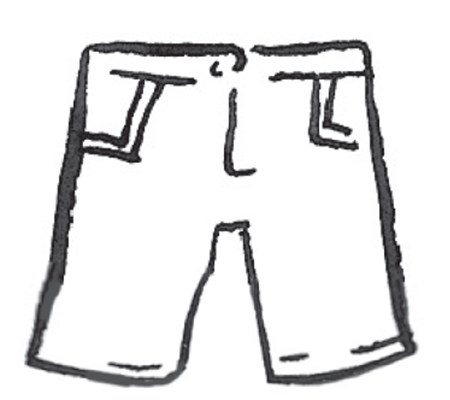
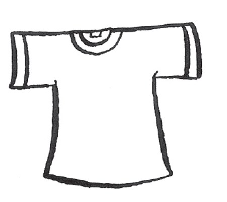
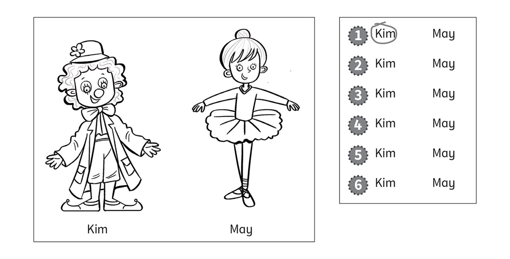
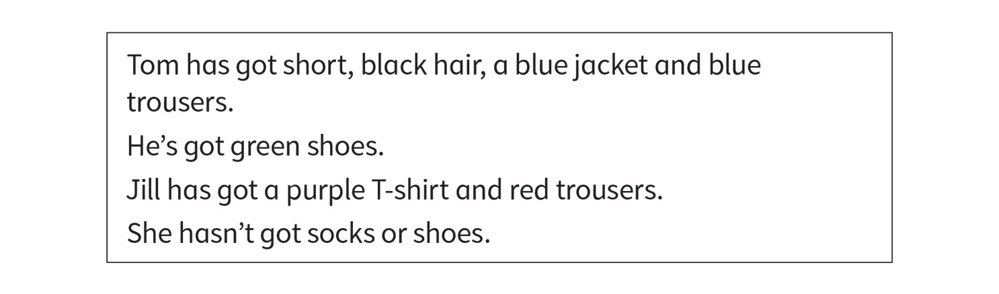

**[Vocabulary]{.underline}**

**1. Look and circle. There is one example.   (one point each)**

1\. *[socks]{.underline}* / shoes

2\. shorts / jacket

3\. skirt / shoes

4\. T-shirt / skirt

5\. jacket / shoes

6\. socks / T-shirt

**2. Look and write *yes* or *no*. There is one example.   (one point
each)**

  ------------------------------- --- -----------------------------------
  1\. six shoes                       *[no]{.underline}*

  ------------------------------- --- -----------------------------------

  ------------------------------- --- -----------------------------------
  2\. three jackets                   \_\_\_\_\_\_\_\_\_\_\_\_

  ------------------------------- --- -----------------------------------

  ------------------------------- --- -----------------------------------
  3\. four socks                      \_\_\_\_\_\_\_\_\_\_\_\_

  ------------------------------- --- -----------------------------------

  ------------------------------- --- -----------------------------------
  4\. seven skirts                    \_\_\_\_\_\_\_\_\_\_\_\_

  ------------------------------- --- -----------------------------------

  ------------------------------- --- -----------------------------------
  5\. two T-shirts                    \_\_\_\_\_\_\_\_\_\_\_\_

  ------------------------------- --- -----------------------------------

  ------------------------------- --- -----------------------------------
  6\. one pair of trousers            \_\_\_\_\_\_\_\_\_\_\_\_

  ------------------------------- --- -----------------------------------

**3. Look, read and draw lines. There is one example.   (one point
each)**

**[Grammar]{.underline}**

**4. Look read and circle. There is one example.   (one point each)**

**5. Look and circle. There is one example.   (one point each)**

**[Listening]{.underline}**

**6. Listen and colour. There is one example.   (one point each)**

**7. Listen and circle. There is one example.   (one point each)**

**[Reading]{.underline}**

**8. Read, draw and colour.   (one point each)**

Tom has got short, black hair, a blue jacket and blue trousers.

He's got green shoes.

Jill has got a purple T-shirt and red trousers.

She hasn't got socks or shoes.

