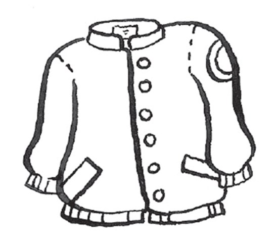
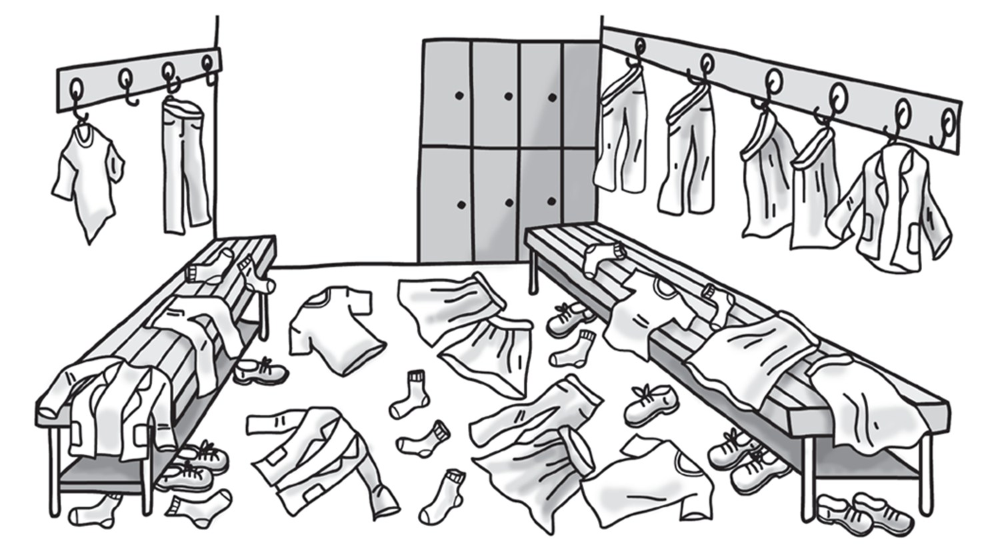
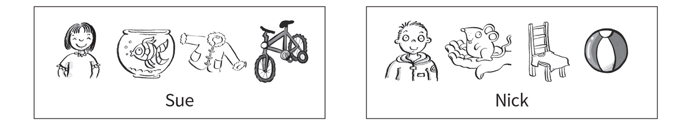
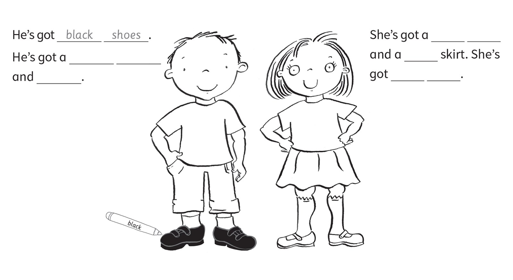
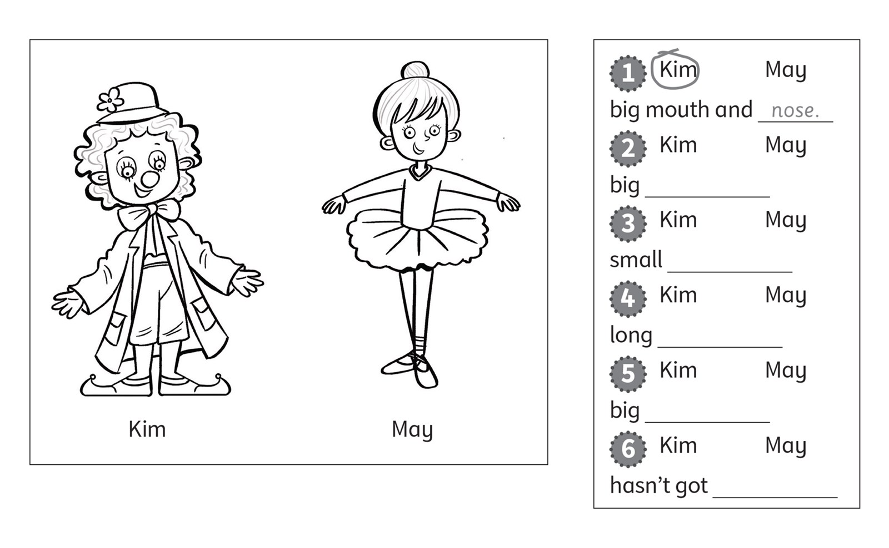
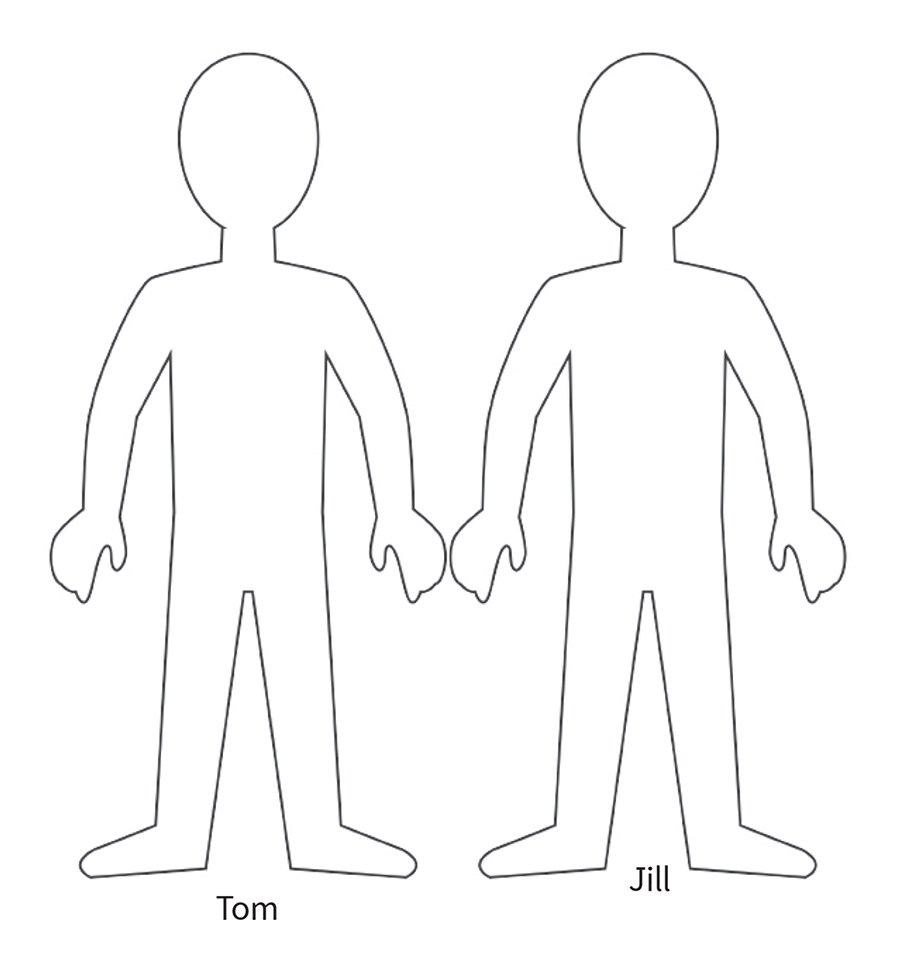

**[Vocabulary]{.underline}**

**1. Look and write. There is one example.   (one point each)**

  ------------------------------------------------------------------------------------------------------------------------------------------------------------------------------------------------------------------- -- ---------------------------------------------------------------------------------------------------------------------------------------------------------------------------------------------------------------- -- ----------------------------------------------------------------------------------------------------------------------------------------------------------------------------------------------------------------
   1.            
  *shoes*                                                                                                                                                                                                                2. *[socks]{.underline}*                                                                                                                                                                                            3. *shorts*

  ------------------------------------------------------------------------------------------------------------------------------------------------------------------------------------------------------------------- -- ---------------------------------------------------------------------------------------------------------------------------------------------------------------------------------------------------------------- -- ----------------------------------------------------------------------------------------------------------------------------------------------------------------------------------------------------------------

  ---------------------------------------------------------------------------------------------------------------------------------------------------------------------------------------------------------------- -- ---------------------------------------------------------------------------------------------------------------------------------------------------------------------------------------------------------------- -- ----------------------------------------------------------------------------------------------------------------------------------------------------------------------------------------------------------------
              
  4. *skirt*                                                                                                                                                                                                          5. *jacket*                                                                                                                                                                                                         6. *T-shirt*

  ---------------------------------------------------------------------------------------------------------------------------------------------------------------------------------------------------------------- -- ---------------------------------------------------------------------------------------------------------------------------------------------------------------------------------------------------------------- -- ----------------------------------------------------------------------------------------------------------------------------------------------------------------------------------------------------------------

**2. Look, count and write. There is one example.   (one point each)**

1\. nine *[s]{.underline}* *[h]{.underline}* *[o]{.underline}*
*[e]{.underline}* *[s]{.underline}*

2\. four \_ - \_ \_ \_ \_ \_ \_

*T-shirts*

3\. ten \_ \_ \_ \_ \_

*socks*

4\. seven \_ \_ \_ \_ \_ \_

*skirts*

5\. three \_ \_ \_ \_ \_ \_ \_

*jackets*

6\. five \_ \_ \_ \_ \_ \_ \_ \_

*trousers*

**3. Look, read and draw lines. There is one example.   (one point
each)**

*2. The skirt is on the bed.*

*3. The socks are under the chair.*

*4. The shoes are under the bed.*

*5. The T-shirt is next to the toy box.*

*6. The jacket is on the chair.*

**[Grammar]{.underline}**

**4. Look and write. There is one example.   (one point each)**

*2. She's got*

*3. He hasn't got*

*4. She hasn't got*

*5. He's got*

*6. She's got*

**5. Look. Write *Yes, he/she has* or *No, he/she hasn't*. There is one
example.   (one point each)**

1\. Has Sue got a jacket?       *[Yes, she has.]{.underline}*

2\. Has Nick got a T-shirt?      \_\_\_\_\_\_\_\_\_\_\_\_\_\_\_\_\_\_

*Yes, he has*

3\. Has Nick got a T-shirt?      \_\_\_\_\_\_\_\_\_\_\_\_\_\_\_\_\_\_

*Yes, he has*

4\. Has Nick got a bike?      \_\_\_\_\_\_\_\_\_\_\_\_\_\_\_\_\_\_

*No, he hasn't*

5\. Has Sue got a fish?      \_\_\_\_\_\_\_\_\_\_\_\_\_\_\_\_\_\_

*Yes, she has*

6\. Has Sue got a mouse?      \_\_\_\_\_\_\_\_\_\_\_\_\_\_\_\_\_\_

*No, she hasn't*

7\. Has Nick got a ball?      \_\_\_\_\_\_\_\_\_\_\_\_\_\_\_\_\_\_

*Yes, he has*

**[Listening]{.underline}**

**6. Listen and colour. Then write. There is one example.   (one point
each)**

*Boy: a red T-shirt, green trousers.*

*Girl: a yellow T-shirt, purple, orange socks.*

**Audio script**

He's got black shoes. He's got a red T-shirt and green trousers. She's
got a yellow

T-shirt and a purple skirt. She's got orange socks.

**7. Listen. Circle *Kim* or *May*. Write. There is one example.   (one
point each)**

*2. Kim, jacket*

*3. May, shoes*

*4. Kim, shoes*

*5. May, skirt*

*6. May, trousers*

**Audio script**

1\. She's got a big mouth and nose.

2\. She's got a big jacket.

3\. She's got small shoes.

4\. She's got long shoes.

5\. She's got a big skirt.

6\. She's hasn't got trousers.

**[Reading]{.underline}**

**8. Read, draw and colour.   (one point each)**

*Tom: blue jacket, blue trousers; green shoes;*

*Jill: long brown hair; purple T-shirt and red trousers*

