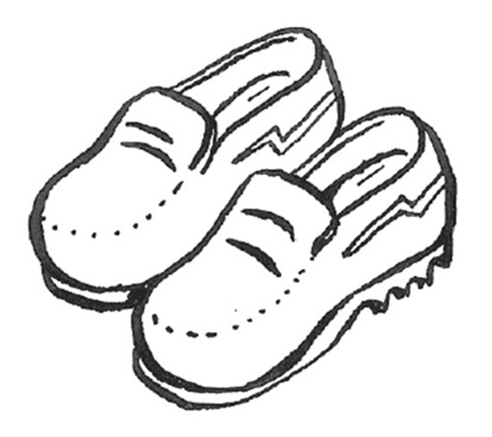
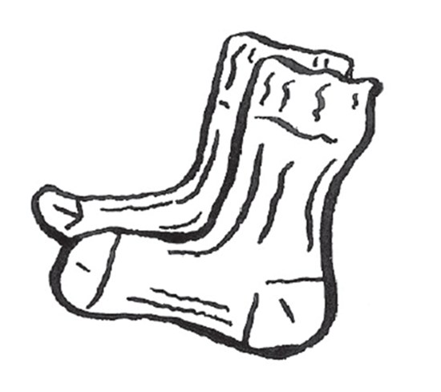
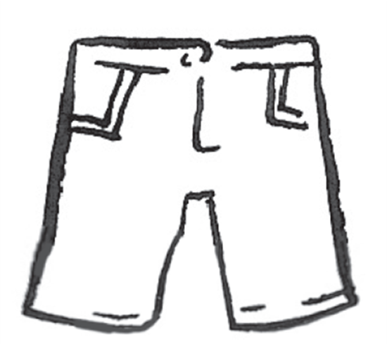
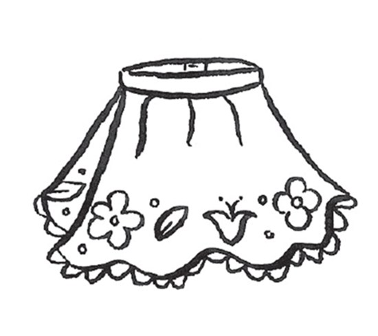
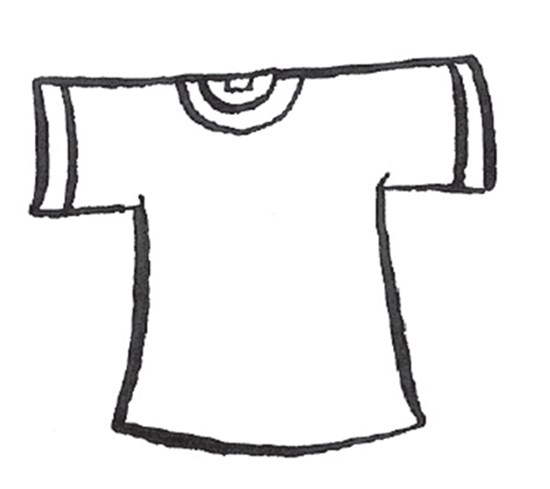
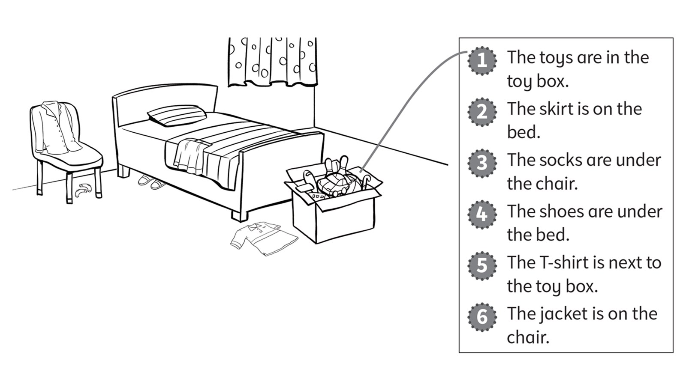
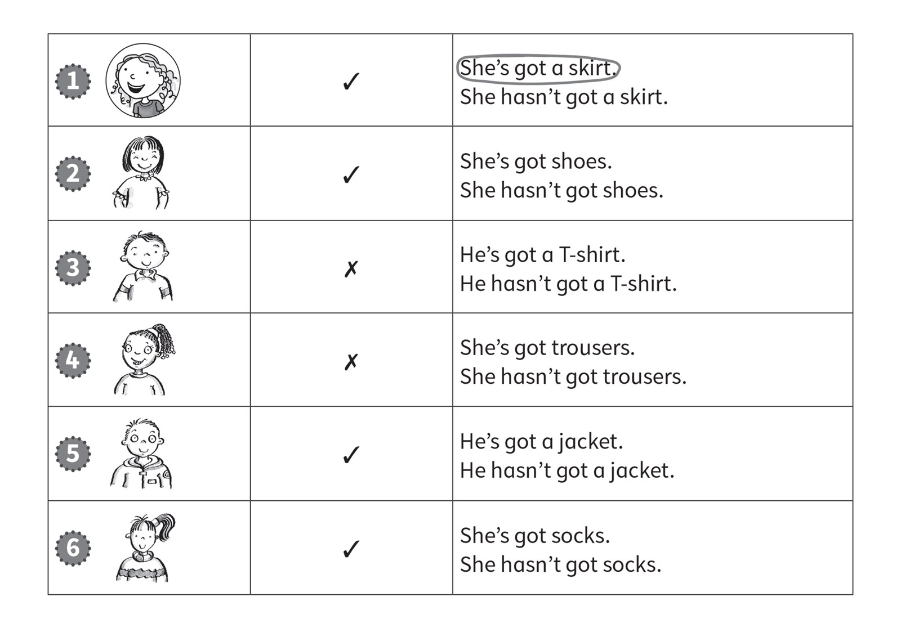
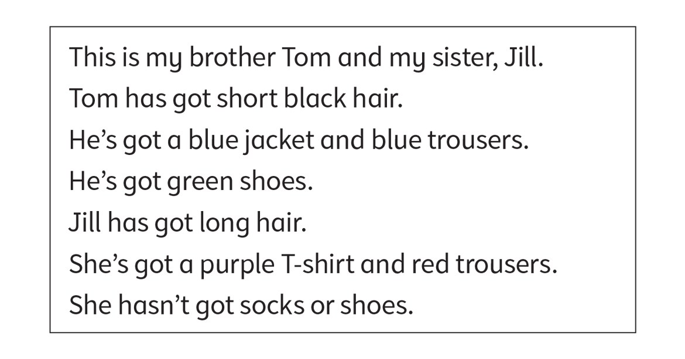

**[Vocabulary]{.underline}**

**1. Look and write. There is one example.   (one point each)**

  ---------------------------------------------------------------------------------------------------------------------------------------------------------------------------------------------------------------------- -- ------------------------------------------------------------------------------------------------------------------------------------------------------------------------------------------------------------------- -- -------------------------------------------------------------------------------------------------------------------------------------------------------------------------------------------------------------------
   1.            
  \_\_\_\_\_\_\_                                                                                                                                                                                                            2. *[socks]{.underline}*                                                                                                                                                                                               3. \_\_\_\_\_\_\_

  ---------------------------------------------------------------------------------------------------------------------------------------------------------------------------------------------------------------------- -- ------------------------------------------------------------------------------------------------------------------------------------------------------------------------------------------------------------------- -- -------------------------------------------------------------------------------------------------------------------------------------------------------------------------------------------------------------------

  ------------------------------------------------------------------------------------------------------------------------------------------------------------------------------------------------------------------- -- ------------------------------------------------------------------------------------------------------------------------------------------------------------------------------------------------------------------- -- -------------------------------------------------------------------------------------------------------------------------------------------------------------------------------------------------------------------
              
  4. \_\_\_\_\_\_\_                                                                                                                                                                                                      5. \_\_\_\_\_\_\_                                                                                                                                                                                                      6. \_\_\_\_\_\_\_

  ------------------------------------------------------------------------------------------------------------------------------------------------------------------------------------------------------------------- -- ------------------------------------------------------------------------------------------------------------------------------------------------------------------------------------------------------------------- -- -------------------------------------------------------------------------------------------------------------------------------------------------------------------------------------------------------------------

**2. Look, count and write. There is one example.   (one point each)**

1\. nine *[s]{.underline}* *[h]{.underline}* *[o]{.underline}*
*[e]{.underline}* *[s]{.underline}*

2\. four \_ - \_ \_ \_ \_ \_ \_

3\. ten \_ \_ \_ \_ \_

4\. seven \_ \_ \_ \_ \_ \_

5\. three \_ \_ \_ \_ \_ \_ \_

6\. five \_ \_ \_ \_ \_ \_ \_ \_

**3. Look, read and draw lines. There is one example.   (one point
each)**

**[Grammar]{.underline}**

**4. Look and write. There is one example.   (one point each)**

**5. Look. Write *Yes, he/she has* or *No, he/she hasn't*. There is one
example.   (one point each)**

1\. Has Sue got a jacket?       *[Yes, she has.]{.underline}*

2\. Has Nick got a T-shirt?      \_\_\_\_\_\_\_\_\_\_\_\_\_\_\_\_\_\_

3\. Has Nick got a T-shirt?      \_\_\_\_\_\_\_\_\_\_\_\_\_\_\_\_\_\_

4\. Has Nick got a bike?      \_\_\_\_\_\_\_\_\_\_\_\_\_\_\_\_\_\_

5\. Has Sue got a fish?      \_\_\_\_\_\_\_\_\_\_\_\_\_\_\_\_\_\_

6\. Has Sue got a mouse?      \_\_\_\_\_\_\_\_\_\_\_\_\_\_\_\_\_\_

7\. Has Nick got a ball?      \_\_\_\_\_\_\_\_\_\_\_\_\_\_\_\_\_\_

**[Listening]{.underline}**

**6. Listen and colour. Then write. There is one example.   (one point
each)**

**7. Listen. Circle *Kim* or *May*. Write. There is one example.   (one
point each)**

**[Reading]{.underline}**

**8. Read, draw and colour.   (one point each)**

