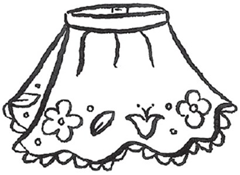
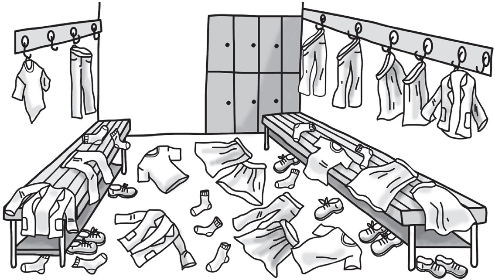
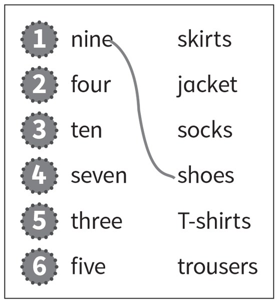
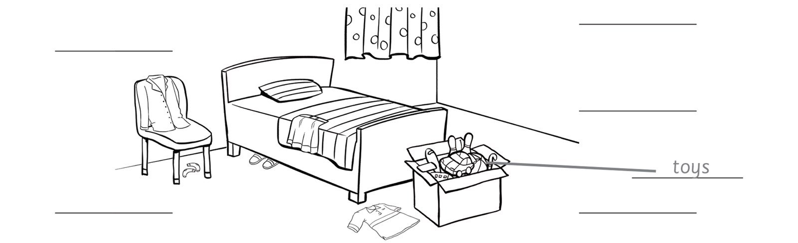
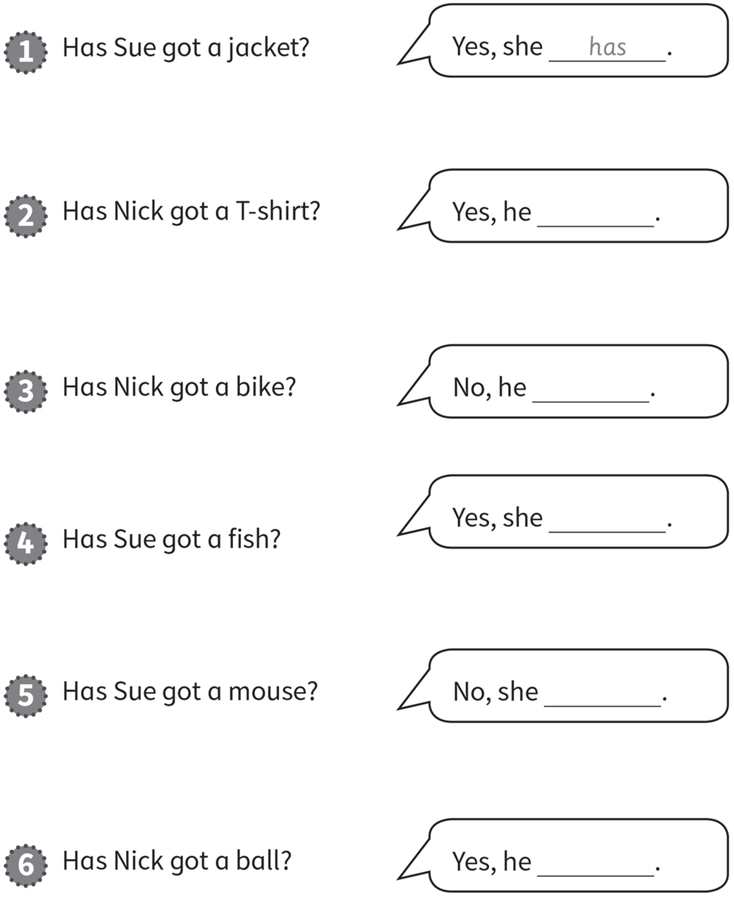
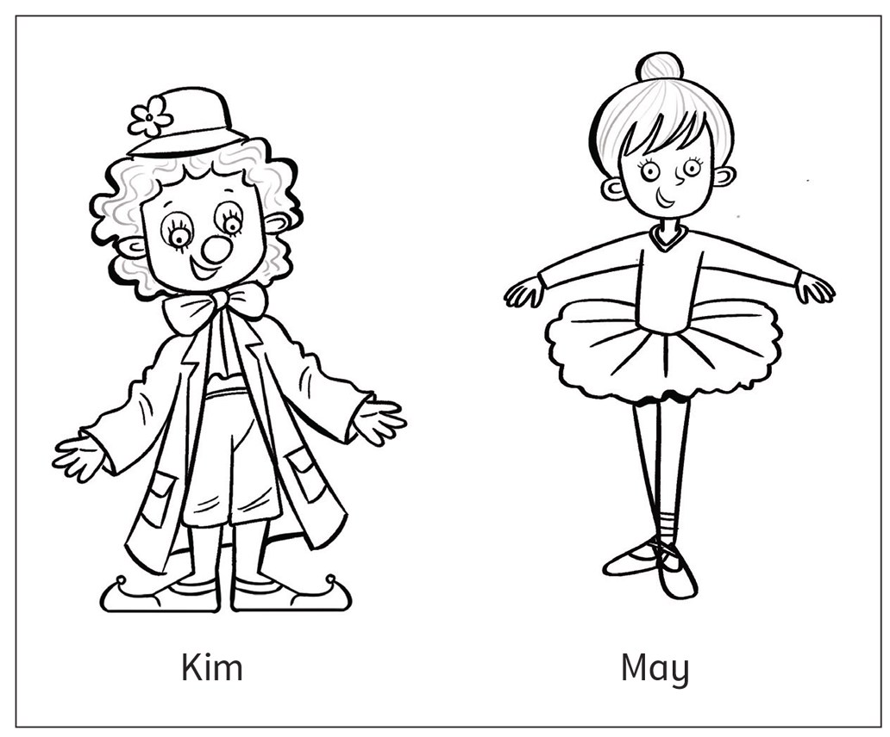
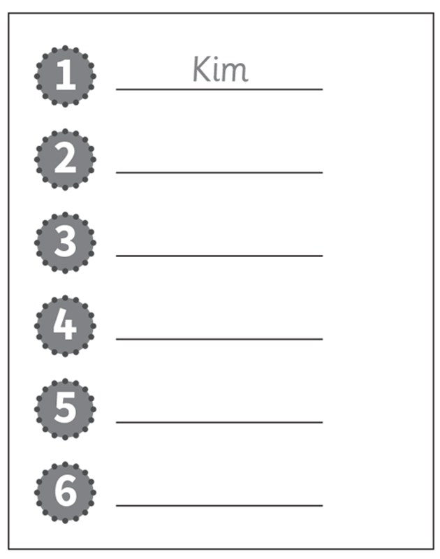
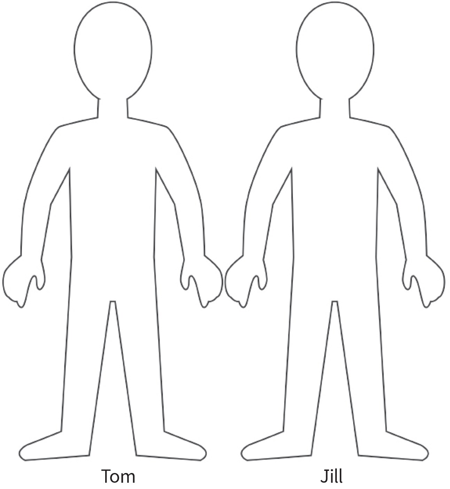

**[Vocabulary]{.underline}**

**1. Look and complete the write. There is one example.   (one point
each)**

1\. *[s]{.underline}* *[o]{.underline}* c *[k]{.underline}* s

2\. s \_ \_ r \_ s

*shorts*

3\. s \_ \_ e \_

*shoes*

4\. \_ k \_ \_ \_

*skirt*

5\. \_ \_ c \_ \_ \_

*jacket*

6\. T-\_ \_ \_ \_ \_

*T-shirt*

**2. Look, count and match. There is one example.   (one point each)**

*2. four T-shirts*

*3. ten socks*

*4. seven skirts*

*5. three jackets*

*6. five trousers*

**3. Look and read. Draw lines and write. Draw lines. There is one
example.   (one point each)**

1\. The toys are in the toy box.

*toys -- in toy box*

2\. The skirt is on the bed.

*skirt -- on bed*

3\. The socks are under the chair.

*socks -- under chair*

4\. The shoes are under the bed.

*shoes -- under bed*

5\. The T-shirt is next to the toy box.

*T-shirt -- next to toy box*

6\. The jacket is on the chair.

*jacket -- on chair*

**[Grammar]{.underline}**

**4. Look, read and circle. There is one example.   (one point each)**

*2. She's got shoes*

*3. He hasn't got a T-shirt*

*4. She hasn't got trousers*

*5. He's got a jacket*

*6. She's got socks*

**5. Look. Write *has* or *hasn't*. There is one example.   (one point
each)**

*2. has*

*3. hasn't*

*4. has*

*5. hasn't*

*6. has*

**[Listening]{.underline}**

**6. Listen and colour. There is one example.   (one point each)**

*Boy: red T-shirt, green trousers.*

*Girl: yellow T-shirt, purple skirt, orange socks.*

**Audio script**

He's got black shoes.

He's got a red T-shirt and green trousers.

She's got a yellow T-shirt and an purple skirt.

She's got orange socks.

**7. Listen. Write *Kim* or *May*. There is one example.   (one point
each)**

*2. Kim*

*3. May*

*4. Kim*

*5. May*

*6. May*

**Audio script**

1\. She's got a big mouth and nose.

2\. She's got a big jacket.

3\. She's got small shoes.

4\. She's got long shoes.

5\. She's got a big skirt.

6\. She's hasn't got trousers.

**[Reading]{.underline}**

**8. Read, draw and colour.   (one point each)**

*1 mark for the following:*

*Tom: blue jacket; blue trousers; green shoes;*

*Jill: purple T-shirt; red trousers*

