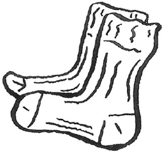
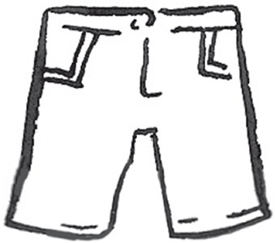
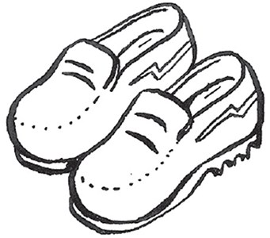
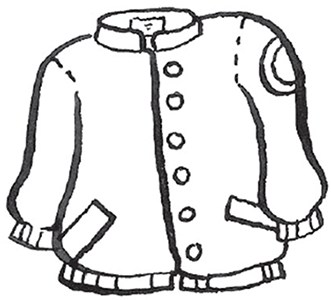
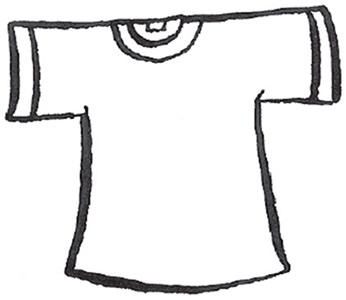
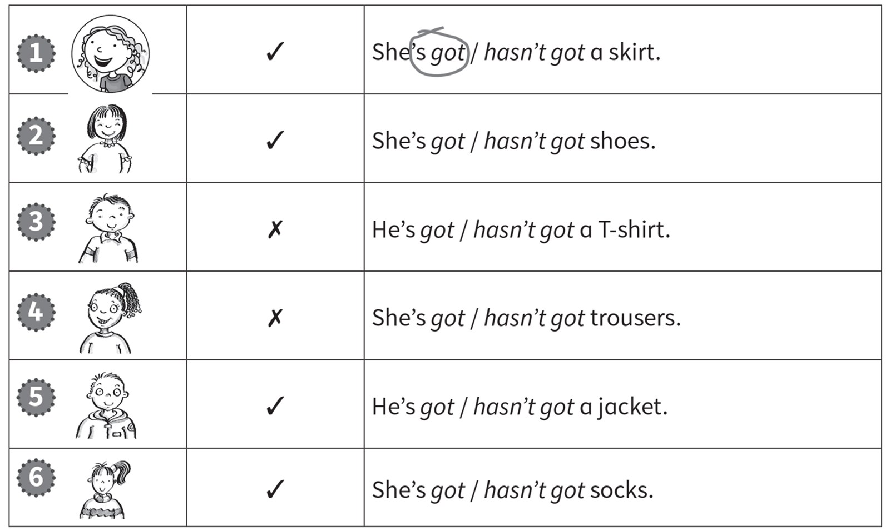
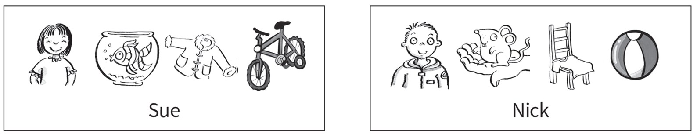
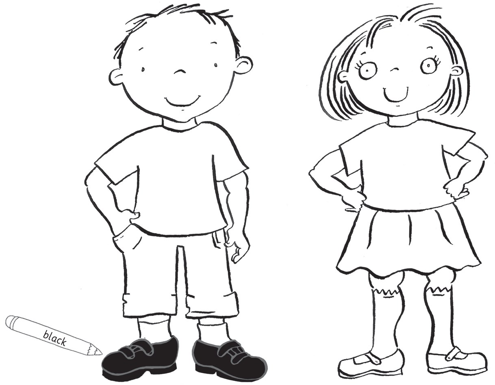
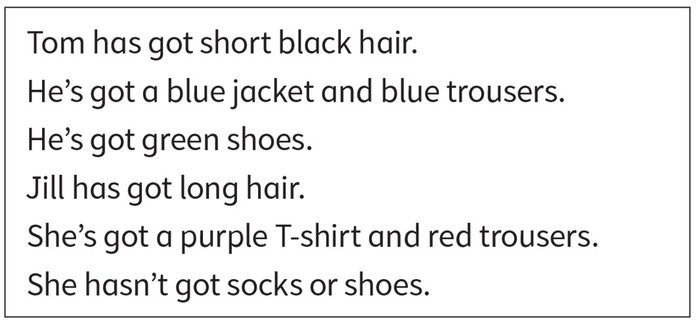

**[Vocabulary]{.underline}**

**1. Look and complete the write. There is one example.   (one point
each)**

1\. *[s]{.underline}* *[o]{.underline}* c *[k]{.underline}* s

2\. s \_ \_ r \_ s

3\. s \_ \_ e \_

4\. \_ k \_ \_ \_

5\. \_ \_ c \_ \_ \_

6\. T-\_ \_ \_ \_ \_

**2. Look, count and match. There is one example.   (one point each)**

**3. Look and read. Draw lines and write. Draw lines. There is one
example.   (one point each)**

1\. The toys are in the toy box.

2\. The skirt is on the bed.

3\. The socks are under the chair.

4\. The shoes are under the bed.

5\. The T-shirt is next to the toy box.

6\. The jacket is on the chair.

**[Grammar]{.underline}**

**4. Look, read and circle. There is one example.   (one point each)**

**5. Look. Write *has* or *hasn't*. There is one example.   (one point
each)**

**[Listening]{.underline}**

**6. Listen and colour. There is one example.   (one point each)**

**7. Listen. Write *Kim* or *May*. There is one example.   (one point
each)**

**[Reading]{.underline}**

**8. Read, draw and colour.   (one point each)**

