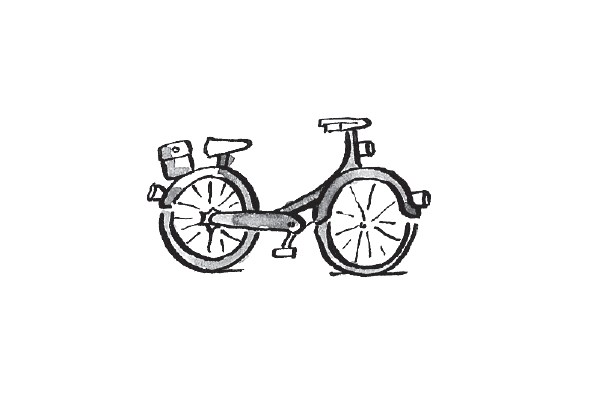
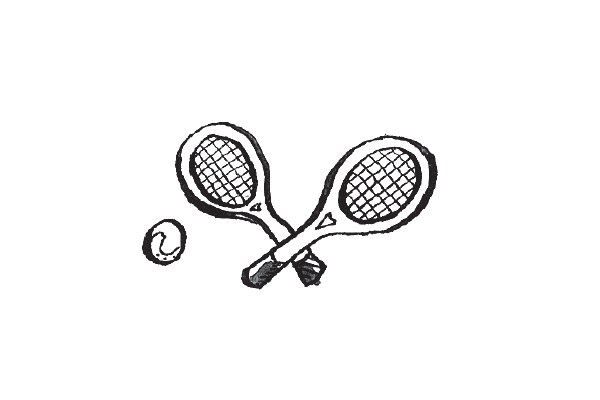
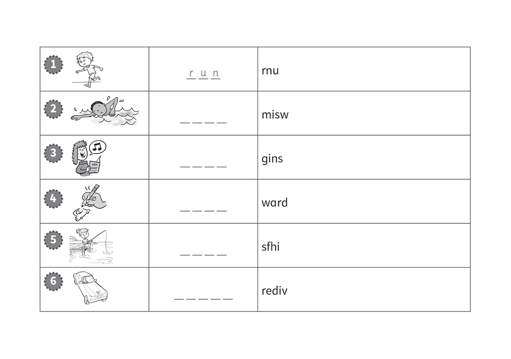
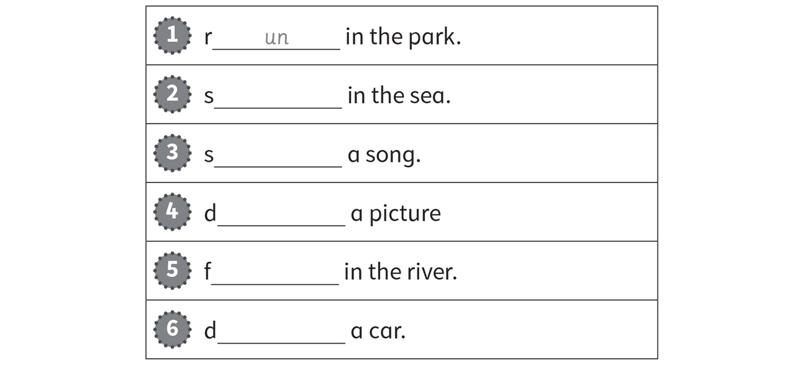
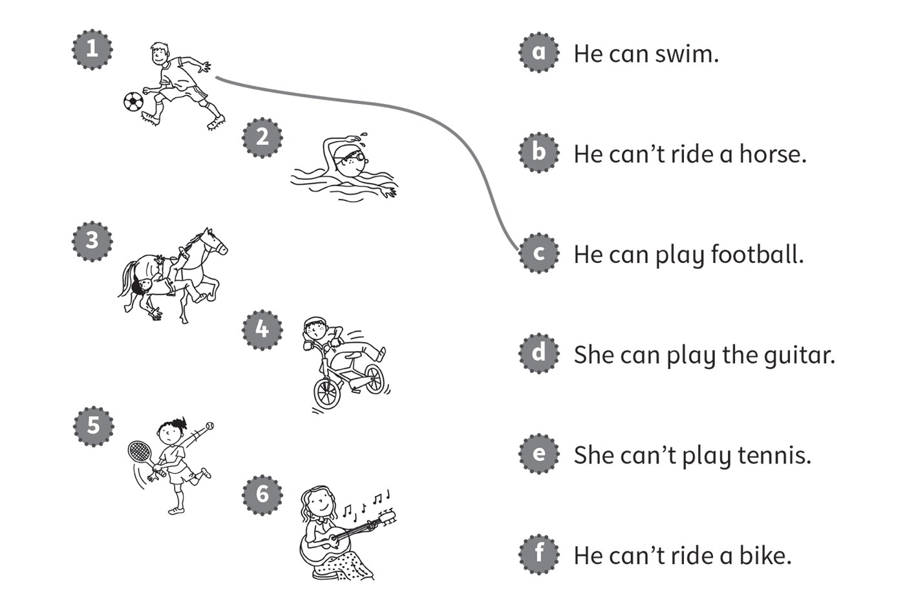
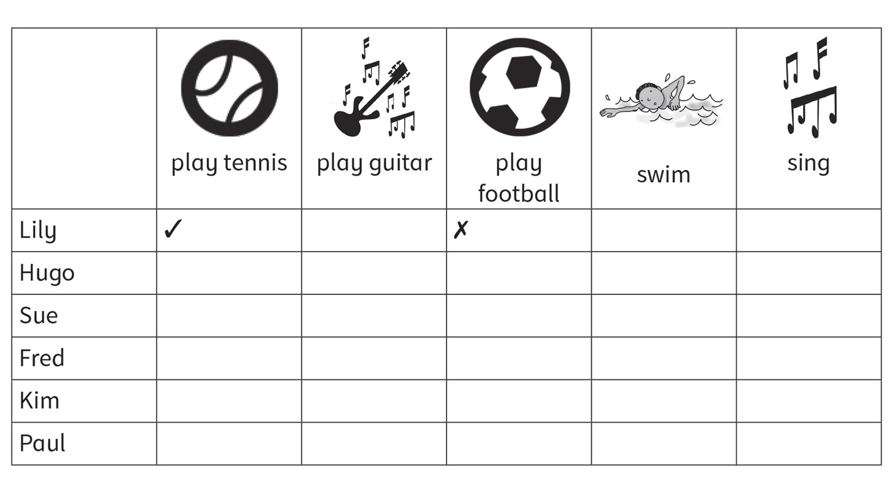
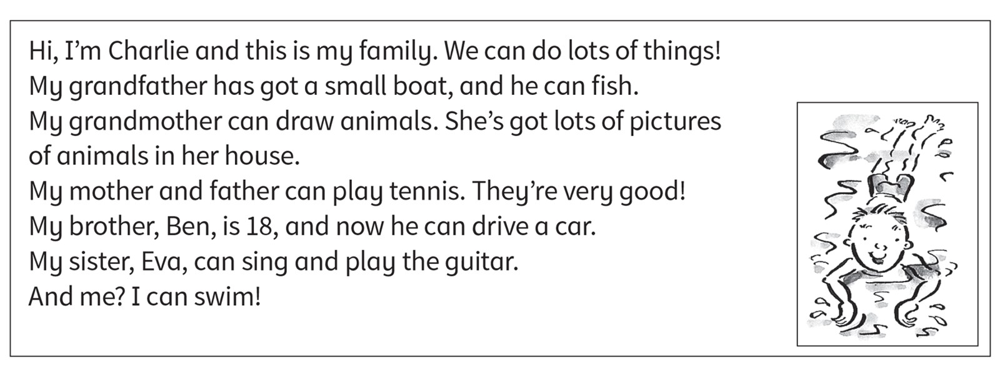

**[Vocabulary]{.underline}**

**1. Write the words. There is one example.   (one point each)**

~~guitar~~ \| ride \| play \| basketball \| tennis \| horse

1\. play the *[g]{.underline}* *[u]{.underline}* *[i]{.underline}*
*[t]{.underline}* *[a]{.underline}* *[r]{.underline}*

2\. \_ \_ \_ \_ a bike

*ride*

3\. ride a \_ \_ \_ \_ \_

*horse*

4\. play \_ \_ \_ \_ \_ \_

*tennis*

5\. \_ \_ \_ \_ football

*play*

6\. Play \_ \_ \_ \_ \_ \_ \_ \_ \_ \_

*basketball*

**2. Look and write the words. There is one example.   (one point
each)**

*2. swim*

*3. sing*

*4. draw*

*5. fish*

*6. drive*

**3. Look. Write the words from Exercise 2. There is one example.   (one
point each)**

*2. swim*

*3. sing*

*4. draw*

*5. fish*

*6. drive*

**[Grammar]{.underline}**

**4. Look and draw lines. There is one example.   (one point each)**

*2. a*

*3. b*

*4. f*

*5. e*

*6. d*

**5. Look and circle. There is one example.   (one point each)**

1\. Can you draw?      ✓      *[Yes, I can.]{.underline}*      No, I
can't.

2\. Can you play the guitar?      ✗      Yes, I can.      No, I can't.

*No, I can't.*

3\. Can she play basketball?      ✗      Yes, she can.      No, she
can't.

*No, she can't.*

4\. Can he ride a bike?      ✓      Yes, he can.      No, he can't.

*Yes, he can.*

5\. Can she ride a horse?      ✓      Yes, she can.      No, she can't.

*Yes, she can.*

6\. Can he swim?      ✗      Yes, he can.      No, he can't.

*No, he can't.*

**[Listening]{.underline}**

**6. Listen and draw lines. There is one example.   (one point each)**

*2. Jane -- girl swimming*

*3. Peter -- boy fishing*

*4. Grace -- girl riding a bike*

*5. Fred -- boy riding a horse*

*6. Lucy -- girl drawing a pictures*

**Audio script**

1

**Boy**: What can Alex do?

**Girl**: Alex can play basketball.

2

**Boy**: What can Jane do?

**Girl**: Jane can swim.

3

**Boy**: What can Peter do?

**Girl**: Peter can fish in the river. He fishes with his grandpa.

4

**Boy**: What can Grace do?

**Girl**: Grace can ride a bike.

5

**Boy**: What can Fred do?

**Girl**: Fred can ride a horse.

6

**Boy**: What can Lucy do?

**Girl**: Lucy can draw pictures.

**7. Listen and tick or cross. There is one example.   (one point
each)**

*2. Hugo -- swim ✗, guitar ✓*

*3. Sue -- sing ✓, guitar ✗*

*4. Fred -- football ✓, swim ✓*

*5. Kim -- sing ✗, tennis ✗*

*6. Paul -- football ✗, guitar ✓*

**Audio script**

1

**Boy**: Hi, Lily. Can you play tennis?

**Lily**: Yes, I can.

**Boy**: Can you play football?

**Lily**: No, I can't.

2

**Girl**: Hi, Hugo. Can you swim?

**Hugo**: No, I can't.

**Girl**: Can you play the guitar?

**Hugo**: Yes, I can.

3

**Boy**: Hello, Sue. Can you sing?

**Sue**: Yes, I can.

**Boy**: Can you play the guitar?

**Sue**: No, I can't!

4

**Girl**: Hello, Fred. Can you play football?

**Fred**: Yes, I can.

**Girl**: Can you swim?

**Fred**: Yes, I can!

5

**Boy**: Hi, Kim. Can you sing?

**Kim**: No, I can't.

**Boy**: Can you play tennis?

**Kim**: No, I can't!

6

**Girl**: Hello, Paul. Can you play football?

**Paul**: No, I can't.

**Girl**: Can you play the guitar?

**Paul**: Yes, I can.

**[Reading]{.underline}**

**8. Read. Circle *Yes* or *No*. There is one example.   (one point
each)**

1\. Grandfather can fish.      *[Yes]{.underline}*      No

2\. Grandmother can draw.      Yes      No

*Yes*

3\. Charlie's mother can play football.      Yes      No

*No*

4\. Ben can drive.      Yes      No

*Yes*

5\. Eva can play tennis.      Yes      No

*No*

6\. Charlie can swim.      Yes      No

*Yes*

