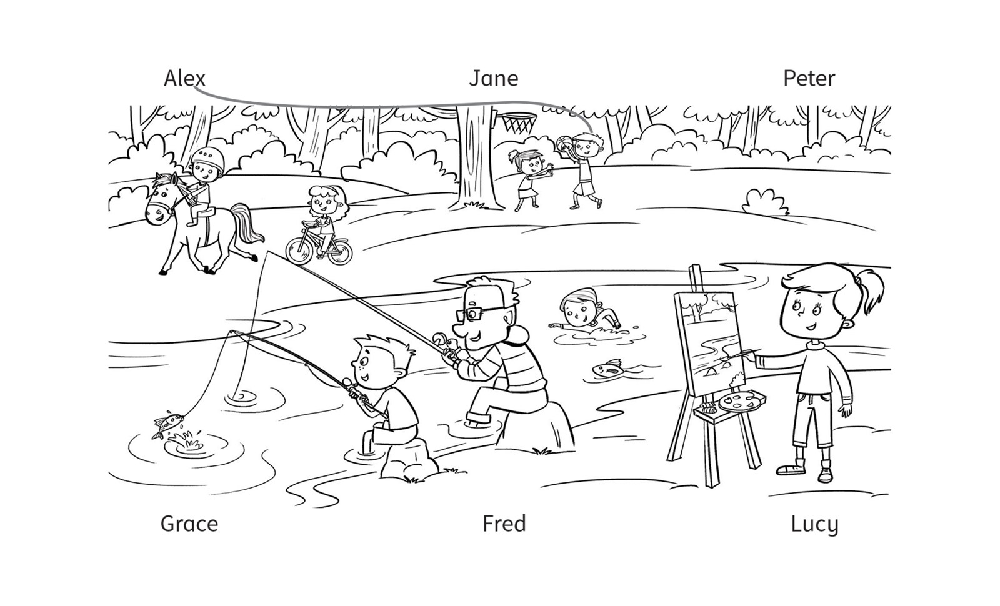

**[Vocabulary]{.underline}**

**1. Write the words. There is one example.   (one point each)**

~~guitar~~ \| ride \| play \| basketball \| tennis \| horse

1\. play the *[g]{.underline}* *[u]{.underline}* *[i]{.underline}*
*[t]{.underline}* *[a]{.underline}* *[r]{.underline}*

2\. \_ \_ \_ \_ a bike

3\. ride a \_ \_ \_ \_ \_

4\. play \_ \_ \_ \_ \_ \_

5\. \_ \_ \_ \_ football

6\. Play \_ \_ \_ \_ \_ \_ \_ \_ \_ \_

**2. Look and write the words. There is one example.   (one point
each)**

**3. Look. Write the words from Exercise 2. There is one example.   (one
point each)**

**[Grammar]{.underline}**

**4. Look and draw lines. There is one example.   (one point each)**

**5. Look and circle. There is one example.   (one point each)**

1\. Can you draw?      ✓      *[Yes, I can.]{.underline}*      No, I
can't.

2\. Can you play the guitar?      ✗      Yes, I can.      No, I can't.

3\. Can she play basketball?      ✗      Yes, she can.      No, she
can't.

4\. Can he ride a bike?      ✓      Yes, he can.      No, he can't.

5\. Can she ride a horse?      ✓      Yes, she can.      No, she can't.

6\. Can he swim?      ✗      Yes, he can.      No, he can't.

**[Listening]{.underline}**

**6. Listen and draw lines. There is one example.   (one point each)**

**7. Listen and tick or cross. There is one example.   (one point
each)**

**[Reading]{.underline}**

**8. Read. Circle *Yes* or *No*. There is one example.   (one point
each)**

1\. Grandfather can fish.      *[Yes]{.underline}*      No

2\. Grandmother can draw.      Yes      No

3\. Charlie's mother can play football.      Yes      No

4\. Ben can drive.      Yes      No

5\. Eva can play tennis.      Yes      No

6\. Charlie can swim.      Yes      No

