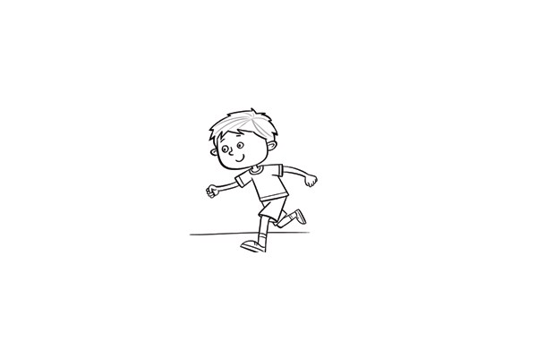
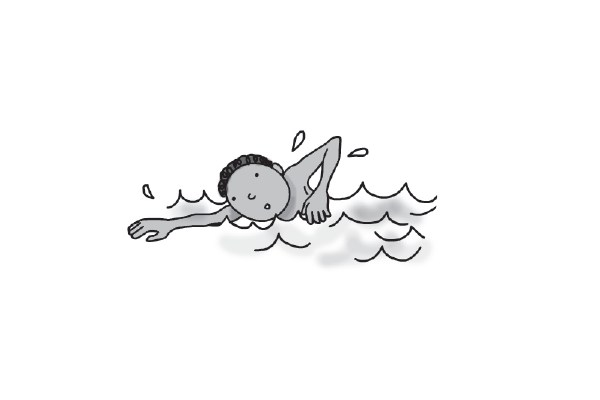
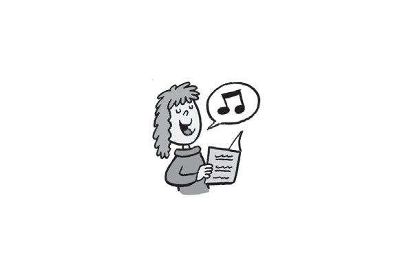
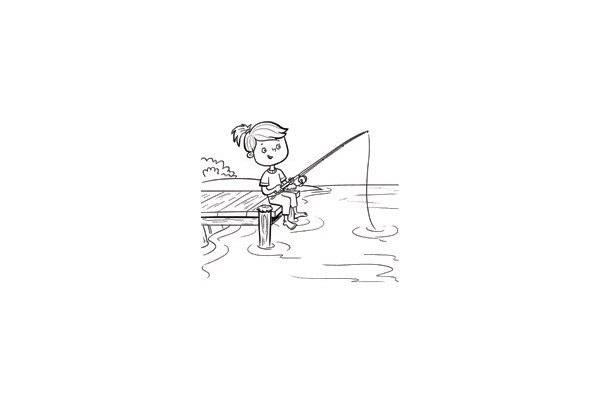
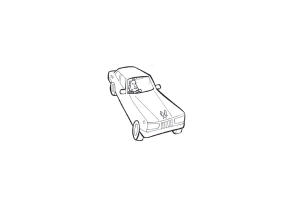
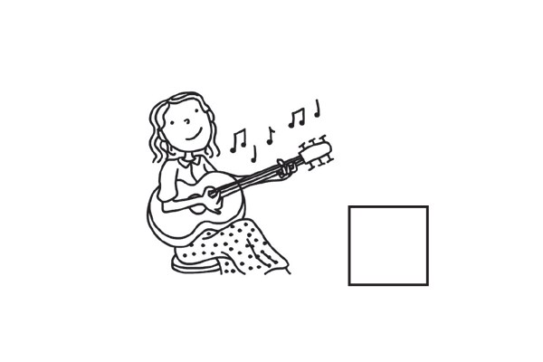
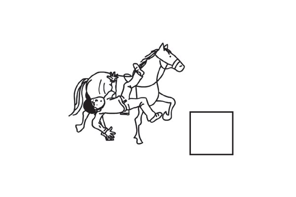
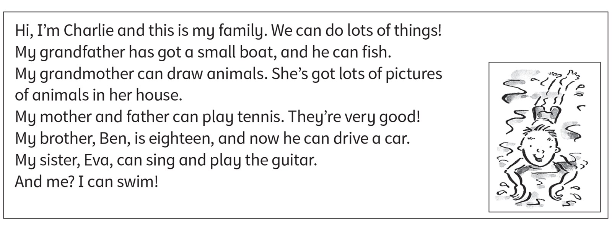

**[Vocabulary]{.underline}**

**1. Write the activities with *ride* and *play*. There is one
example.   (one point each)**

  ------------------------------------------------------------------------------------------------------------------------------------------------------------------------------------------------------------------- -- ---------------------------------------------------------------------------------------------------------------------------------------------------------------------------------------------------------------- -- ----------------------------------------------------------------------------------------------------------------------------------------------------------------------------------------------------------------
   1.            
  *[play the guitar]{.underline}*                                                                                                                                                                                        2. *ride a bike*                                                                                                                                                                                                    3. *ride a horse*

  ------------------------------------------------------------------------------------------------------------------------------------------------------------------------------------------------------------------- -- ---------------------------------------------------------------------------------------------------------------------------------------------------------------------------------------------------------------- -- ----------------------------------------------------------------------------------------------------------------------------------------------------------------------------------------------------------------

  ---------------------------------------------------------------------------------------------------------------------------------------------------------------------------------------------------------------- -- ---------------------------------------------------------------------------------------------------------------------------------------------------------------------------------------------------------------- -- ----------------------------------------------------------------------------------------------------------------------------------------------------------------------------------------------------------------
              
  4. *play tennis*                                                                                                                                                                                                    5. *play football*                                                                                                                                                                                                  6. *play basketball*

  ---------------------------------------------------------------------------------------------------------------------------------------------------------------------------------------------------------------- -- ---------------------------------------------------------------------------------------------------------------------------------------------------------------------------------------------------------------- -- ----------------------------------------------------------------------------------------------------------------------------------------------------------------------------------------------------------------

**2. Look and write the words. There is one example.   (one point
each)**

1\. r *[u]{.underline}* *[n]{.underline}*

2\. s \_ \_ \_

*swim*

3\. s \_ \_ \_

*sing*

4\. d \_ \_ \_

*draw*

5\. f \_ \_ \_

*fish*

6\. d \_ \_ \_ \_

*drive*

**3. Look. Write the words from Exercise 2. Then put the letters in
order. There is one example.   (one point each)**

1\. *[run]{.underline}* in the p *[a]{.underline}* *[r]{.underline}*
*[k]{.underline}* (rkap).

2\. \_\_\_\_\_\_\_\_\_\_ a p \_ \_ \_ \_ \_ \_ (erutcip)

*draw, picture*

3\. \_\_\_\_\_\_\_\_\_\_ a c \_ \_ (arc).

*drive, car*

4\. \_\_\_\_\_\_\_\_\_\_ in the s \_ \_ (eas).

*swim / fish, sea*

5\. \_\_\_\_\_\_\_\_\_\_ a s \_ \_ \_ (osng).

*sing, song*

6\. \_\_\_\_\_\_\_\_\_\_ in the w \_ \_ \_ \_ (awter).

*fish / swim, water*

**[Grammar]{.underline}**

**4. Write the numbers. Write *can* or *can't*. There is one
example.   (one point each)**

1\. She *[can't]{.underline}* play tennis.

2\. I \_\_\_\_\_\_\_\_\_\_ play football.

*a -- I can play football.*

3\. She \_\_\_\_\_\_\_\_\_\_ play the guitar.

*f -- She can play the guitar.*

4\. He \_\_\_\_\_\_\_\_\_\_ swim.

*c -- He can swim.*

5\. He \_\_\_\_\_\_\_\_\_\_ ride a horse.

*e -- He can't ride a horse.*

6\. He \_\_\_\_\_\_\_\_\_\_ ride a bike.

*b -- He can't ride a bike.*

**5. Look, read and write. There is one example.   (one point each)**

can \| can't \| I \| he \| she \| Yes \| No

  ------------------------------- --- -----------------------------------
  1\. Can you draw?      ✓            *[Yes, I can]{.underline}*

  ------------------------------- --- -----------------------------------

  ------------------------------- --- -----------------------------------
  2\. Can you play the                *No, I can't*
  guitar?      ✗                      

  ------------------------------- --- -----------------------------------

  ------------------------------- --- -----------------------------------
  3\. Can she play                    *No, she can't*
  basketball?      ✗                  

  ------------------------------- --- -----------------------------------

  ------------------------------- --- -----------------------------------
  4\. Can he ride a bike?      ✓      *Yes, he can*

  ------------------------------- --- -----------------------------------

  ------------------------------- --- -----------------------------------
  5\. Can she ride a                  *Yes, she can*
  horse?      ✓                       

  ------------------------------- --- -----------------------------------

  ------------------------------- --- -----------------------------------
  6\. Can he swim?      ✗             *No, he can't*

  ------------------------------- --- -----------------------------------

**[Listening]{.underline}**

**6. Listen and draw lines. There are two extra names. There is one
example.   (one point each)**

*2. Jane -- girl swimming*

*3. Peter -- boy fishing*

*4. Grace -- girl riding a bike*

*5. Fred -- boy riding horse*

*6. Lucy -- girl draw girl pictures*

**Audio script**

1

**Boy:** What can Alex do?

**Girl:** Alex can play basketball.

2

**Boy:** What can Jane do?

**Girl:** Jane can swim.

3

**Boy:** What can Peter do?

**Girl:** Peter can fish in the river. He fishes with his grandpa.

4

**Boy:** What can Grace do?

**Girl:** Grace can ride a bike.

5

**Boy:** What can Fred do?

**Girl:** Fred can ride a horse.

6

**Boy:** What can Lucy do?

**Girl:** Lucy can draw pictures.

**7. Listen and tick or cross. There are two extra pictures. There is
one example.   (one point each)**

*2. Hugo -- swim ✗, guitar ✓*

*3. Sue -- sing ✓, guitar ✗*

*4. Fred -- football ✓, swim ✓*

*5. Kim -- sing ✗, tennis ✗*

*6. Paul -- football ✗, guitar ✓*

**Audio script**

1

**Boy:** Hi, Lily. Can you play tennis?

**Lily:** Yes, I can.

**Boy:** Can you play football?

**Lily:** No, I can't.

2

**Girl:** Hi, Hugo. Can you swim?

**Hugo:** No, I can't.

**Girl:** Can you play the guitar?

**Hugo:** Yes, I can.

3

**Boy:** Hello, Sue. Can you sing?

**Sue:** Yes, I can.

**Boy:** Can you play the guitar?

**Sue:** No, I can't!

4

**Girl:** Hello, Fred. Can you play football?

**Fred:** Yes, I can.

**Girl:** Can you swim?

**Fred:** Yes, I can.

5

**Boy:** Hi, Kim. Can you sing?

**Kim:** No, I can't.

**Boy:** Can you play tennis?

**Kim:** No, I can't!

6

**Girl:** Hello, Paul. Can you play football?

**Paul:** No, I can't.

**Girl:** Can you play the guitar?

**Paul:** Yes, I can.

**[Reading]{.underline}**

**8. Read and write the answers. There is one example.   (one point
each)**

1\. What can grandfather do?   *[fish]{.underline}*

2\. What can grandmother draw?   \_\_\_\_\_\_\_\_\_\_

*animals*

3\. What can Charlie's mother play?   \_\_\_\_\_\_\_\_\_\_

*tennis*

4\. Who can drive?   \_\_\_\_\_\_\_\_\_\_

*Ben*

5\. What can Eva play?    the \_\_\_\_\_\_\_\_\_\_

*guitar*

6\. What can Charlie do?   \_\_\_\_\_\_\_\_\_\_

*swim*

