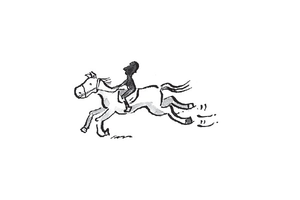
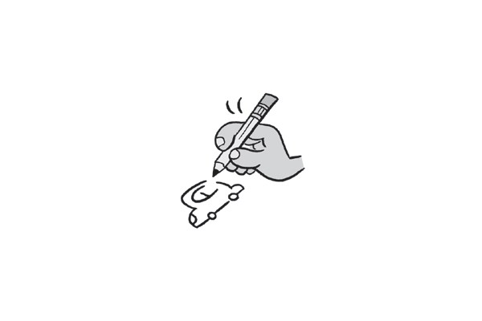
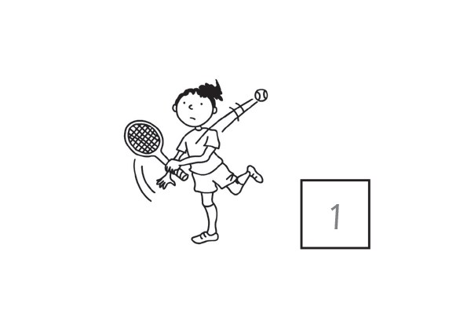
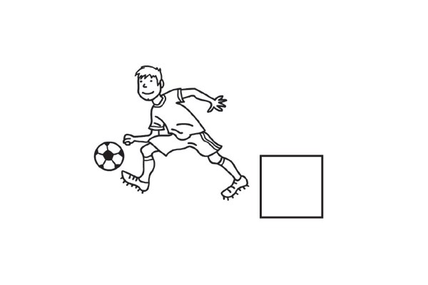
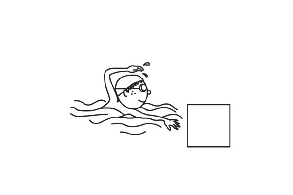
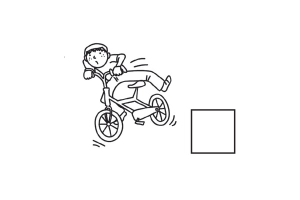
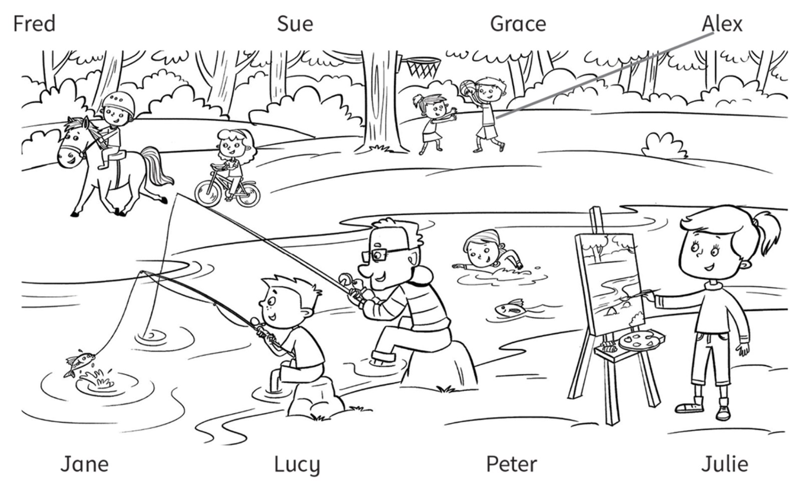
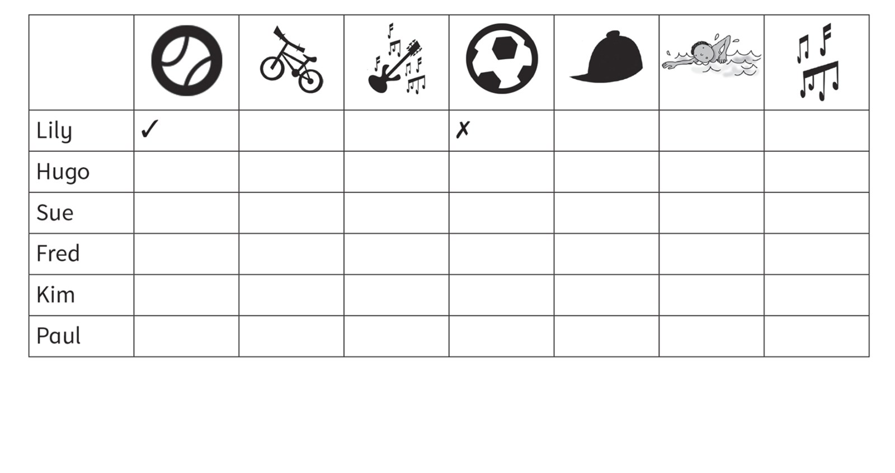

**[Vocabulary]{.underline}**

**1. Write the activities with *ride* and *play*. There is one
example.   (one point each)**

  ---------------------------------------------------------------------------------------------------------------------------------------------------------------------------------------------------------------------- -- ------------------------------------------------------------------------------------------------------------------------------------------------------------------------------------------------------------------- -- -------------------------------------------------------------------------------------------------------------------------------------------------------------------------------------------------------------------
   1.            
  *[play the guitar]{.underline}*                                                                                                                                                                                           2. \_\_\_\_\_\_\_\_\_\_\_\_\_\_\_                                                                                                                                                                                      3. \_\_\_\_\_\_\_\_\_\_\_\_\_\_\_

  ---------------------------------------------------------------------------------------------------------------------------------------------------------------------------------------------------------------------- -- ------------------------------------------------------------------------------------------------------------------------------------------------------------------------------------------------------------------- -- -------------------------------------------------------------------------------------------------------------------------------------------------------------------------------------------------------------------

  ------------------------------------------------------------------------------------------------------------------------------------------------------------------------------------------------------------------- -- ------------------------------------------------------------------------------------------------------------------------------------------------------------------------------------------------------------------- -- -------------------------------------------------------------------------------------------------------------------------------------------------------------------------------------------------------------------
              
  4. \_\_\_\_\_\_\_\_\_\_\_\_\_\_\_                                                                                                                                                                                      5. \_\_\_\_\_\_\_\_\_\_\_\_\_\_\_                                                                                                                                                                                      6. \_\_\_\_\_\_\_\_\_\_\_\_\_\_\_

  ------------------------------------------------------------------------------------------------------------------------------------------------------------------------------------------------------------------- -- ------------------------------------------------------------------------------------------------------------------------------------------------------------------------------------------------------------------- -- -------------------------------------------------------------------------------------------------------------------------------------------------------------------------------------------------------------------

**2. Look and write the words. There is one example.   (one point
each)**

1\. r *[u]{.underline}* *[n]{.underline}*

2\. s \_ \_ \_

3\. s \_ \_ \_

4\. d \_ \_ \_

5\. f \_ \_ \_

6\. d \_ \_ \_ \_

**3. Look. Write the words from Exercise 2. Then put the letters in
order. There is one example.   (one point each)**

1\. *[run]{.underline}* in the p *[a]{.underline}* *[r]{.underline}*
*[k]{.underline}* (rkap).

2\. \_\_\_\_\_\_\_\_\_\_ a p \_ \_ \_ \_ \_ \_ (erutcip)

3\. \_\_\_\_\_\_\_\_\_\_ a c \_ \_ (arc).

4\. \_\_\_\_\_\_\_\_\_\_ in the s \_ \_ (eas).

5\. \_\_\_\_\_\_\_\_\_\_ a s \_ \_ \_ (osng).

6\. \_\_\_\_\_\_\_\_\_\_ in the w \_ \_ \_ \_ (awter).

**[Grammar]{.underline}**

**4. Write the numbers. Write *can* or *can't*. There is one
example.   (one point each)**

1\. She *[can't]{.underline}* play tennis.

2\. I \_\_\_\_\_\_\_\_\_\_ play football.

3\. She \_\_\_\_\_\_\_\_\_\_ play the guitar.

4\. He \_\_\_\_\_\_\_\_\_\_ swim.

5\. He \_\_\_\_\_\_\_\_\_\_ ride a horse.

6\. He \_\_\_\_\_\_\_\_\_\_ ride a bike.

**5. Look, read and write. There is one example.   (one point each)**

can \| can't \| I \| he \| she \| Yes \| No

  ------------------------------- --- -----------------------------------
  1\. Can you draw?      ✓            *[Yes, I can]{.underline}*

  ------------------------------- --- -----------------------------------

  ------------------------------- --- -----------------------------------
  2\. Can you play the                
  guitar?      ✗                      

  ------------------------------- --- -----------------------------------

  ------------------------------- --- -----------------------------------
  3\. Can she play                    
  basketball?      ✗                  

  ------------------------------- --- -----------------------------------

  ------------------------------- --- -----------------------------------
  4\. Can he ride a bike?      ✓      

  ------------------------------- --- -----------------------------------

  ------------------------------- --- -----------------------------------
  5\. Can she ride a                  
  horse?      ✓                       

  ------------------------------- --- -----------------------------------

  ------------------------------- --- -----------------------------------
  6\. Can he swim?      ✗             

  ------------------------------- --- -----------------------------------

**[Listening]{.underline}**

**6. Listen and draw lines. There are two extra names. There is one
example.   (one point each)**

**7. Listen and tick or cross. There are two extra pictures. There is
one example.   (one point each)**

**[Reading]{.underline}**

**8. Read and write the answers. There is one example.   (one point
each)**

1\. What can grandfather do?   *[fish]{.underline}*

2\. What can grandmother draw?   \_\_\_\_\_\_\_\_\_\_

3\. What can Charlie's mother play?   \_\_\_\_\_\_\_\_\_\_

4\. Who can drive?   \_\_\_\_\_\_\_\_\_\_

5\. What can Eva play?    the \_\_\_\_\_\_\_\_\_\_

6\. What can Charlie do?   \_\_\_\_\_\_\_\_\_\_

