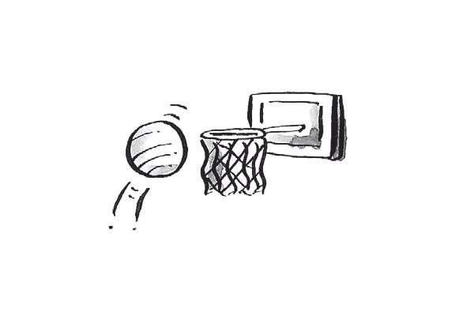
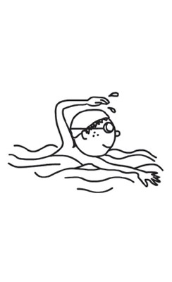
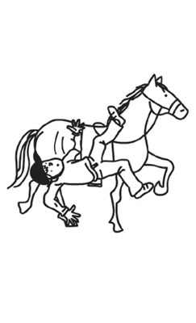
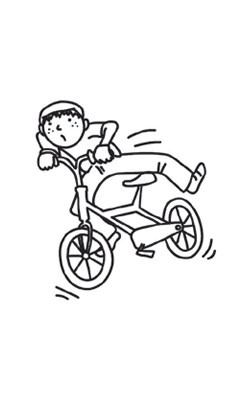
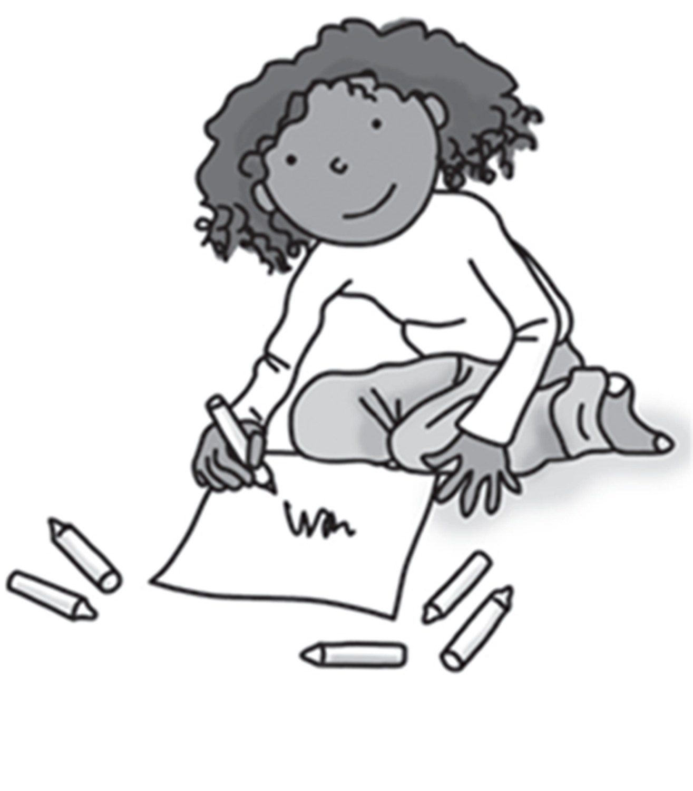
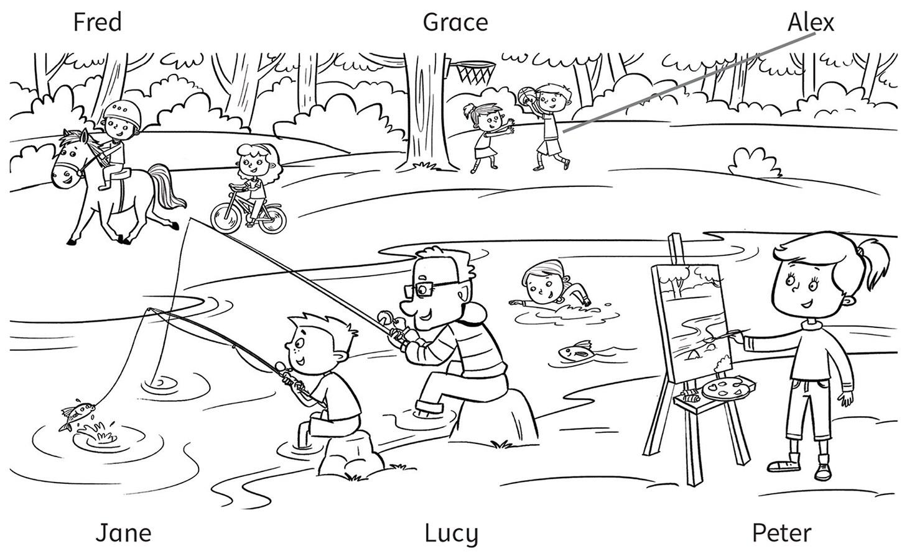
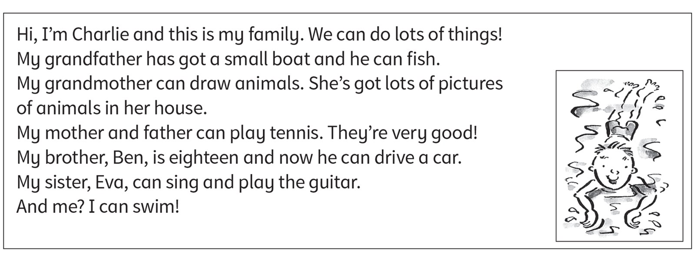

**[Vocabulary]{.underline}**

**1. Write the words. There is one example.   (one point each)**

~~guitar~~ \| ride \| play \| basketball \| tennis \| horse

  ------------------------------------------------------------------------------------------------------------------------------------------------------------------------------------------------------------------- -- ---------------------------------------------------------------------------------------------------------------------------------------------------------------------------------------------------------------- -- ----------------------------------------------------------------------------------------------------------------------------------------------------------------------------------------------------------------
   1.            
  play the *[guitar]{.underline}*                                                                                                                                                                                        2. *ride* a bike                                                                                                                                                                                                    3. ride a *horse*

  ------------------------------------------------------------------------------------------------------------------------------------------------------------------------------------------------------------------- -- ---------------------------------------------------------------------------------------------------------------------------------------------------------------------------------------------------------------- -- ----------------------------------------------------------------------------------------------------------------------------------------------------------------------------------------------------------------

  ---------------------------------------------------------------------------------------------------------------------------------------------------------------------------------------------------------------- -- ---------------------------------------------------------------------------------------------------------------------------------------------------------------------------------------------------------------- -- ----------------------------------------------------------------------------------------------------------------------------------------------------------------------------------------------------------------
              
  4. play *tennis*                                                                                                                                                                                                    5. *play* footaball                                                                                                                                                                                                 6. play *basketball*

  ---------------------------------------------------------------------------------------------------------------------------------------------------------------------------------------------------------------- -- ---------------------------------------------------------------------------------------------------------------------------------------------------------------------------------------------------------------- -- ----------------------------------------------------------------------------------------------------------------------------------------------------------------------------------------------------------------

**2. Look and write the words. Draw lines. There is one example.   (one
point each)**

*2. swim*

*3. sing*

*4. draw*

*5. fish*

*6. drive*

**3. Look. Write the words from Exercise 2. There is one example.   (one
point each)**

1\. *[run]{.underline}* in the park

2\. *draw* a picture

3\. *drive* a car.

4\. *swim / fish* in the sea.

5\. *sing* a song.

6\. *fish / swim* in the water.

**[Grammar]{.underline}**

**4. Look and circle. There is one example.   (one point each)**

1\. I *[can]{.underline}* / *can't* play football.

2\. He *can* / *can't* swim.

*can*

3\. He *can* / *can't* ride a horse.

*can't*

4\. He *can* / *can't* ride a bike.

*can't*

5\. She *can* / *can't* play tennis.

*can't*

6\. She *can* / *can't* play the guitar.

*can*

**5. Look, read and write. There is one example.   (one point each)**

~~Yes, I can.~~ \| Yes, he can. \| Yes, she can. \| No, I can't. \| No,
he can't. \| No, she can't.

  ------------------------------- --- -----------------------------------
  1\. Can you draw?                   *✓    [Yes, I can]{.underline}.*

  ------------------------------- --- -----------------------------------

  ------------------------------- --- -----------------------------------
  2\. Can you play the guitar?        *✗ No, I can't.*

  ------------------------------- --- -----------------------------------

  ------------------------------- --- -----------------------------------
  3\. Can she play basketball?        *✗    No, she can't.*

  ------------------------------- --- -----------------------------------

  ------------------------------- --- -----------------------------------
  4\. Can he ride a bike?             *✓    Yes, he can.*

  ------------------------------- --- -----------------------------------

  ------------------------------- --- -----------------------------------
  5\. Can she ride a horse?           *✓    Yes, she can.*

  ------------------------------- --- -----------------------------------

  ------------------------------- --- -----------------------------------
  6\. Can he swim?                    *✗    No, he can't.*

  ------------------------------- --- -----------------------------------

**[Listening]{.underline}**

**6. Listen and draw lines. There is one example.   (one point each)**

*2. Jane -- girl swimming*

*3. Peter -- boy fishing*

*4. Grace -- girl riding a bike*

*5. Fred -- riding a horse*

*6. Lucy -- drawing pictures*

**Audio script**

1

**Boy:** What can Alex do?

**Girl:** Alex can play basketball.

2

**Boy:** What can Jane do?

**Girl:** Jane can swim.

3

**Boy:** What can Peter do?

**Girl:** Peter can fish in the river. He fishes with his grandpa.

4

**Boy:** What can Grace do?

**Girl:** Grace can ride a bike.

5

**Boy:** What can Fred do?

**Girl:** Fred can ride a horse.

6

**Boy:** What can Lucy do?

**Girl:** Lucy can draw pictures.

**7. Listen and tick or cross. There is one example.   (one point
each)**

*2. Hugo -- swim ✗, guitar ✓*

*3. Sue -- sing ✓, guitar ✗*

*4. Fred -- football ✓, swim ✓*

*5. Kim -- sing ✗, tennis ✗*

*6. Paul -- football ✗, guitar ✓*

**Audio script**

1

**Boy:** Hi, Lily. Can you play tennis?

**Lily:** Yes, I can.

**Boy:** Can you play football?

**Lily:** No, I can't.

2

**Girl:** Hi, Hugo. Can you swim?

**Hugo:** No, I can't.

**Girl:** Can you play the guitar?

**Hugo:** Yes, I can.

3

**Boy:** Hello, Sue. Can you sing?

**Sue:** Yes, I can.

**Boy:** Can you play the guitar?

**Sue:** No, I can't!

4

**Girl:** Hello, Fred. Can you play football?

**Fred:** Yes, I can.

**Girl:** Can you swim?

**Fred:** Yes, I can.

5

**Boy:** Hi, Kim. Can you sing?

**Kim:** No, I can't.

**Boy:** Can you play tennis?

**Kim:** No, I can't!

6

**Girl:** Hello, Paul. Can you play football?

**Paul:** No, I can't.

**Girl:** Can you play the guitar?

**Paul:** Yes, I can.

**[Reading]{.underline}**

**8. Read and complete the words. There is one example.   (one point
each)**

1\. What can grandfather do? f *[i]{.underline}* *[s]{.underline}*
*[h]{.underline}*

2\. What can grandmother draw? a \_ \_ \_ \_ \_ s

*animals*

3\. What can Charlie's mother play? t \_ \_ \_ \_ s

*tennis*

4\. Who can drive? B \_ \_

*Ben*

5\. What can Eva play? the g \_ \_ \_ \_ \_

*guitar*

6\. What can Charlie do? s \_ \_ \_

*swim*

