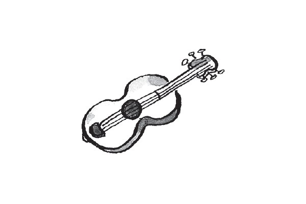
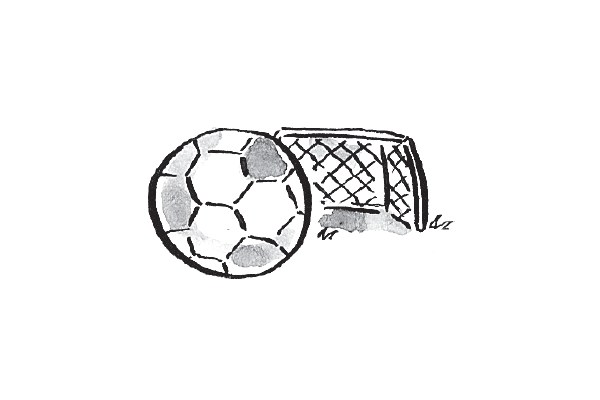
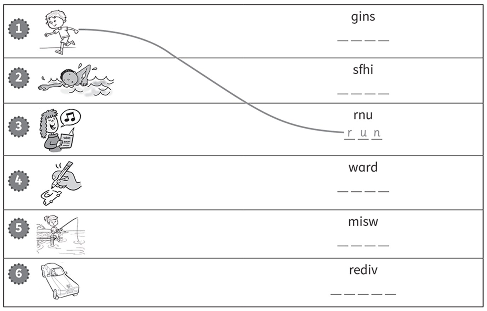
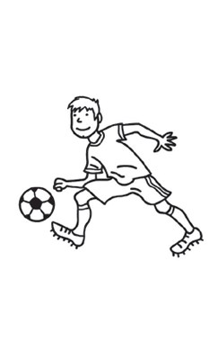
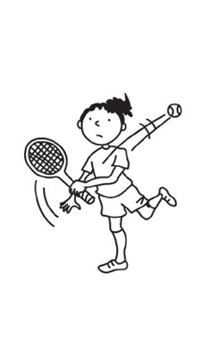
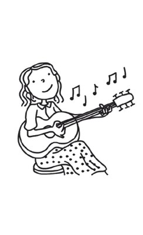
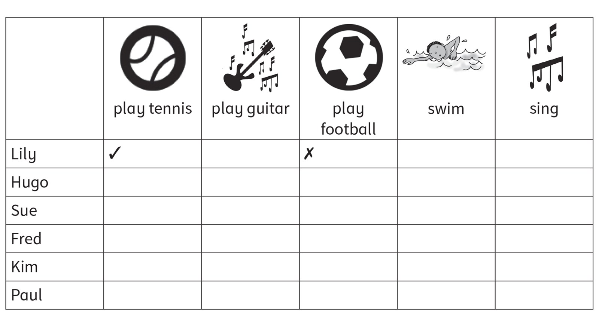

**[Vocabulary]{.underline}**

**1. Write the words. There is one example.   (one point each)**

~~guitar~~ \| ride \| play \| basketball \| tennis \| horse

  ---------------------------------------------------------------------------------------------------------------------------------------------------------------------------------------------------------------------- -- ------------------------------------------------------------------------------------------------------------------------------------------------------------------------------------------------------------------- -- -------------------------------------------------------------------------------------------------------------------------------------------------------------------------------------------------------------------
   1.            
  play the *[guitar]{.underline}*                                                                                                                                                                                           2. \_\_\_\_\_\_\_\_\_\_ a bike                                                                                                                                                                                         3. ride a \_\_\_\_\_\_\_\_\_\_

  ---------------------------------------------------------------------------------------------------------------------------------------------------------------------------------------------------------------------- -- ------------------------------------------------------------------------------------------------------------------------------------------------------------------------------------------------------------------- -- -------------------------------------------------------------------------------------------------------------------------------------------------------------------------------------------------------------------

  ------------------------------------------------------------------------------------------------------------------------------------------------------------------------------------------------------------------- -- ------------------------------------------------------------------------------------------------------------------------------------------------------------------------------------------------------------------- -- -------------------------------------------------------------------------------------------------------------------------------------------------------------------------------------------------------------------
              
  4. play \_\_\_\_\_\_\_\_\_\_                                                                                                                                                                                           5. \_\_\_\_\_\_\_\_\_\_ footaball                                                                                                                                                                                      6. play \_\_\_\_\_\_\_\_\_\_

  ------------------------------------------------------------------------------------------------------------------------------------------------------------------------------------------------------------------- -- ------------------------------------------------------------------------------------------------------------------------------------------------------------------------------------------------------------------- -- -------------------------------------------------------------------------------------------------------------------------------------------------------------------------------------------------------------------

**2. Look and write the words. Draw lines. There is one example.   (one
point each)**

**3. Look. Write the words from Exercise 2. There is one example.   (one
point each)**

1\. *[run]{.underline}* in the park

2\. \_\_\_\_\_\_\_\_\_\_\_\_\_\_\_\_\_\_ a picture

3\. \_\_\_\_\_\_\_\_\_\_\_\_\_\_\_\_\_\_ a car.

4\. \_\_\_\_\_\_\_\_\_\_\_\_\_\_\_\_\_\_ in the sea.

5\. \_\_\_\_\_\_\_\_\_\_\_\_\_\_\_\_\_\_ a song.

6\. \_\_\_\_\_\_\_\_\_\_\_\_\_\_\_\_\_\_ in the water.

**[Grammar]{.underline}**

**4. Look and circle. There is one example.   (one point each)**

1\. I *[can]{.underline}* / *can't* play football.

2\. He *can* / *can't* swim.

3\. He *can* / *can't* ride a horse.

4\. He *can* / *can't* ride a bike.

5\. She *can* / *can't* play tennis.

6\. She *can* / *can't* play the guitar.

**5. Look, read and write. There is one example.   (one point each)**

~~Yes, I can.~~ \| Yes, he can. \| Yes, she can. \| No, I can't. \| No,
he can't. \| No, she can't.

  ------------------------------- --- -----------------------------------
  1\. Can you draw?                   ✓    *[Yes, I can]{.underline}*.

  ------------------------------- --- -----------------------------------

  ------------------------------- --- -----------------------------------
  2\. Can you play the guitar?        ✗ \_\_\_\_\_\_\_\_\_\_\_\_

  ------------------------------- --- -----------------------------------

  ------------------------------- --- -----------------------------------
  3\. Can she play basketball?        ✗    \_\_\_\_\_\_\_\_\_\_\_\_

  ------------------------------- --- -----------------------------------

  ------------------------------- --- -----------------------------------
  4\. Can he ride a bike?             ✓    \_\_\_\_\_\_\_\_\_\_\_\_

  ------------------------------- --- -----------------------------------

  ------------------------------- --- -----------------------------------
  5\. Can she ride a horse?           ✓    \_\_\_\_\_\_\_\_\_\_\_\_

  ------------------------------- --- -----------------------------------

  ------------------------------- --- -----------------------------------
  6\. Can he swim?                    ✗    \_\_\_\_\_\_\_\_\_\_\_\_

  ------------------------------- --- -----------------------------------

**[Listening]{.underline}**

**6. Listen and draw lines. There is one example.   (one point each)**

**7. Listen and tick or cross. There is one example.   (one point
each)**

**[Reading]{.underline}**

**8. Read and complete the words. There is one example.   (one point
each)**

1\. What can grandfather do? f *[i]{.underline}* *[s]{.underline}*
*[h]{.underline}*

2\. What can grandmother draw? a \_ \_ \_ \_ \_ s

3\. What can Charlie's mother play? t \_ \_ \_ \_ s

4\. Who can drive? B \_ \_

5\. What can Eva play? the g \_ \_ \_ \_ \_

6\. What can Charlie do? s \_ \_ \_

