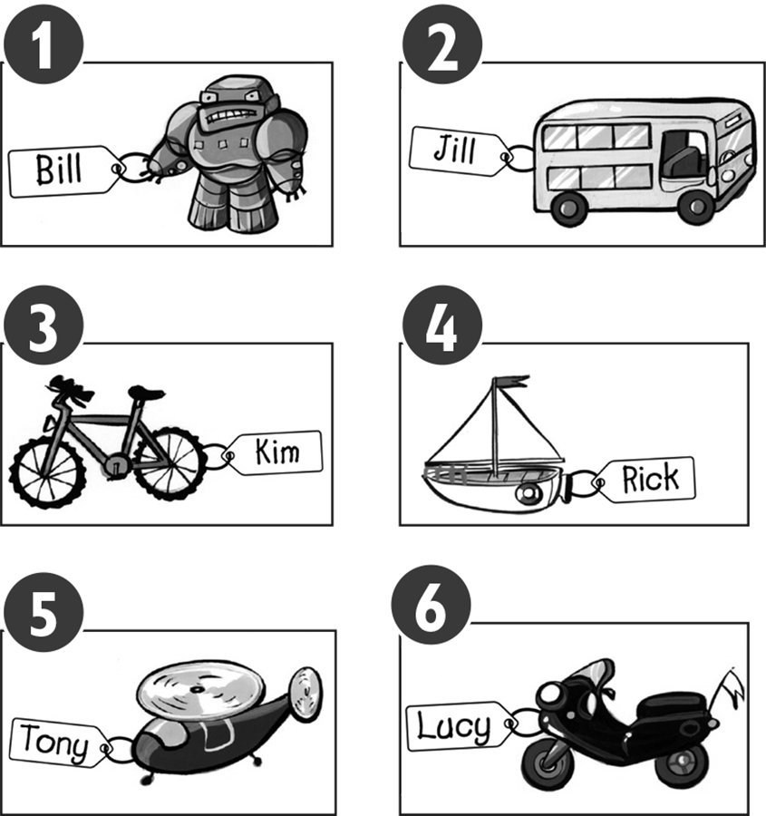
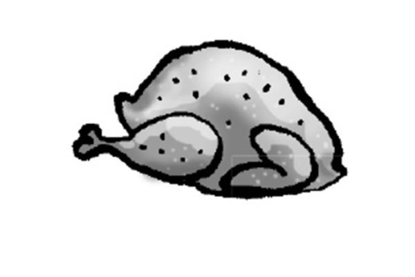
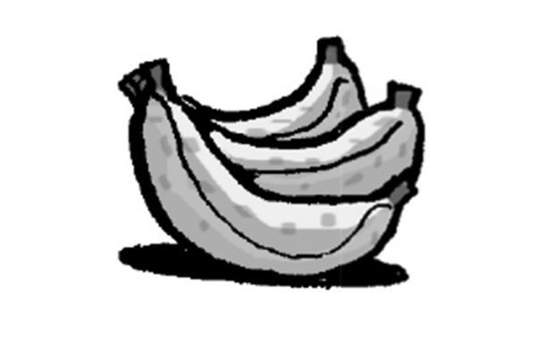
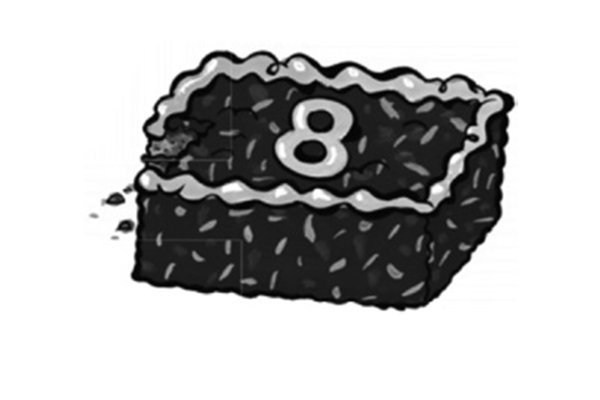
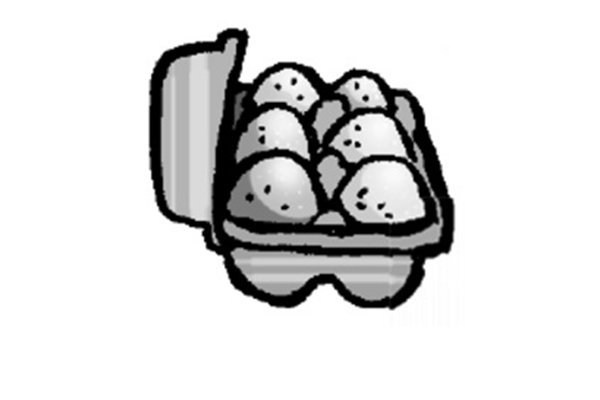
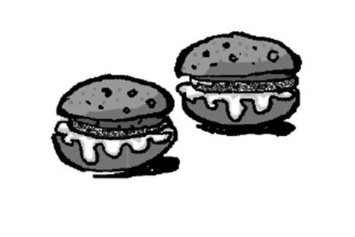
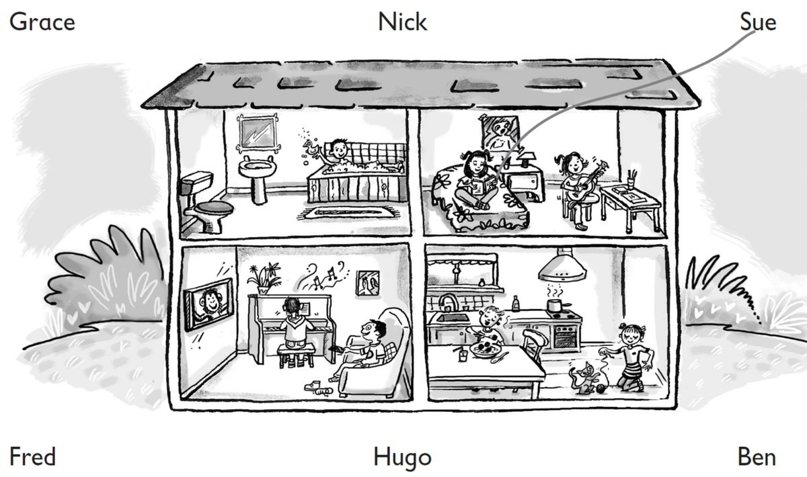
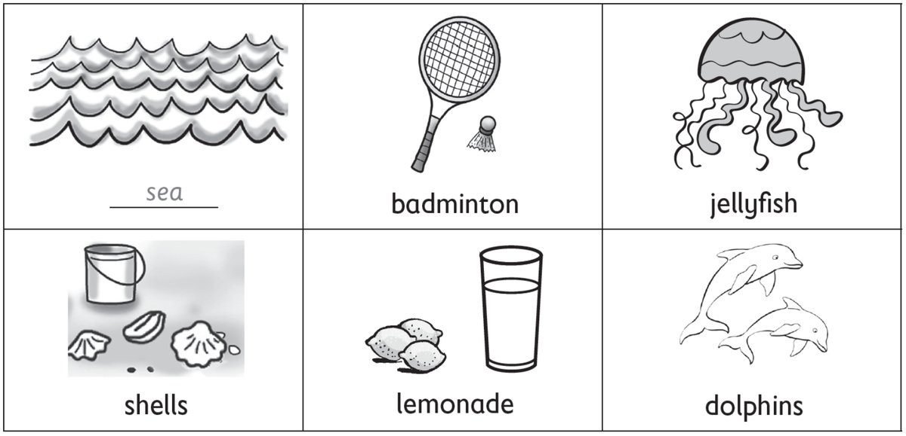

**[Vocabulary]{.underline}**

**1. Look and write the words. There is one example.   (one point
each)**

1\. This is *[Bill's]{.underline}* robot.

2\. This is *Jill's* bus.

3\. This is *Kim's* bike.

4\. This is *Rick's* boat.

5\. This is *Tony's* helicopter.

6\. This is *Lucy's* motorbike.

**2. Look, read and tick. There is one example.   (one point each)**

1\. Chickens, cows and donkeys live here.

    farm   ✓          pet shop   ⬜

2\. People drink coffee and eat here.

    street   ✓          cafe   ⬜

*café*

3\. People live in this.

    shop   ✓          flat   ⬜

*flat*

4\. Children play here.

    park   ✓          hospital   ⬜

*park*

5\. There are lots of shops and cars here.

    town   ✓          farm   ⬜

*town*

6\. People sleep here.

    bathroom   ✓          bedroom   ⬜

*bedroom*

**[Grammar]{.underline}**

**3. Look. Circle picture 1 or picture 2. There is one example.   (one
point each)**

  ------------------------------- --- -------------------------------
  1\. Three cars are under the        1        2
  chair.                              

  ------------------------------- --- -------------------------------

*2*

  ------------------------------- --- -------------------------------
  2\. The lamp is between the bed     1        2
  and the cupboard.                   

  ------------------------------- --- -------------------------------

*1*

  ------------------------------- --- -------------------------------
  3\. A mirror is on the wall.        1        2

  ------------------------------- --- -------------------------------

*1*

  ------------------------------- --- -------------------------------
  4\. The rug is under the bed.       1        2

  ------------------------------- --- -------------------------------

*2*

  ------------------------------- --- -------------------------------
  5\. A watch is next to the          1        2
  lamp.                               

  ------------------------------- --- -------------------------------

*1*

  ------------------------------- --- -------------------------------
  6\. A cat is sitting in front       1        2
  of the bookcase.                    

  ------------------------------- --- -------------------------------

*2*

**4. Read and answer. Write *It's* or *They're* and the words. There is
one example.   (one point each)**

a cake \| burgers \| bananas \| ~~chicken~~ \| eggs \| rice

  ------------------------------------------------------------------------------------------------------------------------------------------------------------------------------------------------------------------ -- --------------------------------------------------------------------------------------------------------------------------------------------------------------------------------------------------------------- -- ---------------------------------------------------------------------------------------------------------------------------------------------------------------------------------------------------------------
   1.            
  What's this? *[It's chicken.]{.underline}*                                                                                                                                                                            2. What's this? *It's rice*                                                                                                                                                                                        3. What are these? *They're bananas*

  ------------------------------------------------------------------------------------------------------------------------------------------------------------------------------------------------------------------ -- --------------------------------------------------------------------------------------------------------------------------------------------------------------------------------------------------------------- -- ---------------------------------------------------------------------------------------------------------------------------------------------------------------------------------------------------------------

  --------------------------------------------------------------------------------------------------------------------------------------------------------------------------------------------------------------- -- --------------------------------------------------------------------------------------------------------------------------------------------------------------------------------------------------------------- -- ---------------------------------------------------------------------------------------------------------------------------------------------------------------------------------------------------------------
              
  4. What's this? *It's a cake*                                                                                                                                                                                      5. What are these? *They're eggs*                                                                                                                                                                                  6. What are these? *They're burgers*

  --------------------------------------------------------------------------------------------------------------------------------------------------------------------------------------------------------------- -- --------------------------------------------------------------------------------------------------------------------------------------------------------------------------------------------------------------- -- ---------------------------------------------------------------------------------------------------------------------------------------------------------------------------------------------------------------

**5. Read and write. There is one example.   (one point each)**

reading \| swimming \| playing table tennis \| painting \| fishing \|
~~playing hockey~~

1\. He's *[playing hockey]{.underline}*.

2\. She's \_\_\_\_\_\_\_\_\_\_\_\_\_\_\_\_\_\_\_\_\_\_\_\_\_\_.

*reading*

3\. They're \_\_\_\_\_\_\_\_\_\_\_\_\_\_\_\_\_\_\_\_\_\_\_\_\_\_.

*swimming*

4\. She's \_\_\_\_\_\_\_\_\_\_\_\_\_\_\_\_\_\_\_\_\_\_\_\_\_\_.

*painting*

5\. He's \_\_\_\_\_\_\_\_\_\_\_\_\_\_\_\_\_\_\_\_\_\_\_\_\_\_.

*fishing*

6\. We're \_\_\_\_\_\_\_\_\_\_\_\_\_\_\_\_\_\_\_\_\_\_\_\_\_\_.

*playing table tennis*

**[Listening]{.underline}**

**6. Listen and colour. There is one example.   (one point each)**

*2. girl's hat -- green*

*3. (Mummy) woman's T-shirt -- yellow*

*4. (Daddy) man's T-shirt -- purple*

*5. shells -- blue*

*6. tree -- brown and green*

**Audio script**

1\. The bird is grey.

2\. The girl's hat is green.

3\. Mummy's T-shirt is yellow.

4\. Daddy's wearing a purple T-shirt.

5\. The shells are blue.

6\. The tree is brown and green.

**7. Listen and draw lines. There is one example.   (one point each)**

*2. Ben -- sofa, watching TV*

*3. Fred -- bath*

*4. Grace -- guitar, bedroom*

*5. Nick -- eating, kitchen*

*6. Hugo -- playing the piano, living room*

**Audio script**

1\. Sue's got a book. She's reading on the bed.

2\. Ben's sitting on the sofa. He's watching TV.

3\. Fred's got a duck. He's in the bath.

4\. Grace has got a guitar. She's playing it in the bedroom.

5\. Nick's eating meatballs. He's in the kitchen.

6\. Hugo loves playing the piano. He's in the living room.

**[Reading]{.underline}**

**8. Read and write the words. There is one example.   (one point
each)**

Hi, I'm Bill. Today we are driving to the beach. I love jumping and
swimming in the (1) *[sea]{.underline}*. One day I want to swim with (2)
*dolphins*! They're beautiful, and they're my favourite animal.

Sometimes I can see big lizards on the beach and sometimes pink (3)
*jellyfish* in the water, but I don't like those!

My sister likes sitting on the sand and playing with (4) *shells*.

My brother and my dad like playing (5) *badminton* or flying their
kites.

There is a small café next to the beach, and sometimes we go there to
get a (6) *lemonade* or an ice cream before we go home to the city.

