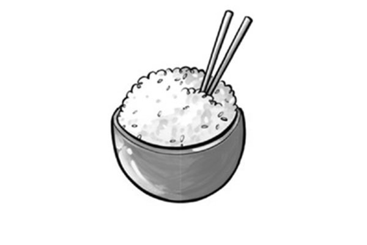
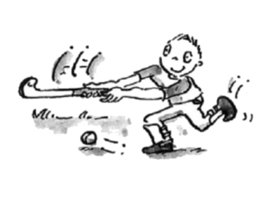
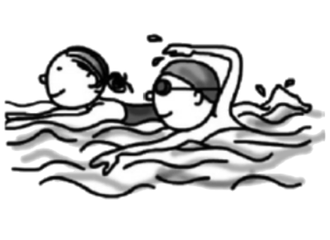
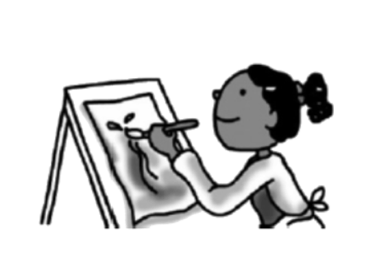
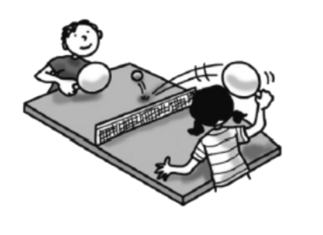
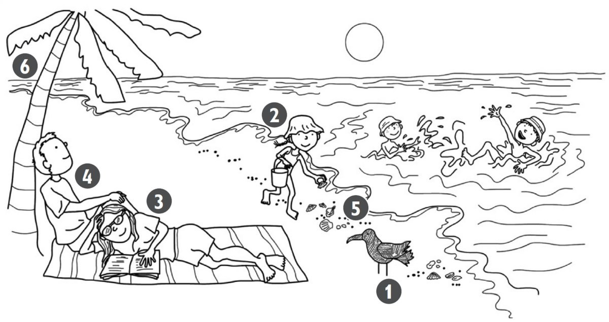

**[Vocabulary]{.underline}**

**1. Look and write the words. There is one example.   (one point
each)**

1\. This is *[Bill's]{.underline}* robot.

2\. This is \_\_\_\_\_\_\_\_\_\_\_\_\_ bus.

3\. This is \_\_\_\_\_\_\_\_\_\_\_\_\_ bike.

4\. This is \_\_\_\_\_\_\_\_\_\_\_\_\_ boat.

5\. This is \_\_\_\_\_\_\_\_\_\_\_\_\_ helicopter.

6\. This is \_\_\_\_\_\_\_\_\_\_\_\_\_ motorbike.

**2. Look, read and tick. There is one example.   (one point each)**

1\. Chickens, cows and donkeys live here.

    farm   ✓          pet shop   ⬜

2\. People drink coffee and eat here.

    street   ✓          cafe   ⬜

3\. People live in this.

    shop   ✓          flat   ⬜

4\. Children play here.

    park   ✓          hospital   ⬜

5\. There are lots of shops and cars here.

    town   ✓          farm   ⬜

6\. People sleep here.

    bathroom   ✓          bedroom   ⬜

**[Grammar]{.underline}**

**3. Look. Circle picture 1 or picture 2. There is one example.   (one
point each)**

  ------------------------------- --- -------------------------------
  1\. Three cars are under the        1        2
  chair.                              

  ------------------------------- --- -------------------------------

  ------------------------------- --- -------------------------------
  2\. The lamp is between the bed     1        2
  and the cupboard.                   

  ------------------------------- --- -------------------------------

  ------------------------------- --- -------------------------------
  3\. A mirror is on the wall.        1        2

  ------------------------------- --- -------------------------------

  ------------------------------- --- -------------------------------
  4\. The rug is under the bed.       1        2

  ------------------------------- --- -------------------------------

  ------------------------------- --- -------------------------------
  5\. A watch is next to the          1        2
  lamp.                               

  ------------------------------- --- -------------------------------

  ------------------------------- --- -------------------------------
  6\. A cat is sitting in front       1        2
  of the bookcase.                    

  ------------------------------- --- -------------------------------

**4. Read and answer. Write *It's* or *They're* and the words. There is
one example.   (one point each)**

a cake \| burgers \| bananas \| ~~chicken~~ \| eggs \| rice

  --------------------------------------------------------------------------------------------------------------------------------------------------------------------------------------------------------------------- -- ------------------------------------------------------------------------------------------------------------------------------------------------------------------------------------------------------------------ -- ------------------------------------------------------------------------------------------------------------------------------------------------------------------------------------------------------------------
   1.            
  What's this? *[It's chicken.]{.underline}*                                                                                                                                                                               2. What's this? \_\_\_\_\_\_\_\_\_\_\_\_\_\_\_                                                                                                                                                                        3. What are these? \_\_\_\_\_\_\_\_\_\_\_\_\_\_\_

  --------------------------------------------------------------------------------------------------------------------------------------------------------------------------------------------------------------------- -- ------------------------------------------------------------------------------------------------------------------------------------------------------------------------------------------------------------------ -- ------------------------------------------------------------------------------------------------------------------------------------------------------------------------------------------------------------------

  ------------------------------------------------------------------------------------------------------------------------------------------------------------------------------------------------------------------ -- ------------------------------------------------------------------------------------------------------------------------------------------------------------------------------------------------------------------ -- ------------------------------------------------------------------------------------------------------------------------------------------------------------------------------------------------------------------
              
  4. What's this? \_\_\_\_\_\_\_\_\_\_\_\_\_\_\_                                                                                                                                                                        5. What are these? \_\_\_\_\_\_\_\_\_\_\_\_\_\_\_                                                                                                                                                                     6. What are these? \_\_\_\_\_\_\_\_\_\_\_\_\_\_\_

  ------------------------------------------------------------------------------------------------------------------------------------------------------------------------------------------------------------------ -- ------------------------------------------------------------------------------------------------------------------------------------------------------------------------------------------------------------------ -- ------------------------------------------------------------------------------------------------------------------------------------------------------------------------------------------------------------------

**5. Read and write. There is one example.   (one point each)**

reading \| swimming \| playing table tennis \| painting \| fishing \|
~~playing hockey~~

1\. He's *[playing hockey]{.underline}*.

2\. She's \_\_\_\_\_\_\_\_\_\_\_\_\_\_\_\_\_\_\_\_\_\_\_\_\_\_.

3\. They're \_\_\_\_\_\_\_\_\_\_\_\_\_\_\_\_\_\_\_\_\_\_\_\_\_\_.

4\. She's \_\_\_\_\_\_\_\_\_\_\_\_\_\_\_\_\_\_\_\_\_\_\_\_\_\_.

5\. He's \_\_\_\_\_\_\_\_\_\_\_\_\_\_\_\_\_\_\_\_\_\_\_\_\_\_.

6\. We're \_\_\_\_\_\_\_\_\_\_\_\_\_\_\_\_\_\_\_\_\_\_\_\_\_\_.

**[Listening]{.underline}**

**6. Listen and colour. There is one example.   (one point each)**

**7. Listen and draw lines. There is one example.   (one point each)**

**[Reading]{.underline}**

**8. Read and write the words. There is one example.   (one point
each)**

Hi, I'm Bill. Today we are driving to the beach. I love jumping and
swimming in the (1) *[sea]{.underline}*. One day I want to swim with (2)
\_\_\_\_\_\_\_\_\_\_\_\_\_\_\_\_! They're beautiful, and they're my
favourite animal.

Sometimes I can see big lizards on the beach and sometimes pink (3)
\_\_\_\_\_\_\_\_\_\_\_\_\_\_\_\_ in the water, but I don't like those!

My sister likes sitting on the sand and playing with (4)
\_\_\_\_\_\_\_\_\_\_\_\_\_\_\_\_.

My brother and my dad like playing (5) \_\_\_\_\_\_\_\_\_\_\_\_\_\_\_\_
or flying their kites.

There is a small café next to the beach, and sometimes we go there to
get a (6) \_\_\_\_\_\_\_\_\_\_\_\_\_\_\_\_ or an ice cream before we go
home to the city.

