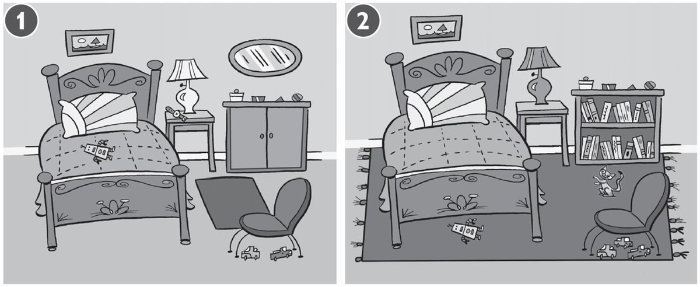
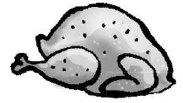
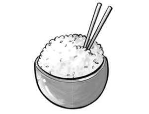
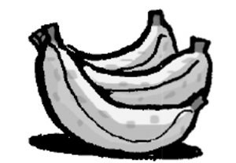
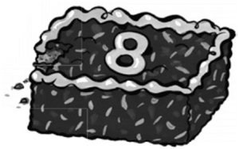
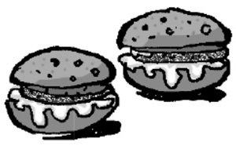
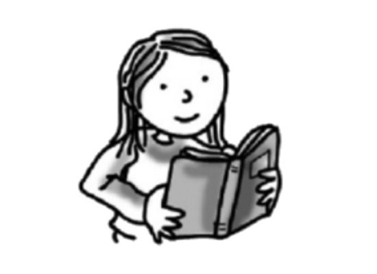
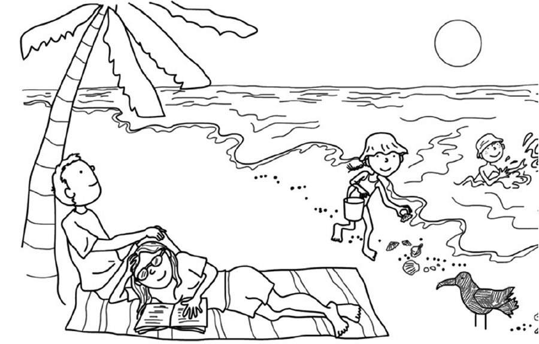
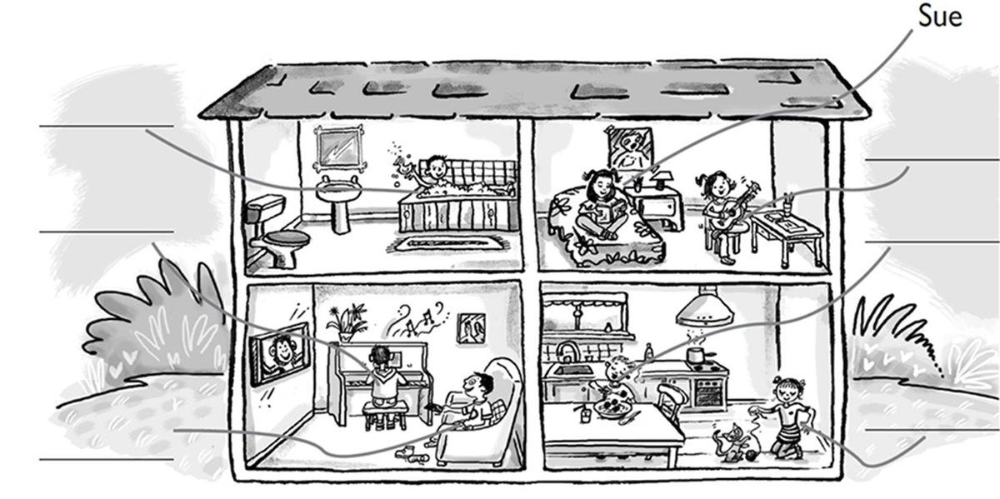
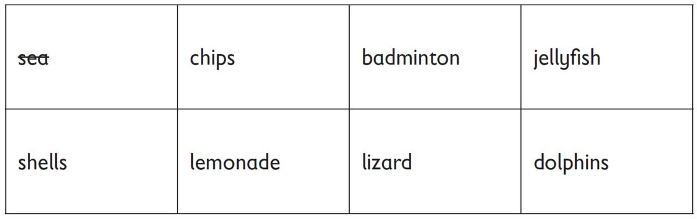

**[Vocabulary]{.underline}**

**1. Read, and write the number. Then write the words. There is one
example.   (one point each)**

1\. This is *[Bill's]{.underline}* robot.

2\. This is \_\_\_\_\_\_\_\_\_\_\_\_\_\_\_ bus.

*Jill's -- bus*

3\. This is \_\_\_\_\_\_\_\_\_\_\_\_\_\_\_ bike.

*Kim's -- bike*

4\. This is \_\_\_\_\_\_\_\_\_\_\_\_\_\_\_ boat.

*Rick's -- boat*

5\. This is \_\_\_\_\_\_\_\_\_\_\_\_\_\_\_ helicopter.

*Tony's -- helicopter*

6\. This is \_\_\_\_\_\_\_\_\_\_\_\_\_\_\_ motorbike.

*Lucy's -- motorbike*

**2. Read and write the words. There are two extra words. There is one
example.   (one point each)**

bathroom \| bedroom \| café \| farm \| flat \| hospital \| park \|
~~town~~

  ------------------------------- --- -----------------------------------
  1\. There are lots of shops and     *[town]{.underline}*
  cars here.                          

  ------------------------------- --- -----------------------------------

  ------------------------------- --- -----------------------------------
  2\. People drink coffee and eat     *café*
  here.                               

  ------------------------------- --- -----------------------------------

  ------------------------------- --- -----------------------------------
  3\. People live in this.            *flat*

  ------------------------------- --- -----------------------------------

  ------------------------------- --- -----------------------------------
  4\. Children play here.             *park*

  ------------------------------- --- -----------------------------------

  ------------------------------- --- -----------------------------------
  5\. Chickens, cows and donkeys      *farm*
  live here.                          

  ------------------------------- --- -----------------------------------

  ------------------------------- --- -----------------------------------
  6\. People sleep here.              *bedroom*

  ------------------------------- --- -----------------------------------

**[Grammar]{.underline}**

**3. Look. Write the words. There is one example.   (one point each)**

1\. Three cars are *[under]{.underline}* the chair.      1    **2**

2\. The lamp is \_\_\_\_\_\_\_\_\_\_\_\_\_\_\_ the bed and the
cupboard.      1    2

*between*

3\. A mirror is \_\_\_\_\_\_\_\_\_\_\_\_\_\_\_ the wall.      1    2

*on*

4\. The rug is \_\_\_\_\_\_\_\_\_\_\_\_\_\_\_ the bed.      1    2

*under*

5\. A watch is \_\_\_\_\_\_\_\_\_\_\_\_\_\_\_ the lamp.      1    2

*next to*

6\. A cat is sitting \_\_\_\_\_\_\_\_\_\_\_\_\_\_\_ the
bookcase.      1    2

*in front of*

**4. Write this or these and answer the questions. There is one
example.   (one point each)**

1\. What's *[this]{.underline}*?

*[It's chicken.]{.underline}*

2\. What's \_\_\_\_\_\_\_\_\_\_\_\_\_\_\_?

\_\_\_\_\_\_\_\_\_\_\_\_\_\_\_\_\_\_\_\_\_\_\_\_\_\_\_

*this -- It's rice*

3\. What are \_\_\_\_\_\_\_\_\_\_\_\_\_\_\_?

\_\_\_\_\_\_\_\_\_\_\_\_\_\_\_\_\_\_\_\_\_\_\_\_\_\_\_

*these -- They're bananas*

4\. What's \_\_\_\_\_\_\_\_\_\_\_\_\_\_\_?

\_\_\_\_\_\_\_\_\_\_\_\_\_\_\_\_\_\_\_\_\_\_\_\_\_\_\_

*this -- It's a cake*

5\. What are \_\_\_\_\_\_\_\_\_\_\_\_\_\_\_?

\_\_\_\_\_\_\_\_\_\_\_\_\_\_\_\_\_\_\_\_\_\_\_\_\_\_\_

*these -- They're eggs*

6\. What are \_\_\_\_\_\_\_\_\_\_\_\_\_\_\_?

\_\_\_\_\_\_\_\_\_\_\_\_\_\_\_\_\_\_\_\_\_\_\_\_\_\_\_

*these -- They're burgers*

**5. Look, read and write. There is one example.   (one point each)**

1\. *[He's playing hockey.]{.underline}*

2\. \_\_\_\_\_\_\_\_\_\_\_\_\_\_\_\_\_\_\_\_\_\_\_\_\_\_\_\_\_\_\_\_\_\_

*She's reading*

3\. \_\_\_\_\_\_\_\_\_\_\_\_\_\_\_\_\_\_\_\_\_\_\_\_\_\_\_\_\_\_\_\_\_\_

*They're swimming*

4\. \_\_\_\_\_\_\_\_\_\_\_\_\_\_\_\_\_\_\_\_\_\_\_\_\_\_\_\_\_\_\_\_\_\_

*She's painting*

5\. \_\_\_\_\_\_\_\_\_\_\_\_\_\_\_\_\_\_\_\_\_\_\_\_\_\_\_\_\_\_\_\_\_\_

*He's fishing*

6\. \_\_\_\_\_\_\_\_\_\_\_\_\_\_\_\_\_\_\_\_\_\_\_\_\_\_\_\_\_\_\_\_\_\_

*We're playing table tennis*

**[Listening]{.underline}**

**6. Listen and colour. Then write. There is one example.   (one point
each)**

I can see a (1) *[grey bird]{.underline}*, a (2)
\_\_\_\_\_\_\_\_\_\_\_\_\_\_\_\_\_\_\_
\_\_\_\_\_\_\_\_\_\_\_\_\_\_\_\_\_\_\_, a (3)
\_\_\_\_\_\_\_\_\_\_\_\_\_\_\_\_\_\_\_
\_\_\_\_\_\_\_\_\_\_\_\_\_\_\_\_\_\_\_, a (4)
\_\_\_\_\_\_\_\_\_\_\_\_\_\_\_\_\_\_\_
\_\_\_\_\_\_\_\_\_\_\_\_\_\_\_\_\_\_\_, some (5)
\_\_\_\_\_\_\_\_\_\_\_\_\_\_\_\_\_\_\_
\_\_\_\_\_\_\_\_\_\_\_\_\_\_\_\_\_\_\_ and a (6)
\_\_\_\_\_\_\_\_\_\_\_\_\_\_\_\_\_\_\_ and a
\_\_\_\_\_\_\_\_\_\_\_\_\_\_\_\_\_\_\_ tree.

*2. girl's hat -- green*

*3. Mummy's T-shirt -- yellow*

*4. Daddy's T-shirt -- purple*

*5. shells -- blue*

*6. tree -- brown and green*

*2. green hat*

*3. yellow T-shirt*

*4. purple T-shirt*

*5. blue shells*

*6. brown and green (tree)*

**Audio script**

1\. The bird is grey.

2\. The girl's hat is green.

3\. Mummy's T-shirt is yellow.

4\. Daddy's wearing a purple T-shirt.

5\. The shells are blue.

6\. The tree is brown and green.

**7. Listen and write the name. There is one extra line. There is one
example.   (one point each)**

Ben \| Fred \| Grace \| Hugo \| Nick \| ~~Sue~~

*2. Ben -- sofa, watching TV,*

*3. Fred -- bath*

*4. Grace -- guitar, bedroom*

*5. Nick -- eating, kitchen*

*6. Hugo -- playing the piano, living room*

**Audio script**

1\. Sue's got a book. She's reading on the bed.

2\. Ben's sitting on the sofa. He's watching TV.

3\. Fred's got a duck. He's in the bath.

4\. Grace has got a guitar. She's playing it in the bedroom.

5\. Nick's eating meatballs. He's in the kitchen.

6\. Hugo loves playing the piano. He's in the living room.

**[Reading]{.underline}**

**8. Read and write. There are two extra words. There is one
example.   (one point each)**

Hi, I'm Bill. Today we are driving to the beach. I love jumping and
swimming in the (1) *[sea]{.underline}*. One day I want to swim with (2)
*dolphins*! They're beautiful, and they're my favourite animal.

Sometimes I can see big lizards on the beach and sometimes pink (3)
*jellyfish* in the water, but I don't like those!

My sister likes sitting on the sand and playing with (4) *shells*.

My brother and my dad like playing (5) *badminton* or flying their
kites.

There is a small café next to the beach, and sometimes we go there to
get a (6) *lemonade* or an ice cream before we go home to the city.

