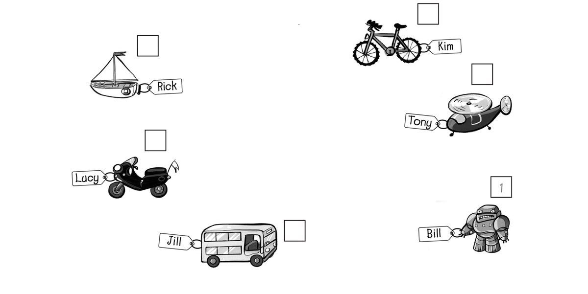
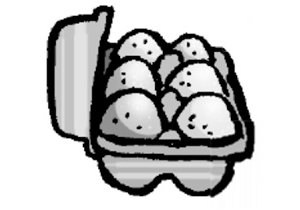
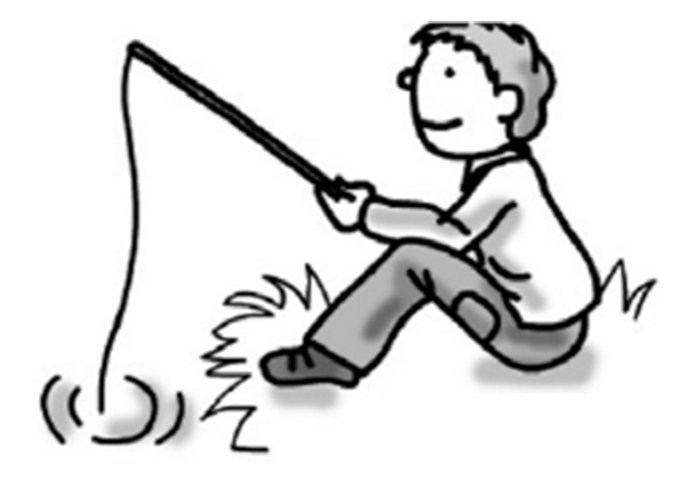
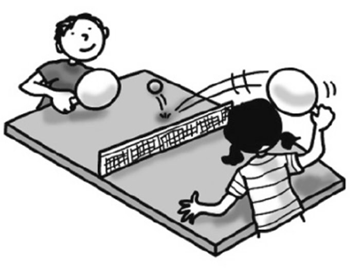

**[Vocabulary]{.underline}**

**1. Read, and write the number. Then write the words. There is one
example.   (one point each)**

1\. This is *[Bill's]{.underline}* robot.

2\. This is \_\_\_\_\_\_\_\_\_\_\_\_\_\_\_ bus.

3\. This is \_\_\_\_\_\_\_\_\_\_\_\_\_\_\_ bike.

4\. This is \_\_\_\_\_\_\_\_\_\_\_\_\_\_\_ boat.

5\. This is \_\_\_\_\_\_\_\_\_\_\_\_\_\_\_ helicopter.

6\. This is \_\_\_\_\_\_\_\_\_\_\_\_\_\_\_ motorbike.

**2. Read and write the words. There are two extra words. There is one
example.   (one point each)**

bathroom \| bedroom \| café \| farm \| flat \| hospital \| park \|
~~town~~

  ------------------------------- --- -----------------------------------
  1\. There are lots of shops and     *[town]{.underline}*
  cars here.                          

  ------------------------------- --- -----------------------------------

  ------------------------------- --- --------------------------------------------
  2\. People drink coffee and eat     \_\_\_\_\_\_\_\_\_\_\_\_\_\_\_\_\_\_\_\_\_
  here.                               

  ------------------------------- --- --------------------------------------------

  ------------------------------- --- --------------------------------------------
  3\. People live in this.            \_\_\_\_\_\_\_\_\_\_\_\_\_\_\_\_\_\_\_\_\_

  ------------------------------- --- --------------------------------------------

  ------------------------------- --- --------------------------------------------
  4\. Children play here.             \_\_\_\_\_\_\_\_\_\_\_\_\_\_\_\_\_\_\_\_\_

  ------------------------------- --- --------------------------------------------

  ------------------------------- --- --------------------------------------------
  5\. Chickens, cows and donkeys      \_\_\_\_\_\_\_\_\_\_\_\_\_\_\_\_\_\_\_\_\_
  live here.                          

  ------------------------------- --- --------------------------------------------

  ------------------------------- --- --------------------------------------------
  6\. People sleep here.              \_\_\_\_\_\_\_\_\_\_\_\_\_\_\_\_\_\_\_\_\_

  ------------------------------- --- --------------------------------------------

**[Grammar]{.underline}**

**3. Look. Write the words. There is one example.   (one point each)**

1\. Three cars are *[under]{.underline}* the chair.      1    **2**

2\. The lamp is \_\_\_\_\_\_\_\_\_\_\_\_\_\_\_ the bed and the
cupboard.      1    2

3\. A mirror is \_\_\_\_\_\_\_\_\_\_\_\_\_\_\_ the wall.      1    2

4\. The rug is \_\_\_\_\_\_\_\_\_\_\_\_\_\_\_ the bed.      1    2

5\. A watch is \_\_\_\_\_\_\_\_\_\_\_\_\_\_\_ the lamp.      1    2

6\. A cat is sitting \_\_\_\_\_\_\_\_\_\_\_\_\_\_\_ the
bookcase.      1    2

**4. Write this or these and answer the questions. There is one
example.   (one point each)**

1\. What's *[this]{.underline}*?

*[It's chicken.]{.underline}*

2\. What's \_\_\_\_\_\_\_\_\_\_\_\_\_\_\_?

\_\_\_\_\_\_\_\_\_\_\_\_\_\_\_\_\_\_\_\_\_\_\_\_\_\_\_

3\. What are \_\_\_\_\_\_\_\_\_\_\_\_\_\_\_?

\_\_\_\_\_\_\_\_\_\_\_\_\_\_\_\_\_\_\_\_\_\_\_\_\_\_\_

4\. What's \_\_\_\_\_\_\_\_\_\_\_\_\_\_\_?

\_\_\_\_\_\_\_\_\_\_\_\_\_\_\_\_\_\_\_\_\_\_\_\_\_\_\_

5\. What are \_\_\_\_\_\_\_\_\_\_\_\_\_\_\_?

\_\_\_\_\_\_\_\_\_\_\_\_\_\_\_\_\_\_\_\_\_\_\_\_\_\_\_

6\. What are \_\_\_\_\_\_\_\_\_\_\_\_\_\_\_?

\_\_\_\_\_\_\_\_\_\_\_\_\_\_\_\_\_\_\_\_\_\_\_\_\_\_\_

**5. Look, read and write. There is one example.   (one point each)**

1\. *[He's playing hockey.]{.underline}*

2\. \_\_\_\_\_\_\_\_\_\_\_\_\_\_\_\_\_\_\_\_\_\_\_\_\_\_\_\_\_\_\_\_\_\_

3\. \_\_\_\_\_\_\_\_\_\_\_\_\_\_\_\_\_\_\_\_\_\_\_\_\_\_\_\_\_\_\_\_\_\_

4\. \_\_\_\_\_\_\_\_\_\_\_\_\_\_\_\_\_\_\_\_\_\_\_\_\_\_\_\_\_\_\_\_\_\_

5\. \_\_\_\_\_\_\_\_\_\_\_\_\_\_\_\_\_\_\_\_\_\_\_\_\_\_\_\_\_\_\_\_\_\_

6\. \_\_\_\_\_\_\_\_\_\_\_\_\_\_\_\_\_\_\_\_\_\_\_\_\_\_\_\_\_\_\_\_\_\_

**[Listening]{.underline}**

**6. Listen and colour. Then write. There is one example.   (one point
each)**

I can see a (1) *[grey bird]{.underline}*, a (2)
\_\_\_\_\_\_\_\_\_\_\_\_\_\_\_\_\_\_\_
\_\_\_\_\_\_\_\_\_\_\_\_\_\_\_\_\_\_\_, a (3)
\_\_\_\_\_\_\_\_\_\_\_\_\_\_\_\_\_\_\_
\_\_\_\_\_\_\_\_\_\_\_\_\_\_\_\_\_\_\_, a (4)
\_\_\_\_\_\_\_\_\_\_\_\_\_\_\_\_\_\_\_
\_\_\_\_\_\_\_\_\_\_\_\_\_\_\_\_\_\_\_, some (5)
\_\_\_\_\_\_\_\_\_\_\_\_\_\_\_\_\_\_\_
\_\_\_\_\_\_\_\_\_\_\_\_\_\_\_\_\_\_\_ and a (6)
\_\_\_\_\_\_\_\_\_\_\_\_\_\_\_\_\_\_\_ and a
\_\_\_\_\_\_\_\_\_\_\_\_\_\_\_\_\_\_\_ tree.

**7. Listen and write the name. There is one extra line. There is one
example.   (one point each)**

Ben \| Fred \| Grace \| Hugo \| Nick \| ~~Sue~~

**[Reading]{.underline}**

**8. Read and write. There are two extra words. There is one
example.   (one point each)**

Hi, I'm Bill. Today we are driving to the beach. I love jumping and
swimming in the (1) *[sea]{.underline}*. One day I want to swim with (2)
\_\_\_\_\_\_\_\_\_\_\_\_\_\_\_\_! They're beautiful, and they're my
favourite animal.

Sometimes I can see big lizards on the beach and sometimes pink (3)
\_\_\_\_\_\_\_\_\_\_\_\_\_\_\_\_ in the water, but I don't like those!

My sister likes sitting on the sand and playing with (4)
\_\_\_\_\_\_\_\_\_\_\_\_\_\_\_\_.

My brother and my dad like playing (5) \_\_\_\_\_\_\_\_\_\_\_\_\_\_\_\_
or flying their kites.

There is a small café next to the beach, and sometimes we go there to
get a (6) \_\_\_\_\_\_\_\_\_\_\_\_\_\_\_\_ or an ice cream before we go
home to the city.

