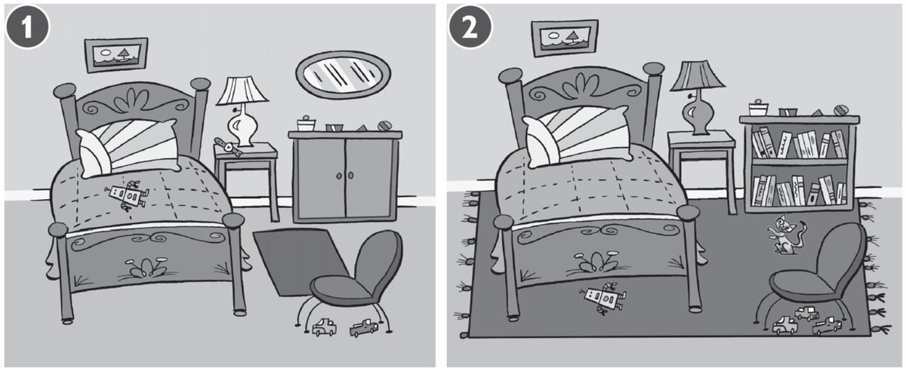
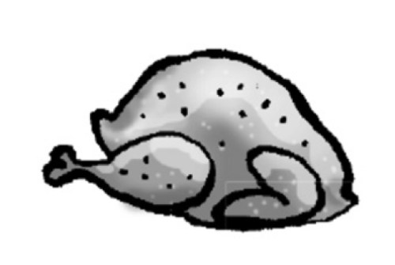
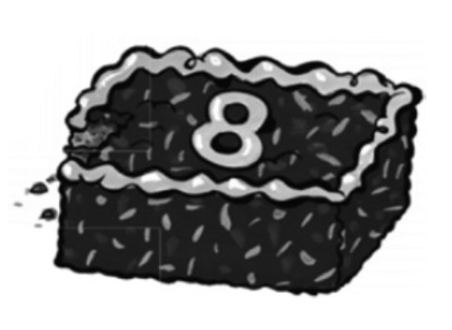
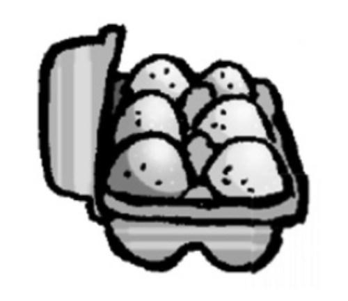

**[Vocabulary]{.underline}**

**1. Match and write the words. There is one example.   (one point
each)**

1\. This is *[Bill's]{.underline}* robot.

2\. This is \_\_\_\_\_\_\_\_\_\_\_\_\_\_\_ bus.

*Jill's*

3\. This is \_\_\_\_\_\_\_\_\_\_\_\_\_\_\_ boat.

*Rick's*

4\. This is \_\_\_\_\_\_\_\_\_\_\_\_\_\_\_ bike.

*Kim's*

5\. This is \_\_\_\_\_\_\_\_\_\_\_\_\_\_\_ helicopter.

*Tony's*

6\. This is \_\_\_\_\_\_\_\_\_\_\_\_\_\_\_ motorbike.

*Lucy's*

**2. Look and read. Write the numbers. There is one example.   (one
point each)**

  ------------------------------- --- -------------------------------
  1\. Chickens, cows and donkeys      a park
  live here.                          

  ------------------------------- --- -------------------------------

*[a farm]{.underline}*

  ------------------------------- --- -------------------------------
  2\. People drink coffee and eat     a bedroom
  here.                               

  ------------------------------- --- -------------------------------

*a café*

  ------------------------------- --- -------------------------------
  3\. People live in this.            a flat

  ------------------------------- --- -------------------------------

*a flat*

  ------------------------------- --- -------------------------------
  4\. Children play here.             a farm

  ------------------------------- --- -------------------------------

*a park*

  ------------------------------- --- -------------------------------
  5\. There are lots of shops and     a town
  cars here.                          

  ------------------------------- --- -------------------------------

*a town*

  ------------------------------- --- -------------------------------
  6\. People sleep here.              a café

  ------------------------------- --- -------------------------------

*a bedroom*

**[Grammar]{.underline}**

**3. Look, read and write the words. There is one example.   (one point
each)**

between \| in front of \| next to \| on \| ~~under~~ \| under

1\. Three cars are *[under]{.underline}* the chair. 1 **2**

2\. The lamp is \_\_\_\_\_\_\_\_\_\_\_\_\_\_\_\_\_\_\_\_\_\_\_\_\_\_\_
the bed and the cupboard.      1    2

*between*

3\. A mirror is \_\_\_\_\_\_\_\_\_\_\_\_\_\_\_\_\_\_\_\_\_\_\_\_\_\_\_
the wall.      1    2

*on*

4\. The rug is \_\_\_\_\_\_\_\_\_\_\_\_\_\_\_\_\_\_\_\_\_\_\_\_\_\_\_
the bed.      1    2

*under*

5\. A watch is \_\_\_\_\_\_\_\_\_\_\_\_\_\_\_\_\_\_\_\_\_\_\_\_\_\_\_
the lamp.      1    2

*next to*

6\. A cat is sitting
\_\_\_\_\_\_\_\_\_\_\_\_\_\_\_\_\_\_\_\_\_\_\_\_\_\_\_ the
bookcase.      1    2

*in front of*

**4. Read and answer the questions. There is one example.   (one point
each)**

 1.
What's this?

+------------------------+---+--------------------------------------------------------------------------------------------------------------------------------------------------------------------------------------------------------------+---+--------------------------------------------------------------------------------------------------------------------------------------------------------------------------------------------------------------+
|     *[It's             |   |  |   |  |
| chicken]{.underline}*. |   | 2. What's this?                                                                                                                                                                                              |   | 3. What are these?                                                                                                                                                                                           |
|                        |   |                                                                                                                                                                                                              |   |                                                                                                                                                                                                              |
|                        |   |     *It's rice*                                                                                                                                                                                              |   |     *They're bananas*                                                                                                                                                                                        |
+------------------------+---+--------------------------------------------------------------------------------------------------------------------------------------------------------------------------------------------------------------+---+--------------------------------------------------------------------------------------------------------------------------------------------------------------------------------------------------------------+

4. What's this?

+------------------+---+--------------------------------------------------------------------------------------------------------------------------------------------------------------------------------------------------------------+---+--------------------------------------------------------------------------------------------------------------------------------------------------------------------------------------------------------------+
|     *It's a      |   |  |   |  |
| cake*            |   | 5. What are these?                                                                                                                                                                                           |   | 6. What are these?                                                                                                                                                                                           |
|                  |   |                                                                                                                                                                                                              |   |                                                                                                                                                                                                              |
|                  |   |     *They're eggs*                                                                                                                                                                                           |   |     *They're burgers*                                                                                                                                                                                        |
+------------------+---+--------------------------------------------------------------------------------------------------------------------------------------------------------------------------------------------------------------+---+--------------------------------------------------------------------------------------------------------------------------------------------------------------------------------------------------------------+

**5. Choose the words. Write sentences. There is one example.   (one
point each)**

~~He's~~ \| They're \| She's \| She's \| He's \| We're

reading \| swimming \| playing badminton \| painting \| fishing \|
~~playing hockey~~

1\. *[He's playing hockey.]{.underline}*

2\. \_\_\_\_\_\_\_\_\_\_\_\_\_\_\_\_\_\_\_\_\_\_\_\_\_\_\_\_\_\_\_\_\_\_

*She's reading*

3\. \_\_\_\_\_\_\_\_\_\_\_\_\_\_\_\_\_\_\_\_\_\_\_\_\_\_\_\_\_\_\_\_\_\_

*They're swimming*

4\. \_\_\_\_\_\_\_\_\_\_\_\_\_\_\_\_\_\_\_\_\_\_\_\_\_\_\_\_\_\_\_\_\_\_

*She's painting*

5\. \_\_\_\_\_\_\_\_\_\_\_\_\_\_\_\_\_\_\_\_\_\_\_\_\_\_\_\_\_\_\_\_\_\_

*He's fishing*

6\. \_\_\_\_\_\_\_\_\_\_\_\_\_\_\_\_\_\_\_\_\_\_\_\_\_\_\_\_\_\_\_\_\_\_

    Me and my friend

*We're playing badminton.*

**[Listening]{.underline}**

**6. Listen and colour. There is one example.   (one point each)**

*2. girl's hat -- green*

*3. Mummy's T-shirt -- yellow*

*4. Daddy's T-shirt -- purple*

*5. shells -- blue*

*6. tree -- brown and green*

**Audio script**

1\. The bird is grey.

2\. The girl's hat is green.

3\. Mummy's T-shirt is yellow.

4\. Daddy's wearing a purple T-shirt.

5\. The shells are blue.

6\. The tree is brown and green.

**7. Listen and draw lines. There are two extra names. There is one
example.   (one point each)**

*2. Ben -- sofa, watching TV*

*3. Fred -- bath*

*4. Grace -- guitar, bedroom*

*5. Nick -- eating, kitchen*

*6. Hugo -- playing the piano, living room*

**Audio script**

1\. Sue's got a book. She's reading on the bed.

2\. Ben's sitting on the sofa. He's watching TV.

3\. Fred's got a duck. He's in the bath.

4\. Grace has got a guitar. She's playing it in the bedroom.

5\. Nick's eating meatballs. He's in the kitchen.

6\. Hugo loves playing the piano. He's in the living room.

**[Reading]{.underline}**

**8. Read and write. There are two extra words. There is one
example.   (one point each)**

Hi, I'm Bill. Today we are driving to the beach. I love jumping and
swimming in the (1) *[sea]{.underline}*. One day I want to swim with (2)
*dolphins*! They're beautiful, and they're my favourite animal.

Sometimes I can see big lizards on the beach and sometimes pink (3)
*jellyfish* in the water, but I don't like those!

My sister likes sitting on the sand and playing with (4) *shells*.

My brother and my dad like playing (5) *badminton* or flying their
kites.

There is a small café next to the beach, and sometimes we go there to
get a (6) *lemonade* or an ice cream before we go home to the city.

