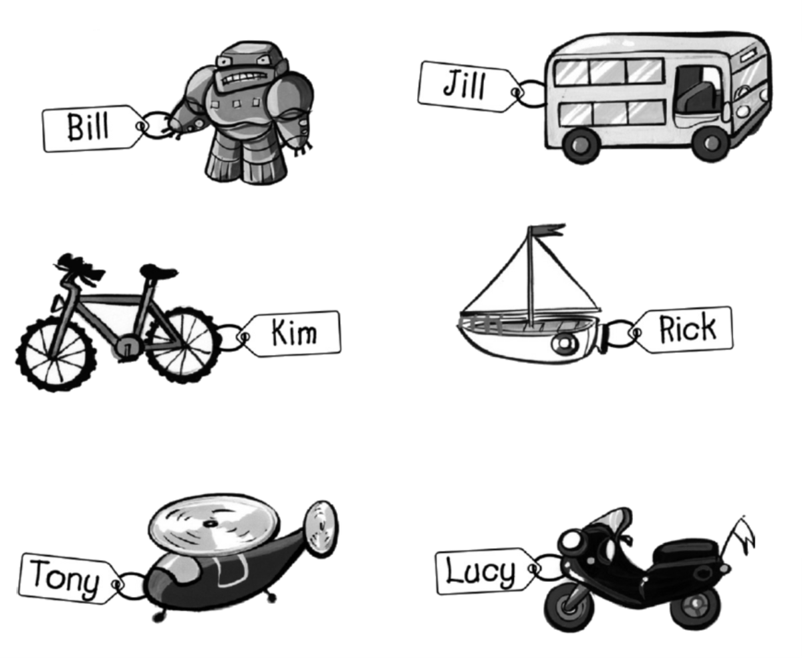
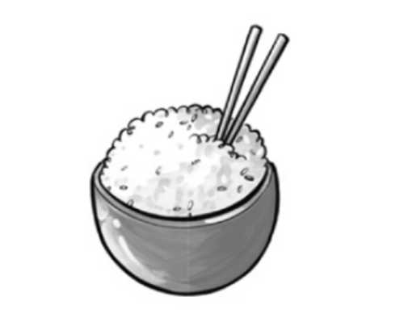
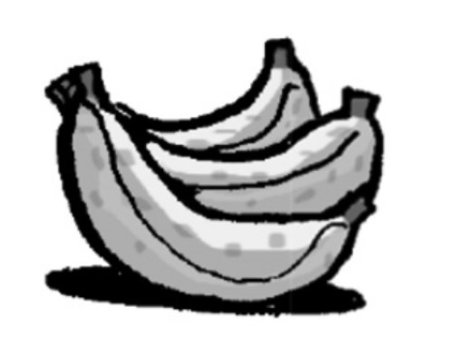
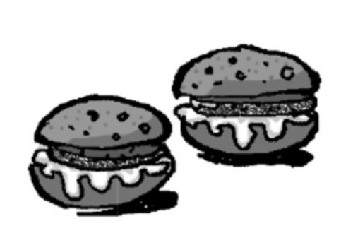
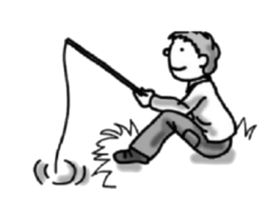
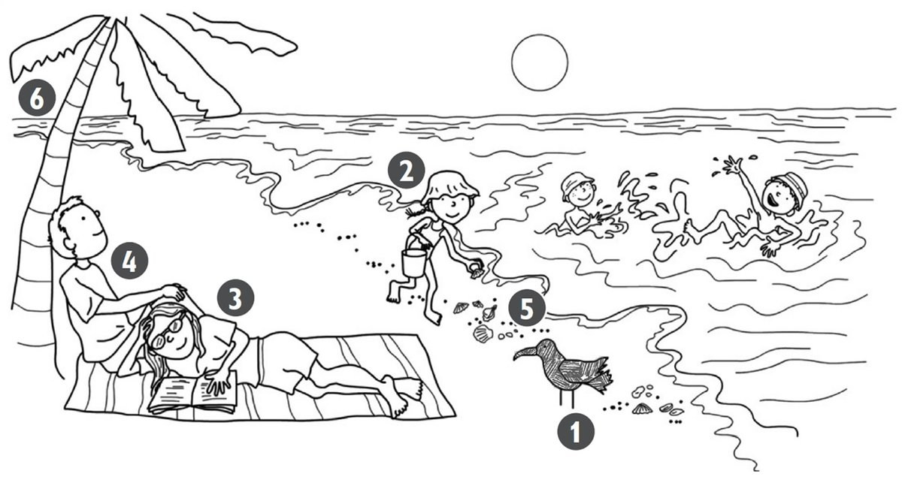
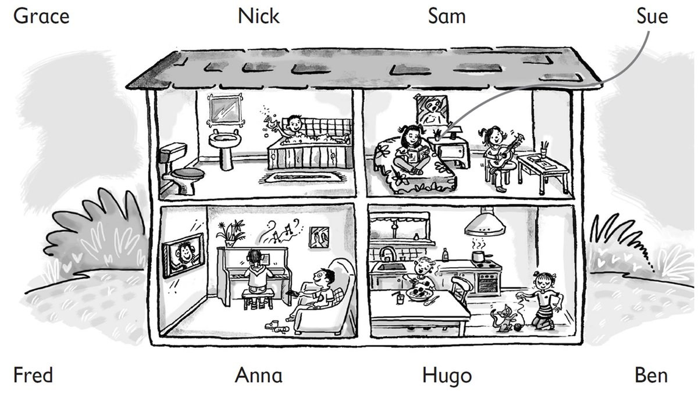
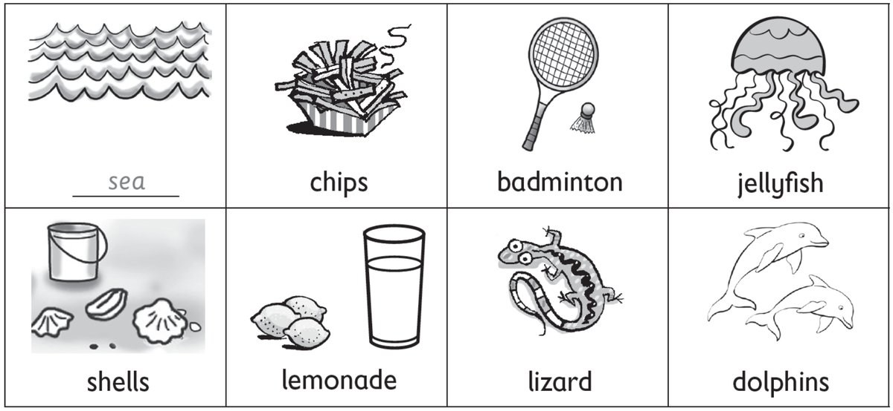

**[Vocabulary]{.underline}**

**1. Match and write the words. There is one example.   (one point
each)**

1\. This is *[Bill's]{.underline}* robot.

2\. This is \_\_\_\_\_\_\_\_\_\_\_\_\_\_\_ bus.

3\. This is \_\_\_\_\_\_\_\_\_\_\_\_\_\_\_ boat.

4\. This is \_\_\_\_\_\_\_\_\_\_\_\_\_\_\_ bike.

5\. This is \_\_\_\_\_\_\_\_\_\_\_\_\_\_\_ helicopter.

6\. This is \_\_\_\_\_\_\_\_\_\_\_\_\_\_\_ motorbike.

**2. Look and read. Write the numbers. There is one example.   (one
point each)**

  ------------------------------- --- -------------------------------
  1\. Chickens, cows and donkeys      a town
  live here.                          

  ------------------------------- --- -------------------------------

  ------------------------------- --- -------------------------------
  2\. People drink coffee and eat     a farm
  here.                               

  ------------------------------- --- -------------------------------

  ------------------------------- --- -------------------------------
  3\. People live in this.            a park

  ------------------------------- --- -------------------------------

  ------------------------------- --- -------------------------------
  4\. Children play here.             a café

  ------------------------------- --- -------------------------------

  ------------------------------- --- -------------------------------
  5\. There are lots of shops and     a flat
  cars here.                          

  ------------------------------- --- -------------------------------

  ------------------------------- --- -------------------------------
  6\. People sleep here.              a bedroom

  ------------------------------- --- -------------------------------

**[Grammar]{.underline}**

**3. Look, read and write the words. There is one example.   (one point
each)**

between \| in front of \| next to \| on \| ~~under~~ \| under

1\. Three cars are *[under]{.underline}* the chair. 1 **2**

2\. The lamp is \_\_\_\_\_\_\_\_\_\_\_\_\_\_\_\_\_\_\_\_\_\_\_\_\_\_\_
the bed and the cupboard.      1    2

3\. A mirror is \_\_\_\_\_\_\_\_\_\_\_\_\_\_\_\_\_\_\_\_\_\_\_\_\_\_\_
the wall.      1    2

4\. The rug is \_\_\_\_\_\_\_\_\_\_\_\_\_\_\_\_\_\_\_\_\_\_\_\_\_\_\_
the bed.      1    2

5\. A watch is \_\_\_\_\_\_\_\_\_\_\_\_\_\_\_\_\_\_\_\_\_\_\_\_\_\_\_
the lamp.      1    2

6\. A cat is sitting
\_\_\_\_\_\_\_\_\_\_\_\_\_\_\_\_\_\_\_\_\_\_\_\_\_\_\_ the
bookcase.      1    2

**4. Read and answer the questions. There is one example.   (one point
each)**

 1.
What's this?

+------------------------+---+-----------------------------------------------------------------------------------------------------------------------------------------------------------------------------------------------------------------+---+-----------------------------------------------------------------------------------------------------------------------------------------------------------------------------------------------------------------+
|     *[It's             |   |  |   |  |
| chicken]{.underline}*. |   | 2. What's this?                                                                                                                                                                                                 |   | 3. What are these?                                                                                                                                                                                              |
|                        |   |                                                                                                                                                                                                                 |   |                                                                                                                                                                                                                 |
|                        |   |     \_\_\_\_\_\_\_\_\_\_\_\_\_\_\_                                                                                                                                                                              |   |     \_\_\_\_\_\_\_\_\_\_\_\_\_\_\_                                                                                                                                                                              |
+------------------------+---+-----------------------------------------------------------------------------------------------------------------------------------------------------------------------------------------------------------------+---+-----------------------------------------------------------------------------------------------------------------------------------------------------------------------------------------------------------------+

4. What's this?

+------------------------------------+---+-----------------------------------------------------------------------------------------------------------------------------------------------------------------------------------------------------------------+---+-----------------------------------------------------------------------------------------------------------------------------------------------------------------------------------------------------------------+
|     \_\_\_\_\_\_\_\_\_\_\_\_\_\_\_ |   |  |   |  |
|                                    |   | 5. What are these?                                                                                                                                                                                              |   | 6. What are these?                                                                                                                                                                                              |
|                                    |   |                                                                                                                                                                                                                 |   |                                                                                                                                                                                                                 |
|                                    |   |     \_\_\_\_\_\_\_\_\_\_\_\_\_\_\_                                                                                                                                                                              |   |     \_\_\_\_\_\_\_\_\_\_\_\_\_\_\_                                                                                                                                                                              |
+------------------------------------+---+-----------------------------------------------------------------------------------------------------------------------------------------------------------------------------------------------------------------+---+-----------------------------------------------------------------------------------------------------------------------------------------------------------------------------------------------------------------+

**5. Choose the words. Write sentences. There is one example.   (one
point each)**

~~He's~~ \| They're \| She's \| She's \| He's \| We're

reading \| swimming \| playing badminton \| painting \| fishing \|
~~playing hockey~~

1\. *[He's playing hockey.]{.underline}*

2\. \_\_\_\_\_\_\_\_\_\_\_\_\_\_\_\_\_\_\_\_\_\_\_\_\_\_\_\_\_\_\_\_\_\_

3\. \_\_\_\_\_\_\_\_\_\_\_\_\_\_\_\_\_\_\_\_\_\_\_\_\_\_\_\_\_\_\_\_\_\_

4\. \_\_\_\_\_\_\_\_\_\_\_\_\_\_\_\_\_\_\_\_\_\_\_\_\_\_\_\_\_\_\_\_\_\_

5\. \_\_\_\_\_\_\_\_\_\_\_\_\_\_\_\_\_\_\_\_\_\_\_\_\_\_\_\_\_\_\_\_\_\_

6\. \_\_\_\_\_\_\_\_\_\_\_\_\_\_\_\_\_\_\_\_\_\_\_\_\_\_\_\_\_\_\_\_\_\_

    Me and my friend

**[Listening]{.underline}**

**6. Listen and colour. There is one example.   (one point each)**

**7. Listen and draw lines. There are two extra names. There is one
example.   (one point each)**

**[Reading]{.underline}**

**8. Read and write. There are two extra words. There is one
example.   (one point each)**

Hi, I'm Bill. Today we are driving to the beach. I love jumping and
swimming in the (1) *[sea]{.underline}*. One day I want to swim with (2)
\_\_\_\_\_\_\_\_\_\_\_\_\_\_\_\_! They're beautiful, and they're my
favourite animal.

Sometimes I can see big lizards on the beach and sometimes pink (3)
\_\_\_\_\_\_\_\_\_\_\_\_\_\_\_\_ in the water, but I don't like those!

My sister likes sitting on the sand and playing with (4)
\_\_\_\_\_\_\_\_\_\_\_\_\_\_\_\_.

My brother and my dad like playing (5) \_\_\_\_\_\_\_\_\_\_\_\_\_\_\_\_
or flying their kites.

There is a small café next to the beach, and sometimes we go there to
get a (6) \_\_\_\_\_\_\_\_\_\_\_\_\_\_\_\_ or an ice cream before we go
home to the city.

