**[Vocabulary]{.underline}**

**1. Listen and write the number on the picture. Draw lines. There is
one example.   (one point each)**

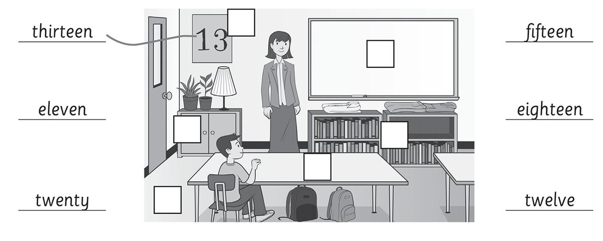

*whiteboard -- twenty/20*

*desk -- fifteen/15*

*cupboard -- twelve/12*

*floor -- eighteen/18*

*bookcase -- eleven/11*

**Audio script**

1\. Write the number thirteen on the poster.

2\. Write the number twenty on the whiteboard.

3\. Write the number fifteen on the desk.

4\. Write the number twelve on the cupboard.

5\. Write the number eighteen on the floor.

6\. Write the number eleven on the bookcase.

**2. Read and write the number. There is one example.   (one point
each)**

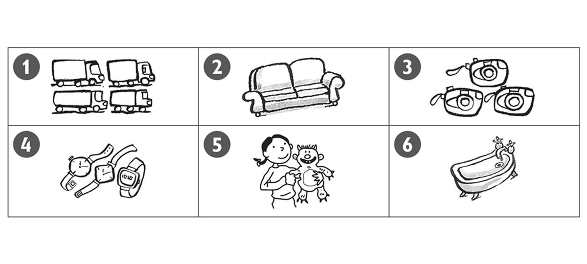

1\. *[3]{.underline}* These are cameras.

2\. \_\_\_\_\_ These are lorries.

*1*

3\. \_\_\_\_\_ This is a bath.

*6*

4\. \_\_\_\_\_ This is a sofa.

*2*

5\. \_\_\_\_\_ These are watches.

*4*

6\. \_\_\_\_\_ This is an alien.

*5*

**[Grammar]{.underline}**

**3. Look, read and circle. There is one example.   (one point each)**

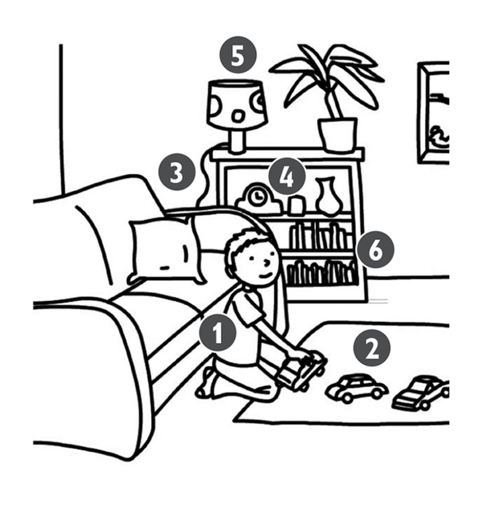

1\. The boy is *[next to]{.underline}* / *on* the sofa.

2\. The cars are *on* / *in* the rug.

*on*

3\. The sofa is *under* / *next to* the bookcase.

*next to*

4\. The clock is *on* / *under* the lamp.

*under*

5\. The lamp is *on* / *in* the bookcase.

*on*

6\. The books are *next to* / *in* the bookcase.

*in*

**4. Look, read and write the words. There is one example.   (one point
each)**

many \| There \| Are \| is \| ~~many~~ \| there

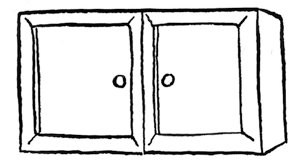

1\. How *[many]{.underline}* cupboards are there?

2\. Is \_\_\_\_\_\_\_\_\_\_\_\_ a teacher?

*there*

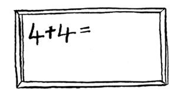

3\. \_\_\_\_\_\_\_\_\_\_\_\_ is a whiteboard.

*is*

4\. \_\_\_\_\_\_\_\_\_\_\_\_ there eighteen desks?

*Are*

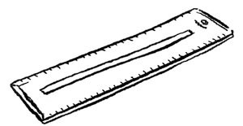

5\. Are \_\_\_\_\_\_\_\_\_\_\_\_ six rulers?

*there*

6\. How \_\_\_\_\_\_\_\_\_\_\_\_ bookcases are there?

*many*

**5. Read and circle. There is one example.   (one point each)**

1\. Are these lorries mine?

    Yes, *it's* / *[they're]{.underline}* yours.

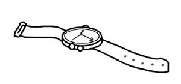

2\. Is this watch yours?

    No, *it isn't* / *they aren't*.

*it isn't*

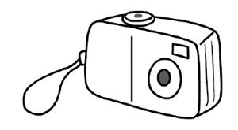

3\. Whose camera is this?

    *It's* / *They're* Mary's.

*It's*

4\. Whose games are these?

    *It's* / *They're* Tom's.

*They're*

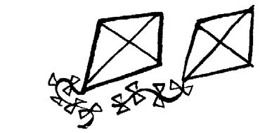

5\. Whose kites are those?

    *It's* / *They're* mine.

*They're*

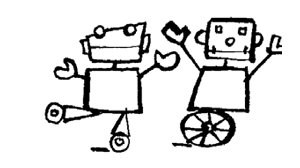

6\. Which robots are Clare's?

    The two white *one* / *ones*.

*ones*

**[Listening]{.underline}**

**6. Look and listen. Circle *yes* or *no*. There is one example.   (one
point each)**

*yes*

*no*

*yes*

*yes*

*no*

**Audio script**

1\. There's a cupboard in the girl's bedroom.

2\. There's a boy on the sofa.

3\. There are two watches on the mat.

4\. There's a lamp next to the phone.

5\. There are two aliens on the television.

6\. There's a robot in the bath.

**7. Listen and tick or cross. There is one example.   (one point
each)**

*✓*

*✗*

*✓*

*✗*

*✓*

**Audio script**

**1**

**Woman:** Whose are the kites?

**Girl:** They're Sam and Sue's.

**2**

**Woman:** Whose is the camera?

**Girl:** It's Lucy's.

**3**

**Woman:** Whose is the phone?

**Girl:** It's Alex's.

**4**

**Woman:** Whose are the computer games?

**Girl:** They're Dan's.

**5**

**Woman:** Whose is the watch?

**Girl:** It's Eva's.

**6**

**Woman:** Whose is the robot and alien?

**Girl:** They're Nick's.

**[Reading]{.underline}**

**8. Look and read. Circle the answer. There is one example.   (one
point each)**

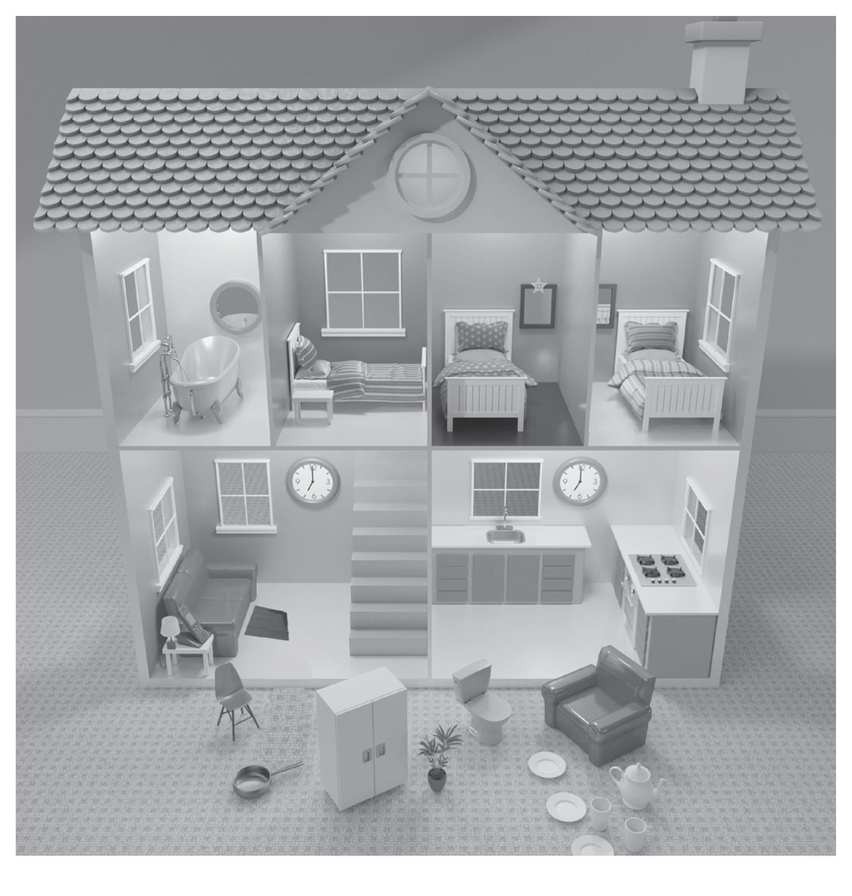

1\. How many beds are there? *[three]{.underline}* / *four*

2\. How many mirrors are there? *two* / *three*

*three*

3\. Where are the clocks? in the living room and *bedroom* / *kitchen*

*kitchen*

4\. Where is the phone? next to the *chair* / *sofa*

*sofa*

5\. Where is the lamp? next to the *bath* / *bed*

*bed*

6\. What's in front of the sofa? a *mat* / *sock*

*mat*

