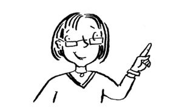
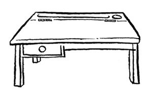
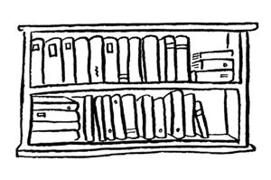
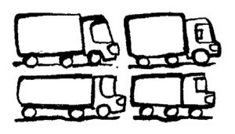
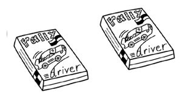
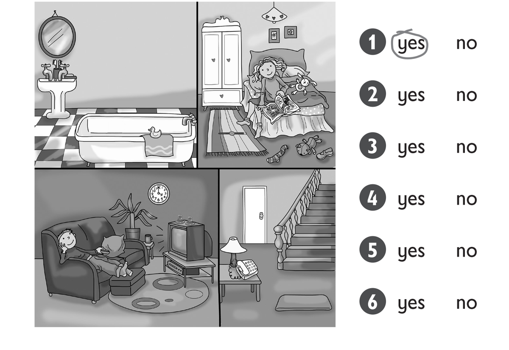
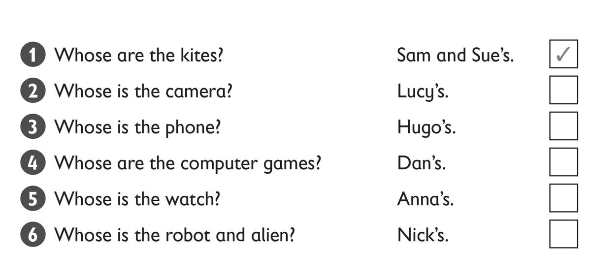

**[Vocabulary]{.underline}**

**1. Listen and write the number on the picture. Draw lines. There is
one example.   (one point each)**

**2. Read and write the number. There is one example.   (one point
each)**

1\. *[3]{.underline}* These are cameras.

2\. \_\_\_\_\_ These are lorries.

3\. \_\_\_\_\_ This is a bath.

4\. \_\_\_\_\_ This is a sofa.

5\. \_\_\_\_\_ These are watches.

6\. \_\_\_\_\_ This is an alien.

**[Grammar]{.underline}**

**3. Look, read and circle. There is one example.   (one point each)**

1\. The boy is *[next to]{.underline}* / *on* the sofa.

2\. The cars are *on* / *in* the rug.

3\. The sofa is *under* / *next to* the bookcase.

4\. The clock is *on* / *under* the lamp.

5\. The lamp is *on* / *in* the bookcase.

6\. The books are *next to* / *in* the bookcase.

**4. Look, read and write the words. There is one example.   (one point
each)**

many \| There \| Are \| is \| ~~many~~ \| there

1\. How *[many]{.underline}* cupboards are there?

2\. Is \_\_\_\_\_\_\_\_\_\_\_\_ a teacher?

3\. \_\_\_\_\_\_\_\_\_\_\_\_ is a whiteboard.

4\. \_\_\_\_\_\_\_\_\_\_\_\_ there eighteen desks?

5\. Are \_\_\_\_\_\_\_\_\_\_\_\_ six rulers?

6\. How \_\_\_\_\_\_\_\_\_\_\_\_ bookcases are there?

**5. Read and circle. There is one example.   (one point each)**

1\. Are these lorries mine?

    Yes, *it's* / *[they're]{.underline}* yours.

2\. Is this watch yours?

    No, *it isn't* / *they aren't*.

3\. Whose camera is this?

    *It's* / *They're* Mary's.

4\. Whose games are these?

    *It's* / *They're* Tom's.

5\. Whose kites are those?

    *It's* / *They're* mine.

6\. Which robots are Clare's?

    The two white *one* / *ones*.

**[Listening]{.underline}**

**6. Look and listen. Circle *yes* or *no*. There is one example.   (one
point each)**

**7. Listen and tick or cross. There is one example.   (one point
each)**

**[Reading]{.underline}**

**8. Look and read. Circle the answer. There is one example.   (one
point each)**

1\. How many beds are there? *[three]{.underline}* / *four*

2\. How many mirrors are there? *two* / *three*

3\. Where are the clocks? in the living room and *bedroom* / *kitchen*

4\. Where is the phone? next to the *chair* / *sofa*

5\. Where is the lamp? next to the *bath* / *bed*

6\. What's in front of the sofa? a *mat* / *sock*

