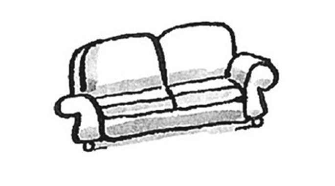
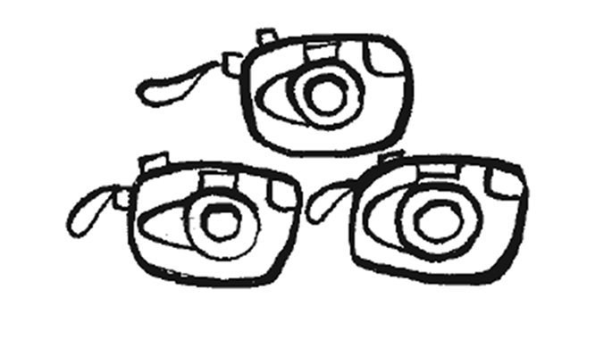
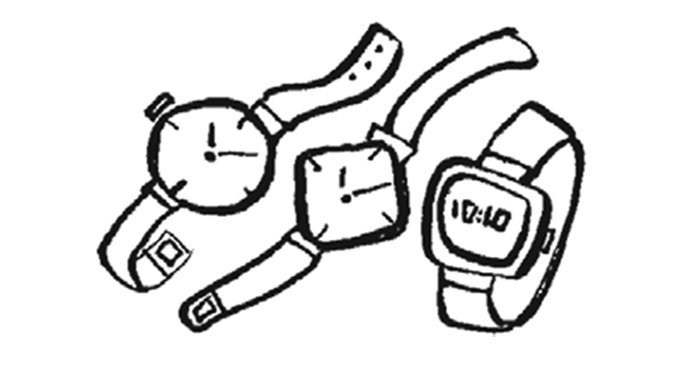
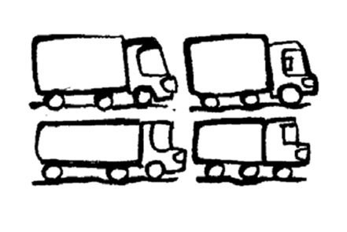
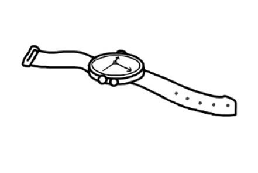
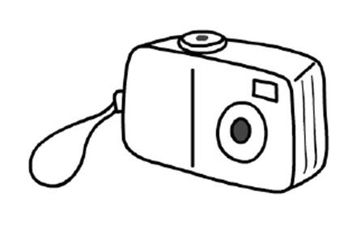
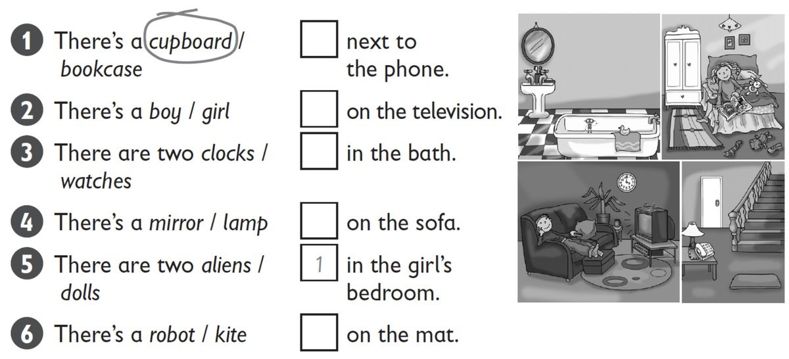

**[Vocabulary]{.underline}**

**1. Listen and write the number on the picture. Write and draw lines.
There is one example.   (one point each)**

*whiteboard -- twenty/20*

*desk -- fifteen/15*

*cupboard -- twelve/12*

*floor -- eighteen/18*

*bookcase -- eleven/11*

**Audio script**

1\. Write the number *thirteen* on the poster.

2\. Write the number *twenty* on the whiteboard.

3\. Write the number *fifteen* on the desk.

4\. Write the number *twelve* on the cupboard.

5\. Write the number *eighteen* on the floor.

6\. Write the number *eleven* on the bookcase.

**2. Read and write the correct word. Circle *This* or *These*. There is
one example.   (one point each)**

aliens / aliens \| bath / baths \| camera / cameras \| lorry /
~~lorries~~ \| sofa / sofas \| watch / watches

1\. *This* / ***These*** are *[lorries]{.underline}*.

2\. *This* / *These* is a \_\_\_\_\_\_\_\_\_\_\_\_\_\_\_.

*This, sofa*

3\. *This* / *These* are \_\_\_\_\_\_\_\_\_\_\_\_\_\_\_.

*These, cameras*

4\. *This* / *These* are \_\_\_\_\_\_\_\_\_\_\_\_\_\_\_.

*These, watches*

5\. *This* / *These* is an \_\_\_\_\_\_\_\_\_\_\_\_\_\_\_.

*This, alien*

6\. *This* / *These* is a \_\_\_\_\_\_\_\_\_\_\_\_\_\_\_.

*This, bath*

**[Grammar]{.underline}**

**3. Complete the paragraph with one or more suitable words, using
information from the text.**

1\. The boy is *[next to]{.underline}* the sofa.

2\. The cars are *on* the rug.

3\. The sofa is *next to* the bookcase.

4\. The clock is *under* the lamp.

5\. The lamp is *on* the bookcase.

6\. The books are *in* the bookcase.

**4. Put the words in order. Complete the answers. There is one
example.   (one point each)**

1\. cupboards / are / there? / How / many

    *[How many cupboards are there? There are]{.underline}* three
cupboards.

2\. Is / teacher? / there / a

    \_\_\_\_\_\_\_\_\_\_\_\_\_\_\_\_\_\_\_\_\_\_\_\_\_\_\_\_\_    Yes,
\_\_\_\_\_\_\_\_\_\_\_\_\_\_\_\_\_\_\_\_\_\_\_\_\_\_\_\_\_.

*Is there a teacher? Yes, there is.*

3\. whiteboard? / Is / a / there

    \_\_\_\_\_\_\_\_\_\_\_\_\_\_\_\_\_\_\_\_\_\_\_\_\_\_\_\_\_    No,
\_\_\_\_\_\_\_\_\_\_\_\_\_\_\_\_\_\_\_\_\_\_\_\_\_\_\_\_\_\_.

*Is there a whiteboard? No, there isn't.*

4\. desk? / there / Are / eighteen

    \_\_\_\_\_\_\_\_\_\_\_\_\_\_\_\_\_\_\_\_\_\_\_\_\_\_\_\_\_    No,
\_\_\_\_\_\_\_\_\_\_\_\_\_\_\_\_\_\_\_\_\_\_\_\_\_\_\_\_\_\_.

*Are there eighteen desks? No, there aren't.*

5\. six / Are / there / rulers?

    \_\_\_\_\_\_\_\_\_\_\_\_\_\_\_\_\_\_\_\_\_\_\_\_\_\_\_\_\_    Yes,
\_\_\_\_\_\_\_\_\_\_\_\_\_\_\_\_\_\_\_\_\_\_\_\_\_\_\_\_\_.

*Are there six rulers? Yes, there are.*

6\. there? / How / are / bookcases / many

    \_\_\_\_\_\_\_\_\_\_\_\_\_\_\_\_\_\_\_\_\_\_\_\_\_\_\_\_\_\_\_\_\_\_\_\_\_
\_\_\_\_\_\_\_\_\_\_\_\_\_\_\_ four bookcases.

*How many bookcases are there? There are four bookcases.*

**5. Read and write the words. There are two extra words. There is one
example.   (one point each)**

it isn't \| mine \| one \| ones \| It's \| They're \| ~~they're~~ \|
whose

1\. Are these lorries mine?

    Yes, *[they're]{.underline}* yours.

2\. Is this watch yours?

    No, \_\_\_\_\_\_\_\_\_\_\_\_\_\_\_.

*it isn't*

3\. Whose camera is this?

    \_\_\_\_\_\_\_\_\_\_\_\_\_\_\_ Mary's.

*It's*

4\. Whose games are these?

    \_\_\_\_\_\_\_\_\_\_\_\_\_\_\_ Tom's.

*They're*

5\. Whose kites are those?

    They're \_\_\_\_\_\_\_\_\_\_\_\_\_\_\_.

*mine*

6\. Which robots are Clare's?

    The two white \_\_\_\_\_\_\_\_\_\_\_\_\_\_\_.

*ones*

**[Listening]{.underline}**

**6. Listen and circle. Match and write the number. There is one
example.   (one point each)**

*2. boy / on the sofa*

*3. watches / on the mat*

*4. lamp / next to the phone*

*5. two aliens / on the television*

*6. robot / in the bath*

**Audio script**

1

There's a cupboard in the girl's bedroom.

\[pause\]

2

There's a boy on the sofa.

\[pause\]

3

There are two watches on the mat.

\[pause\]

4

There's a lamp next to the phone.

\[pause\]

5

There are two aliens on the television.

\[pause\]

6

There's a robot in the bath.

**7. Listen and number. Draw lines. There is one example.   (one point
each)**

*2. the camera -- Lucy's*

*3. the phone -- Alex's*

*4. the computer games -- Dan's*

*5. the watch -- Eva's*

*6. the robot and alien -- Nick's*

**Audio script**

1

**Woman:** Whose are the kites?

**Girl:** They're Sam and Sue's.

\[pause\]

2

**Woman:** Whose is the camera?

**Girl:** It's Lucy's.

\[pause\]

3

**Woman:** Whose is the phone?

**Girl:** It's Alex's.

\[pause\]

4

**Woman:** Whose are the computer games?

**Girl:** They're Dan's.

\[pause\]

5

**Woman:** Whose is the watch?

**Girl:** It's Eva's.

\[pause\]

6

**Woman:** Whose is the robot and alien?

**Girl:** They're Nick's.

**[Reading]{.underline}**

**8. Look and read. Write the answer. There is one example.   (one point
each)**

1\. How many beds are there?

    *[three]{.underline}*

2\. How many mirrors are there?

     \_\_\_\_\_\_\_\_\_\_\_\_\_\_\_\_\_\_\_\_\_\_\_\_\_\_\_

*three*

3\. Where are the clocks?

    in the living room and
\_\_\_\_\_\_\_\_\_\_\_\_\_\_\_\_\_\_\_\_\_\_\_\_\_\_\_

*kitchen*

4\. Where is the phone?

    next to the \_\_\_\_\_\_\_\_\_\_\_\_\_\_\_\_\_\_\_\_\_\_\_\_\_\_\_

*sofa*

5\. Where is the lamp?

    next to the \_\_\_\_\_\_\_\_\_\_\_\_\_\_\_\_\_\_\_\_\_\_\_\_\_\_\_

*bed*

6\. What's in front of the sofa?

    a \_\_\_\_\_\_\_\_\_\_\_\_\_\_\_\_\_\_\_\_\_\_\_\_\_\_\_

*mat*

