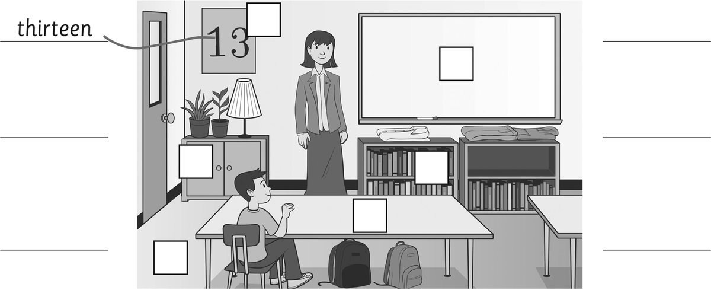
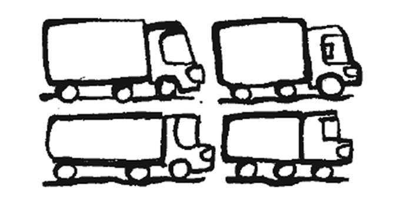
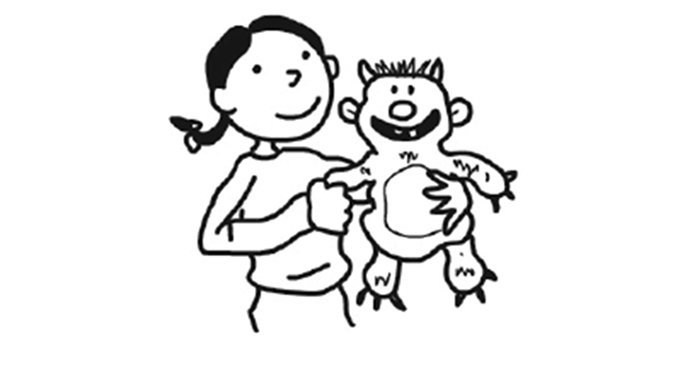
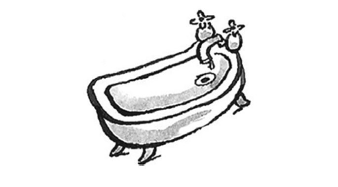
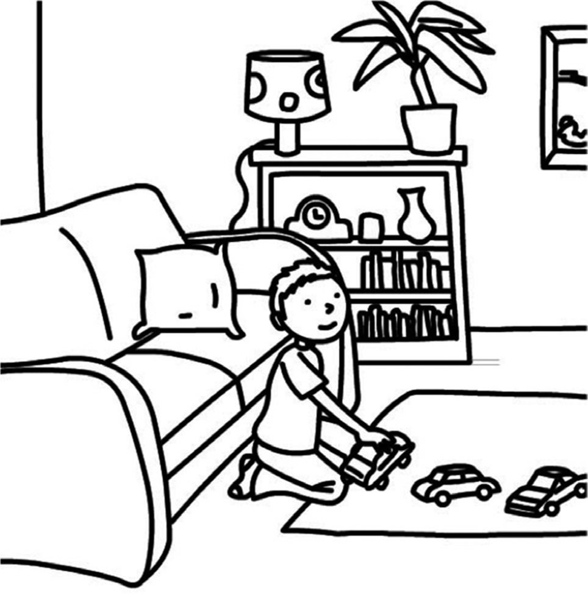
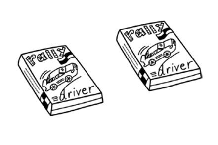
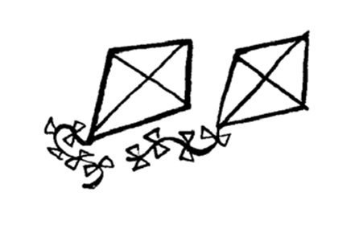
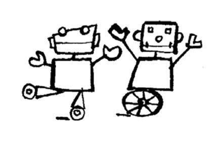
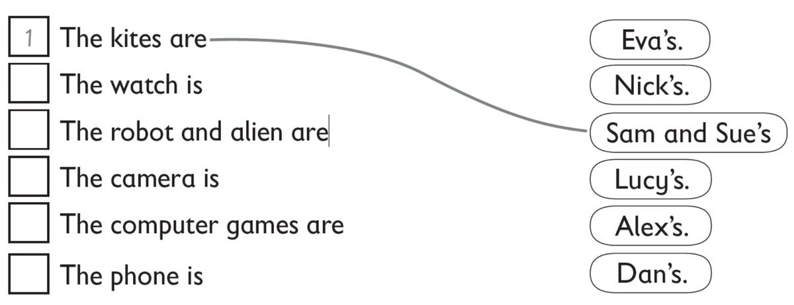

**[Vocabulary]{.underline}**

**1. Listen and write the number on the picture. Write and draw lines.
There is one example.   (one point each)**

**2. Read and write the correct word. Circle *This* or *These*. There is
one example.   (one point each)**

aliens / aliens \| bath / baths \| camera / cameras \| lorry /
~~lorries~~ \| sofa / sofas \| watch / watches

1\. *This* / ***These*** are *[lorries]{.underline}*.

2\. *This* / *These* is a \_\_\_\_\_\_\_\_\_\_\_\_\_\_\_.

3\. *This* / *These* are \_\_\_\_\_\_\_\_\_\_\_\_\_\_\_.

4\. *This* / *These* are \_\_\_\_\_\_\_\_\_\_\_\_\_\_\_.

5\. *This* / *These* is an \_\_\_\_\_\_\_\_\_\_\_\_\_\_\_.

6\. *This* / *These* is a \_\_\_\_\_\_\_\_\_\_\_\_\_\_\_.

**[Grammar]{.underline}**

**3. Complete the paragraph with one or more suitable words, using
information from the text.**

1\. The boy is *[next to]{.underline}* the sofa.

2\. The cars are \_\_\_\_\_\_\_\_\_\_\_\_\_\_ the rug.

3\. The sofa is \_\_\_\_\_\_\_\_\_\_\_\_\_\_ the bookcase.

4\. The clock is \_\_\_\_\_\_\_\_\_\_\_\_\_\_ the lamp.

5\. The lamp is \_\_\_\_\_\_\_\_\_\_\_\_\_\_ the bookcase.

6\. The books are \_\_\_\_\_\_\_\_\_\_\_\_\_\_ the bookcase.

**4. Put the words in order. Complete the answers. There is one
example.   (one point each)**

1\. cupboards / are / there? / How / many

    *[How many cupboards are there? There are]{.underline}* three
cupboards.

2\. Is / teacher? / there / a

    \_\_\_\_\_\_\_\_\_\_\_\_\_\_\_\_\_\_\_\_\_\_\_\_\_\_\_\_\_    Yes,
\_\_\_\_\_\_\_\_\_\_\_\_\_\_\_\_\_\_\_\_\_\_\_\_\_\_\_\_\_.

3\. whiteboard? / Is / a / there

    \_\_\_\_\_\_\_\_\_\_\_\_\_\_\_\_\_\_\_\_\_\_\_\_\_\_\_\_\_    No,
\_\_\_\_\_\_\_\_\_\_\_\_\_\_\_\_\_\_\_\_\_\_\_\_\_\_\_\_\_\_.

4\. desk? / there / Are / eighteen

    \_\_\_\_\_\_\_\_\_\_\_\_\_\_\_\_\_\_\_\_\_\_\_\_\_\_\_\_\_    No,
\_\_\_\_\_\_\_\_\_\_\_\_\_\_\_\_\_\_\_\_\_\_\_\_\_\_\_\_\_\_.

5\. six / Are / there / rulers?

    \_\_\_\_\_\_\_\_\_\_\_\_\_\_\_\_\_\_\_\_\_\_\_\_\_\_\_\_\_    Yes,
\_\_\_\_\_\_\_\_\_\_\_\_\_\_\_\_\_\_\_\_\_\_\_\_\_\_\_\_\_.

6\. there? / How / are / bookcases / many

    \_\_\_\_\_\_\_\_\_\_\_\_\_\_\_\_\_\_\_\_\_\_\_\_\_\_\_\_\_\_\_\_\_\_\_\_\_
\_\_\_\_\_\_\_\_\_\_\_\_\_\_\_ four bookcases.

**5. Read and write the words. There are two extra words. There is one
example.   (one point each)**

it isn't \| mine \| one \| ones \| It's \| They're \| ~~they're~~ \|
whose

1\. Are these lorries mine?

    Yes, *[they're]{.underline}* yours.

2\. Is this watch yours?

    No, \_\_\_\_\_\_\_\_\_\_\_\_\_\_\_.

3\. Whose camera is this?

    \_\_\_\_\_\_\_\_\_\_\_\_\_\_\_ Mary's.

4\. Whose games are these?

    \_\_\_\_\_\_\_\_\_\_\_\_\_\_\_ Tom's.

5\. Whose kites are those?

    They're \_\_\_\_\_\_\_\_\_\_\_\_\_\_\_.

6\. Which robots are Clare's?

    The two white \_\_\_\_\_\_\_\_\_\_\_\_\_\_\_.

**[Listening]{.underline}**

**6. Listen and circle. Match and write the number. There is one
example.   (one point each)**

**7. Listen and number. Draw lines. There is one example.   (one point
each)**

**[Reading]{.underline}**

**8. Look and read. Write the answer. There is one example.   (one point
each)**

1\. How many beds are there?

    *[three]{.underline}*

2\. How many mirrors are there?

     \_\_\_\_\_\_\_\_\_\_\_\_\_\_\_\_\_\_\_\_\_\_\_\_\_\_\_

3\. Where are the clocks?

    in the living room and
\_\_\_\_\_\_\_\_\_\_\_\_\_\_\_\_\_\_\_\_\_\_\_\_\_\_\_

4\. Where is the phone?

    next to the \_\_\_\_\_\_\_\_\_\_\_\_\_\_\_\_\_\_\_\_\_\_\_\_\_\_\_

5\. Where is the lamp?

    next to the \_\_\_\_\_\_\_\_\_\_\_\_\_\_\_\_\_\_\_\_\_\_\_\_\_\_\_

6\. What's in front of the sofa?

    a \_\_\_\_\_\_\_\_\_\_\_\_\_\_\_\_\_\_\_\_\_\_\_\_\_\_\_

