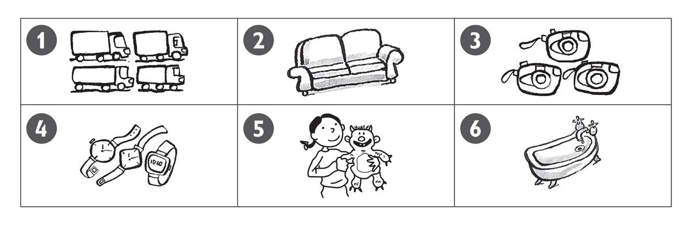
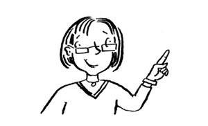
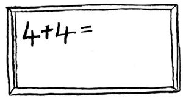
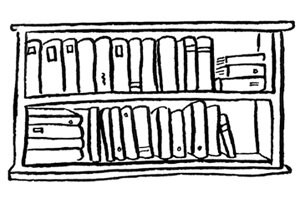
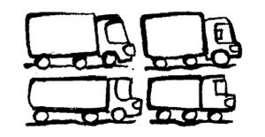
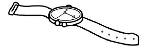
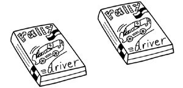
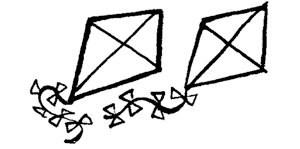
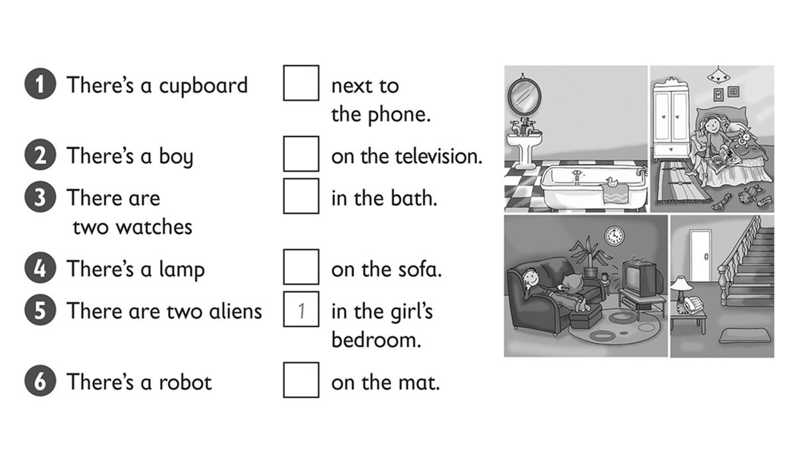
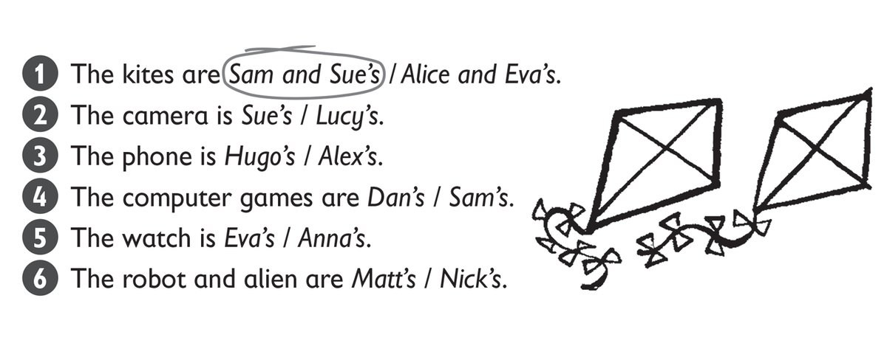

**[Vocabulary]{.underline}**

**1. Listen and write the number on the picture. Write and draw lines.
There is one example.   (one point each)**

*whiteboard -- twenty / 20*

*desk -- fifteen / 15*

*cupboard -- twelve / 12*

*floor -- eighteen / 18*

*bookcase -- eleven / 11*

**Audio script**

1\. Write the number *thirteen* on the poster.

2\. Write the number *twenty* on the whiteboard.

3\. Write the number *fifteen* on the desk.

4\. Write the number *twelve* on the cupboard.

5\. Write the number *eighteen* on the floor.

6\. Write the number *eleven* on the bookcase.

**2. Read and write the correct word. There is one example   (one point
each)**

alien / aliens \| bath / baths \| camera / cameras

lorry / ~~lorries~~ \| sofa / sofas \| watch / watches

1\. These are *[lorries]{.underline}*.

2\. This is a *sofa*.

3\. These are *cameras*.

4\. These are *watches*.

5\. This is an *alien*.

6\. This is a *bath*.

**[Grammar]{.underline}**

**3. Look and write the words. There is one example.   (one point
each)**

~~next to~~ \| under \| on \| in \| on \| next to

1\. The boy is *[next to]{.underline}* the sofa.

2\. The cars are *on* the rug.

3\. The sofa is *next to* the bookcase.

4\. The clock is *under* the lamp.

5\. The lamp is *on* the bookcase.

6\. The books are *in* the bookcase.

**4. Put the words in order and write. There is one example.   (one
point each)**

1\. cupboards / are / there? / How / many

*[How many cupboards are there?]{.underline}*

2\. Is / teacher? / there / a

\_\_\_\_\_\_\_\_\_\_\_\_\_\_\_\_\_\_\_\_\_\_\_\_\_

*Is there a teacher?*

3\. whiteboard. / There / a / is

\_\_\_\_\_\_\_\_\_\_\_\_\_\_\_\_\_\_\_\_\_\_\_\_\_

*There is a whiteboard.*

4\. desks? / there / Are / eighteen

\_\_\_\_\_\_\_\_\_\_\_\_\_\_\_\_\_\_\_\_\_\_\_\_\_

*Are there eighteen desks?*

5\. six / Are / there / rulers?

\_\_\_\_\_\_\_\_\_\_\_\_\_\_\_\_\_\_\_\_\_\_\_\_\_

*Are there six rulers?*

6\. there / bookcase? / Is / a

\_\_\_\_\_\_\_\_\_\_\_\_\_\_\_\_\_\_\_\_\_\_\_\_\_

*Is there a bookcase?*

**5. Read and write the words. There is one example.   (one point
each)**

It's \| it isn't \| mine \| ones \| They're \| ~~they're~~

1\. Are these lorries mine? Yes, *[they're]{.underline}* yours.

2\. Is this watch yours? No, \_\_\_\_\_\_\_\_\_\_\_\_.

*it isn't*

3\. Whose camera is this? \_\_\_\_\_\_\_\_\_\_\_\_ Mary's.

*It's*

4\. Whose games are these? \_\_\_\_\_\_\_\_\_\_\_\_ Tom's

*They're*

5\. Whose kites are those? They're \_\_\_\_\_\_\_\_\_\_\_\_.

*mine*

6\. Which robots are Clare's? The two white \_\_\_\_\_\_\_\_\_\_\_\_.

*ones*

**[Listening]{.underline}**

**6. Listen, look and write the number. There is one example.   (one
point each)**

*on the sofa*

*on the mat*

*next to the phone*

*on the bed*

*in the bath*

**Audio script**

1\. There's a cupboard in the girl's bedroom.

2\. There's a boy on the sofa.

3\. There are two watches on the mat.

4\. There's a lamp next to the phone.

5\. There are two aliens on the television.

6\. There's a robot in the bath.

**7. Listen and circle. There is one example.   (one point each)**

*Lucy's*

*Alex's*

*Dan's*

*Eva's*

*Nick's*

**Audio script**

1

**Woman:** Whose are the kites?

**Girl:** They're Sam and Sue's.

2

**Woman:** Whose is the camera?

**Girl:** It's Lucy's.

3

**Woman:** Whose is the phone?

**Girl:** It's Alex's.

4

**Woman:** Whose are the computer games?

**Girl:** They're Dan's.

5

**Woman:** Whose is the watch?

**Girl:** It's Eva's.

6

**Woman:** Whose is the robot and alien?

**Girl:** They're Nick's.

**[Reading]{.underline}**

**8. Look and read. Write the answer. There is one example.   (one point
each)**

bed \| kitchen \| mat \| sofa \| three \| ~~three~~

1\. How many beds are there?

*[three]{.underline}*

2\. Where is the phone?

Next to the *three*

3\. How many mirrors are there?

*kitchen*

4\. Where is the lamp?

Next to the *sofa*

5\. Where are the clocks?

In the living room and *bed*

6\. What's in front of the sofa?

A *mat*

